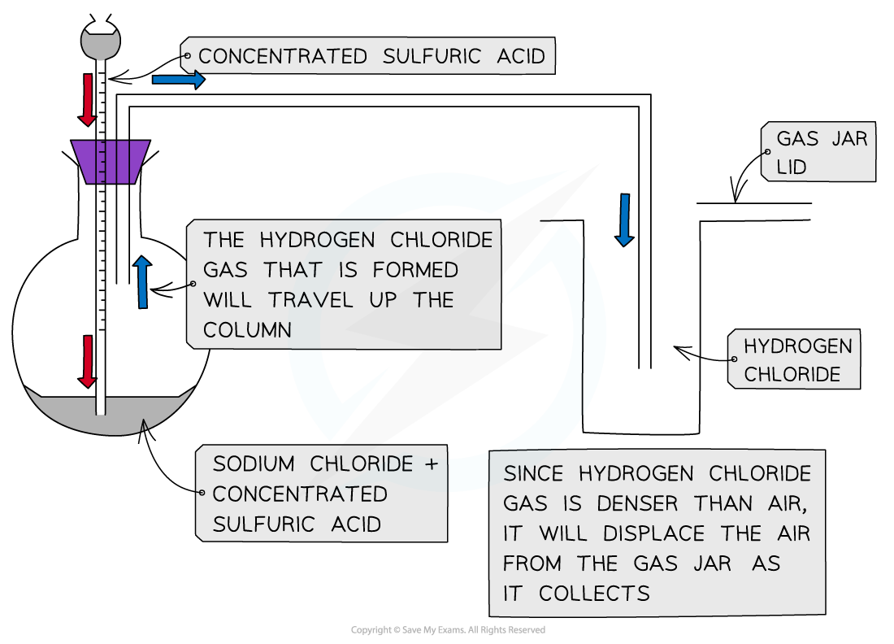

## Halide Ion Reactions

#### Concentrated sulfuric acid

* Chloride, bromide and iodide ions react with concentrated sulfuric acid to produce **toxic gases**
* These reactions should therefore be carried out in a fume cupboard
* The general reaction of the halide ions with concentrated sulfuric acid is:

**H****2****SO****4****(aq) + X****-****(aq) → HX(g) + HSO****4****-****(aq)**

(general equation)

Where **X****-** is the halide ion

#### Reaction of chloride ions with concentrated sulfuric Acid

* Concentrated sulfuric acid is dropwise added to sodium chloride crystals to produce **hydrogen chloride gas**

***Apparatus set up for the reaction of sodium chloride with concentrated sulfuric acid***

* The reaction that takes place is:

**H****2****SO****4****(aq) + NaCl (s) → HCl (g) + NaHSO****4****(s)**

* The HCl gas produces is seen as **white fumes**

#### Reaction of bromide ions with concentrated sulfuric acid

* The **thermal stability** of the hydrogen halides decreases down the group
* The reaction of sodium bromide and concentrated sulfuric acid is:

**H****2****SO****4****(aq) + NaBr (s) → HBr (g) + NaHSO****4****(s)**

* The concentrated sulfuric acid **oxidises** HBr which decomposes into **bromine** and **hydrogen gas** and sulfuric acid itself is **reduced** to **sulfur** **dioxide** **gas**:

**2HBr (g) + H****2****SO****4****(aq) → Br****2****(g) + SO****2****(g) + 2H****2****O (l)**

* The bromine is seen as a **reddish-brown gas**

#### Reaction of iodide ions with concentrated sulfuric acid

* The reaction of sodium iodide and concentrated sulfuric acid is:

**H****2****SO****4** **(aq) + NaI (s) → HI (g) + NaHSO****4** **(s)**

* **Hydrogen iodide** decomposes the **easiest**
* Sulfuric acid oxidises the hydrogen iodide to several extents:
* The concentrated sulfuric acid **oxidises** HI and is itself **reduced** to **sulfur** **dioxide** **gas**:

**2HI (g) + H****2****SO****4** **(aq) → I****2** **(g) + SO****2** **(g) + 2H****2****O (l)**

* Iodine is seen as a violet/purple vapour
* The concentrated sulfuric acid **oxidises** HI and is itself **reduced** to **sulfur**:

**6HI (g) + H****2****SO****4** **(aq) → 3I****2** **(g) + S (s) + 4H****2****O (l)**

* Sulfur is seen as a **yellow solid**
* The concentrated sulfuric acid **oxidises** HI and is itself **reduced** to **hydrogen sulfide**:

**8HI (g) + H****2****SO****4** **(aq) → 4I****2** **(g) + H****2****S (s) + 4H****2****O (l)**

* Hydrogen sulfide has a **strong smell of bad eggs**

#### Halide ion reactions with concentrated sulfuric acid table

| **Halide ion** | **Reaction with concentrated sulfuric acid** | **Observations** |
| --- | --- | --- |
| Cl– (aq) | H2SO4 (aq) + NaCl (s) → HCl (g) + NaHSO4 (s) | White fumes of HCl (g) |
| Br– (aq) | H2SO4 (aq) + NaBr (s) → HBr (g) + NaHSO4 (s)  H2SO4 (aq) + 2HBr (g) → Br2 (g) + SO2 (g) + 2H2O (l) | Reddish brown fumes of Br2 (g) |
| I– (aq) | H2SO4 (aq) + NaI (s) → HI (g) + NaHSO4 (s)  H2SO4 (aq) + 2HI (g) → I2 (g) + SO2 (g) + 2H2O (l)  H2SO4 (aq) + 6HI (g) → 3I2 (g) + S (s) + 4H2O (l)  H2SO4 (aq) + 8HI (g) → 4I2 (g) + H2S (s) + 4H2O (l) | Purple fumes of I2 (g)  Yellow sulfur solid  Strong "egg" smell of H2S |

#### Silver ions & ammonia

* Halide ions can be identified in an **unknown** **solution** by dissolving the solution in **nitric acid** and then adding a **silver nitrate solution** followed by **ammonia** solution
* The halide ions will react with the silver nitrate solution as follows:

**AgNO****3****(aq) + X****-****(aq) → AgX (s) + NO****3****-****(aq)**

**Ag****+****(aq) + X****-****(aq) → AgX (s)**

* **X****-** is the halide ion in both equations
* If the unknown solution contains halide ions, then a **precipitate** of the **silver halide** will be formed (AgX)

***A silver halide precipitate is formed upon addition of silver nitrate solution to halide ion solution***

* **Dilute** followed by **concentrated ammonia** is added to the silver halide solution to identify the halide ion
* If the precipitate dissolves in **dilute** ammonia the unknown halide is **chloride**
* If the precipitate does not dissolve in dilute but in **concentrated** ammonia the unknown halide is **bromide**
* If the precipitate does not dissolve in **dilute** nor **concentrated** ammonia the unknown halide is iodide

***Silver chloride and silver bromide precipitates dissolve on addition of ammonia solution whereas silver iodide doesn’t***

#### Reaction of halide ions with silver nitrate & ammonia solutions table

#### Reactions with hydrogen halides

* When a halogen reacts with hydrogen a hydrogen halide is produced, for example:

  + **Cl****2** **(g) + H****2** **(g) → 2HCl (g)**
* These hydrogen halides react with ammonia gas to form **ammonium halides**

  + **NH****3** **(g) + HCl (g) → NH****4****Cl (s)**
* Hydrogen halides will also react with water
* For example, hydrogen chloride also dissolves in water to form **hydrochloric acid**

  + **HCl (g) → H****+****(aq) + Cl****-** **(aq)**