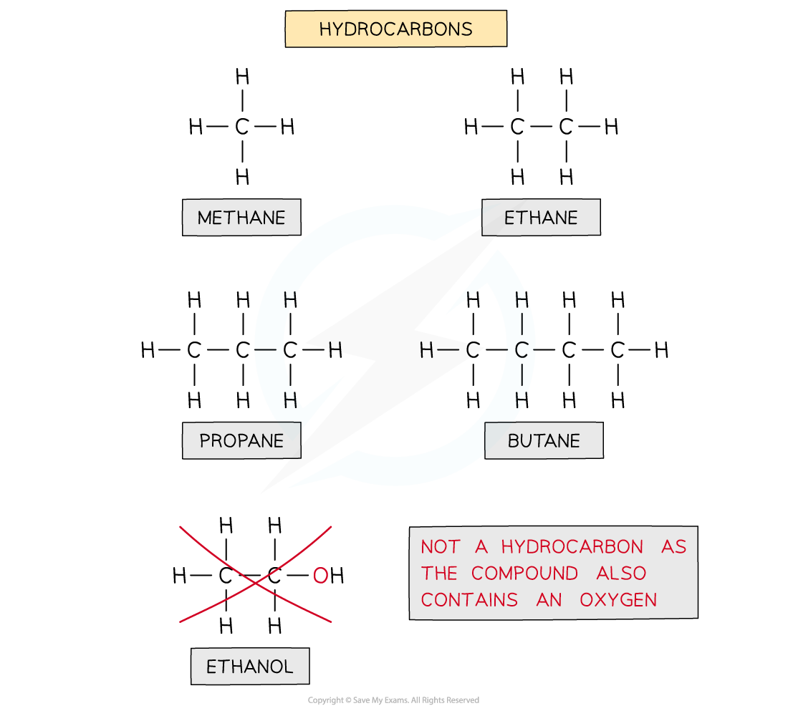
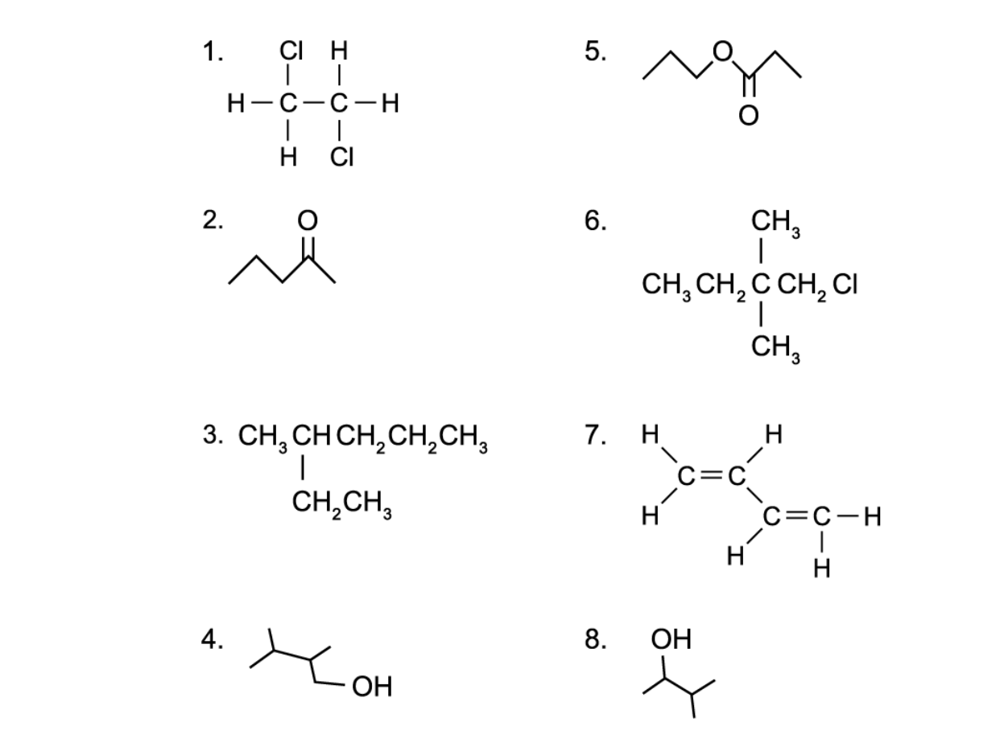

## Formulae of Organic Compounds

* **Organic chemistry** is the chemistry of carbon compounds
* Carbon forms a vast number of compounds because it can form strong covalent bonds with itself
* This enables it to form long chains of carbon atoms, and hence an almost infinite variety of carbon compounds are known
* Hydrocarbons are compounds that are made up of carbon and hydrogen atoms **ONLY**

***The diagram shows examples of hydrocarbons***

***Ethanol is NOT a hydrocarbon as the molecule also contains an oxygen atom and is not solely made up of carbon and hydrogen***

* Hydrocarbons can be placed into two categories

  + Saturated molecules containing single carbon-carbon bonds only
  + Unsaturated molecules containing double or triple carbon-carbon bonds
* The **general formula**is a formula that represents a **homologous series** of compounds using letters and numbers

  + Eg. the general formula of alkanes is CnH2n+2
  + A homologous series is a group of organic compounds that have the same functional group, the same general formula and the same chemical properties
* The **structural formula**is a formula that shows how the atoms are bonded to each carbon atom in a molecule
* The **displayed formula**is a 2D representation of an organic molecule showing **all** its atoms (by their **symbols**) and their bonds (by single, double or triple bonds)
* The **skeletal formula** is a simplified displayed formula with all the carbon and hydrogen (C-H) bonds removed

**Overview of the Formulae of Organic Compounds Table**

#### Worked Example

**Drawing skeletal formulae of molecules**

Draw the skeletal formula of the following molecules:

1. CH3(CH2)3OH
2. (CH3)2CHCH2OH
3. CH3CH2OCH2CH3

**Answer:**

#### Worked Example

**Drawing displayed formulae of molecules** Draw the displayed formula of the following molecules:

**Answer:**

* The **molecular formula**shows the number and type of each atom in a molecule

  + Eg. the molecular formula of ethanoic acid is C2H4O2

* The **empirical formula** shows the simplest whole number ratio of the elements present in one molecule of the compound

  + Eg. the empirical formula of ethanoic acid is CH2O

#### Worked Example

**Deducing molecular & empirical formulae**

Deduce the molecular and empirical formula of the following compounds:

**Answer:**

