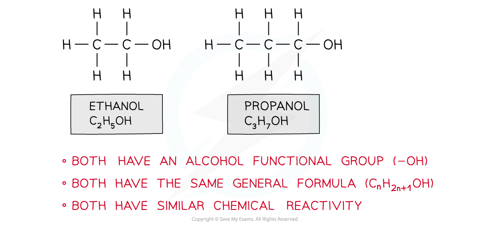
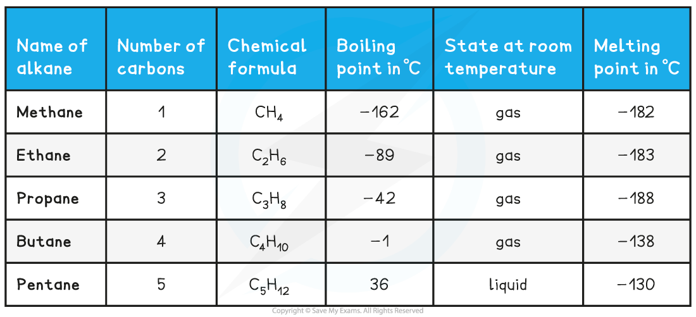
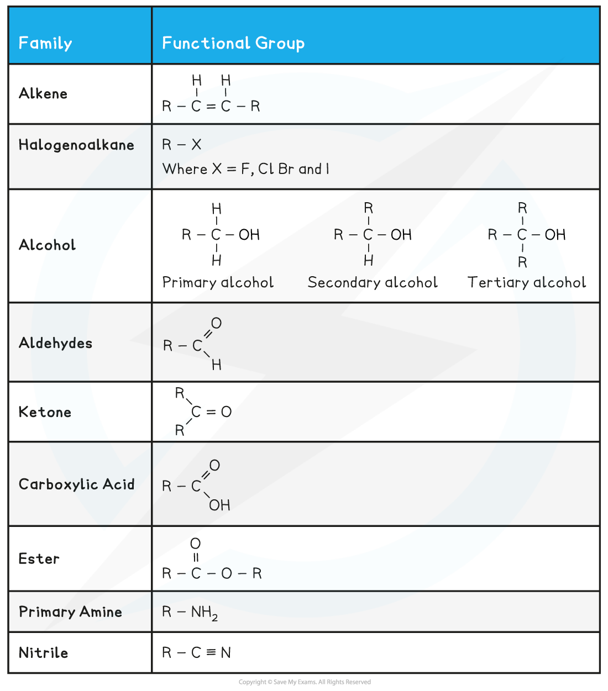

## Homologous Series & Functional Groups

#### Homologous series

* A homologous series is a group of organic compounds that have the same functional group, but each successive member differs by CH2

***Ethanol and propanol belong to the same homologous series***

***Homologous Series of Alkanes***

* Things we can say about a**homologous series:**

  + Each member has the same **functional group**
  + Each member has the same **general formula**
  + Each member has **similar** chemical properties
  + Each successive member differs by  -CH2–
  + Members have gradually changing physical properties, for example, boiling point, melting point and density
* As a homologous series is ascended, the size of the molecule increases
* This has an effect on the physical properties, such as boiling point and density

#### Functional Groups

* Functional groups determine the physical and chemical properties of molecules
* The table below shows a summary of common functional groups found in compounds
* R is any other atom or group of atoms (except for hydrogen)

**Functional Groups found in Compounds Table**

