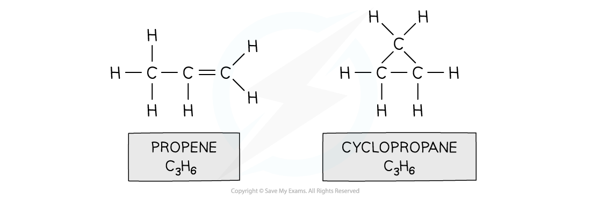
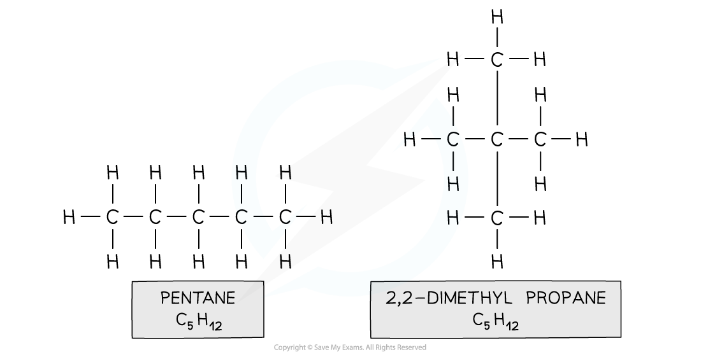
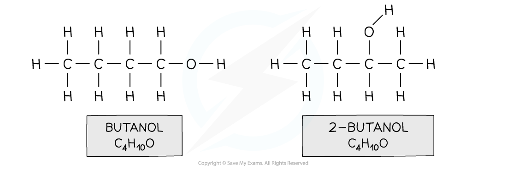
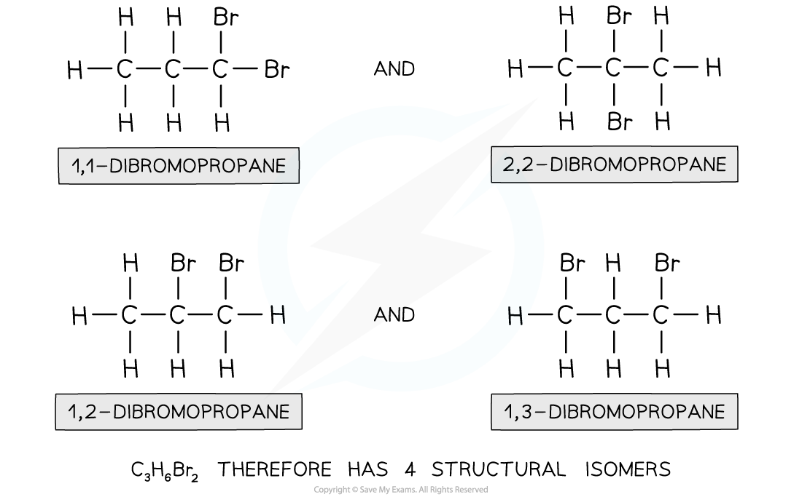
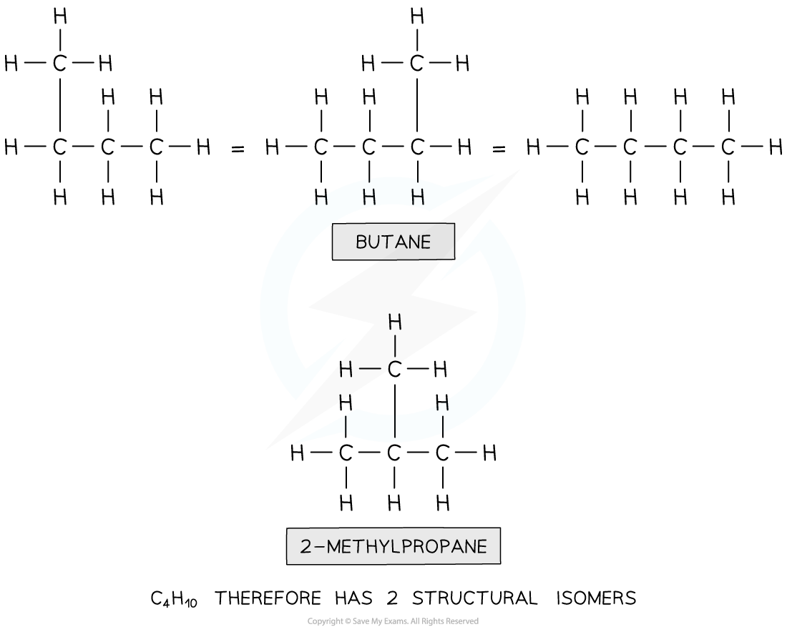

## Structural Isomerism

* **Structural isomers**are compounds that have the same **molecular** formula but different **structural** formulae

  + E.g. propene and cyclopropane

***Both propene and cyclopropane are made up of 3 carbon and 6 hydrogen atoms but the structure of the two molecules differs***

* There are two different types of structural isomerism you need to be aware of:

  + **Chain** isomerism
  + **Positional** isomerism

#### Chain isomerism

* **Chain isomerism**is when compounds have the same molecular formula, but their longest hydrocarbon chain is not the same
* This is caused by branching

  + E.g. pentane and 2,2-dimethylpropane

***Both compounds are made up of the same atoms, however the longest carbon chain in pentane is 5 and in 2,2-dimethylpropane it is 3 (with two methyl branches)***

#### Positional isomerism

* **Positional isomers**arise from differences in the position of a functional group in each isomer

  + The functional group can be located on different carbons
  + For example, butan-1-ol and butan-2-ol

***Both compounds have an alcohol group and are made up of 4 carbons, 10 hydrogens and one oxygen, however in butanol the functional group is located on the first carbon and in 2-butanol on the second carbon***

#### Worked Example

**Isomers of dibromopropane** How many isomers are there of dibromopropane, C3H6Br2?

**Answer**

**Step 1:** Draw the structural formula of the compound

**Step 2:**Determine whether it is a stereo or structural isomer

There is no restricted bond rotation around the C-C bond, so it is structural isomerism

**Step 3:** Determine whether it is a functional group, chain or positional isomerism

* Functional group? No, as Br is the only functional group possible

  + Chain? No, as the longest chain can only be 3
  + Positional? Yes, as the two bromine atoms can be bonded to different carbon atoms

#### Worked Example

**Deducing isomers of C****4****H****10**How many isomers are there of the compound with molecular formula C4H10?

**Answer**

**Step 1:** Draw the structural formula of the compound

**Step 2:**Determine whether it is a stereo or structural isomer.

There is no restricted bond rotation around the C-C bond so it is structural isomerism

**Step 3:** Determine whether it is a functional group, chain or positional isomerism

* Functional group? No, as there are no functional groups

  + Positional? No, as there are no functional groups which can be positioned on different carbon atoms
  + Chain? Yes!

