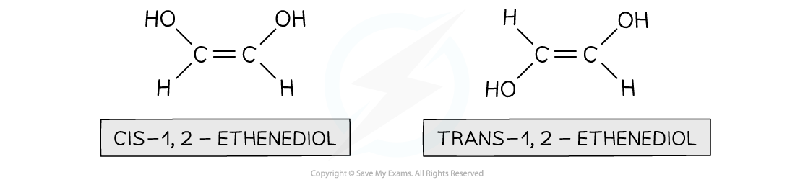
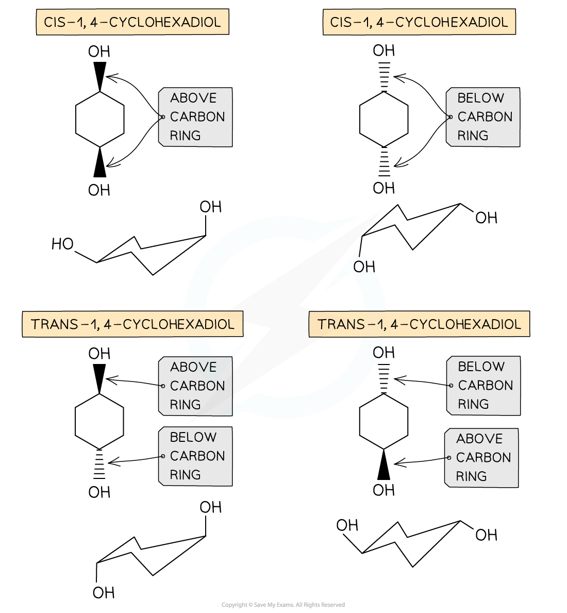

## E/Z Isomerism

* **Stereoisomers**are compounds that have the same atoms connected to each other, however the atoms are differently arranged in space

#### E/Z isomerism

* **E/Z isomerism**is seen in unsaturated (double bond containing) or ring compounds that have the same molecular formula and order of atoms (the atoms are connected similarly to each other) but different shapes
* **E/Z** nomenclature is used to distinguish between the isomers

  + Z isomers have groups on the same side of the double bond/carbon ring
  + E isomers have groups on opposite sides of the double bond/carbon ring

* You may see this type of isomerism referred to in other sources as cis/trans isomerism

  + This is a special case of E/Z isomerism
  + A "cis" isomer would essentially be the same as a "Z" isomer and a "trans" isomer would also essentially be the same as an "E" isomer

***Geometrical isomerism in unsaturated compounds***

***Geometrical isomerism in cyclic compounds***

* This causes the compounds to have different **chemical** and **physical** properties
* For example, they may have different reaction rates for the same reaction (chemical property) or different melting/boiling points (physical property)

#### Limitation of Cis/Trans Naming

* The cis / trans naming system cannot be used with three or four atoms / groups of atoms when they are all different

  + This requires the use of the *E* / *Z* naming system

***1-bromo-2-chloropropene cannot be named using cis / trans***

#### E / Z isomers

* To discuss *E* / *Z* isomers, we will use an alkene of the general formula C2R4:

***The general alkene, C******2******R******4***

* When the groups R1, R2, R3 and R4 are all different (i.e. R1 ≠ R2 ≠ R3 ≠ R4), we have to use the *E* / *Z* naming system

  + This is based on Cahn-Ingold-Prelog (CIP) priority rules
* To do this, we look at the **atomic number** of the first atom attached to the carbon in question

  + The higher the atomic number; the higher the priority
* For example, 1-bromo-1-propen-2-ol has four different atoms or groups of atoms attached to the C=C bond

  + This means that it can have two different displayed formulae:

***1-bromo-1-propen-2-ol (compounds A and B)***

**Compound A - is it E or Z?**

* **Step 1: Apply the CIP priority rules**

  + Look at R1 and R3:

    - Bromine has a higher atomic number than hydrogen so bromine has priority
  + Look at R2 and R4:

    - Oxygen has a higher atomic number than carbon so oxygen has priority

* **Step 2: Deduce** ***E*** **or** ***Z***

  + *E* isomers have the highest priority groups on opposite sides of the C=C bond, i.e. one above and one below

    - The *E* comes from the German word "entgegen" meaning opposite
  + *Z* isomers have the highest priority groups on the same side of the C=C bond, i.e. both above or both below

    - The *Z* comes from the German word "zusammen" meaning together
  + In compound A, the two highest priority groups are on opposite sides (above and below) the C=C bond

    - Therefore, compound A is *E*-1-bromo-1-propen-2-ol

#### Examiner Tips and Tricks

You may come across the term geometric isomerism in older exam papers and textbooks. The term used to refer to cis/trans isomerism, but is no longer in use and would not be required in exams.