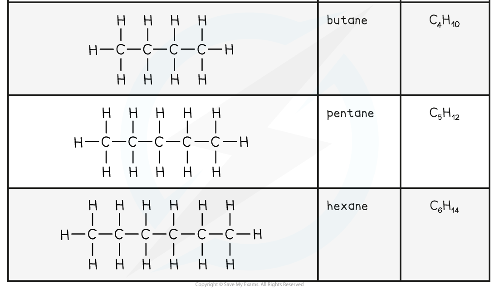

## Describing Alkanes

* **Hydrocarbons** are compounds containing hydrogen and carbon only
* There are four families of hydrocarbons you should know: **alkanes, alkenes, alkynes** and **arenes**

  + Alkanes, alkenes and alkynes can be described as **aliphatic**
  + Arenes can be described as **aromatic**
* Alkanes have the general molecular formula **C****n****H****2n+2**
* They contain only **single bonds** and are said to be **saturated**
* Alkanes are named using the nomenclature rule **alk + ane**

  + The **alk** portion of the name depends on the number of carbons

    - 1 carbon = meth
    - 2 carbons = eth
    - 3 carbons = prop
    - 4 carbons = but
    - 5 carbons = pent
    - After 5 carbons, the naming of alkanes matches the names of the polygons in Maths
  + The **ane** portion of the name suggests single bonds between the carbon atoms

**The First Six Members of the Alkane Family**

* Alkanes can be linear, branched or cyclic

  + The key points are that there are no functional groups and only single bonds between the carbon atoms

***Alkanes are compounds made up of carbon and hydrogen atoms only and contain no functional group***