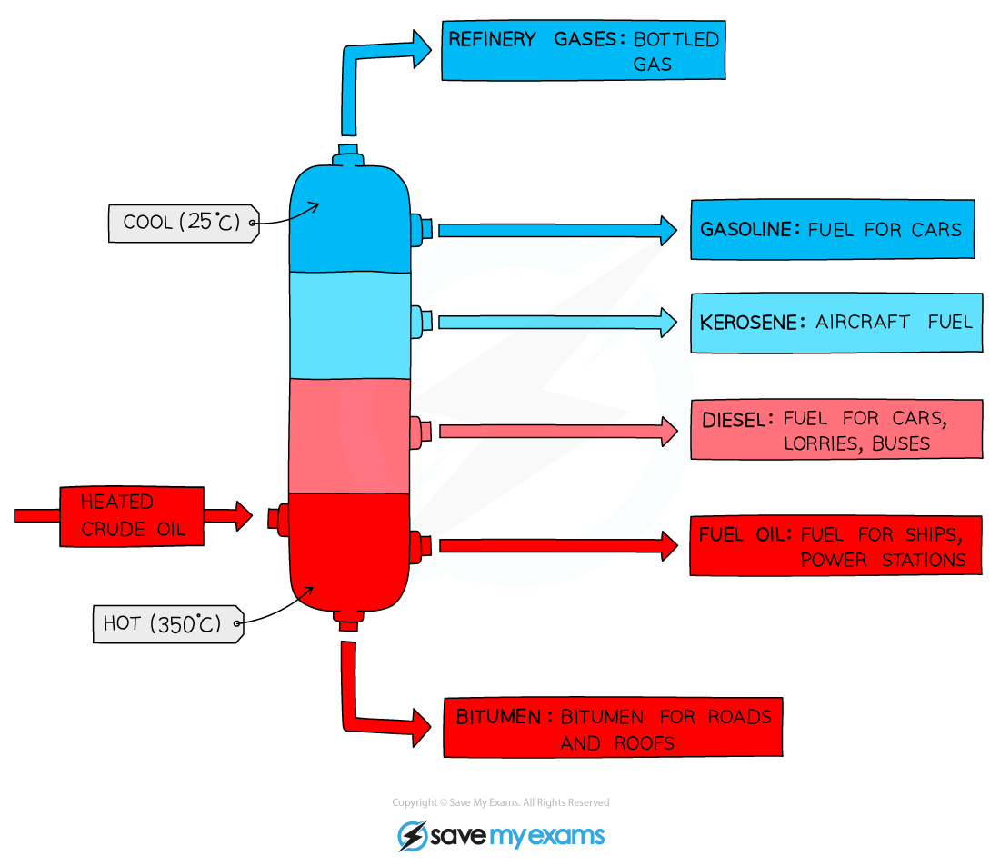
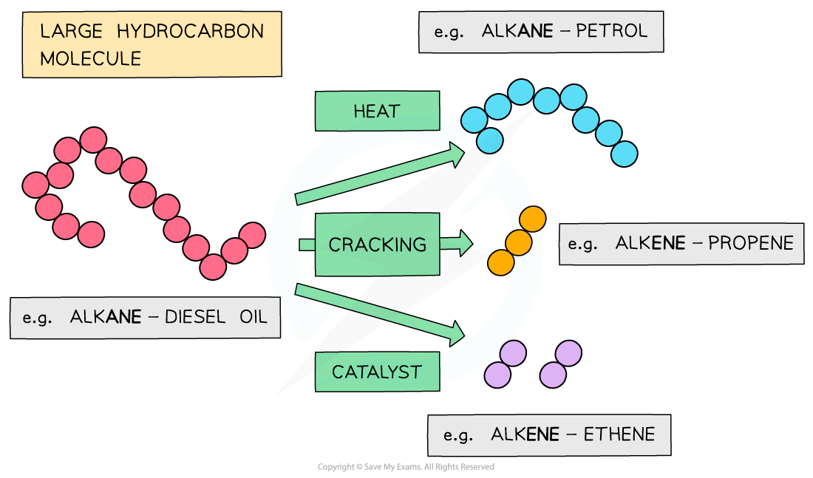
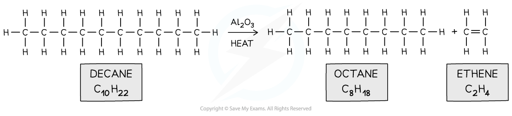

## Alkane Fuels

* Alkanes are obtained from the **fractional distillation** and **cracking** of crude oil

#### Fractional distillation of crude oil

* Crude oil is a **mixture** of hydrocarbons containing **alkanes**, **cycloalkanes** and **arenes** (compounds with a benzene ring)
* The crude oil is extracted from the earth in a drilling process and transported to an oil refinery
* At the oil refinery the crude oil is separated into useful fuels by fractional distillation

  + This is a separating technique in which the wide range of different hydrocarbons are separated into fractions based on their boiling points

***Crude oil is initially separated into fractions with similar boiling points in a process called fractional distillation***

#### Cracking of crude oil fractions

* However, the smaller hydrocarbon fractions (such as gasoline fractions) are in high demand compared to the larger ones
* Therefore, some of the **excess** heavier fractions are broken down into smaller, **more** **useful** **compounds**
* These more useful compounds include **alkanes** and **alkenes** of **lower** relative formula mass (**M****r**)
* This process is called **cracking**

***The heavier fractions that are obtained in fractional distillation are further cracked into useful alkane and alkenes with lower M******r*** ***values***

* When a large hydrocarbon is cracked, a **smaller** **alkane** and **alkene** molecules are formed

  + E.g.. octane and ethene from decane

***Long hydrocarbon fraction is cracked into two smaller ones***

* The **low-molecular mass** **alkanes** formed make good fuels and are in high demand

* There are two types of cracking:
* **Thermal cracking** requires high temperatures (up to 1000 oC) and high pressure (up to 70 atmospheres) and produces alkanes and a lot of alkenes
* **Catalytic cracking** uses a lower temperature (around 450 oC) and slight pressure in the presence of a catalyst such as a zeolite or aluminium oxide to produce mainly aromatic hydrocarbons

#### Reforming alkanes

* Many vehicles run on petrol or diesel which are both a mixture of alkanes along with other hydrocarbons, impurities and additives
* Many of the alkanes in these fuels are straight chain alkanes
* These straight chain alkanes are more likely to explode, rather than combust, inside the engine

  + This is known as **knocking** and makes the combustion less efficient
* To reduce this straight chain alkanes are **reformed** into:

  + Branched alkanes, e.g. octane → 2,5-dimethylhexane

CH3CH2CH2CH2CH2CH2CH2CH3 → CH3CH**(CH****3****)**CH2CH2CH**(CH****3****)**CH3

* Cycloalkanes, e.g. hexane → cyclohexane

CH3CH2CH2CH2CH2CH3 → C6H12 + H2

* Reforming often uses a platinum catalyst