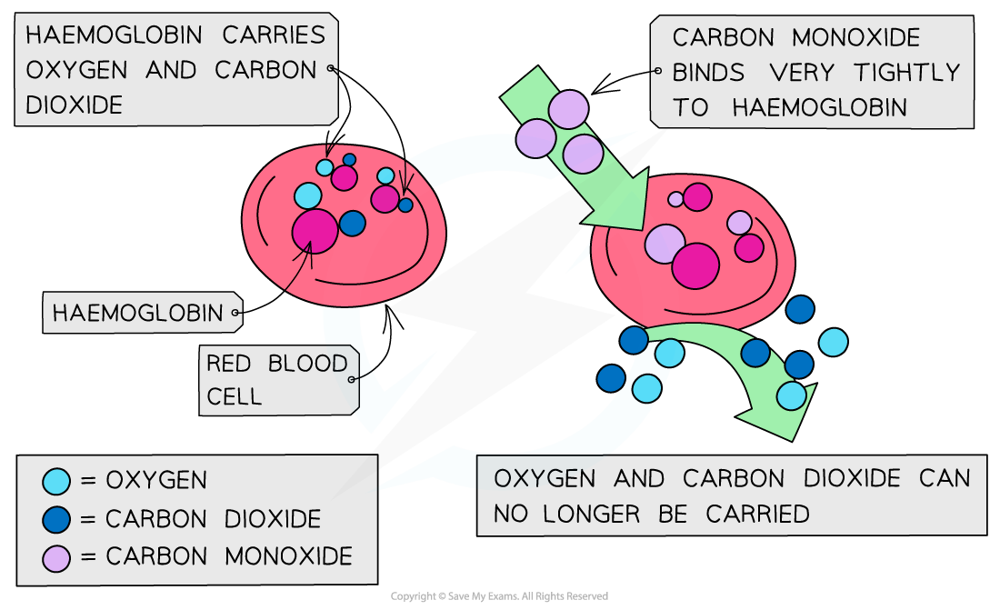
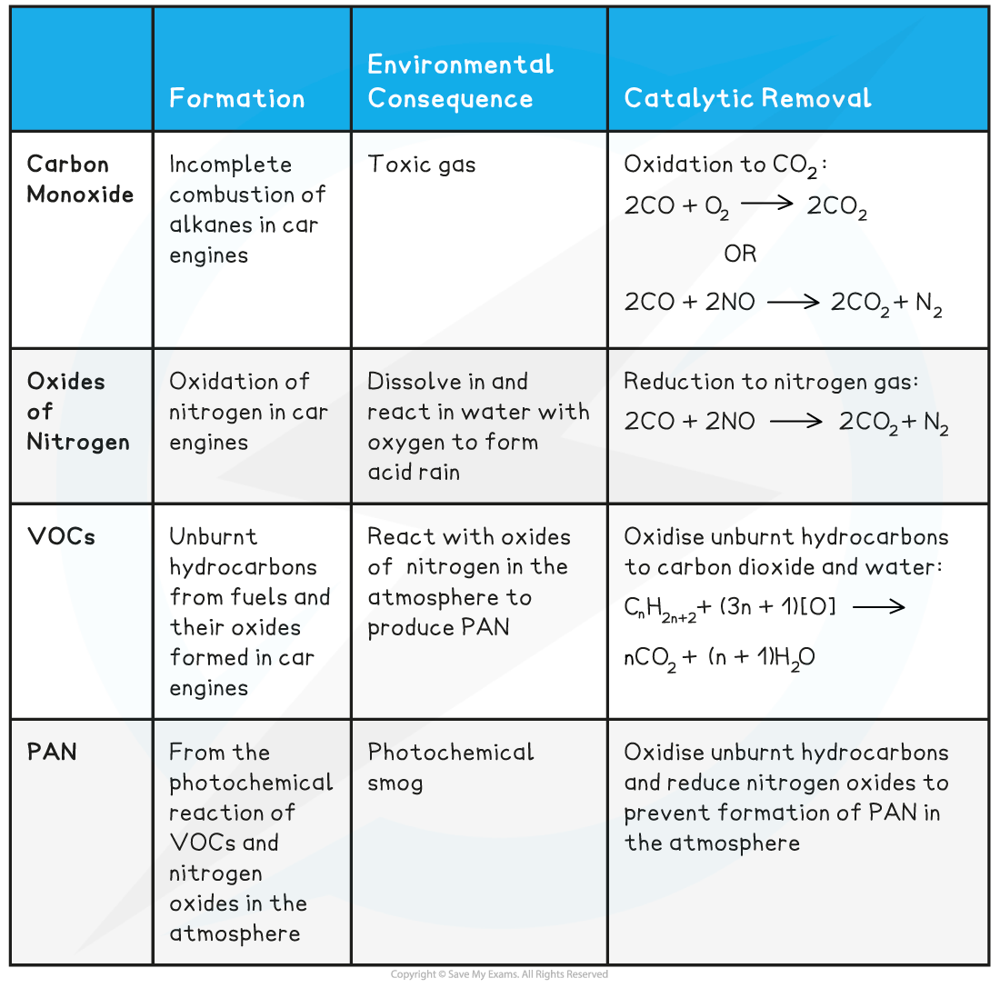

## Causes & Effects of Pollution

* Alkanes are **combusted** (burnt) on a large scale for their use as fuels

#### Complete combustion

* When alkanes are burnt in **excess** (plenty of) oxygen, **complete combustion** will take place and all carbon and hydrogen will be oxidised to **carbon dioxide** and **water** respectively

  + For example, the complete combustion of octane to carbon dioxide and water

***The complete combustion of alkanes***

#### Incomplete combustion

* When alkanes are burnt in only a **limited supply** of oxygen, **incomplete combustion** will take place and not all the carbon is fully oxidised
* Some carbon is only **partially** oxidised to form **carbon monoxide**

  + For example, the incomplete combustion of octane to form carbon monoxide

***The incomplete combustion of alkanes***

* Incomplete combustion often takes place inside a **car engine** due to a limited amount of oxygen present
* With a reduced supply of oxygen, **carbon** will be produced in the form of soot:

  

* Car **exhaust fumes** include toxic gases such as **carbon monoxide** (CO), **oxides of nitrogen** (NO/NO2) and **volatile organic compounds** (VOCs)
* When released into the atmosphere, these pollutants have serious environmental consequences damaging nature and health

#### Carbon monoxide

* CO is a toxic and odourless gas which can cause dizziness, loss of consciousness and eventually death

  + The CO binds well to haemoglobin which therefore cannot bind oxygen and carbon dioxide
  + Oxygen is transported to organs
  + Carbon dioxide is removed as waste material from organs

***The high affinity of CO to haemoglobin prevents it from binding to O******2*** ***and CO******2***

#### Oxides of nitrogen

* Normally, nitrogen is too unreactive to react with oxygen in air
* However, in a car engine, high temperatures and pressures are reached causing the oxidation of nitrogen to take place:

**N****2****(g) + O****2****(g) → 2NO(g)**

**N****2****(g) + 2O****2****(g) → 2NO****2****(g)**

* The **oxides of nitrogen** are then released in the exhaust fumes into the atmosphere
* Car exhaust fumes also contain **unburnt** **hydrocarbons** from fuels and their **oxides** (VOCs)
* In air, the nitrogen oxides can react with these VOCs to form **peroxyacetyl** **nitrate** (PAN) which is the main pollutant found in **photochemical smog**

  + PAN is also harmful to the lungs, eyes and plant-life
* Nitrogen oxides can also dissolve and react in water with oxygen to form nitric acid which is a cause of **acid rain**
* Acid rain can cause corrosion of buildings, endangers plant and aquatic life (as lakes and rivers become too **acidic**) as well as directly damaging human health

#### Particulates

* Solid carbon particles (or particulates) released from incomplete combustion clump together to form **soot** which gradually falls back to the ground
* Particulates can cause several problems:
* If they are inhaled they can damage the lungs and cause **respiratory** problems
* They can cover buildings and statues, making them look **unclean**and accelerating corrosion
* They can reflect sunlight back into space reducing the amount of light reaching the earth, this is called **global dimming**

#### Pollutants, their Effect & Removal Table

