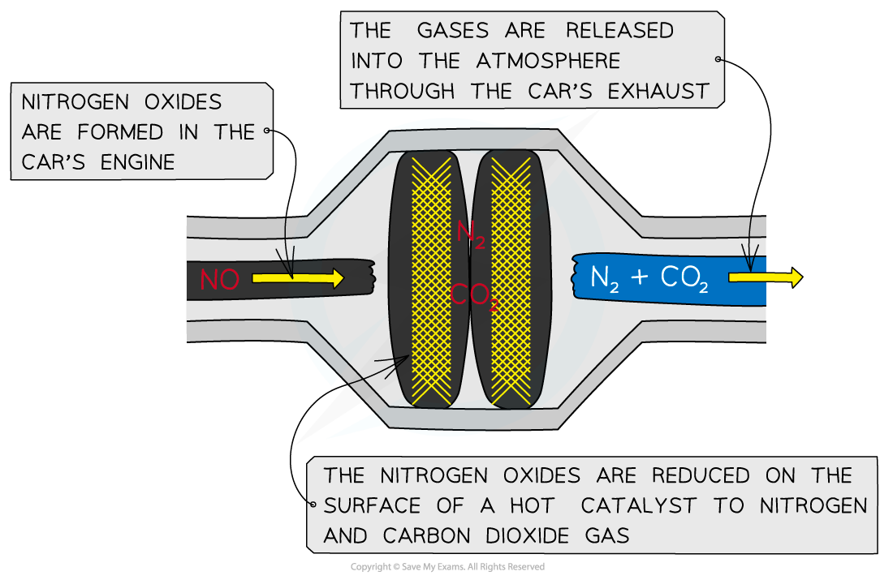

## Catalytic Converters

* To reduce the amount of pollutants released in car exhaust fumes, many cars are now fitted with **catalytic converters**
* Precious metals (such as platinum) are coated on a honeycomb to provide a **large surface area**
* The reactions that take place in the catalytic converter include:
* Oxidation of unburnt hydrocarbons:

**C****n****H****2n+2** **+ (3n+1)[O] → nCO****2** **+ (n+1)H****2****O**

* Oxidation of CO to CO2:

**2CO + O****2** **→ 2CO****2**

or

**2CO + 2NO → 2CO****2** **+ N****2**

* Reduction of NO to N2:

**2CO + 2NO → 2CO****2** **+ N****2**

#### Catalytic removal of NOx and CO

* Carbon monoxide and the nitrogen oxides released through cars’ exhaust fumes **pollute** the atmosphere
* The nitrogen oxides are **reduced** on the surface of the **hot catalyst** to form the unreactive and harmless nitrogen gas which is then released from the vehicle’s exhaust pipe into the atmosphere
* The chemical reaction for the reduction of nitrogen oxide to nitrogen gas by the catalyst is as follows:

**2CO (g) + 2NO (g) → 2CO****2****(g) + N****2****(g)**

***A catalytic converter helps reduce the pollutants from motor vehicles***

## Alternative Fuels

* Reducing pollution from the combustion of fossil fuels and the limited amount of **non-renewable fossil fuels** are two reasons for finding alternative fuels
* Biofuels are **renewable** fuels

  + Renewable meaning that they can be replaced over a short period of time
  + The bio part of biofuel meaning that it comes from living matter
* The three main biofuels are **biodiesel**, **bioethanol** and **biogas**

  + Biodiesel - made by refining renewable fats and oils
  + Bioethanol - made by fermentation
  + Biogas - made / released when organic waste breaks down

#### Benefits of biofuels

* Biofuels are often considered as **carbon neutral**

  + This is because as the plants grow they absorb carbon dioxide which is equivalent to the amount of carbon dioxide that will be released when they are burnt
  + This is not completely correct because carbon dioxide will also be produced in the refining and transport of the plants
* Biodiesel and biogas can reduce the amount of waste going to landfill as the waste can be used to produce them
* Biofuel production could provide money for less developed countries as they have the space to grow the crops required

#### Drawbacks of biofuels

* The cost of converting engines and machinery to run on biofuels instead of petrol / diesel
* Many developed countries don't have the space to be able to produce enough plants to make the biofuels because the land is needed for food production

#### Examiner Tips and Tricks

There are other options that could be considered such as the use of renewable energy, e.g. wind turbines, solar cells, as well as the use of fuel cells in vehicles but this aspect of Chemistry typically focuses on biofuel