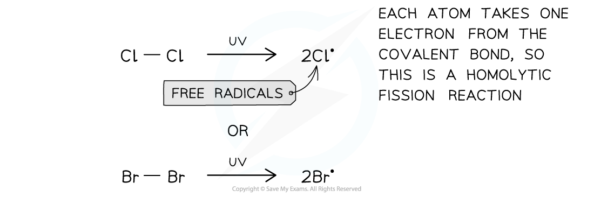
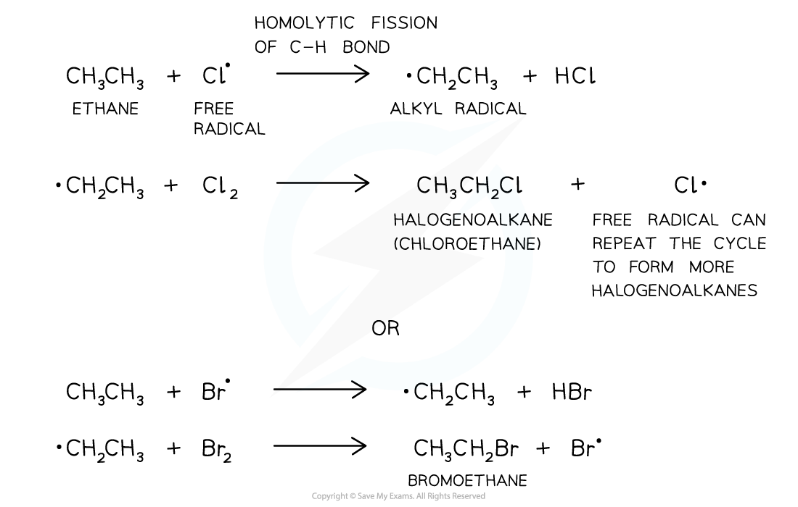
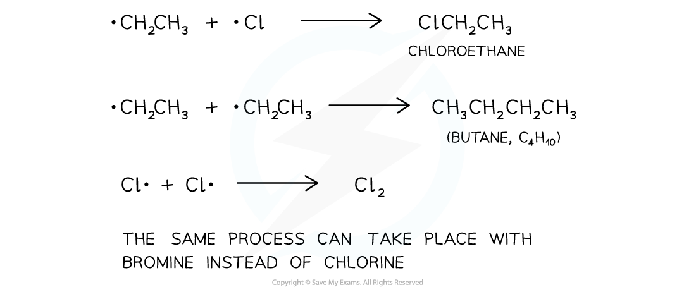

## Free Radical Substitution of Alkanes

* Alkanes can undergo **free-radical substitution** in which a hydrogen atom gets **substituted** by a halogen (chlorine / bromine)
* Since alkanes are very unreactive, **ultraviolet** light **(sunlight)** is needed for this substitution reaction to occur
* The free-radical substitution reaction consists of three steps:

  + In the **initiation step**, the halogen bond (Cl-Cl or Br-Br) is broken by UV energy to form two radicals
  + These radicals create further radicals in a chain reaction called the **propagation step**
  + The reaction is terminated when two radicals collide with each other in a **termination step**
* Alkanes can undergo **free-radical substitution** in which a hydrogen atom gets **substituted** by a halogen (chlorine/bromine)

  + **Ultraviolet** light **(sunlight)** is needed for this substitution reaction to occur

***The fact that the bromine colour has disappeared only when mixed with an alkane and placed in sunlight suggests that the ultraviolet light is essential for the free radical substitution reaction to take place***

* The free-radical substitution reaction consists of three steps:

#### Initiation step

* In the **initiation** **step** the Cl-Cl or Br-Br is broken by energy from the UV light
* This produces two radicals in a **homolytic** **fission** reaction

***The first step of the free-radical substitution reaction is the initiation step in which two free radicals are formed by sunlight***

#### Propagation step

* The **propagation** **step** refers to the **progression** (growing) of the substitution reaction in a **chain reaction**

  + **Free radicals** are very reactive and will attack the unreactive alkanes
  + A C-H bond breaks **homolytically** (each atom gets an electron from the covalent bond)
  + An **alkyl** free radical is produced
  + This can attack another chlorine/bromine molecule to form the **halogenoalkane** and **regenerate** the chlorine/bromine free radical
  + This free radical can then **repeat** the cycle

***The second step of the free-radical substitution reaction is the propagation step in which the reaction grows in a chain reaction***

* This reaction is not very suitable for preparing specific halogenoalkanes as a **mixture** of substitution products are formed

  + If there is enough chlorine/bromine present, all the hydrogens in the alkane will eventually get substituted (eg. ethane will become C2Cl6/C2Br6)

***The free-radical substitution reaction gives a variety of products and not a pure halogenoalkane***

#### Termination step

* The **termination step** is when the chain reaction **terminates** (stops) due to two free radicals reacting together and forming a single unreactive molecule

  + Multiple products are possible

***The final step in the substitution reaction to form a single unreactive molecule***

## Limitations of Free Radical Substitution

#### Impurities

* In the termination step there are a number of possibilities
* Remember that termination involves any free radical bonding with another free radical
* If we have two **⋅**CH3radicals they can bond to form ethane, CH3CH3

  + **⋅**CH3+ **⋅**CH3 → CH3CH3
  + If we are trying to form a chloroalkane, then ethane is an impurity

#### Further substitution

* Excess chlorine present when reacted with methane in the presence of UV light will promote further substitution and could produce CH2Cl2, CHCl3, CCl4
* Further substitution can occur as follows

  + CH3Cl + **⋅**Cl → HCl + **⋅**CH2Cl
  + **⋅**CH2Cl + Cl2 → CH2Cl2+ **⋅**Cl
* These reactions could occur

  + CH3Cl + Cl2 → CH2Cl2+ HCl
  + CH2Cl2 + Cl2 → CHCl3+ HCl
  + CHCl3+ Cl2 → CCl4 + HCl

#### Substitution of different carbon atoms

* If we have an alkane with a middle carbon such as propane, substitution can occur here
* Propagation steps for substitution of propane with excess bromine in the presence of UV light on the middle carbon are as follows

  + CH3CH2CH3+ **⋅**Br → CH3**⋅**CHCH3+ HBr
  + CH3**⋅**CHCH3+ Br2 → CH3CH(Br)CH3 + HBr
* If the question asks for the halogen to be substituted onto a middle carbon you must show the radical dot in the correct place, so on the electron deficient carbon