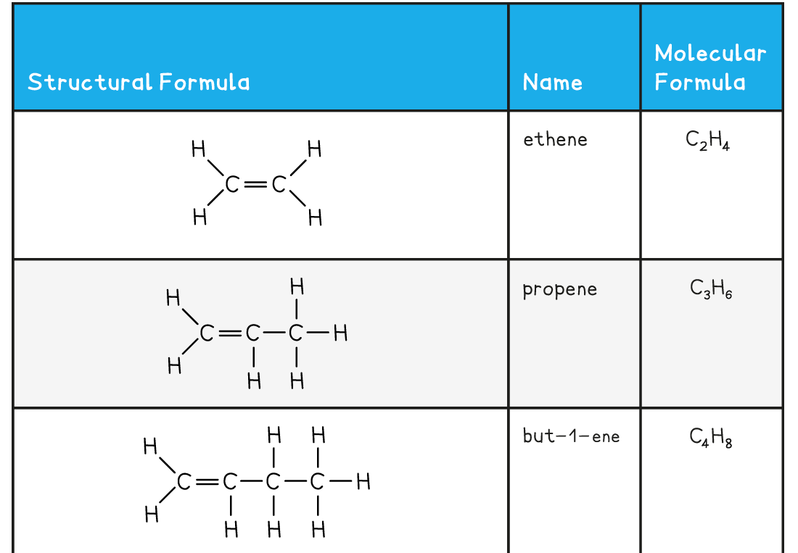
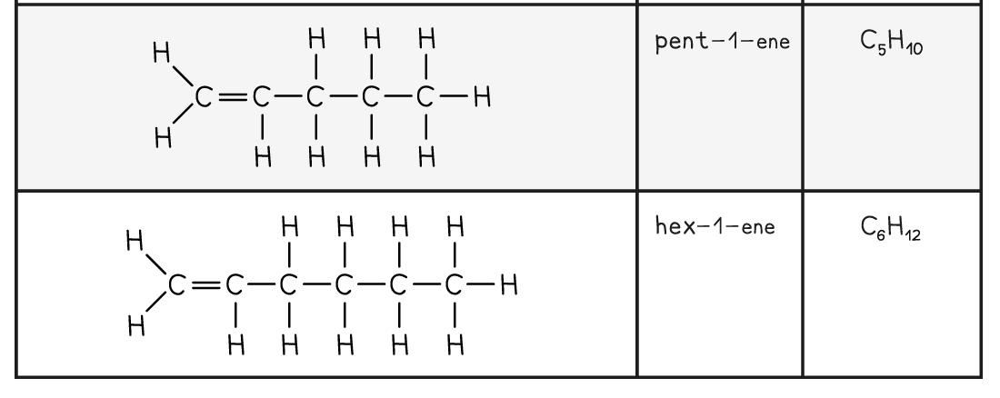

## Describing Alkenes

* All alkenes contain a **double carbon bond**, which is shown as two lines between two of the carbon atoms i.e. C=C
* All alkenes contain a double carbon bond, which is the functional group and is what allows alkenes to react in ways that alkanes cannot
* **Alkenes** have the general molecular formula**C****n****H****2n**
* They are said to be **unsaturated hydrocarbons**

  + They contain carbon-carbon double bonds
  + They are made up of hydrogen and carbon atoms only
* Alkenes are named using the nomenclature rule **alk + ene**
* In molecules with a straight chain of 4 or more carbon atoms, the position of the C=C double bond must be specified
* The carbon atoms on the straight chain must be numbered, starting with the end closest to the double bond
* The lowest-numbered carbon atom participating in the double bond is indicated just before the -ene:

#### The First Five Members of the Alkene Family

