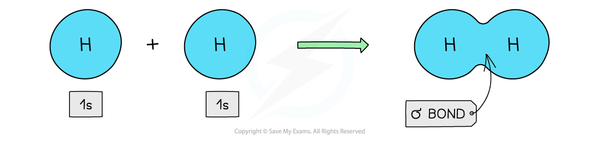
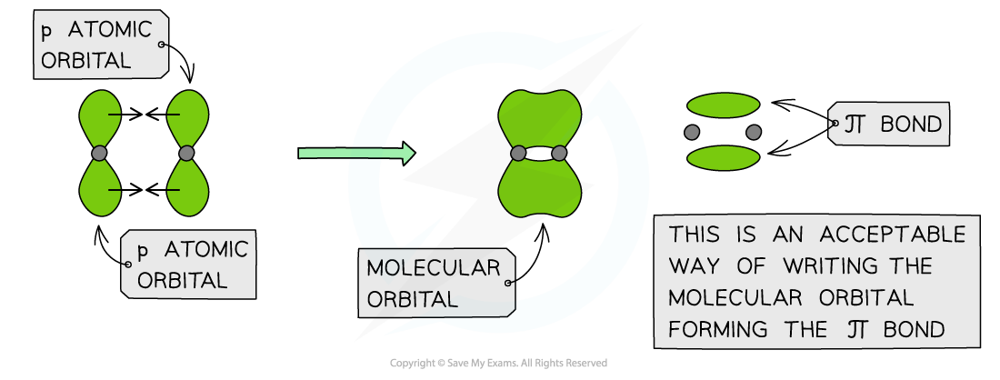

## Bonding in Alkenes

* Each carbon atom has four electrons in its outer shell (**electronic configuration**: 1s22s22p2)
* Carbon atoms share these four electrons in four covalent bonds with other atoms to achieve a **full outer shell configuration**
* These electrons are found in orbitals within the respective atoms
* When forming a covalent bond, the orbitals overlap in such a way to form two types of bonds

  + Sigma bonds (σ)
  + Pi bonds (π)

* When carbon atoms use only three of their electron pairs to form a σ bond, each carbon atom will have a p orbital which contains **one** spare electron
* When the p orbitals of two carbon atoms overlap with each other, a π bond is formed (the π bond contains two electrons)
* The two orbitals that form the π bond lie above and below the plane of the two carbon atoms to maximise bond overlap

#### σ bonds

* **Sigma** (σ) bonds are formed from the **end to end** **overlap** of atomic orbitals
* s orbitals overlap this way as well as p orbitals

***Sigma orbitals can be formed from the end to end overlap of s orbitals***

* The electron density in a σ bond is symmetrical about a line joining the nuclei of the atoms forming the bond
* The pair of electrons is found between the nuclei of the two atoms
* The electrostatic attraction between the electrons and nuclei bonds the atoms to each other

#### Hydrogen

* The hydrogen atom has only one s orbital
* The s orbitals of the two hydrogen atoms will overlap to form a σ bond

#### π bonds

* **Pi** (π) bonds are formed from the **sideways** **overlap** of **adjacent**p orbitals
* The two lobes that make up the π bond lie **above** **and** **below** **the** **plane** of the σ bond
* This maximises overlap of the p orbitals
* A single π bond is drawn as **two electron clouds,** one arising from each lobe of the p orbitals
* The two clouds of electrons in a π bond represent **one**bond containing **two electrons**

***π orbitals can be formed from the sideways overlap of p orbitals***

#### Ethene

* Each carbon atom uses **three**of its **four**electrons to form σ bonds
* Two σ bonds are formed with the hydrogen atoms
* One σ bond is formed with the other carbon atom
* The fourth electron from each carbon atom occupies a p orbital which overlaps **sideways**with another p orbital on the other carbon atom to form a π bond
* This means that the C-C is a **double bond**: one σ and one π bond

***Each carbon atom in ethene forms two sigma bonds with hydrogen atoms and one σ bond with another carbon atom. The fourth electron is used to form a π bond between the two carbon atoms***