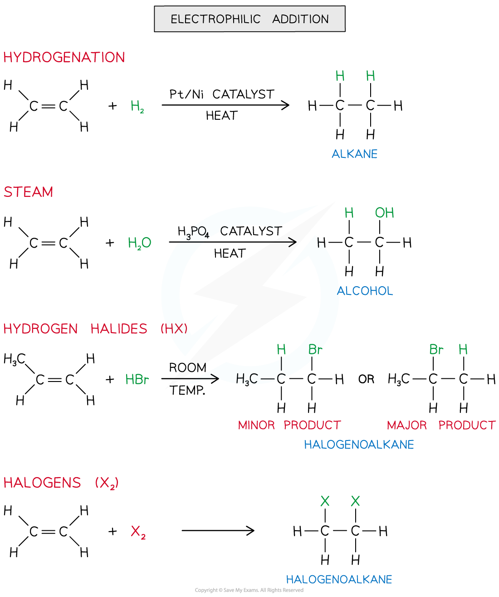
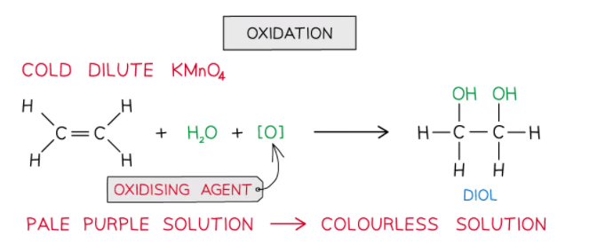
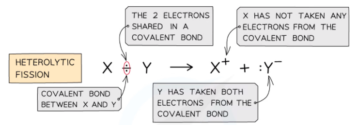

## Electrophilic Addition

* The double bond in alkenes is an area of high electron density (there are four electrons found in this double bond)
* This makes the double bond susceptible to attack by electrophiles (electron-loving species)
* An **electrophilic addition**is the addition of an **electrophile** to a double bond
* The C-C double bond is broken, and a new single bond is formed from each of the two carbon atoms
* Electrophilic addition reactions include the addition of:

  + Hydrogen (also known as **hydrogenation** **reaction**)
  + Steam (H2O (g))
  + Hydrogen halide (HX)
  + Halogen

***The diagram shows an overview of the different electrophilic addition reactions alkenes can undergo***

#### Manufacture of margarine

* Hydrogenation is extensively used in industry to manufacture margarine
* Naturally occurring vegetable oils are unsaturated and contain C=C double bonds
* When these bonds react with hydrogen, some of the C=C double bonds become C-C single bonds
* This process changes the properties of vegetable oil and converts it into a solid: margarine

#### Oxidation

* Alkenes can also be **oxidised**by **acidified potassium manganate(VII)**(KMnO4) which is a very powerful **oxidising agent**
* When shaken with cold dilute **KMnO****4** the **pale purple**solution turns **colourless**and the product is a **diol**

  + This colour change means this reaction can be used, like bromine, to distinguish alkanes from alkenes ( alkanes do not have double bonds and so are not oxidised in this way)

* Although you do not need to know the full details of the working of this reaction you can think of it as an oxidation followed by an addition

  + The potassium manganate provides an oxygen atom (oxidation)
  + Then water in the solution provides another oxygen atom and two hydrogen atoms, so there is addition of two OH groups across the double bond

## Heterolytic Fission

* **Heterolytic fission**is breaking a covalent bond in such a way that the more electronegative atom takes both the electrons from the bond to form a negative ion and leaving behind a positive ion

  

***The diagram shows heterolytic fission in which the most electronegative atom takes both electrons in the covalent bond***