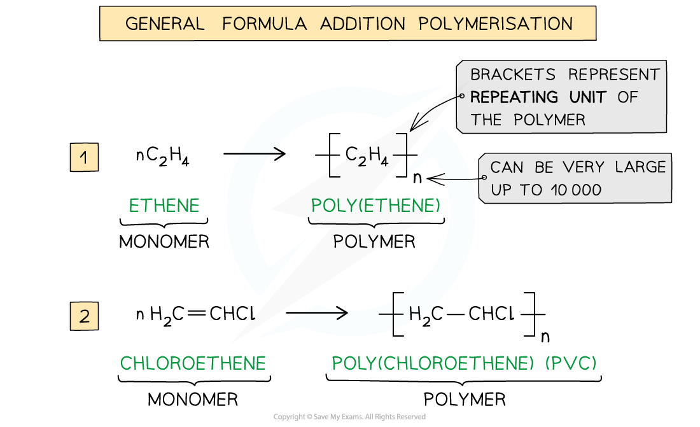
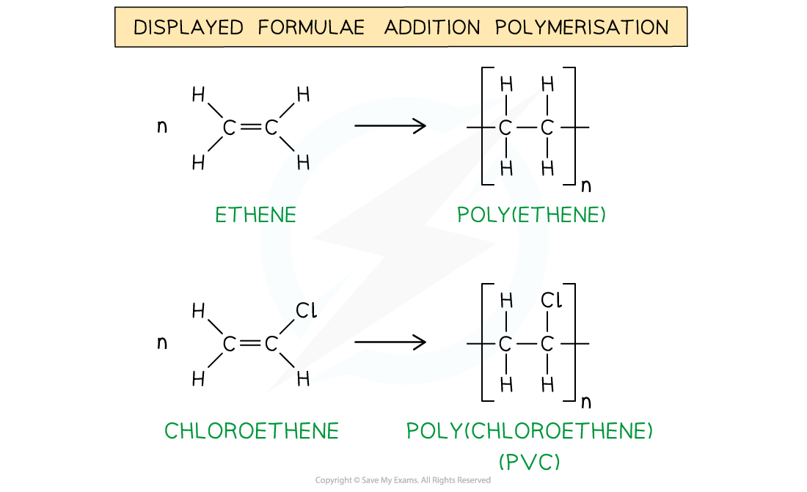
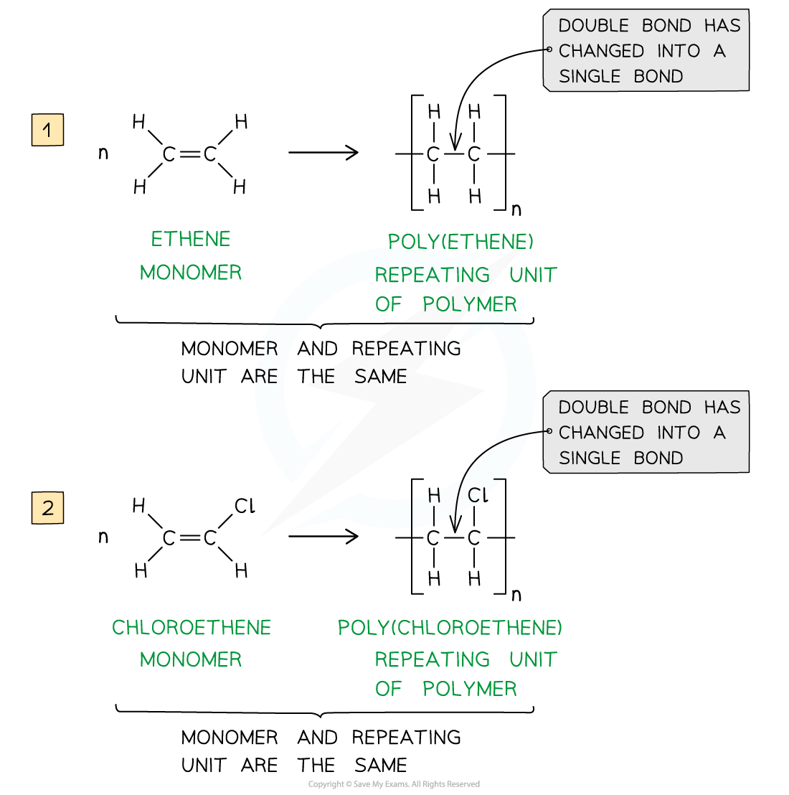
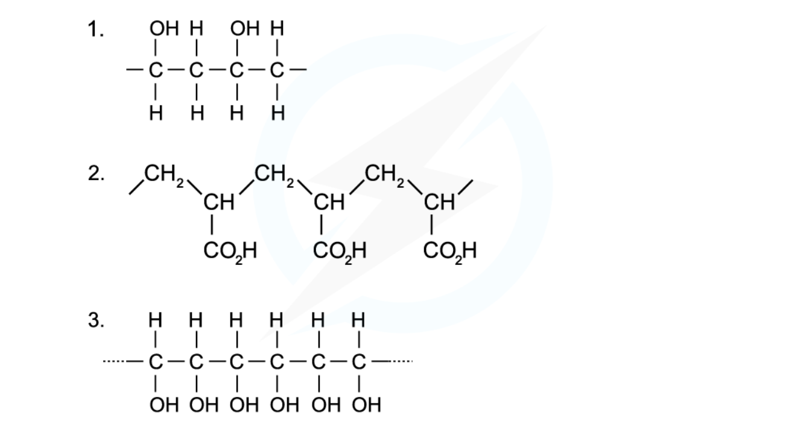
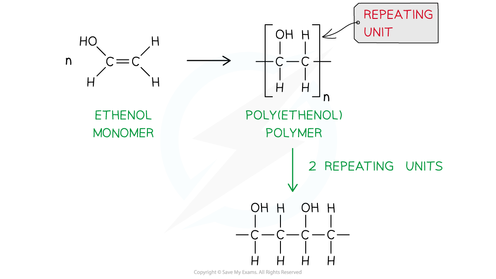
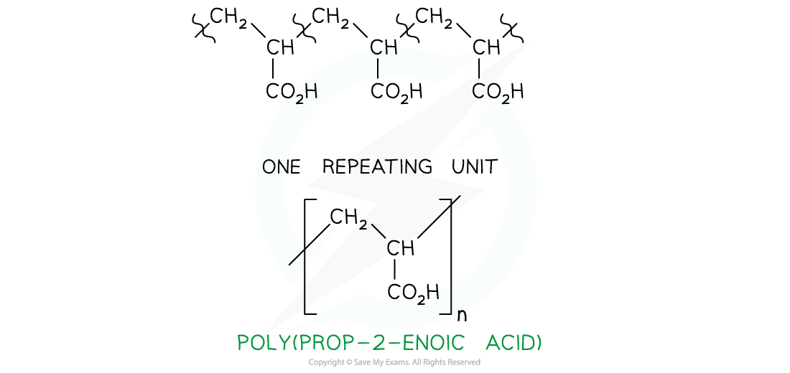

## Addition Polymerisation

#### Addition polymerisation

* **Addition polymerisation** is one of the most important addition reactions of alkenes which form the basis of the plastics industry
* Addition polymerisation is the reaction in which many **monomers** containing at least one C=C double bond form long chains of **polymers** as the only product

  + Just like in other addition reactions of alkenes, the π-bond in each C-C bond breaks and then the monomers link together to form new C-C single bonds
* A **polymer** is a long-chain molecule that is made up of many repeating units
* The small, reactive molecules that join together to form the polymer are called **monomers**
* A polymerisation reaction can be represented by a **general formula** or by using **displayed formulae**

  + Eg. poly(ethene) and poly(chloroethene) (also known as **PVC**) are polymers made up of the ethene and chloroethene monomers respectively and are commonly used in making plastics

***The general formulae of the addition polymerisation of ethene (1) and chloroethene (2)***

***The displayed formulae of the addition polymerisation of ethene (1) and chloroethene (2)***

* Just like any other **addition** reaction of alkenes, addition polymerisation gives only **one** product

#### Deducing repeat units

* A **repeat unit** is the smallest group of atoms that when connected one after the other make up the polymer chain

  + It is represented by **square brackets** in the displayed and general formula
* In **poly(alkenes)** (such as poly(ethene)) and **substituted poly(alkenes)** (such as PVC) made of **one type of monomer** the repeating unit is the same as the monomer except that the C=C double bond is changed to a C-C single bond

***The repeating units of poly(ethene) and poly(chloroethene) are similar to their monomer except that the C=C bond has changed into a C-C bond***

#### Worked Example

**Identifying monomers**

Identify the monomers present in the given sections of addition polymer molecules:

**Answer 1:**

* When ethenol, CH(OH)=CH2, is polymerised, the C=C double bond opens to produce a repeating unit of -CH(OH)-CH2- This gives the polymer poly(ethenol)

**Answer 2:**

* To find the monomer, first the repeating unit should be deduced. Repeating units have only 2 carbons in the polymer main chain

* Since the repeating unit is now found, it can be concluded that the monomer is prop-2-enoic acid

**Answer 3:**

* Again, the repeating unit only has 2 carbons in the polymer chain which in this case are two carbon atoms that each contain one OH group

  + Thus, when ethene-1,2-diol, CH(OH)=CH(OH), is polymerised, the C=C double bond opens to produce a repeating unit of  -CH(OH)-CH(OH)- which gives the polymer poly(ethene-1,2-diol)

#### Examiner Tips and Tricks

The section of the polymer chain shown inside the square brackets by the structural or displayed formula is the **repeat unit** and **not** the monomer. The monomer is the same as the repeat unit except for that it has C=C bonds instead of C-C bonds