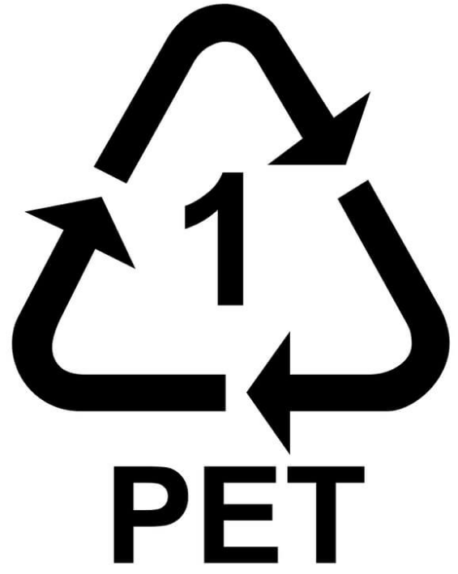
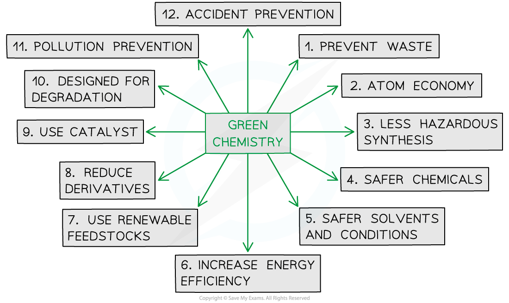

## Disposal of Polymers

* Polymers provide a readily available, cheap alternative to many metal, glass, paper and cardboard materials in everyday use
* The **low reactivity** of many polymers makes them ideal for certain uses, e.g. food packaging, but at the same time creates problems with their disposal as a lot of polymers are **non-biodegradable**

  + There are many published articles about the **environmental problems** of waste plastic killing marine animals
* One method of polymer disposal continues to be the use of landfill sites

  + This is not ideal and various initiatives are being introduced aiming to reduce this method of waste disposal in general as well as with specific regard to polymers

#### Recycling

* Polymer **recycling**reduces the amount of waste that it going to **landfill**sites

  + Newer landfill sites can have a recycling point where the new waste is brought before going to into the actual landfill - this is in an effort to reduce the amount of polymers (and other recyclable materials) unnecessarily going into the waste site
* The recycling of polymers can also reduce the use of **finite resources**

  + Lots of polymers are made from the products of cracking crude oil and it's fractions

* Recycling polymers is a **time-consuming** process as they have to be sorted into the different categories

  + These categories are usually shown somewhere on the plastic / polymer product with the recycling symbol and numbers or abbreviations for the different polymers, e.g.:

**The recycling symbol for the polyethylene terephthalate polymer**

* After sorting, the polymers are chopped, washed, dried, melted and then cast into pellets ready for use

  + However, mixed polymers can mean that this process is wasted as its produces an unusable mix of polymers
* Certain polymers can cause problems when recycling due to their chemical composition, e.g. PVC contains a large amount of toxic chlorine which can be released

  + Modern techniques are overcoming this PVC problem by dissolving the polymer and precipitating out the recycled material

#### Incineration

* Some petroleum / natural gas derived polymers are still difficult to recycle
* Since they have a large amount of energy stored within the polymer chains, these polymers can be incinerated

  + This process can then be used to boil water and use the water vapour to turn turbines inside a power station, in a  similar fashion to coal-fired power stations
* This process still causes environmental pollution as the carbon within the polymer can be released as carbon dioxide contributing to global warming

  + Other toxic waste products include hydrogen chloride and other chlorinated molecules from the combustion of PVC

#### Feedstock recycling

* **Feedstock recycling** is where waste polymers are broken down, by chemical and thermal processes, into monomers, gases and oils
* These products are then used as the raw materials in the production of new polymers and other organic chemicals
* The major benefit of feedstock recycling, compared to other methods of polymer disposal, is that it works with unsorted and unwashed polymers

## Sustainability

* Chemists will often use the principles of green chemistry when designing a **sustainable** polymer manufacturing process

***The twelve principles of green chemistry***

* They will aim to:

  + Use chemicals (reactants, solvents and catalysts) that are as **safe** and **environmentally friendly** as possible

    - They also aim to **reduce the amount of chemicals used,** in terms of physical quantities as well as actual number of chemicals
  + Use **renewable feedstock** chemicals where possible
  + **Reduce the energy requirements** for the reaction as well as increase the energy efficiency, which has both an environmental and financial bonus
  + Improve atom economy / reduce the amount of waste byproducts
  + Consider the lifespan of the polymer, which will incorporate the idea of the polymer being suitable for its use

## Limiting Problems of Polymer Disposal

* Chemists have designed ways to remove toxic waste products like HCl before they are emitted into the atmosphere
* The waste gase from the incinerator are scrubbed/reacted with a base or carbonate
* The base reacts with the acidic HCl gas, neutralising it

  + eg. CaO (s) + 2HCl (aq)→ CaCl2 (aq) + H2O (l)
* Chemists have also developed biodegradable and compostable polymers

#### Biodegradable polymers

* Biodegradable polymers can be broken down over time by microorganisms

  + Common products from this process include carbon dioxide, water and other organic compounds
* The **polyester**and **polyamide**condensation polymers are considered to be biodegradable as they can be broken down using **hydrolysis**reactions

  + This is a major advantage over the polymers produced using alkene monomers (polyalkenes)
  + When polyesters and polyamides are taken to landfill sites, they can be broken down easily and their products used for other applications

#### Compostable polymers

* Compostable polymers are commonly plant based

  + Plant starch is being used in the production of biodegradable bin liners
  + Sugar cane fibres are replacing polystyrene in the production of disposable plates and cups
* Compostable polymers degrade naturally leaving no harmful residues