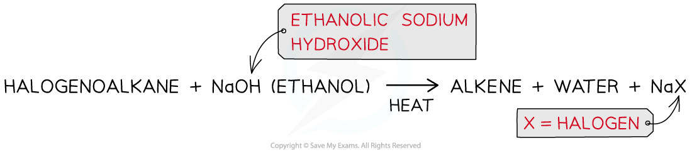

## Nucleophilic Substitution: Reactions

* A **nucleophile** is an electron-rich species that can **donate** a pair of electrons

  + ‘Nucleophile’ means ‘nucleus / positive charge loving’ as nucleophiles are attracted to positively charged species
  + **Nucleophilic**refers to reactions that involve a nucleophile

#### Formation of alcohols

* The nucleophile in this reaction is the **hydroxide ion**, **OH****-**
* An **aqueous** solution of sodium hydroxide (NaOH) or potassium hydroxide (KOH) with **ethanol** is used to form an alcohol
* This reaction is very slow at room temperature, so the reaction mixture is warmed
* This is an example of a **hydrolysis reaction** and the product is an alcohol

  + The rate of this reaction depends on the type of halogen in the halogenoalkane
  + The stronger the C-X bond, the slower the rate of the reaction
  + In terms of bond enthalpy, C-F > C-Cl > C-Br > C-I
  + Fluoroalkanes do not react at all, but iodoalkanes have a very fast rate of reaction

***The halogen is replaced by the nucleophile, OH******-***

* This reaction could also be done with water as the nucleophile, but it is very slow

  + The hydroxide ion is a better nucleophile than water as it carries a full negative charge
  + In water, the oxygen atom only carries a partial charge

***A hydroxide ion is a better nucleophile as it has a full formal negative charge whereas the oxygen atom in water only carries a partial negative charge; this causes the nucleophilic substitution reaction with water to be much slower than the aqueous alkali***

#### Reaction with water

* The water molecule is a weak nucleophile, but it will eventually substitute for the halogen
* This occurs much more slowly compared to when warm aqueous sodium hydroxide is used
* An alcohol is produced

  + **RX + H****2****O → ROH + H****+** **+ X****-**
  + **CH****3****CH****2****Br + H****2****O → CH****3****CH****2****OH + H****+** **+ Br****-**
* If silver nitrate solution in ethanol is added to the solution, the silver ions will react with the halide ions as soon as they form, giving a silver halide precipitate

  + **Ag****+****(aq) + X****-** **(aq) → AgX (s)**

#### Formation of nitriles

* The nucleophile in this reaction is the **cyanide ion, CN****-**
* An **ethanolic solution** of **potassium** **cyanide** (KCN in ethanol) is **heated** **under** **reflux** with the halogenoalkane
* The product is a **nitrile**

  + E.g. bromoethane is heated under reflux with ethanolic potassium cyanide to form propanenitrile

***The halogen is replaced by a cyanide group, CN*** ***-***

* The nucleophilic substitution of halogenoalkanes with KCN **extends the carbon chain** by adding an extra carbon atom
* This reaction can therefore be used by chemists to make a compound with one more carbon atom than the best available organic starting material

#### Formation of primary amines by reaction with ammonia

* The nucleophile in this reaction is the ammonia molecule, NH3
* An **ethanolic** **solution** of **excess** ammonia (NH3 in ethanol) is **heated** **under pressure** with a **primary** halogenoalkane

  + An excess of ammonia is used because the product is more reactive than ammonia so further substitution reactions could occur
* The product is a **primary amine**

  + E.g. bromoethane reacts with excess ethanolic ammonia when heated under pressure to form ethylamine

***The halogen is replaced by an amine group, NH******2***

#### Formation of alkenes

* The halogenoalkanes are **heated under reflux** with **ethanolic sodium hydroxide** causing the C-X bond to break **heterolytically,** forming an X- ion and leaving an alkene as an organic product

  + E.g. bromoethane is heated under reflux with ethanolic sodium hydroxide to form ethene

***Production of an alkene from a halogenoalkane by reacting it with ethanolic sodium hydroxide and heating it***

***Hydrogen bromide is eliminated to form ethene***