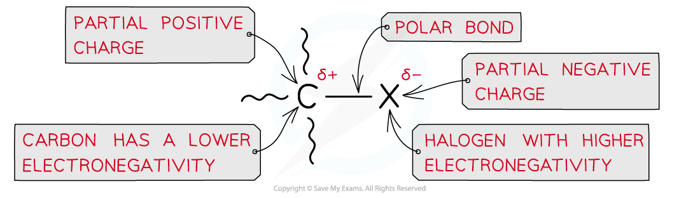

## Nucleophilic Substitution: Mechanisms

* A **nucleophilic substitution**reaction is one in which a **nucleophile**attacks a carbon atom which carries a **partial** **positive** **charge**
* An atom that has a **partial** **negative** **charge** is replaced by the nucleophile
* Halogenoalkanes will undergo nucleophilic substitution reactions due to the polar C-X bond (where X is a halogen)

***Due to large differences in electronegativity between the carbon and halogen atom, the C-X bond is polar***

#### Mechanism with aqueous potassium hydroxide

* In the following reaction a halogenoalkane reacts with aqueous alkali to form an alcohol

***The halogen is replaced by a nucleophile, OH******–***

* The mechanism for the reaction is as follows

***Nucleophilic substitution reaction of bromoethane and aqueous alkali (e.g. NaOH)***

#### Mechanism with ammonia

* When ammonia reacts with a haloalkane a nucleophilic substitution reaction takes place forming a primary amine

  + For example chloromethane reacts with ammonia in two steps to make methylamine and ammonium chloride

**CH****3****Cl + NH****3** **→ [CH****3****NH****3****]****+****Cl****-**

**[CH****3****NH****3****]****+****Cl****-****+ NH****3** **→ CH****3****NH****2****+ NH****4****+****Cl****-**

* **Excess** ammonia is used to prevent further substitution and favour the formation of a primary amine

***The mechanism of nucleophilic substitution between ammonia and a halogenoalkane***