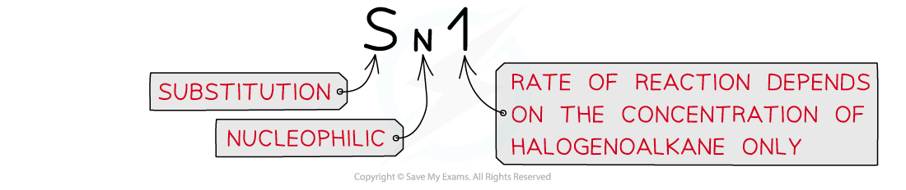
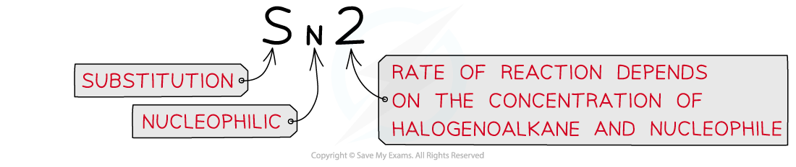
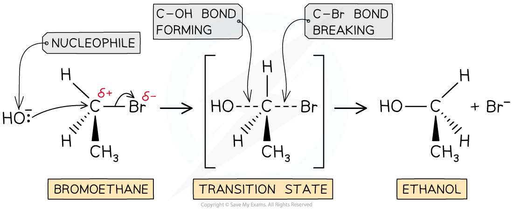
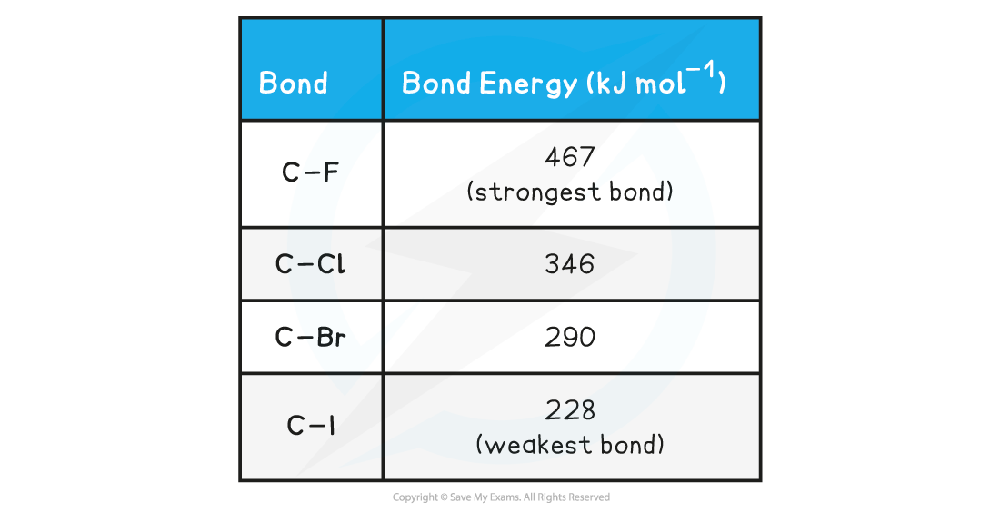

## Reactivity of Halogenoalkanes

* Nucleophilic substitution reactions can occur in two different ways (known as **S****N****2** and **S****N****1**reactions) depending on the structure of the halogenoalkane involved

  + **Tertiary** halogenoalkanes favour SN1 reactions
  + **Primary** halogenoalkanes favour SN2 reactions

#### SN1 reactions

* In **tertiary** halogenoalkanes, the carbon that is attached to the halogen is also bonded to three alkyl groups
* These halogenoalkanes undergo nucleophilic substitution by an **S****N****1** mechanism

  + ‘S’ stands for ‘substitution’
  + ‘N’ stands for ‘nucleophilic’
  + ‘1’ means that the rate of the reaction (which is determined by the slowest step of the reaction) depends on the concentration of only one reagent, the halogenoalkane

* The SN1 mechanism is a **two-step** reaction
* In the first step, the C-X bond breaks heterolytically and the halogen leaves the halogenoalkane as an X- ion (this is the **slow** and **rate-determining step**)

  + This forms a tertiary carbocation **(which is a tertiary carbon atom with a positive charge)**
  + In the second step, the tertiary carbocation is attacked by the nucleophile

* For example, the nucleophilic substitution of 2-bromo-2-methylpropane by hydroxide ions to form 2-methyl-2-propanol

***The mechanism of nucleophilic substitution in 2-bromo-2-methylpropane which is a tertiary halogenoalkane***

#### SN2 reactions

* In **primary** halogenoalkanes**,** the carbon that is attached to the halogen is bonded to one alkyl group
* These halogenoalkanes undergo nucleophilic substitution by an **S****N****2** mechanism

  + ‘S’ stands for ‘substitution’
  + ‘N’ stands for ‘nucleophilic’
  + ‘2’ means that the rate of the reaction (which is determined by the slowest step of the reaction) depends on the concentration of both the halogenoalkane and the nucleophile ions

* The SN2 mechanism is a **one-step** reaction

  + The nucleophile donates a pair of electrons to the δ+ carbon atom of the halogenoalkane to form a new bond

    At the same time, the C-X bond is breaking and the halogen (X) takes both electrons in the bond
  + The halogen leaves the halogenoalkane as an X- ion
* For example, the nucleophilic substitution of bromoethane by hydroxide ions to form ethanol

***The*** **S****N****2** ***mechanism of bromoethane with hydroxide causing an inversion of configuration***

## Bond Enthalpy & Halogenoalkane Reactivity

#### Bond Enthalpy

* The halogenoalkanes have different **rates** of **substitution** **reactions**
* Since substitution reactions involve **breaking** the **carbon-halogen** bond the **bond** **energies** can be used to explain their different reactivities

#### Halogenoalkane Bond Energy

* The table above shows that the C-I bond requires the least energy to break, and is therefore the **weakest** carbon-halogen bond
* During substitution reactions, the C-I bond will, therefore, **heterolytically** break as follows:

**R****3****C-I + OH****-****→    R****3****C-OH + I****-**

                 halogenoalkane          alcohol

* The C-F bond, on the other hand, requires the most energy to break and is, therefore, the **strongest**carbon-halogen bond
* Fluoroalkanes will, therefore, be less likely to undergo substitution reactions