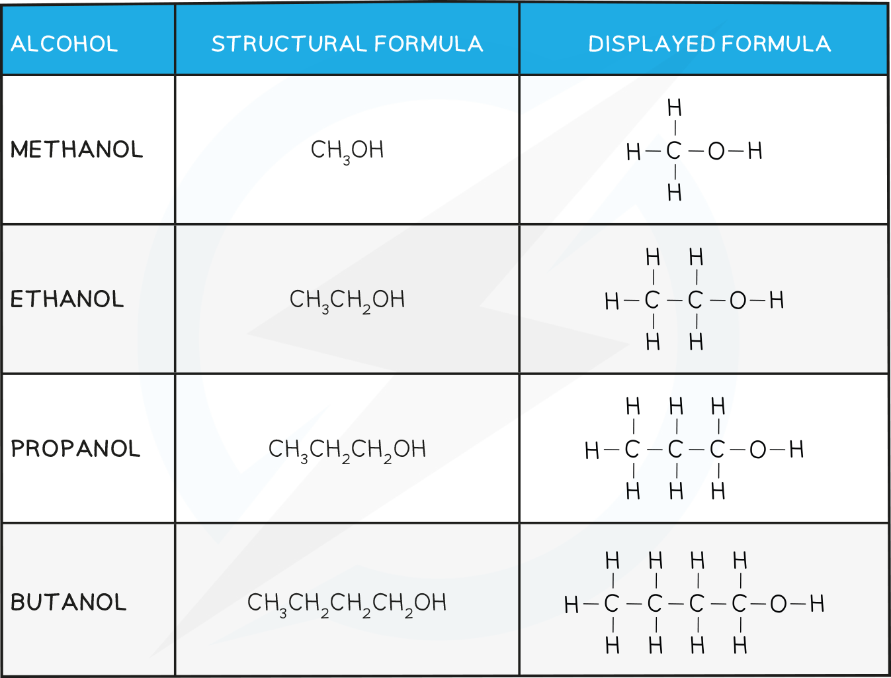
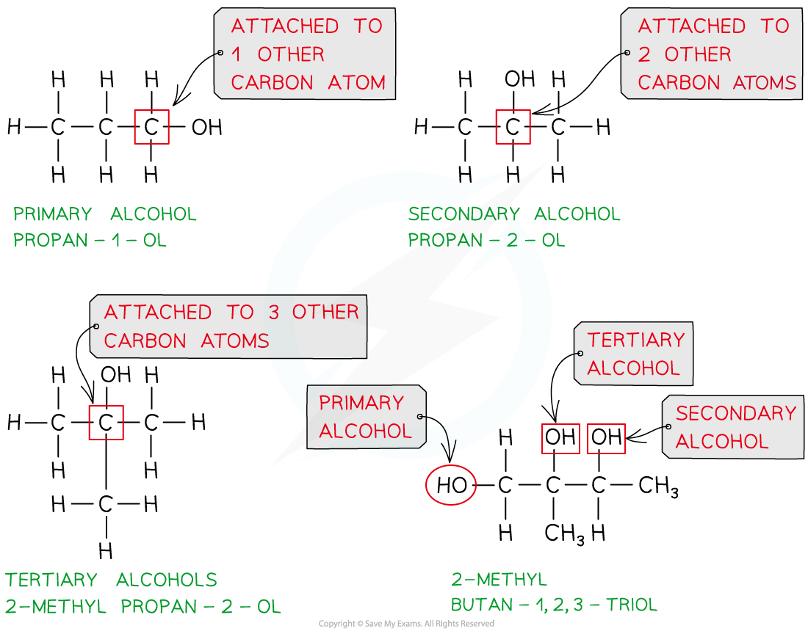

## Classifying Alcohols

* **Alcohols** are a family of molecules that contain the **hydroxyl functional group**, **-OH**
* Their general formula is  **C****n****H****2n+1****OH**
* The nomenclature of alcohols follows the pattern**alkan + ol**
* If there are two **-OH** groups present the molecule is called a **diol**

#### The first four Alcohols and their Structures Table

* Alcohols are classified as **primary, secondary** or **tertiary** depending on the number of carbons attached to the**functional group** carbon

  + **Primary** **alcohols** are alcohols in which the carbon atom bonded to the -OH group is attached to **one** other carbon atom (or alkyl group)
  + **Secondary** **alcohols** are alcohols in which the carbon atom bonded to the -OH group is attached to **two** other carbon atoms (or alkyl groups)
  + **Tertiary** **alcohols** are alcohols in which the carbon atom bonded to the -OH group is attached to **three** other carbon atoms (or alkyl groups)

***Classifying primary, secondary and tertiary alcohols and alcohols with more than one alcohol group***