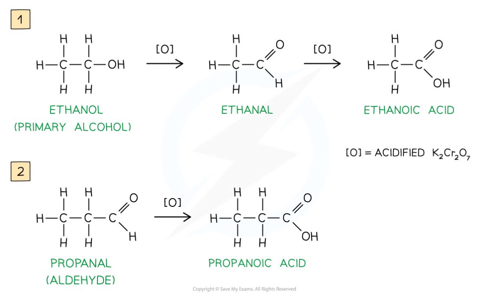
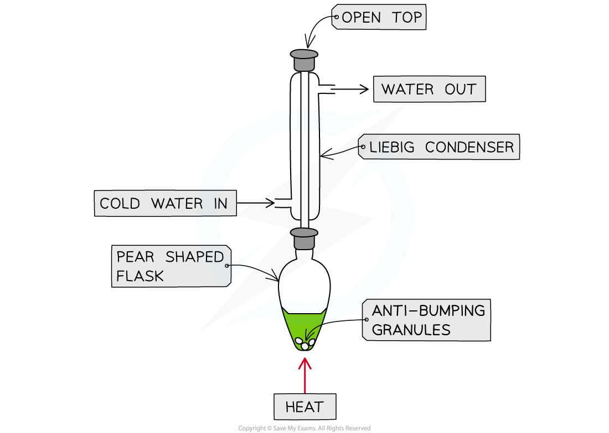
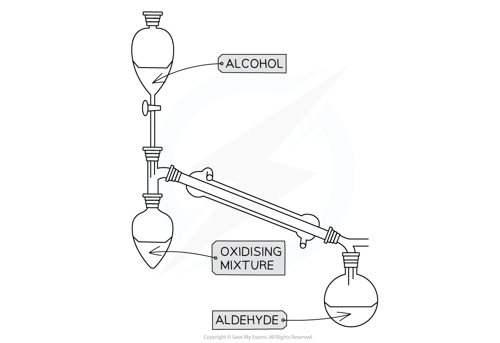

## Reactions of Alcohols

#### Combustion of alcohols

* Alcohols react with oxygen in the air when ignited and undergo **complete combustion**to form carbon dioxide and water

**alcohol + oxygen → carbon dioxide + water**

***Complete combustion of alcohols to produce carbon dioxide and water***

#### Conversions to halogenoalkanes

* These reactions involve replacing the hydroxyl group in an alcohol molecule with a halogen atom(known as halogenation)
* Different methods are required for each halogen

#### Chlorination

* Phosphorus(V) chloride is added to the alcohol resulting in a vigorous reaction at room temperature

  + This means the mixture doesn't need heating
* This reaction is used as a qualitative test for the presence of the -OH group

  + If you add PCl5 to an unknown liquid the evolution of steamy fumes (HCl gas) is evidence for the presence of the -OH group
* Two inorganic products are formed: phosphoryl chloride and hydrogen chloride

**CH****3****CH****2****CH****2****OH + PCl****5** **→ CH****3****CH****2****CH****2****Cl + POCl****3** **+ HCl**

* Chlorination of tertiary alcohols can be carried out in a different way by mixing (shaking) with hydrochloric acid at room temperature

* An example equation for the reaction of 2-methyl propan-2-ol is:

**(CH****3****)****3****COH + HCl → (CH****3****)****3****CCl + H****2****O**

* This reaction will not occur with primary or secondary alcohols

#### Bromination

* This reaction is carried out using a warmed mixture of potassium bromide and 50% concentrated sulfuric acid with the reacting alcohol
* More concentrated sulfuric acid would oxidise bromide ions to bromine resulting in different products
* The reaction can be written as two equations as the inorganic reactants first react together to form hydrogen bromide and potassium sulfate

**2KBr + H****2****SO****4****→ K****2****SO****4****+2HBr**

* The resulting hydrogen bromide then reacts with the alcohol, for example the reaction with butan-1-ol would be as follows:

**CH****3****CH****2****CH****2****CH****2****OH + HBr → CH****3****CH****2****CH****2****CH****2****Br + H****2****O**

#### Iodination

* This reaction is carried out using a mixture of red phosphorus and iodine with the alcohol whilst heating under reflux
* Similar to bromination, the reaction can be written as two equations as the inorganic reactants first react to form phosphorus(III) iodide

**2P + 3I****2** **→ 2PI****3**

* The reaction for the iodination of ethanol would be:

**3C****2****H****5****OH + PI****3** **→ 3C****2****H****5****I + H****3****PO****3**

* This reaction results in the formation of phosphoric acid as shown above

#### Dehydration to Alkenes

* Dehydration is done by heating the alcohol with concentrated phosphoric acid
* The reaction is similar to the elimination reaction of a halogenoalkene

  + The OH group and hydrogen of adjacent carbons are removed forming a C=C bond
* The equation for the dehydration of ethanol would be

**CH****3****CH****2****OH → CH****2****=CH****2****+ H****2****O**

* Phosphoric acid does not appear in the equation as the water formed dilutes the concentrated phosphoric acid

#### Oxidation of alcohols

* Primary alcohols can be oxidised to form **aldehydes** which can undergo further oxidation to form **carboxylic** **acids**
* Secondary alcohols can be oxidised to form **ketones**only
* Tertiary alcohols do not undergo oxidation
* The oxidising agents of alcohols include **acidified K****2****Cr****2****O****7**
* **Acidified potassium dichromate(VI)**, K2Cr2O7, is an orange oxidising agent

  + Acidified means that that the potassium dichromate(VI) is in a solution of **dilute** **acid** (such as dilute sulfuric acid)
  + For potassium dichromate(VI) to act as an oxidising agent, it itself needs to be reduced
  + This reduction requires hydrogen (H+) ions which are provided by the acidic medium

    - When alcohols are **oxidised**the orange dichromate ions (Cr2O72-) are reduced to green Cr3+ ions
* The primary alcohol is added to the oxidising agent and warmed
* The aldehyde product has a lower boiling point than the alcohol reactant so it can be **distilled off**as soon as it forms
* If the aldehyde is not distilled off, further **refluxing** with excess oxidising agent will oxidise it to a carboxylic acid
* Since ketones cannot be further oxidised, the ketone product does not need to be **distilled off**straight away after it has been formed

***Oxidation Stages of Primary Alcohols***

***Oxidation of propan-2-ol by acidified K******2******Cr******2******O******7******to form a ketone***

* The presence of an aldehyde group (-CHO) in an **unknown compound**can be determined by the **oxidising agents** Fehling’s and Tollens’ reagents

#### Fehling’s solution

* **Fehling’s solution** is an alkaline solution containing copper(II) ions which act as the oxidising agent
* When **warmed** with an aldehyde, the aldehyde is oxidised to a carboxylic acid and the Cu2+ ions are reduced to Cu+ ions

  + In the alkaline conditions, the carboxylic acid formed will be neutralised to a carboxylate ion (the -COOH will lose a proton to become -COO- )
  + The carboxylate ion (-COO-) will form a salt with a positively charged metal ion such as sodium (-COO-Na+)

* The **clear blue** solution turns **opaque** due to the formation of a **red precipitate**, **copper(I) oxide**
* **Ketones**cannot be oxidised and therefore give a **negative test** when warmed with Fehling’s solution

***The copper(II) ions in Fehling’s solution are oxidising agents, oxidising the aldehyde to a carboxylic acid and getting reduced themselves to copper(I) ions in the Cu******2******O precipitate***

#### Tollens’ reagent

* **Tollens' reagent**is an aqueous alkaline solution of silver nitrate in excess ammonia solution

  + Tollen’s reagent is also called **ammoniacal silver nitrate solution**
* When **warmed** with an aldehyde, the aldehyde is oxidised to a carboxylic acid and the Ag+ions are reduced to Ag atoms

  + In the alkaline conditions, the carboxylic acid will become a carboxylate ion and form a salt

* The Ag atoms form a silver ‘mirror’ on the inside of the tube
* **Ketones**cannot be oxidised and therefore give a **negative test** when warmed with Tollens’ reagent

***The Ag******+******ions in Tollens’ reagent are oxidising agents, oxidising the aldehyde to a carboxylic acid and getting reduced themselves to silver atoms***

#### Different practical techniques

* Because of the easier oxidation of aldehydes compared to alcohols, two different techniques are used

  + Heating under reflux
  + Distillation with addition

#### Heating under reflux

* This technique is used when we want full oxidation

  + Producing a carboxylic acid for a primary alcohol
  + Producing a ketone for a secondary alcohol

***Apparatus set up for heating under reflux***

* This set up means any products of oxidation remain in the reaction mixture
* Products which boil off condense in the vertical condenser then return to the heating flask

#### Distillation with addition

* This technique is used when we do not want to complete oxidation

  + To obtain an aldehyde rather than carboxylic acid for primary alcohol

    

***Apparatus set up for distillation with addition***

* Only the oxidising agent is heated whilst the alcohol is slowly added
* When the aldehyde is formed it immediately distils off as it has a much lower boiling point than the alcohol used to make it
* The aldehyde is then collected in the reciever

#### Examiner Tips and Tricks

* Tri-iodoethane is used in the iodoform test which will give a yellow precipitate with methyl ketones as covered at A Level in 7.2.2 Testing for Carbonyls
* It can also give a positive result for alcohols containing the CH3CHOH group (this also will include ethanol)