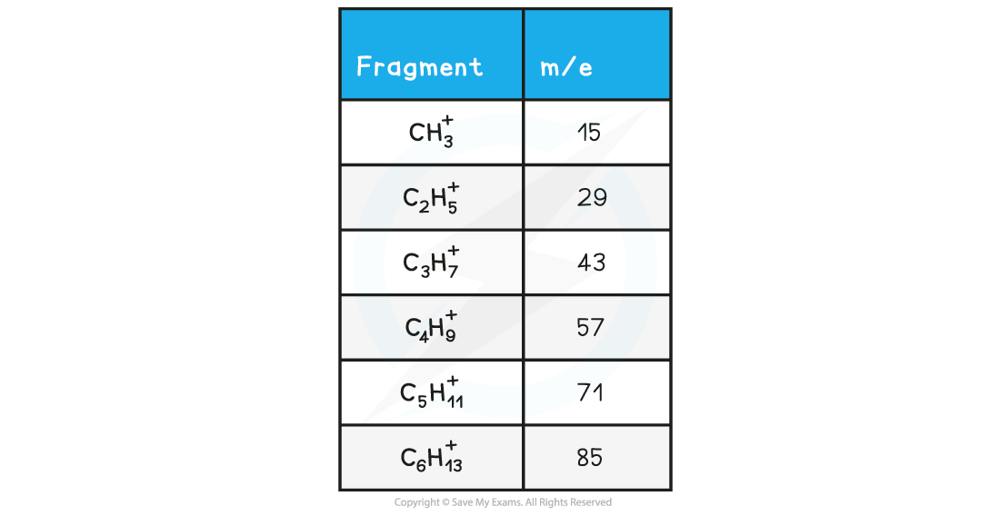
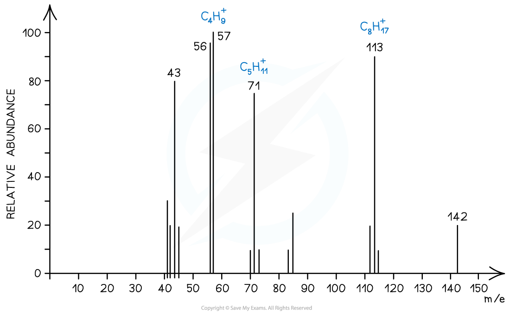
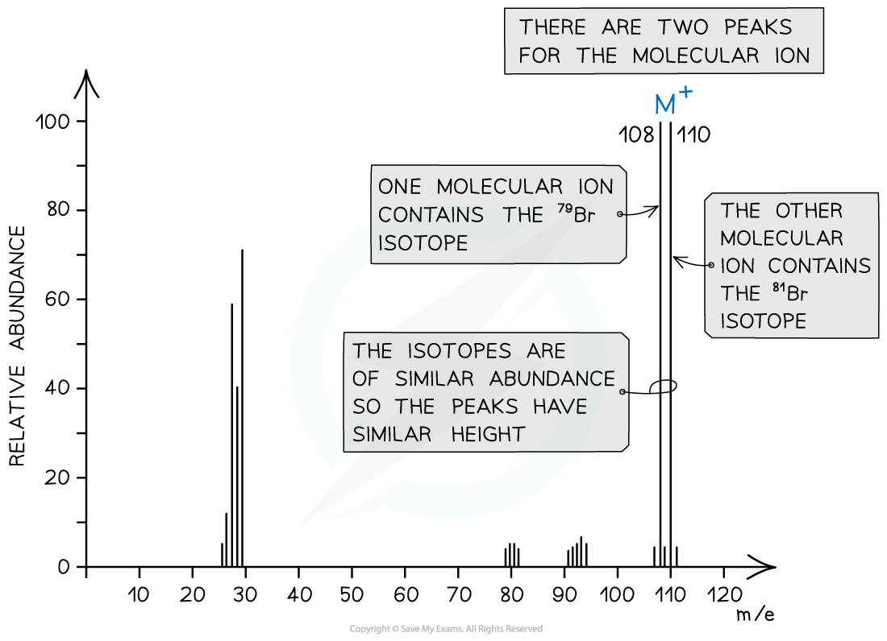
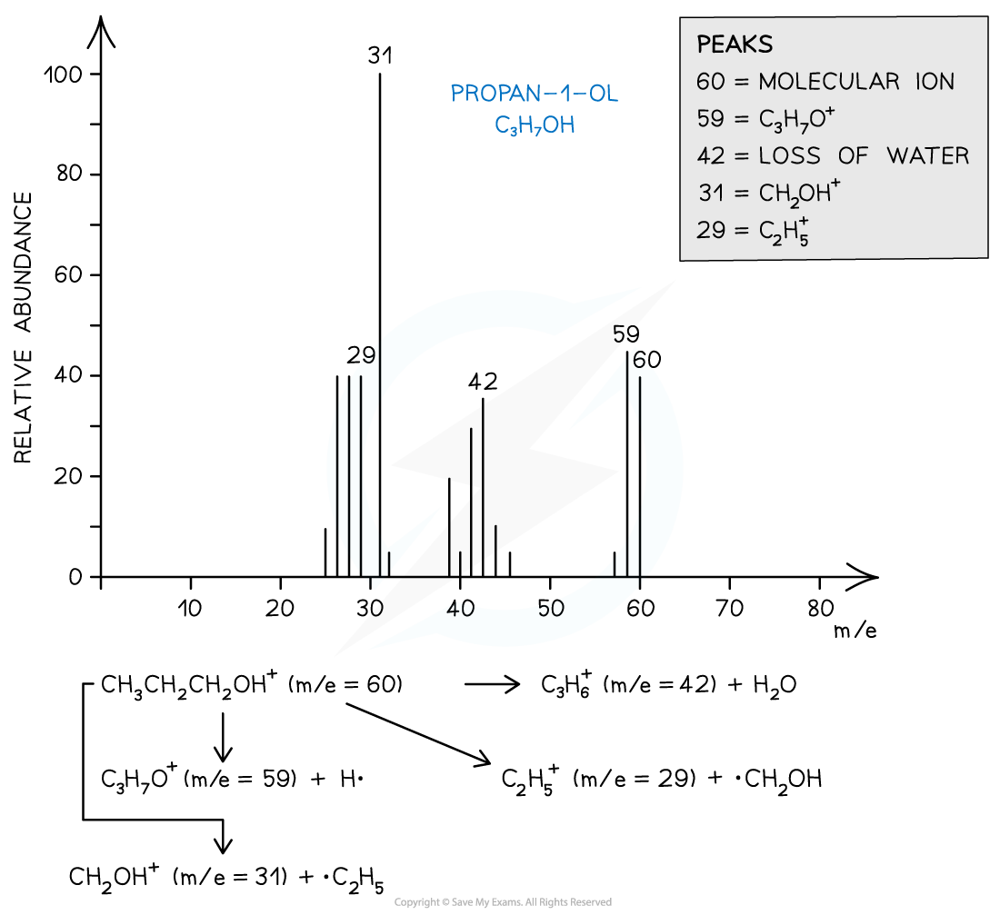

## Mass Spectrometry

* **Mass spectroscopy** is an analytical technique used to identify unknown compounds
* The molecules in the small sample are **bombarded** with high energy electrons which can cause the molecule to lose an electron
* This results in the formation of a positively charged **molecular** **ion** with one unpaired electron

  + One of the electrons in the pair has been **removed** by the beam of electrons

* The **[M+1]** peak is a smaller peak which is due to the natural abundance of the isotope carbon-13
* The amount of naturally occurring C-13 is a little over 1%, so the [M+1] peak is very small
* The height of the [M+1] peak for a particular ion depends on how many carbon atoms are present in that molecule; the more carbon atoms, the larger the [M+1] peak is

  + For example, the height of the [M+1] peak for an hexane (containing six carbon atoms) ion will be greater than the height of the [M+1] peak of an ethane (containing two carbon atoms) ion

#### Worked Example

**Analysing mass spectra**

Determine whether the following mass spectrum corresponds to but-1-ene or pent-1-ene:

**Answer**

* The mass spectrum corresponds to pent-1-ene as the molecular ion peak is at *m/z* = 70

  + The small peak at m/z = 71 is a C-13 peak, which does not count as the molecular ion peak
  + But-1-ene arises from the C4H8+ ion which has a molecular mass of 56
  + Pent-1-ene arises from the C5H10+ ion which has a molecular mass of 70

* The molecular ion can further **fragment** to form new ions, molecules, and radicals

***Fragmentation of a molecule in mass spectroscopy***

* These **fragmented** ions are **accelerated** by an electric field
* Based on their mass (***m***) to charge (***z***) ratio, the ion fragments are then separated by deflecting them into the **detector**

  + Most ions will only gain a charge of 1+ and therefore a ion with mass 12 and charge 1+ will have an *m/z* value of 12
  + It is, however, possible for a greater charge to occur. For example, an ion with mass 16 and charge 2+ will have a *m/z* value of 8
* The smaller and more positively charged fragment ions will be **detected** first as they will get **deflected** the most and are more attracted to the **negative** **pole** of the magnet
* Each fragment corresponds to a specific **peak** with a particular *m/z* value in the mass spectrum
* The **base peak** is the peak corresponding to the most **abundant** ion
* The *m/z* is sometimes referred to as the *m/e* ratio and it is almost always **1:1**

#### Isotopes

* Isotopes are different atoms of the **same** **element** that contain the same number of **protons** and **electrons** but a different number of **neutrons**.

  + These are atoms of the same **elements** but with different mass number
  + For example, Cl-35 and Cl-37 are isotopes as they are both atoms of the same element (chlorine, Cl) but have a different mass number (35 and 37 respectively)
* Mass spectroscopy can be used to find the **relative abundance** of the isotopes experimentally
* The **relative abundance** of an isotope is the proportion of one particular isotope in a mixture of isotopes found in nature

  + For example, the relative abundance of Cl-35 and Cl-37 is 75% and 25% respectively
  + This means that in nature, 75% of the chlorine atoms is the Cl-35 isotope and 25% is the Cl-37 isotope
* The **heights** of the peaks in mass spectroscopy show the proportion of each isotope present

***The peak heights show the relative abundance of the boron isotopes: boron-10 has a relative abundance of 19.9% and boron-11 has a relative abundance of 80.1%***

#### Worked Example

**Calculating m/z ratio**

In a sample of iron, the ions 54Fe2+ and 56Fe3+ are detected. Calculate their m/z ratio and determine which ion is deflected more inside the spectrometer.

**Answer**

* 56Fe3+ has a smaller *m/z* ratio and will therefore be deflected more.

  + It also has the largest positive charge and will be more attracted to the negative pole of the magnet within the mass spectrometer.

#### Examiner Tips and Tricks

A small *m/z* value corresponds to fragments that are either **small** or have a **high positive charge** or a combination of **both**.

#### Fragmentation

* The molecular ion peak can be used to identify the **molecular mass** of a compound
* However, different compounds may have the same molecular mass
* To further determine the structure of the unknown compound, **fragmentation** is used
* Fragments may appear due to the formation of **characteristic** **fragments** or the **loss** **of** **small** **molecules**

  + For example, a peak at 29 is due to the characteristic fragment C2H5+­­
  + Loss of small molecules give rise to peaks at 18 (H2O), 28 (CO), and 44 (CO2)

#### Alkanes

* Simple alkanes are fragmented in mass spectroscopy by breaking the C-C bonds
* ***M/e*** values of some of the common alkane fragments are given in the table below

***m/e*** **Values of Fragments Table**

***Mass spectrum showing the fragmentation of C******10******H******22***

#### Halogenoalkanes

* Halogenoalkanes often have multiple peaks around the molecular ion peak
* This is caused by the fact that there are different isotopes of the halogens

***Mass spectrum showing different isotopes of bromine in the molecular ion***

#### Alcohols

* Alcohols often tend to lose a **water molecule** giving rise to a peak at **18 below the molecular ion**
* Another common peak is found at *m/e* value 31 which corresponds to the CH2OH+­­ fragment
* For example, the mass spectrum of propan-1-ol shows that the compound has fragmented in four different ways:

  + Loss of H• to form a C3H7O+ fragment with *m/e* = 59
  + Loss of a water molecule to form a C3H6+ fragment with *m/e* = 42
  + Loss of a •C2H5 to form a CH2OH+ fragment with *m/e* = 31
  + And the loss of •CH2OH to form a C2H5+ fragment with *m/e* = 29

***Mass spectrum showing the fragmentation patterns in propan-1-ol (alcohol)***

#### Worked Example

**Ion fragmentation**

Which of the following statements about the mass spectrum of CH3Br is correct?

**A**. There is one peak for the molecular ion with an m/e value of 44

**B**. There is one peak for the molecular ion with an m/e value of 95

**C**. The last two peaks have abundances in the ratio 3:1 and occur at m/e values of 94 and 96

**D**. The last two peaks are of equal size and occur at m/e values of 94 and 96

**Answer**

The correct answer is option **D**

* Bromomethane (CH3Br) can produce 3 peaks

  + CH381Br → [CH381Br]+ + e− at m/e 96
  + CH379Br → [CH379Br]+ + e− at m/e 94
  + CH3Br → [CH3]+ + •Br at m/e 15
  + The last two peaks (which correspond to the molecular ion peak) therefore are equal in size and occur at *m/e* values of 94 and 96

#### Worked Example

**Alcohol fragmentation**

Which alcohol is not likely to have a fragment ion at m/e at 43 in its mass spectrum?

**A**. (CH3)2CHCH2OH

**B**. CH3CH(OH)CH2CH2CH3

**C**. CH3CH2CH2CH2OH

**D**. CH3CH2CH(OH)CH3

**Answer**

The correct answer is option **D**

* Because a line at m/e = 43 corresponds to an ion with a mass of 43 for example:

  + [CH3CH2CH2]+
  + [(CH3)2CH]+
  + 2-butanol is not likely to have a fragment at m/e = 43 as it does not have either of these fragments in its structure.