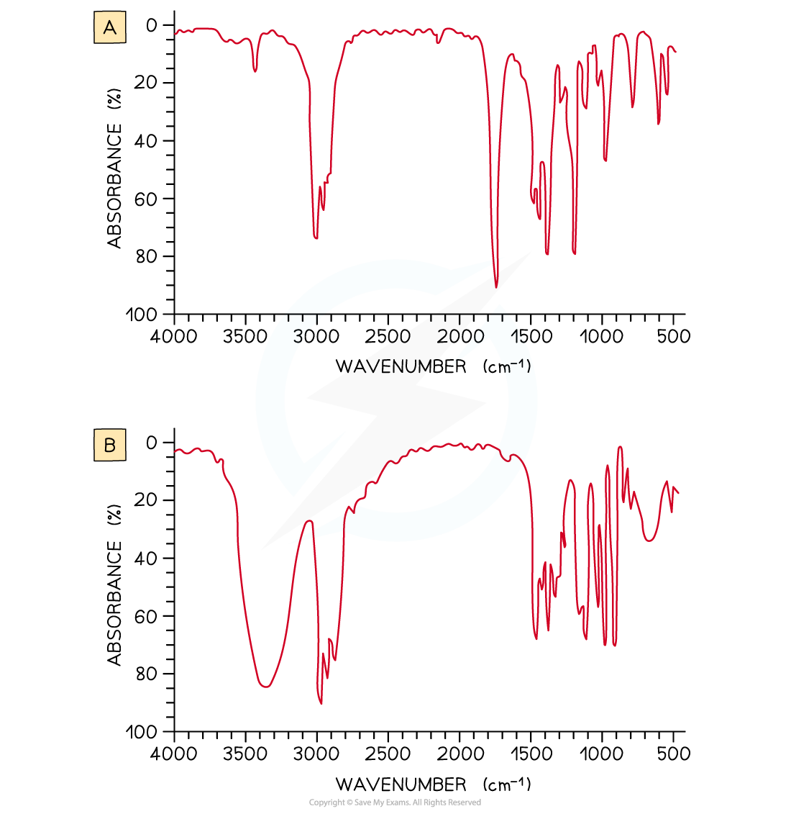

## Interpreting an IR Spectrum

* **Infrared (IR) spectroscopy** is a technique used to identify compounds based on changes in **vibrations** of atoms when they **absorb** IR of certain **frequencies**
* A **spectrophotometer** irradiates the sample with electromagnetic waves in the infrared region and then detects the **intensity** of the wavelength of IR radiation which goes through the sample
* All organic molecules absorb IR radiation and depending on which energies of radiation are absorbed, bonds between atoms will vibrate by **stretching**, **bending** and **twisting**
* The molecules will only vibrate at a specific frequency
* The **resonance frequency** is the specific frequency at which the molecules will vibrate to stimulate larger vibrations
* Depending on the rest of the molecule, each vibration will absorb specific wavelengths of IR radiation which are also shown as the **reciprocal** of the wavelength

  + This unit is called the **wavenumber** (cm-1)
* Particular absorbance have characteristic **widths** (broad or sharp) and **intensities** (strong or weak)

  + For example, hydrogen bonds cause the O-H bonds in alcohols and carboxylic acids to be **broad** whereas the C-O bond in carbonyl (C=O) groups have a strong, sharp absorbance peak
* The energies absorbed by different functional groups are given as a range and an unknown compound can be identified by comparing its IR spectrum to the IR spectrum of a known compound

| **Bond** | **Functional groups containing the bond** | **Characteristic infrared absorption range** **Wavenumber (cm****-1****)** |
| --- | --- | --- |
| **C–H** **(stretching)** | Alkane Alkene Alkyne Arene Aldehyde | 2962 - 2853 3095 - 3010 3300 3030 2900-2820 and 2775 - 2700 |
| **C–H** **(bending)** | Alkane Arene (5 adjacent H) Arene (4 adjacent H) Arene (3 adjacent H) Arene (2 adjacent H) Arene (1 adjacent H) | 1485 - 1365 750 and 700 750 780 830 880 |
| **N–H** **(stretching)** | Amine Amide | 3500 - 3300 3500 - 3140 |
| **O–H** **(stretching)** | Alcohols and phenols Carboxylic acids | 3750 - 3200 3300 - 2500 |
| **C=C** **(stretching)** | Isolated alkene Arene | 1669 - 1645 1600, 1580, 1500, 1450 |
| **C=O** **(stretching)** | Aldehydes, saturated alkyl Ketones, alkyl Ketones, aryl Carboxylic acids, alkyl Carboxylic acids, aryl Carboxylic acids, anhydrides Acyl halides, chlorides Acyl halides, bromides Esters, saturated Amides | 1740 - 1720 1720 - 1700 1700 - 1680 1725 - 1700 1700 - 1680 1850 - 1800 and 1790 - 1740 1795 1810 1750 - 1735 1700 - 1630 |
| **C**identical to**N** **(stretching)** | Nitrile | 2260 - 2215 |
| **C**identical to**C** **(stretching)** | Alkyne | 2260 - 2100 |

#### Worked Example

**Analysing IR Spectra**

Look at the two infrared spectra below and determine which one corresponds to propanone and which one to propan-2-ol

**Answer**

* IR spectrum **A** is **propanone** and spectrum **B** is **propan-2-ol**.

  + In IR spectrum **A** the presence of a strong, sharp absorption around 1710 cm-1 corresponds to the characteristic C=O, carbonyl, group in a ketone.
  + In spectrum **B** the presence of a strong, broad absorption around 3200-3500 cm-1 suggests that there is an alcohol group present, which corresponds to the -OH group in propan-2-ol.