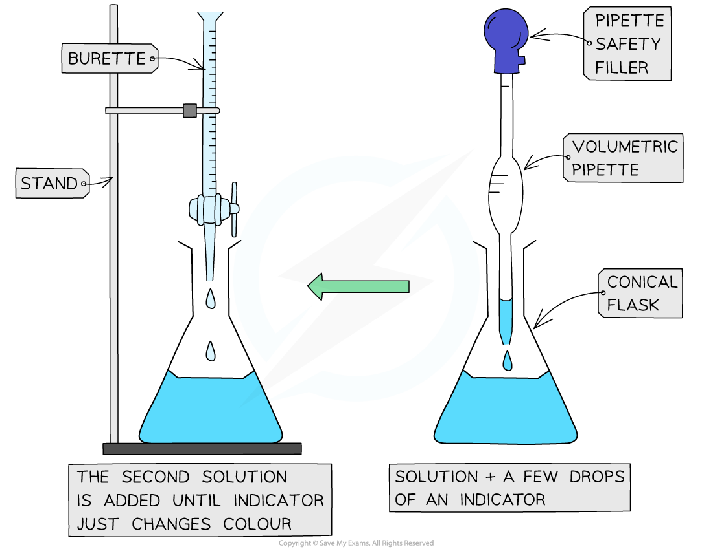
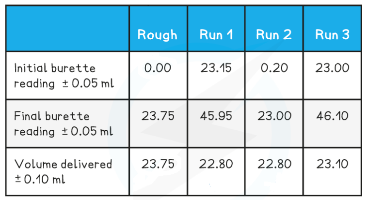

## Core Practical 3: Hydrochloric Acid Concentration

#### Performing the Titration

* The key piece of equipment used in the titration is the burette
* **Burettes** are usually marked to a precision of 0.10 cm3

  + Since they are analogue instruments, the uncertainty is recorded to **half** the smallest marking, in other words to ±0.05 cm3
* The **end point** or **equivalence point** occurs when the two solutions have reacted completely and is shown with the use of an **indicator**

***The steps in a titration***

* A white tile is placed under the conical flask while the titration is performed, to make it easier to see the colour change

***Titrating***

* The steps in a titration are:

  + Measuring a known volume (usually 20 or 25 cm3) of one of the solutions with a**volumetric** **pipette** and placing it into a **conical flask**
  + The other solution is placed in the **burette**

    - To start with, the burette will usually be filled to 0.00 cm3
  + A few drops of the **indicator** are added to the solution in the conical flask
  + The tap on the **burette** is carefully opened and the solution added, portion by portion, to the **conical flask** until the **indicator** starts to change colour
  + As you start getting near to the end point, the flow of the burette should be slowed right down so that the solution is added dropwise

    - You should be able to close the tap on the burette after one drop has caused the colour change
  + Multiple runs are carried out until **concordant** results are obtained

    - Concordant results are within 0.1 cm3 of each other

#### Recording and processing titration results

* Both the initial and final **burette** readings should be recorded and shown to a **precision** of  ±0.05 cm3, the same as the **uncertainty**

***A typical layout and set of titration results***

* The volume delivered (**titre**) is calculated and recorded to an **uncertainty** of ±0.10 cm3

  + The **uncertainty** is doubled, because two **burette** readings are made to obtain the **titre** (V final – V initial), following the rules for **propagation of uncertainties**
* **Concordant**results are then averaged, and non-concordant results are discarded
* The appropriate calculations are then done

#### Worked Example

25.0 cm3 of hydrochloric acid was titrated with a 0.200 mol dm-3 solution of sodium hydrogencarbonate, NaHCO3.

**NaHCO****3** **+ HCl → NaCl + H****2****O + CO****2**

Use the following results to calculate the concentration of the acid, to 3 significant figures.

**Answer**

**Step 1:** Calculate the average titre

* Average titre![equals space fraction numerator 22.80 space plus space 22.80 over denominator 2 end fraction space equals](data:image/svg+xml;charset=utf8,%3Csvg%20xmlns%3D%22http%3A%2F%2Fwww.w3.org%2F2000%2Fsvg%22%20xmlns%3Awrs%3D%22http%3A%2F%2Fwww.wiris.com%2Fxml%2Fmathml-extension%22%20height%3D%2247%22%20width%3D%22158%22%20wrs%3Abaseline%3D%2230%22%3E%3C!--MathML%3A%20%3Cmath%20xmlns%3D%22http%3A%2F%2Fwww.w3.org%2F1998%2FMath%2FMathML%22%3E%3Cmo%3E%3D%3C%2Fmo%3E%3Cmo%3E%26%23xA0%3B%3C%2Fmo%3E%3Cmfrac%3E%3Cmrow%3E%3Cmn%3E22%3C%2Fmn%3E%3Cmo%3E.%3C%2Fmo%3E%3Cmn%3E80%3C%2Fmn%3E%3Cmo%3E%26%23xA0%3B%3C%2Fmo%3E%3Cmo%3E%2B%3C%2Fmo%3E%3Cmo%3E%26%23xA0%3B%3C%2Fmo%3E%3Cmn%3E22%3C%2Fmn%3E%3Cmo%3E.%3C%2Fmo%3E%3Cmn%3E80%3C%2Fmn%3E%3C%2Fmrow%3E%3Cmn%3E2%3C%2Fmn%3E%3C%2Fmfrac%3E%3Cmo%3E%26%23xA0%3B%3C%2Fmo%3E%3Cmo%3E%3D%3C%2Fmo%3E%3C%2Fmath%3E--%3E%3Cdefs%3E%3Cstyle%20type%3D%22text%2Fcss%22%3E%40font-face%7Bfont-family%3A'math16f1ab71ca1b4679edc1ddd12c2'%3Bsrc%3Aurl(data%3Afont%2Ftruetype%3Bcharset%3Dutf-8%3Bbase64%2CAAEAAAAMAIAAAwBAT1MvMi7iBBMAAADMAAAATmNtYXDEvmKUAAABHAAAAERjdnQgDVUNBwAAAWAAAAA6Z2x5ZoPi2VsAAAGcAAABcWhlYWQQC2qxAAADEAAAADZoaGVhCGsXSAAAA0gAAAAkaG10eE2rRkcAAANsAAAAEGxvY2EAHTwYAAADfAAAABRtYXhwBT0FPgAAA5AAAAAgbmFtZaBxlY4AAAOwAAABn3Bvc3QB9wD6AAAFUAAAACBwcmVwa1uragAABXAAAAAUAAADSwGQAAUAAAQABAAAAAAABAAEAAAAAAAAAQEAAAAAAAAAAAAAAAAAAAAAAAAAAAAAAAAAAAAAACAgICAAAAAg1UADev96AAAD6ACWAAAAAAACAAEAAQAAABQAAwABAAAAFAAEADAAAAAIAAgAAgAAACsALgA9%2F%2F8AAAArAC4APf%2F%2F%2F9b%2F1P%2FGAAEAAAAAAAAAAAAAAVQDLACAAQAAVgAqAlgCHgEOASwCLABaAYACgACgANQAgAAAAAAAAAArAFUAgACrANUBAAErAAcAAAACAFUAAAMAA6sAAwAHAAAzESERJSERIVUCq%2F2rAgD%2BAAOr%2FFVVAwAAAQCAAFUC1QKrAAsASQEYsgwBARQTELEAA%2FaxAQT1sAo8sQMF9bAIPLEFBPWwBjyxDQPmALEAABMQsQEG5LEBARMQsAU8sQME5bELBfWwBzyxCQTlMTATIREzESEVIREjESGAAQBVAQD%2FAFX%2FAAGrAQD%2FAFb%2FAAEAAAEAIAAAAKAAgAADAC8YAbAEELAD1LADELAC1LADELAAPLACELABPACwBBCwA9SwAxCwAjywABCwATwwMTczFSMggICAgAACAIAA6wLVAhUAAwAHAGUYAbAIELAG1LAGELAF1LAIELAB1LABELAA1LAGELAHPLAFELAEPLABELACPLAAELADPACwCBCwBtSwBhCwB9SwBxCwAdSwARCwAtSwBhCwBTywBxCwBDywARCwADywAhCwAzwxMBMhNSEdASE1gAJV%2FasCVQHAVdVVVQAAAAABAAAAAQAA1XjOQV8PPPUAAwQA%2F%2F%2F%2F%2F9Y6E3P%2F%2F%2F%2F%2F1joTcwAA%2FyAEgAOrAAAACgACAAEAAAAAAAEAAAPo%2F2oAABdwAAD%2FtgSAAAEAAAAAAAAAAAAAAAAAAAAEA1IAVQNWAIAAyAAgA1YAgAAAAAAAAAAoAAAAoQAAAOcAAAFxAAEAAAAEAF4ABQAAAAAAAgCABAAAAAAABAAA3gAAAAAAAAAVAQIAAAAAAAAAAQASAAAAAAAAAAAAAgAOABIAAAAAAAAAAwAwACAAAAAAAAAABAASAFAAAAAAAAAABQAWAGIAAAAAAAAABgAJAHgAAAAAAAAACAAcAIEAAQAAAAAAAQASAAAAAQAAAAAAAgAOABIAAQAAAAAAAwAwACAAAQAAAAAABAASAFAAAQAAAAAABQAWAGIAAQAAAAAABgAJAHgAAQAAAAAACAAcAIEAAwABBAkAAQASAAAAAwABBAkAAgAOABIAAwABBAkAAwAwACAAAwABBAkABAASAFAAAwABBAkABQAWAGIAAwABBAkABgAJAHgAAwABBAkACAAcAIEATQBhAHQAaAAgAEYAbwBuAHQAUgBlAGcAdQBsAGEAcgBNAGEAdABoAHMAIABGAG8AcgAgAE0AbwByAGUAIABNAGEAdABoACAARgBvAG4AdABNAGEAdABoACAARgBvAG4AdABWAGUAcgBzAGkAbwBuACAAMQAuADBNYXRoX0ZvbnQATQBhAHQAaABzACAARgBvAHIAIABNAG8AcgBlAAADAAAAAAAAAfQA%2BgAAAAAAAAAAAAAAAAAAAAAAAAAAuQcRAACNhRgAsgAAABUUE7EAAT8%3D)format('truetype')%3Bfont-weight%3Anormal%3Bfont-style%3Anormal%3B%7D%3C%2Fstyle%3E%3C%2Fdefs%3E%3Ctext%20font-family%3D%22math16f1ab71ca1b4679edc1ddd12c2%22%20font-size%3D%2216%22%20text-anchor%3D%22middle%22%20x%3D%228.5%22%20y%3D%2230%22%3E%3D%3C%2Ftext%3E%3Cline%20stroke%3D%22%23000%22%20stroke-linecap%3D%22square%22%20stroke-width%3D%221%22%20x1%3D%2223.5%22%20x2%3D%22133.5%22%20y1%3D%2223.5%22%20y2%3D%2223.5%22%2F%3E%3Ctext%20font-family%3D%22Times%20New%20Roman%22%20font-size%3D%2218%22%20text-anchor%3D%22middle%22%20x%3D%2234.5%22%20y%3D%2216%22%3E22%3C%2Ftext%3E%3Ctext%20font-family%3D%22math16f1ab71ca1b4679edc1ddd12c2%22%20font-size%3D%2216%22%20text-anchor%3D%22middle%22%20x%3D%2245.5%22%20y%3D%2216%22%3E.%3C%2Ftext%3E%3Ctext%20font-family%3D%22Times%20New%20Roman%22%20font-size%3D%2218%22%20text-anchor%3D%22middle%22%20x%3D%2257.5%22%20y%3D%2216%22%3E80%3C%2Ftext%3E%3Ctext%20font-family%3D%22math16f1ab71ca1b4679edc1ddd12c2%22%20font-size%3D%2216%22%20text-anchor%3D%22middle%22%20x%3D%2278.5%22%20y%3D%2216%22%3E%2B%3C%2Ftext%3E%3Ctext%20font-family%3D%22Times%20New%20Roman%22%20font-size%3D%2218%22%20text-anchor%3D%22middle%22%20x%3D%22100.5%22%20y%3D%2216%22%3E22%3C%2Ftext%3E%3Ctext%20font-family%3D%22math16f1ab71ca1b4679edc1ddd12c2%22%20font-size%3D%2216%22%20text-anchor%3D%22middle%22%20x%3D%22111.5%22%20y%3D%2216%22%3E.%3C%2Ftext%3E%3Ctext%20font-family%3D%22Times%20New%20Roman%22%20font-size%3D%2218%22%20text-anchor%3D%22middle%22%20x%3D%22123.5%22%20y%3D%2216%22%3E80%3C%2Ftext%3E%3Ctext%20font-family%3D%22Times%20New%20Roman%22%20font-size%3D%2218%22%20text-anchor%3D%22middle%22%20x%3D%2278.5%22%20y%3D%2241%22%3E2%3C%2Ftext%3E%3Ctext%20font-family%3D%22math16f1ab71ca1b4679edc1ddd12c2%22%20font-size%3D%2216%22%20text-anchor%3D%22middle%22%20x%3D%22148.5%22%20y%3D%2230%22%3E%3D%3C%2Ftext%3E%3C%2Fsvg%3E)22.80 cm3

**Step 2:** Calculate the number of moles of sodium hydrogencarbonate

* Moles = ![fraction numerator 22.80 over denominator 1000 end fraction](data:image/svg+xml;charset=utf8,%3Csvg%20xmlns%3D%22http%3A%2F%2Fwww.w3.org%2F2000%2Fsvg%22%20xmlns%3Awrs%3D%22http%3A%2F%2Fwww.wiris.com%2Fxml%2Fmathml-extension%22%20height%3D%2247%22%20width%3D%2250%22%20wrs%3Abaseline%3D%2230%22%3E%3C!--MathML%3A%20%3Cmath%20xmlns%3D%22http%3A%2F%2Fwww.w3.org%2F1998%2FMath%2FMathML%22%3E%3Cmfrac%3E%3Cmrow%3E%3Cmn%3E22%3C%2Fmn%3E%3Cmo%3E.%3C%2Fmo%3E%3Cmn%3E80%3C%2Fmn%3E%3C%2Fmrow%3E%3Cmn%3E1000%3C%2Fmn%3E%3C%2Fmfrac%3E%3C%2Fmath%3E--%3E%3Cdefs%3E%3Cstyle%20type%3D%22text%2Fcss%22%3E%40font-face%7Bfont-family%3A'math1d9d4f495e875a2e075a1a4a6e1'%3Bsrc%3Aurl(data%3Afont%2Ftruetype%3Bcharset%3Dutf-8%3Bbase64%2CAAEAAAAMAIAAAwBAT1MvMi7iBBMAAADMAAAATmNtYXDEvmKUAAABHAAAADRjdnQgDVUNBwAAAVAAAAA6Z2x5ZoPi2VsAAAGMAAAAbmhlYWQQC2qxAAAB%2FAAAADZoaGVhCGsXSAAAAjQAAAAkaG10eE2rRkcAAAJYAAAACGxvY2EAHTwYAAACYAAAAAxtYXhwBT0FPgAAAmwAAAAgbmFtZaBxlY4AAAKMAAABn3Bvc3QB9wD6AAAELAAAACBwcmVwa1uragAABEwAAAAUAAADSwGQAAUAAAQABAAAAAAABAAEAAAAAAAAAQEAAAAAAAAAAAAAAAAAAAAAAAAAAAAAAAAAAAAAACAgICAAAAAg1UADev96AAAD6ACWAAAAAAACAAEAAQAAABQAAwABAAAAFAAEACAAAAAEAAQAAQAAAC7%2F%2FwAAAC7%2F%2F%2F%2FTAAEAAAAAAAABVAMsAIABAABWACoCWAIeAQ4BLAIsAFoBgAKAAKAA1ACAAAAAAAAAACsAVQCAAKsA1QEAASsABwAAAAIAVQAAAwADqwADAAcAADMRIRElIREhVQKr%2FasCAP4AA6v8VVUDAAABACAAAACgAIAAAwAvGAGwBBCwA9SwAxCwAtSwAxCwADywAhCwATwAsAQQsAPUsAMQsAI8sAAQsAE8MDE3MxUjIICAgIAAAAABAAAAAQAA1XjOQV8PPPUAAwQA%2F%2F%2F%2F%2F9Y6E3P%2F%2F%2F%2F%2F1joTcwAA%2FyAEgAOrAAAACgACAAEAAAAAAAEAAAPo%2F2oAABdwAAD%2FtgSAAAEAAAAAAAAAAAAAAAAAAAACA1IAVQDIACAAAAAAAAAAKAAAAG4AAQAAAAIAXgAFAAAAAAACAIAEAAAAAAAEAADeAAAAAAAAABUBAgAAAAAAAAABABIAAAAAAAAAAAACAA4AEgAAAAAAAAADADAAIAAAAAAAAAAEABIAUAAAAAAAAAAFABYAYgAAAAAAAAAGAAkAeAAAAAAAAAAIABwAgQABAAAAAAABABIAAAABAAAAAAACAA4AEgABAAAAAAADADAAIAABAAAAAAAEABIAUAABAAAAAAAFABYAYgABAAAAAAAGAAkAeAABAAAAAAAIABwAgQADAAEECQABABIAAAADAAEECQACAA4AEgADAAEECQADADAAIAADAAEECQAEABIAUAADAAEECQAFABYAYgADAAEECQAGAAkAeAADAAEECQAIABwAgQBNAGEAdABoACAARgBvAG4AdABSAGUAZwB1AGwAYQByAE0AYQB0AGgAcwAgAEYAbwByACAATQBvAHIAZQAgAE0AYQB0AGgAIABGAG8AbgB0AE0AYQB0AGgAIABGAG8AbgB0AFYAZQByAHMAaQBvAG4AIAAxAC4AME1hdGhfRm9udABNAGEAdABoAHMAIABGAG8AcgAgAE0AbwByAGUAAAMAAAAAAAAB9AD6AAAAAAAAAAAAAAAAAAAAAAAAAAC5BxEAAI2FGACyAAAAFRQTsQABPw%3D%3D)format('truetype')%3Bfont-weight%3Anormal%3Bfont-style%3Anormal%3B%7D%3C%2Fstyle%3E%3C%2Fdefs%3E%3Cline%20stroke%3D%22%23000%22%20stroke-linecap%3D%22square%22%20stroke-width%3D%221%22%20x1%3D%222.5%22%20x2%3D%2246.5%22%20y1%3D%2223.5%22%20y2%3D%2223.5%22%2F%3E%3Ctext%20font-family%3D%22Times%20New%20Roman%22%20font-size%3D%2218%22%20text-anchor%3D%22middle%22%20x%3D%2213.5%22%20y%3D%2216%22%3E22%3C%2Ftext%3E%3Ctext%20font-family%3D%22math1d9d4f495e875a2e075a1a4a6e1%22%20font-size%3D%2216%22%20text-anchor%3D%22middle%22%20x%3D%2224.5%22%20y%3D%2216%22%3E.%3C%2Ftext%3E%3Ctext%20font-family%3D%22Times%20New%20Roman%22%20font-size%3D%2218%22%20text-anchor%3D%22middle%22%20x%3D%2236.5%22%20y%3D%2216%22%3E80%3C%2Ftext%3E%3Ctext%20font-family%3D%22Times%20New%20Roman%22%20font-size%3D%2218%22%20text-anchor%3D%22middle%22%20x%3D%2225.5%22%20y%3D%2241%22%3E1000%3C%2Ftext%3E%3C%2Fsvg%3E) x 0.200 = 4.56 x 10-3 moles

**Step 3:** Calculate (or deduce) the number of moles of hydrochloric acid

* The stoichiometry of NaHCO3 : HCl is 1 : 1

  + Therefore, the number of moles of sodium hydrogencarbonate is also 4.56 x 10-3 moles

**Step 4:** Calculate the concentration of hydrochloric acid

* Concentration = ![equals space fraction numerator m o l e s over denominator v o l u m e end fraction space equals fraction numerator 4.56 space cross times space 10 to the power of negative 3 end exponent over denominator left parenthesis 25.0 space divided by space 1000 right parenthesis end fraction space equals space](data:image/svg+xml;charset=utf8,%3Csvg%20xmlns%3D%22http%3A%2F%2Fwww.w3.org%2F2000%2Fsvg%22%20xmlns%3Awrs%3D%22http%3A%2F%2Fwww.wiris.com%2Fxml%2Fmathml-extension%22%20height%3D%2248%22%20width%3D%22238%22%20wrs%3Abaseline%3D%2231%22%3E%3C!--MathML%3A%20%3Cmath%20xmlns%3D%22http%3A%2F%2Fwww.w3.org%2F1998%2FMath%2FMathML%22%3E%3Cmo%3E%3D%3C%2Fmo%3E%3Cmo%3E%26%23xA0%3B%3C%2Fmo%3E%3Cmfrac%3E%3Cmrow%3E%3Cmi%3Em%3C%2Fmi%3E%3Cmi%3Eo%3C%2Fmi%3E%3Cmi%3El%3C%2Fmi%3E%3Cmi%3Ee%3C%2Fmi%3E%3Cmi%3Es%3C%2Fmi%3E%3C%2Fmrow%3E%3Cmrow%3E%3Cmi%3Ev%3C%2Fmi%3E%3Cmi%3Eo%3C%2Fmi%3E%3Cmi%3El%3C%2Fmi%3E%3Cmi%3Eu%3C%2Fmi%3E%3Cmi%3Em%3C%2Fmi%3E%3Cmi%3Ee%3C%2Fmi%3E%3C%2Fmrow%3E%3C%2Fmfrac%3E%3Cmo%3E%26%23xA0%3B%3C%2Fmo%3E%3Cmo%3E%3D%3C%2Fmo%3E%3Cmfrac%3E%3Cmrow%3E%3Cmn%3E4%3C%2Fmn%3E%3Cmo%3E.%3C%2Fmo%3E%3Cmn%3E56%3C%2Fmn%3E%3Cmo%3E%26%23xA0%3B%3C%2Fmo%3E%3Cmo%3E%26%23xD7%3B%3C%2Fmo%3E%3Cmo%3E%26%23xA0%3B%3C%2Fmo%3E%3Cmsup%3E%3Cmn%3E10%3C%2Fmn%3E%3Cmrow%3E%3Cmo%3E-%3C%2Fmo%3E%3Cmn%3E3%3C%2Fmn%3E%3C%2Fmrow%3E%3C%2Fmsup%3E%3C%2Fmrow%3E%3Cmrow%3E%3Cmo%3E(%3C%2Fmo%3E%3Cmn%3E25%3C%2Fmn%3E%3Cmo%3E.%3C%2Fmo%3E%3Cmn%3E0%3C%2Fmn%3E%3Cmo%3E%26%23xA0%3B%3C%2Fmo%3E%3Cmo%3E%2F%3C%2Fmo%3E%3Cmo%3E%26%23xA0%3B%3C%2Fmo%3E%3Cmn%3E1000%3C%2Fmn%3E%3Cmo%3E)%3C%2Fmo%3E%3C%2Fmrow%3E%3C%2Fmfrac%3E%3Cmo%3E%26%23xA0%3B%3C%2Fmo%3E%3Cmo%3E%3D%3C%2Fmo%3E%3Cmo%3E%26%23xA0%3B%3C%2Fmo%3E%3C%2Fmath%3E--%3E%3Cdefs%3E%3Cstyle%20type%3D%22text%2Fcss%22%3E%40font-face%7Bfont-family%3A'math12b45d834e8e6f4560d406e1e0c'%3Bsrc%3Aurl(data%3Afont%2Ftruetype%3Bcharset%3Dutf-8%3Bbase64%2CAAEAAAAMAIAAAwBAT1MvMi7iBBMAAADMAAAATmNtYXDEvmKUAAABHAAAAFRjdnQgDVUNBwAAAXAAAAA6Z2x5ZoPi2VsAAAGsAAAB72hlYWQQC2qxAAADnAAAADZoaGVhCGsXSAAAA9QAAAAkaG10eE2rRkcAAAP4AAAAGGxvY2EAHTwYAAAEEAAAABxtYXhwBT0FPgAABCwAAAAgbmFtZaBxlY4AAARMAAABn3Bvc3QB9wD6AAAF7AAAACBwcmVwa1uragAABgwAAAAUAAADSwGQAAUAAAQABAAAAAAABAAEAAAAAAAAAQEAAAAAAAAAAAAAAAAAAAAAAAAAAAAAAAAAAAAAACAgICAAAAAg1UADev96AAAD6ACWAAAAAAACAAEAAQAAABQAAwABAAAAFAAEAEAAAAAMAAgAAgAEAC4ALwA9ANciEv%2F%2FAAAALgAvAD0A1yIS%2F%2F%2F%2F0%2F%2FT%2F8b%2FLd3zAAEAAAAAAAAAAAAAAAAAAAFUAywAgAEAAFYAKgJYAh4BDgEsAiwAWgGAAoAAoADUAIAAAAAAAAAAKwBVAIAAqwDVAQABKwAHAAAAAgBVAAADAAOrAAMABwAAMxEhESUhESFVAqv9qwIA%2FgADq%2FxVVQMAAAEAIAAAAKAAgAADAC8YAbAEELAD1LADELAC1LADELAAPLACELABPACwBBCwA9SwAxCwAjywABCwATwwMTczFSMggICAgAABAIAAAAIrA4AAAwAiGACxAwA%2FsQEC5DABsAQQsQMD9bECBeWwAdWxAAXlsQUD5gEzASMB1Vb%2BqlUDgPyAAAIAgADrAtUCFQADAAcAZRgBsAgQsAbUsAYQsAXUsAgQsAHUsAEQsADUsAYQsAc8sAUQsAQ8sAEQsAI8sAAQsAM8ALAIELAG1LAGELAH1LAHELAB1LABELAC1LAGELAFPLAHELAEPLABELAAPLACELADPDEwEyE1IR0BITWAAlX9qwJVAcBV1VVVAAIAgABVAtUCgAADAAcARhiwARQAsQAAExCxAAnksQABExCwBDyxBgj0sAI8MAGxCAETELEAA%2FawBzyxAQX1sAY8sgUHABD0sAI8sQkD5rEEBfWwAzwTMwEjETMBI4BVAgBVVf4AVQKA%2FdUCK%2F3VAAEAgAFVAtUBqwADADAYAbAEELEAA%2FawAzyxAgf1sAE8sQUD5gCxAAATELEABuWxAAETELABPLEDBfWwAjwTIRUhgAJV%2FasBq1YAAAEAAAABAADVeM5BXw889QADBAD%2F%2F%2F%2F%2F1joTc%2F%2F%2F%2F%2F%2FWOhNzAAD%2FIASAA6sAAAAKAAIAAQAAAAAAAQAAA%2Bj%2FagAAF3AAAP%2B2BIAAAQAAAAAAAAAAAAAAAAAAAAYDUgBVAMgAIAKqAIADVgCAA1YAgANWAIAAAAAAAAAAKAAAAG4AAACsAAABNgAAAaUAAAHvAAEAAAAGAF4ABQAAAAAAAgCABAAAAAAABAAA3gAAAAAAAAAVAQIAAAAAAAAAAQASAAAAAAAAAAAAAgAOABIAAAAAAAAAAwAwACAAAAAAAAAABAASAFAAAAAAAAAABQAWAGIAAAAAAAAABgAJAHgAAAAAAAAACAAcAIEAAQAAAAAAAQASAAAAAQAAAAAAAgAOABIAAQAAAAAAAwAwACAAAQAAAAAABAASAFAAAQAAAAAABQAWAGIAAQAAAAAABgAJAHgAAQAAAAAACAAcAIEAAwABBAkAAQASAAAAAwABBAkAAgAOABIAAwABBAkAAwAwACAAAwABBAkABAASAFAAAwABBAkABQAWAGIAAwABBAkABgAJAHgAAwABBAkACAAcAIEATQBhAHQAaAAgAEYAbwBuAHQAUgBlAGcAdQBsAGEAcgBNAGEAdABoAHMAIABGAG8AcgAgAE0AbwByAGUAIABNAGEAdABoACAARgBvAG4AdABNAGEAdABoACAARgBvAG4AdABWAGUAcgBzAGkAbwBuACAAMQAuADBNYXRoX0ZvbnQATQBhAHQAaABzACAARgBvAHIAIABNAG8AcgBlAAADAAAAAAAAAfQA%2BgAAAAAAAAAAAAAAAAAAAAAAAAAAuQcRAACNhRgAsgAAABUUE7EAAT8%3D)format('truetype')%3Bfont-weight%3Anormal%3Bfont-style%3Anormal%3B%7D%40font-face%7Bfont-family%3A'round_brackets18549f92a457f2409'%3Bsrc%3Aurl(data%3Afont%2Ftruetype%3Bcharset%3Dutf-8%3Bbase64%2CAAEAAAAMAIAAAwBAT1MvMjwHLFQAAADMAAAATmNtYXDf7xCrAAABHAAAADxjdnQgBAkDLgAAAVgAAAASZ2x5ZmAOz2cAAAFsAAABJGhlYWQOKih8AAACkAAAADZoaGVhCvgVwgAAAsgAAAAkaG10eCA6AAIAAALsAAAADGxvY2EAAARLAAAC%2BAAAABBtYXhwBIgEWQAAAwgAAAAgbmFtZXHR30MAAAMoAAACOXBvc3QDogHPAAAFZAAAACBwcmVwupWEAAAABYQAAAAHAAAGcgGQAAUAAAgACAAAAAAACAAIAAAAAAAAAQIAAAAAAAAAAAAAAAAAAAAAAAAAAAAAAAAAAAAAACAgICAAAAAo8AMGe%2F57AAAHPgGyAAAAAAACAAEAAQAAABQAAwABAAAAFAAEACgAAAAGAAQAAQACACgAKf%2F%2FAAAAKAAp%2F%2F%2F%2F2f%2FZAAEAAAAAAAAAAAFUAFYBAAAsAKgDgAAyAAcAAAACAAAAKgDVA1UAAwAHAAA1MxEjEyMRM9XVq4CAKgMr%2FQAC1QABAAD%2B0AIgBtAACQBNGAGwChCwA9SwAxCwAtSwChCwBdSwBRCwANSwAxCwBzywAhCwCDwAsAoQsAPUsAMQsAfUsAoQsAXUsAoQsADUsAMQsAI8sAcQsAg8MTAREAEzABEQASMAAZCQ%2FnABkJD%2BcALQ%2FZD%2BcAGQAnACcAGQ%2FnAAAQAA%2FtACIAbQAAkATRgBsAoQsAPUsAMQsALUsAoQsAXUsAUQsADUsAMQsAc8sAIQsAg8ALAKELAD1LADELAH1LAKELAF1LAKELAA1LADELACPLAHELAIPDEwARABIwAREAEzAAIg%2FnCQAZD%2BcJABkALQ%2FZD%2BcAGQAnACcAGQ%2FnAAAQAAAAEAAPW2NYFfDzz1AAMIAP%2F%2F%2F%2F%2FVre7u%2F%2F%2F%2F%2F9Wt7u4AAP7QA7cG0AAAAAoAAgABAAAAAAABAAAHPv5OAAAXcAAA%2F%2F4DtwABAAAAAAAAAAAAAAAAAAAAAwDVAAACIAAAAiAAAAAAAAAAAAAkAAAAowAAASQAAQAAAAMACgACAAAAAAACAIAEAAAAAAAEAABNAAAAAAAAABUBAgAAAAAAAAABAD4AAAAAAAAAAAACAA4APgAAAAAAAAADAFwATAAAAAAAAAAEAD4AqAAAAAAAAAAFABYA5gAAAAAAAAAGAB8A%2FAAAAAAAAAAIABwBGwABAAAAAAABAD4AAAABAAAAAAACAA4APgABAAAAAAADAFwATAABAAAAAAAEAD4AqAABAAAAAAAFABYA5gABAAAAAAAGAB8A%2FAABAAAAAAAIABwBGwADAAEECQABAD4AAAADAAEECQACAA4APgADAAEECQADAFwATAADAAEECQAEAD4AqAADAAEECQAFABYA5gADAAEECQAGAB8A%2FAADAAEECQAIABwBGwBSAG8AdQBuAGQAIABiAHIAYQBjAGsAZQB0AHMAIAB3AGkAdABoACAAYQBzAGMAZQBuAHQAIAAxADgANQA0AFIAZQBnAHUAbABhAHIATQBhAHQAaABzACAARgBvAHIAIABNAG8AcgBlACAAUgBvAHUAbgBkACAAYgByAGEAYwBrAGUAdABzACAAdwBpAHQAaAAgAGEAcwBjAGUAbgB0ACAAMQA4ADUANABSAG8AdQBuAGQAIABiAHIAYQBjAGsAZQB0AHMAIAB3AGkAdABoACAAYQBzAGMAZQBuAHQAIAAxADgANQA0AFYAZQByAHMAaQBvAG4AIAAyAC4AMFJvdW5kX2JyYWNrZXRzX3dpdGhfYXNjZW50XzE4NTQATQBhAHQAaABzACAARgBvAHIAIABNAG8AcgBlAAAAAAMAAAAAAAADnwHPAAAAAAAAAAAAAAAAAAAAAAAAAAC5B%2F8AAY2FAA%3D%3D)format('truetype')%3Bfont-weight%3Anormal%3Bfont-style%3Anormal%3B%7D%3C%2Fstyle%3E%3C%2Fdefs%3E%3Ctext%20font-family%3D%22math12b45d834e8e6f4560d406e1e0c%22%20font-size%3D%2216%22%20text-anchor%3D%22middle%22%20x%3D%228.5%22%20y%3D%2231%22%3E%3D%3C%2Ftext%3E%3Cline%20stroke%3D%22%23000%22%20stroke-linecap%3D%22square%22%20stroke-width%3D%221%22%20x1%3D%2223.5%22%20x2%3D%2281.5%22%20y1%3D%2224.5%22%20y2%3D%2224.5%22%2F%3E%3Ctext%20font-family%3D%22Times%20New%20Roman%22%20font-size%3D%2218%22%20font-style%3D%22italic%22%20text-anchor%3D%22middle%22%20x%3D%2238.5%22%20y%3D%2217%22%3Em%3C%2Ftext%3E%3Ctext%20font-family%3D%22Times%20New%20Roman%22%20font-size%3D%2218%22%20font-style%3D%22italic%22%20text-anchor%3D%22middle%22%20x%3D%2249.5%22%20y%3D%2217%22%3Eo%3C%2Ftext%3E%3Ctext%20font-family%3D%22Times%20New%20Roman%22%20font-size%3D%2218%22%20font-style%3D%22italic%22%20text-anchor%3D%22middle%22%20x%3D%2256.5%22%20y%3D%2217%22%3El%3C%2Ftext%3E%3Ctext%20font-family%3D%22Times%20New%20Roman%22%20font-size%3D%2218%22%20font-style%3D%22italic%22%20text-anchor%3D%22middle%22%20x%3D%2263.5%22%20y%3D%2217%22%3Ee%3C%2Ftext%3E%3Ctext%20font-family%3D%22Times%20New%20Roman%22%20font-size%3D%2218%22%20font-style%3D%22italic%22%20text-anchor%3D%22middle%22%20x%3D%2270.5%22%20y%3D%2217%22%3Es%3C%2Ftext%3E%3Ctext%20font-family%3D%22Times%20New%20Roman%22%20font-size%3D%2218%22%20font-style%3D%22italic%22%20text-anchor%3D%22middle%22%20x%3D%2229.5%22%20y%3D%2242%22%3Ev%3C%2Ftext%3E%3Ctext%20font-family%3D%22Times%20New%20Roman%22%20font-size%3D%2218%22%20font-style%3D%22italic%22%20text-anchor%3D%22middle%22%20x%3D%2238.5%22%20y%3D%2242%22%3Eo%3C%2Ftext%3E%3Ctext%20font-family%3D%22Times%20New%20Roman%22%20font-size%3D%2218%22%20font-style%3D%22italic%22%20text-anchor%3D%22middle%22%20x%3D%2245.5%22%20y%3D%2242%22%3El%3C%2Ftext%3E%3Ctext%20font-family%3D%22Times%20New%20Roman%22%20font-size%3D%2218%22%20font-style%3D%22italic%22%20text-anchor%3D%22middle%22%20x%3D%2252.5%22%20y%3D%2242%22%3Eu%3C%2Ftext%3E%3Ctext%20font-family%3D%22Times%20New%20Roman%22%20font-size%3D%2218%22%20font-style%3D%22italic%22%20text-anchor%3D%22middle%22%20x%3D%2264.5%22%20y%3D%2242%22%3Em%3C%2Ftext%3E%3Ctext%20font-family%3D%22Times%20New%20Roman%22%20font-size%3D%2218%22%20font-style%3D%22italic%22%20text-anchor%3D%22middle%22%20x%3D%2275.5%22%20y%3D%2242%22%3Ee%3C%2Ftext%3E%3Ctext%20font-family%3D%22math12b45d834e8e6f4560d406e1e0c%22%20font-size%3D%2216%22%20text-anchor%3D%22middle%22%20x%3D%2296.5%22%20y%3D%2231%22%3E%3D%3C%2Ftext%3E%3Cline%20stroke%3D%22%23000%22%20stroke-linecap%3D%22square%22%20stroke-width%3D%221%22%20x1%3D%22107.5%22%20x2%3D%22209.5%22%20y1%3D%2224.5%22%20y2%3D%2224.5%22%2F%3E%3Ctext%20font-family%3D%22Times%20New%20Roman%22%20font-size%3D%2218%22%20text-anchor%3D%22middle%22%20x%3D%22117.5%22%20y%3D%2217%22%3E4%3C%2Ftext%3E%3Ctext%20font-family%3D%22math12b45d834e8e6f4560d406e1e0c%22%20font-size%3D%2216%22%20text-anchor%3D%22middle%22%20x%3D%22124.5%22%20y%3D%2217%22%3E.%3C%2Ftext%3E%3Ctext%20font-family%3D%22Times%20New%20Roman%22%20font-size%3D%2218%22%20text-anchor%3D%22middle%22%20x%3D%22136.5%22%20y%3D%2217%22%3E56%3C%2Ftext%3E%3Ctext%20font-family%3D%22math12b45d834e8e6f4560d406e1e0c%22%20font-size%3D%2216%22%20text-anchor%3D%22middle%22%20x%3D%22157.5%22%20y%3D%2217%22%3E%26%23xD7%3B%3C%2Ftext%3E%3Ctext%20font-family%3D%22Times%20New%20Roman%22%20font-size%3D%2218%22%20text-anchor%3D%22middle%22%20x%3D%22179.5%22%20y%3D%2217%22%3E10%3C%2Ftext%3E%3Ctext%20font-family%3D%22math12b45d834e8e6f4560d406e1e0c%22%20font-size%3D%2212%22%20text-anchor%3D%22middle%22%20x%3D%22193.5%22%20y%3D%2212%22%3E%26%23x2212%3B%3C%2Ftext%3E%3Ctext%20font-family%3D%22Times%20New%20Roman%22%20font-size%3D%2213%22%20text-anchor%3D%22middle%22%20x%3D%22201.5%22%20y%3D%2212%22%3E3%3C%2Ftext%3E%3Ctext%20font-family%3D%22round_brackets18549f92a457f2409%22%20font-size%3D%2218%22%20text-anchor%3D%22middle%22%20x%3D%22112.5%22%20y%3D%2242%22%3E(%3C%2Ftext%3E%3Ctext%20font-family%3D%22Times%20New%20Roman%22%20font-size%3D%2218%22%20text-anchor%3D%22middle%22%20x%3D%22124.5%22%20y%3D%2242%22%3E25%3C%2Ftext%3E%3Ctext%20font-family%3D%22math12b45d834e8e6f4560d406e1e0c%22%20font-size%3D%2216%22%20text-anchor%3D%22middle%22%20x%3D%22135.5%22%20y%3D%2242%22%3E.%3C%2Ftext%3E%3Ctext%20font-family%3D%22Times%20New%20Roman%22%20font-size%3D%2218%22%20text-anchor%3D%22middle%22%20x%3D%22142.5%22%20y%3D%2242%22%3E0%3C%2Ftext%3E%3Ctext%20font-family%3D%22math12b45d834e8e6f4560d406e1e0c%22%20font-size%3D%2216%22%20text-anchor%3D%22middle%22%20x%3D%22156.5%22%20y%3D%2242%22%3E%2F%3C%2Ftext%3E%3Ctext%20font-family%3D%22Times%20New%20Roman%22%20font-size%3D%2218%22%20text-anchor%3D%22middle%22%20x%3D%22184.5%22%20y%3D%2242%22%3E1000%3C%2Ftext%3E%3Ctext%20font-family%3D%22round_brackets18549f92a457f2409%22%20font-size%3D%2218%22%20text-anchor%3D%22middle%22%20x%3D%22204.5%22%20y%3D%2242%22%3E)%3C%2Ftext%3E%3Ctext%20font-family%3D%22math12b45d834e8e6f4560d406e1e0c%22%20font-size%3D%2216%22%20text-anchor%3D%22middle%22%20x%3D%22224.5%22%20y%3D%2231%22%3E%3D%3C%2Ftext%3E%3C%2Fsvg%3E)**0.182 mol dm****-3**