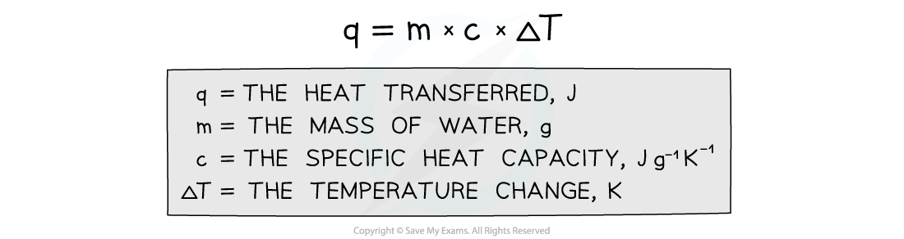

## Core Practical 8: Determining Enthalpy Change of Reaction

#### Measuring enthalpy changes

* **Calorimetry**is a technique used to measure changes in enthalpy of chemical reactions
* A **calorimeter** can be made up of a **polystyrene drinking cup**, a **vacuum flask** or **metal can**

***A polystyrene cup can act as a calorimeter to find enthalpy changes in a chemical reaction***

The energy needed to raise the temperature of 1 g of a substance by 1 K is called the **specific heat capacity**(*c*) of the liquid The **specific heat capacity** of water is 4.18 J g-1 K-1 The energy transferred as heat can be calculated by:

***Equation for calculating energy transferred in a calorimeter***

#### Enthalpy changes for reactions in solution

* The principle of these calorimetry experiments is to carry out the reaction with an excess of one reagent and measure the temperature change over the course of a few minutes
* The apparatus needed to carry out an enthalpy of reaction in solution calorimetry experiment is shown above

**Sample method for a displacement reaction**

1. Using a measuring cylinder place 25 cm3 of the 1.0 mol dm-3 copper(II) sulphate solution into the polystyrene cup
2. Weigh about 6 g of zinc powder - as this is an excess there is no need to be very accurate
3. Draw a table to record the initial temperature and then the temperature and time every half minute up to 9.5 minutes
4. Put a thermometer or temperature probe in the cup, stir, and record the temperature every half minute for 2.5 minutes
5. At precisely 3 minutes, add the zinc powder to the cup (DO NOT RECORD THE TEMPERATURE AT 3 MINUTES)
6. Continue stirring and record the temperature for an additional 6 minutes

* For the purposes of the calculations, some assumptions are made about the experiment:

  + That the specific heat capacity of the solution is the same as pure water, i.e. **4.18 J g****-1****K****-1**
  + That the density of the solution is the same as pure water, i.e. **1 g cm****-3**
  + The specific heat capacity of the container is ignored
  + The reaction is complete
  + There are negligible heat losses

#### Temperature correction graphs

* For reactions which are not instantaneous there may be a delay before the maximum temperature is reached
* During that delay the substances themselves may be losing heat to the surroundings, so that the true maximum temperature is never actually reached
* To overcome this problem we can use graphical analysis to determine the maximum enthalpy change

***A temperature correction graph for a metal displacement reaction between zinc and copper sulfate solution. The zinc is added after 4 minutes***

**The steps to make a temperature correction graph are:**

1. Take a temperature reading before adding the reactants for a few minutes to get a steady value
2. Add the second reactant and continue recording the temperature and time
3. Plot the graph and **extrapolate**the cooling part of the graph until you intersect the time at which the second reactant was added

#### Analysis

* Use both extrapolated lines to calculate Δ*T* as shown on the graph
* Use the equation *q* = *mc*Δ*T* to calculate the energy transferred

  + *q* = energy transferred
  + *m* = mass - this will be the mass of the 25 cm3 solution which will be 25 g (assuming a density of 1 g cm-3)
  + *c* = specific heat capacity - this will be assumed to be 4.18 J g-1K-1, which is the specific heat capacity of water
  + Δ*T* = the temperature change from the graph
* Convert your value for energy transferred from J into kJ
* Then use the equation Δ*H* =  to calculate the enthalpy change for the reaction

  + *q* = energy transferred
  + *n*= number of moles - this would be the number of moles of the **limiting reagent**, which means that you will have an extra calculation to do to determine whether this is the zinc or the copper sulfate
* Remember that in the example above, the temperature of the reaction mixture increased which means that the reaction is exothermic and should, therefore, have a negative value