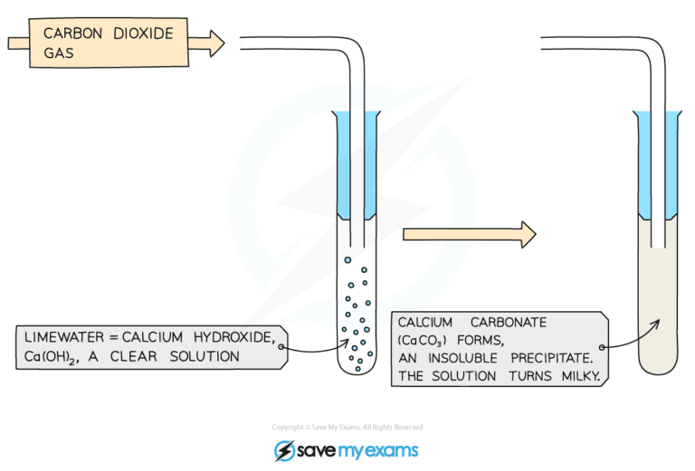

## Core Practical 7: Analysis of Inorganic and Organic Unknowns

#### Test Tube Reactions

* Simple test tube reactions can be done to identify the following ions:

  + Ammonium ions (NH4+)
  + Halide ions (X-) - covered in 2.3.4 Halide Ion Reactions
  + Carbonate ions (CO32-) and hydrogencarbonate ions (HCO3-)
  + Sulfate ions (SO42-)
* If the sample to be tested is a solid, then it must be dissolved in deionised water and made into an aqueous solution

#### Testing for Ammonium Ions

* About 10 drops of a solution containing ammonium ions, such as ammonium chloride, should be added to a clean test tube
* About 10 drops of sodium hydroxide should be added using a pipette

Overall equation: NH4Cl (aq) + NaOH (aq) → NH3 (g) + H2O (l) + NaCl (aq)

Ionic equation: NH4+ (aq) + OH- (aq) → NH3 (g) + H2O (l)

* The test tube should be swirled carefully to ensure that it is mixed well
* The test tube of the solution should then be placed in a beaker of water, and the beaker of water should be placed above a Bunsen burner, so that it can become a water bath
* As the solution is heated gently, fumes will be produced
* A pair of tongs should be used to hold a damp piece of red litmus paper near the mouth of the test tube, to test the fumes
* The red litmus paper will change colour and become blue in the presence of ammonia gas

***Damp red litmus paper turning blue in the presence of ammonia gas***

#### Testing for Carbonate Ions

* A small amount (around 1 cm3) of dilute hydrochloric acid should be added to a test tube using a pipette
* An equal amount of sodium carbonate solution should then be added to the test tube using a clean pipette

Overall equation: 2HCl (aq) + Na2CO3 (aq) → 2NaCl (aq) + CO2 (g) + H2O (l)

Ionic equation: 2H+ (aq) + CO32- (aq) → CO2 (g) + H2O (l)

* As soon as the sodium carbonate solution is added, a bung with a delivery tube should be attached to the test tube

  + The delivery tube should transfer the gas which is formed into a different test tube which contains a small amount of limewater (calcium hydroxide solution)
* Carbonate ions will react with hydrogen ions from the acid to produce carbon dioxide gas
* Carbon dioxide gas will turn the limewater milky

***When carbon dioxide gas is bubbled into limewater it will turn cloudy as calcium carbonate is produced***

* A similar reaction is seen with sodium hydrogen carbonate, but the equations are:

Overall equation: HCl (aq) + NaHCO3 (aq) → NaCl (aq) + CO2 (g) + H2O (l)

Ionic equation: H+ (aq) + HCO3- (aq) → CO2 (g) + H2O (l)

#### Testing for Sulfate Ions

Acidify the sample with dilute hydrochloric acid and then add a few drops of aqueous barium chloride If a sulfate is present then a **white** precipitate of barium sulfate is formed:

**Ba****2+****(aq) + SO****4****2-****(aq) → BaSO****4****(s)**

***A white precipitate of barium sulfate is a positive result for the presence of sulfate ions***

#### Examiner Tips and Tricks

HCl is added first to remove any carbonates which may be present and would also produce a precipitate and interfere with the results.