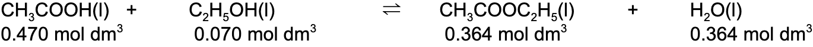
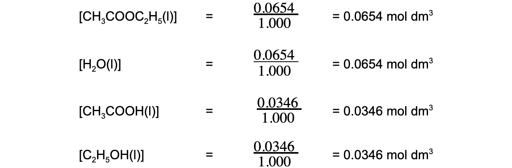

Equilibrium Constant Calculations
---------------------------------

#### Calculations involving Kc

* In the equilibrium expression each figure within a square bracket represents the concentration in <b>mol dm</b><b>-3</b>
* The <b>units </b>of *K**c* therefore depend on the form of the equilibrium expression
* Some questions give the <b>number of moles </b>of each of the reactants and products at equilibrium together with the volume of the reaction mixture
* The concentrations of the reactants and products can then be calculated from the number of moles and total volume

*<b>Equation to calculate concentration from number of moles and volume</b>*

#### Worked Example

#### Calculating Kc of ethanoic acid

Ethanoic acid and ethanol react according to the following equation:

<b>CH</b><b>3</b><b>COOH (I) + C</b><b>2</b><b>H</b><b>5</b><b>OH (I) ⇌ CH</b><b>3</b><b>COOC</b><b>2</b><b>H</b><b>5</b><b> (I) + H</b><b>2</b><b>O (I)</b>

At equilibrium, 500 cm3 of the reaction mixture contained 0.235 mol of ethanoic acid and 0.035 mol of ethanol together with 0.182 mol of ethyl ethanoate and 0.182 mol of water.

Calculate a value of *K**c*for this reaction

<b>Answer</b>

* <b>Step 1: </b>Calculate the concentrations of the reactants and products

  + [CH3COOH] ![equals space fraction numerator 0.235 over denominator 0.500 end fraction space equals space](data:image/svg+xml;charset=utf8,%3Csvg%20xmlns%3D%22http%3A%2F%2Fwww.w3.org%2F2000%2Fsvg%22%20xmlns%3Awrs%3D%22http%3A%2F%2Fwww.wiris.com%2Fxml%2Fmathml-extension%22%20height%3D%2247%22%20width%3D%2296%22%20wrs%3Abaseline%3D%2230%22%3E%3C!--MathML%3A%20%3Cmath%20xmlns%3D%22http%3A%2F%2Fwww.w3.org%2F1998%2FMath%2FMathML%22%3E%3Cmo%3E%3D%3C%2Fmo%3E%3Cmo%3E%26%23xA0%3B%3C%2Fmo%3E%3Cmfrac%3E%3Cmrow%3E%3Cmn%3E0%3C%2Fmn%3E%3Cmo%3E.%3C%2Fmo%3E%3Cmn%3E235%3C%2Fmn%3E%3C%2Fmrow%3E%3Cmrow%3E%3Cmn%3E0%3C%2Fmn%3E%3Cmo%3E.%3C%2Fmo%3E%3Cmn%3E500%3C%2Fmn%3E%3C%2Fmrow%3E%3C%2Fmfrac%3E%3Cmo%3E%26%23xA0%3B%3C%2Fmo%3E%3Cmo%3E%3D%3C%2Fmo%3E%3Cmo%3E%26%23xA0%3B%3C%2Fmo%3E%3C%2Fmath%3E--%3E%3Cdefs%3E%3Cstyle%20type%3D%22text%2Fcss%22%3E%40font-face%7Bfont-family%3A'math11824c643d1feb4da18b28ed527'%3Bsrc%3Aurl(data%3Afont%2Ftruetype%3Bcharset%3Dutf-8%3Bbase64%2CAAEAAAAMAIAAAwBAT1MvMi7iBBMAAADMAAAATmNtYXDEvmKUAAABHAAAADxjdnQgDVUNBwAAAVgAAAA6Z2x5ZoPi2VsAAAGUAAAA%2BGhlYWQQC2qxAAACjAAAADZoaGVhCGsXSAAAAsQAAAAkaG10eE2rRkcAAALoAAAADGxvY2EAHTwYAAAC9AAAABBtYXhwBT0FPgAAAwQAAAAgbmFtZaBxlY4AAAMkAAABn3Bvc3QB9wD6AAAExAAAACBwcmVwa1uragAABOQAAAAUAAADSwGQAAUAAAQABAAAAAAABAAEAAAAAAAAAQEAAAAAAAAAAAAAAAAAAAAAAAAAAAAAAAAAAAAAACAgICAAAAAg1UADev96AAAD6ACWAAAAAAACAAEAAQAAABQAAwABAAAAFAAEACgAAAAGAAQAAQACAC4APf%2F%2FAAAALgA9%2F%2F%2F%2F0%2F%2FFAAEAAAAAAAAAAAFUAywAgAEAAFYAKgJYAh4BDgEsAiwAWgGAAoAAoADUAIAAAAAAAAAAKwBVAIAAqwDVAQABKwAHAAAAAgBVAAADAAOrAAMABwAAMxEhESUhESFVAqv9qwIA%2FgADq%2FxVVQMAAAEAIAAAAKAAgAADAC8YAbAEELAD1LADELAC1LADELAAPLACELABPACwBBCwA9SwAxCwAjywABCwATwwMTczFSMggICAgAACAIAA6wLVAhUAAwAHAGUYAbAIELAG1LAGELAF1LAIELAB1LABELAA1LAGELAHPLAFELAEPLABELACPLAAELADPACwCBCwBtSwBhCwB9SwBxCwAdSwARCwAtSwBhCwBTywBxCwBDywARCwADywAhCwAzwxMBMhNSEdASE1gAJV%2FasCVQHAVdVVVQABAAAAAQAA1XjOQV8PPPUAAwQA%2F%2F%2F%2F%2F9Y6E3P%2F%2F%2F%2F%2F1joTcwAA%2FyAEgAOrAAAACgACAAEAAAAAAAEAAAPo%2F2oAABdwAAD%2FtgSAAAEAAAAAAAAAAAAAAAAAAAADA1IAVQDIACADVgCAAAAAAAAAACgAAABuAAAA%2BAABAAAAAwBeAAUAAAAAAAIAgAQAAAAAAAQAAN4AAAAAAAAAFQECAAAAAAAAAAEAEgAAAAAAAAAAAAIADgASAAAAAAAAAAMAMAAgAAAAAAAAAAQAEgBQAAAAAAAAAAUAFgBiAAAAAAAAAAYACQB4AAAAAAAAAAgAHACBAAEAAAAAAAEAEgAAAAEAAAAAAAIADgASAAEAAAAAAAMAMAAgAAEAAAAAAAQAEgBQAAEAAAAAAAUAFgBiAAEAAAAAAAYACQB4AAEAAAAAAAgAHACBAAMAAQQJAAEAEgAAAAMAAQQJAAIADgASAAMAAQQJAAMAMAAgAAMAAQQJAAQAEgBQAAMAAQQJAAUAFgBiAAMAAQQJAAYACQB4AAMAAQQJAAgAHACBAE0AYQB0AGgAIABGAG8AbgB0AFIAZQBnAHUAbABhAHIATQBhAHQAaABzACAARgBvAHIAIABNAG8AcgBlACAATQBhAHQAaAAgAEYAbwBuAHQATQBhAHQAaAAgAEYAbwBuAHQAVgBlAHIAcwBpAG8AbgAgADEALgAwTWF0aF9Gb250AE0AYQB0AGgAcwAgAEYAbwByACAATQBvAHIAZQAAAwAAAAAAAAH0APoAAAAAAAAAAAAAAAAAAAAAAAAAALkHEQAAjYUYALIAAAAVFBOxAAE%2F)format('truetype')%3Bfont-weight%3Anormal%3Bfont-style%3Anormal%3B%7D%3C%2Fstyle%3E%3C%2Fdefs%3E%3Ctext%20font-family%3D%22math11824c643d1feb4da18b28ed527%22%20font-size%3D%2216%22%20text-anchor%3D%22middle%22%20x%3D%228.5%22%20y%3D%2230%22%3E%3D%3C%2Ftext%3E%3Cline%20stroke%3D%22%23000%22%20stroke-linecap%3D%22square%22%20stroke-width%3D%221%22%20x1%3D%2223.5%22%20x2%3D%2267.5%22%20y1%3D%2223.5%22%20y2%3D%2223.5%22%2F%3E%3Ctext%20font-family%3D%22Times%20New%20Roman%22%20font-size%3D%2218%22%20text-anchor%3D%22middle%22%20x%3D%2229.5%22%20y%3D%2216%22%3E0%3C%2Ftext%3E%3Ctext%20font-family%3D%22math11824c643d1feb4da18b28ed527%22%20font-size%3D%2216%22%20text-anchor%3D%22middle%22%20x%3D%2236.5%22%20y%3D%2216%22%3E.%3C%2Ftext%3E%3Ctext%20font-family%3D%22Times%20New%20Roman%22%20font-size%3D%2218%22%20text-anchor%3D%22middle%22%20x%3D%2252.5%22%20y%3D%2216%22%3E235%3C%2Ftext%3E%3Ctext%20font-family%3D%22Times%20New%20Roman%22%20font-size%3D%2218%22%20text-anchor%3D%22middle%22%20x%3D%2229.5%22%20y%3D%2241%22%3E0%3C%2Ftext%3E%3Ctext%20font-family%3D%22math11824c643d1feb4da18b28ed527%22%20font-size%3D%2216%22%20text-anchor%3D%22middle%22%20x%3D%2236.5%22%20y%3D%2241%22%3E.%3C%2Ftext%3E%3Ctext%20font-family%3D%22Times%20New%20Roman%22%20font-size%3D%2218%22%20text-anchor%3D%22middle%22%20x%3D%2252.5%22%20y%3D%2241%22%3E500%3C%2Ftext%3E%3Ctext%20font-family%3D%22math11824c643d1feb4da18b28ed527%22%20font-size%3D%2216%22%20text-anchor%3D%22middle%22%20x%3D%2282.5%22%20y%3D%2230%22%3E%3D%3C%2Ftext%3E%3C%2Fsvg%3E)0.470 mol dm-3
  + [C2H5OH] ![equals space fraction numerator 0.035 over denominator 0.500 end fraction space equals space](data:image/svg+xml;charset=utf8,%3Csvg%20xmlns%3D%22http%3A%2F%2Fwww.w3.org%2F2000%2Fsvg%22%20xmlns%3Awrs%3D%22http%3A%2F%2Fwww.wiris.com%2Fxml%2Fmathml-extension%22%20height%3D%2247%22%20width%3D%2296%22%20wrs%3Abaseline%3D%2230%22%3E%3C!--MathML%3A%20%3Cmath%20xmlns%3D%22http%3A%2F%2Fwww.w3.org%2F1998%2FMath%2FMathML%22%3E%3Cmo%3E%3D%3C%2Fmo%3E%3Cmo%3E%26%23xA0%3B%3C%2Fmo%3E%3Cmfrac%3E%3Cmrow%3E%3Cmn%3E0%3C%2Fmn%3E%3Cmo%3E.%3C%2Fmo%3E%3Cmn%3E035%3C%2Fmn%3E%3C%2Fmrow%3E%3Cmrow%3E%3Cmn%3E0%3C%2Fmn%3E%3Cmo%3E.%3C%2Fmo%3E%3Cmn%3E500%3C%2Fmn%3E%3C%2Fmrow%3E%3C%2Fmfrac%3E%3Cmo%3E%26%23xA0%3B%3C%2Fmo%3E%3Cmo%3E%3D%3C%2Fmo%3E%3Cmo%3E%26%23xA0%3B%3C%2Fmo%3E%3C%2Fmath%3E--%3E%3Cdefs%3E%3Cstyle%20type%3D%22text%2Fcss%22%3E%40font-face%7Bfont-family%3A'math11824c643d1feb4da18b28ed527'%3Bsrc%3Aurl(data%3Afont%2Ftruetype%3Bcharset%3Dutf-8%3Bbase64%2CAAEAAAAMAIAAAwBAT1MvMi7iBBMAAADMAAAATmNtYXDEvmKUAAABHAAAADxjdnQgDVUNBwAAAVgAAAA6Z2x5ZoPi2VsAAAGUAAAA%2BGhlYWQQC2qxAAACjAAAADZoaGVhCGsXSAAAAsQAAAAkaG10eE2rRkcAAALoAAAADGxvY2EAHTwYAAAC9AAAABBtYXhwBT0FPgAAAwQAAAAgbmFtZaBxlY4AAAMkAAABn3Bvc3QB9wD6AAAExAAAACBwcmVwa1uragAABOQAAAAUAAADSwGQAAUAAAQABAAAAAAABAAEAAAAAAAAAQEAAAAAAAAAAAAAAAAAAAAAAAAAAAAAAAAAAAAAACAgICAAAAAg1UADev96AAAD6ACWAAAAAAACAAEAAQAAABQAAwABAAAAFAAEACgAAAAGAAQAAQACAC4APf%2F%2FAAAALgA9%2F%2F%2F%2F0%2F%2FFAAEAAAAAAAAAAAFUAywAgAEAAFYAKgJYAh4BDgEsAiwAWgGAAoAAoADUAIAAAAAAAAAAKwBVAIAAqwDVAQABKwAHAAAAAgBVAAADAAOrAAMABwAAMxEhESUhESFVAqv9qwIA%2FgADq%2FxVVQMAAAEAIAAAAKAAgAADAC8YAbAEELAD1LADELAC1LADELAAPLACELABPACwBBCwA9SwAxCwAjywABCwATwwMTczFSMggICAgAACAIAA6wLVAhUAAwAHAGUYAbAIELAG1LAGELAF1LAIELAB1LABELAA1LAGELAHPLAFELAEPLABELACPLAAELADPACwCBCwBtSwBhCwB9SwBxCwAdSwARCwAtSwBhCwBTywBxCwBDywARCwADywAhCwAzwxMBMhNSEdASE1gAJV%2FasCVQHAVdVVVQABAAAAAQAA1XjOQV8PPPUAAwQA%2F%2F%2F%2F%2F9Y6E3P%2F%2F%2F%2F%2F1joTcwAA%2FyAEgAOrAAAACgACAAEAAAAAAAEAAAPo%2F2oAABdwAAD%2FtgSAAAEAAAAAAAAAAAAAAAAAAAADA1IAVQDIACADVgCAAAAAAAAAACgAAABuAAAA%2BAABAAAAAwBeAAUAAAAAAAIAgAQAAAAAAAQAAN4AAAAAAAAAFQECAAAAAAAAAAEAEgAAAAAAAAAAAAIADgASAAAAAAAAAAMAMAAgAAAAAAAAAAQAEgBQAAAAAAAAAAUAFgBiAAAAAAAAAAYACQB4AAAAAAAAAAgAHACBAAEAAAAAAAEAEgAAAAEAAAAAAAIADgASAAEAAAAAAAMAMAAgAAEAAAAAAAQAEgBQAAEAAAAAAAUAFgBiAAEAAAAAAAYACQB4AAEAAAAAAAgAHACBAAMAAQQJAAEAEgAAAAMAAQQJAAIADgASAAMAAQQJAAMAMAAgAAMAAQQJAAQAEgBQAAMAAQQJAAUAFgBiAAMAAQQJAAYACQB4AAMAAQQJAAgAHACBAE0AYQB0AGgAIABGAG8AbgB0AFIAZQBnAHUAbABhAHIATQBhAHQAaABzACAARgBvAHIAIABNAG8AcgBlACAATQBhAHQAaAAgAEYAbwBuAHQATQBhAHQAaAAgAEYAbwBuAHQAVgBlAHIAcwBpAG8AbgAgADEALgAwTWF0aF9Gb250AE0AYQB0AGgAcwAgAEYAbwByACAATQBvAHIAZQAAAwAAAAAAAAH0APoAAAAAAAAAAAAAAAAAAAAAAAAAALkHEQAAjYUYALIAAAAVFBOxAAE%2F)format('truetype')%3Bfont-weight%3Anormal%3Bfont-style%3Anormal%3B%7D%3C%2Fstyle%3E%3C%2Fdefs%3E%3Ctext%20font-family%3D%22math11824c643d1feb4da18b28ed527%22%20font-size%3D%2216%22%20text-anchor%3D%22middle%22%20x%3D%228.5%22%20y%3D%2230%22%3E%3D%3C%2Ftext%3E%3Cline%20stroke%3D%22%23000%22%20stroke-linecap%3D%22square%22%20stroke-width%3D%221%22%20x1%3D%2223.5%22%20x2%3D%2267.5%22%20y1%3D%2223.5%22%20y2%3D%2223.5%22%2F%3E%3Ctext%20font-family%3D%22Times%20New%20Roman%22%20font-size%3D%2218%22%20text-anchor%3D%22middle%22%20x%3D%2229.5%22%20y%3D%2216%22%3E0%3C%2Ftext%3E%3Ctext%20font-family%3D%22math11824c643d1feb4da18b28ed527%22%20font-size%3D%2216%22%20text-anchor%3D%22middle%22%20x%3D%2236.5%22%20y%3D%2216%22%3E.%3C%2Ftext%3E%3Ctext%20font-family%3D%22Times%20New%20Roman%22%20font-size%3D%2218%22%20text-anchor%3D%22middle%22%20x%3D%2252.5%22%20y%3D%2216%22%3E035%3C%2Ftext%3E%3Ctext%20font-family%3D%22Times%20New%20Roman%22%20font-size%3D%2218%22%20text-anchor%3D%22middle%22%20x%3D%2229.5%22%20y%3D%2241%22%3E0%3C%2Ftext%3E%3Ctext%20font-family%3D%22math11824c643d1feb4da18b28ed527%22%20font-size%3D%2216%22%20text-anchor%3D%22middle%22%20x%3D%2236.5%22%20y%3D%2241%22%3E.%3C%2Ftext%3E%3Ctext%20font-family%3D%22Times%20New%20Roman%22%20font-size%3D%2218%22%20text-anchor%3D%22middle%22%20x%3D%2252.5%22%20y%3D%2241%22%3E500%3C%2Ftext%3E%3Ctext%20font-family%3D%22math11824c643d1feb4da18b28ed527%22%20font-size%3D%2216%22%20text-anchor%3D%22middle%22%20x%3D%2282.5%22%20y%3D%2230%22%3E%3D%3C%2Ftext%3E%3C%2Fsvg%3E)0.070 mol dm-3
  + [CH3COOC2H5] ![equals space fraction numerator 0.182 over denominator 0.500 end fraction space equals space](data:image/svg+xml;charset=utf8,%3Csvg%20xmlns%3D%22http%3A%2F%2Fwww.w3.org%2F2000%2Fsvg%22%20xmlns%3Awrs%3D%22http%3A%2F%2Fwww.wiris.com%2Fxml%2Fmathml-extension%22%20height%3D%2247%22%20width%3D%2296%22%20wrs%3Abaseline%3D%2230%22%3E%3C!--MathML%3A%20%3Cmath%20xmlns%3D%22http%3A%2F%2Fwww.w3.org%2F1998%2FMath%2FMathML%22%3E%3Cmo%3E%3D%3C%2Fmo%3E%3Cmo%3E%26%23xA0%3B%3C%2Fmo%3E%3Cmfrac%3E%3Cmrow%3E%3Cmn%3E0%3C%2Fmn%3E%3Cmo%3E.%3C%2Fmo%3E%3Cmn%3E182%3C%2Fmn%3E%3C%2Fmrow%3E%3Cmrow%3E%3Cmn%3E0%3C%2Fmn%3E%3Cmo%3E.%3C%2Fmo%3E%3Cmn%3E500%3C%2Fmn%3E%3C%2Fmrow%3E%3C%2Fmfrac%3E%3Cmo%3E%26%23xA0%3B%3C%2Fmo%3E%3Cmo%3E%3D%3C%2Fmo%3E%3Cmo%3E%26%23xA0%3B%3C%2Fmo%3E%3C%2Fmath%3E--%3E%3Cdefs%3E%3Cstyle%20type%3D%22text%2Fcss%22%3E%40font-face%7Bfont-family%3A'math11824c643d1feb4da18b28ed527'%3Bsrc%3Aurl(data%3Afont%2Ftruetype%3Bcharset%3Dutf-8%3Bbase64%2CAAEAAAAMAIAAAwBAT1MvMi7iBBMAAADMAAAATmNtYXDEvmKUAAABHAAAADxjdnQgDVUNBwAAAVgAAAA6Z2x5ZoPi2VsAAAGUAAAA%2BGhlYWQQC2qxAAACjAAAADZoaGVhCGsXSAAAAsQAAAAkaG10eE2rRkcAAALoAAAADGxvY2EAHTwYAAAC9AAAABBtYXhwBT0FPgAAAwQAAAAgbmFtZaBxlY4AAAMkAAABn3Bvc3QB9wD6AAAExAAAACBwcmVwa1uragAABOQAAAAUAAADSwGQAAUAAAQABAAAAAAABAAEAAAAAAAAAQEAAAAAAAAAAAAAAAAAAAAAAAAAAAAAAAAAAAAAACAgICAAAAAg1UADev96AAAD6ACWAAAAAAACAAEAAQAAABQAAwABAAAAFAAEACgAAAAGAAQAAQACAC4APf%2F%2FAAAALgA9%2F%2F%2F%2F0%2F%2FFAAEAAAAAAAAAAAFUAywAgAEAAFYAKgJYAh4BDgEsAiwAWgGAAoAAoADUAIAAAAAAAAAAKwBVAIAAqwDVAQABKwAHAAAAAgBVAAADAAOrAAMABwAAMxEhESUhESFVAqv9qwIA%2FgADq%2FxVVQMAAAEAIAAAAKAAgAADAC8YAbAEELAD1LADELAC1LADELAAPLACELABPACwBBCwA9SwAxCwAjywABCwATwwMTczFSMggICAgAACAIAA6wLVAhUAAwAHAGUYAbAIELAG1LAGELAF1LAIELAB1LABELAA1LAGELAHPLAFELAEPLABELACPLAAELADPACwCBCwBtSwBhCwB9SwBxCwAdSwARCwAtSwBhCwBTywBxCwBDywARCwADywAhCwAzwxMBMhNSEdASE1gAJV%2FasCVQHAVdVVVQABAAAAAQAA1XjOQV8PPPUAAwQA%2F%2F%2F%2F%2F9Y6E3P%2F%2F%2F%2F%2F1joTcwAA%2FyAEgAOrAAAACgACAAEAAAAAAAEAAAPo%2F2oAABdwAAD%2FtgSAAAEAAAAAAAAAAAAAAAAAAAADA1IAVQDIACADVgCAAAAAAAAAACgAAABuAAAA%2BAABAAAAAwBeAAUAAAAAAAIAgAQAAAAAAAQAAN4AAAAAAAAAFQECAAAAAAAAAAEAEgAAAAAAAAAAAAIADgASAAAAAAAAAAMAMAAgAAAAAAAAAAQAEgBQAAAAAAAAAAUAFgBiAAAAAAAAAAYACQB4AAAAAAAAAAgAHACBAAEAAAAAAAEAEgAAAAEAAAAAAAIADgASAAEAAAAAAAMAMAAgAAEAAAAAAAQAEgBQAAEAAAAAAAUAFgBiAAEAAAAAAAYACQB4AAEAAAAAAAgAHACBAAMAAQQJAAEAEgAAAAMAAQQJAAIADgASAAMAAQQJAAMAMAAgAAMAAQQJAAQAEgBQAAMAAQQJAAUAFgBiAAMAAQQJAAYACQB4AAMAAQQJAAgAHACBAE0AYQB0AGgAIABGAG8AbgB0AFIAZQBnAHUAbABhAHIATQBhAHQAaABzACAARgBvAHIAIABNAG8AcgBlACAATQBhAHQAaAAgAEYAbwBuAHQATQBhAHQAaAAgAEYAbwBuAHQAVgBlAHIAcwBpAG8AbgAgADEALgAwTWF0aF9Gb250AE0AYQB0AGgAcwAgAEYAbwByACAATQBvAHIAZQAAAwAAAAAAAAH0APoAAAAAAAAAAAAAAAAAAAAAAAAAALkHEQAAjYUYALIAAAAVFBOxAAE%2F)format('truetype')%3Bfont-weight%3Anormal%3Bfont-style%3Anormal%3B%7D%3C%2Fstyle%3E%3C%2Fdefs%3E%3Ctext%20font-family%3D%22math11824c643d1feb4da18b28ed527%22%20font-size%3D%2216%22%20text-anchor%3D%22middle%22%20x%3D%228.5%22%20y%3D%2230%22%3E%3D%3C%2Ftext%3E%3Cline%20stroke%3D%22%23000%22%20stroke-linecap%3D%22square%22%20stroke-width%3D%221%22%20x1%3D%2223.5%22%20x2%3D%2267.5%22%20y1%3D%2223.5%22%20y2%3D%2223.5%22%2F%3E%3Ctext%20font-family%3D%22Times%20New%20Roman%22%20font-size%3D%2218%22%20text-anchor%3D%22middle%22%20x%3D%2229.5%22%20y%3D%2216%22%3E0%3C%2Ftext%3E%3Ctext%20font-family%3D%22math11824c643d1feb4da18b28ed527%22%20font-size%3D%2216%22%20text-anchor%3D%22middle%22%20x%3D%2236.5%22%20y%3D%2216%22%3E.%3C%2Ftext%3E%3Ctext%20font-family%3D%22Times%20New%20Roman%22%20font-size%3D%2218%22%20text-anchor%3D%22middle%22%20x%3D%2252.5%22%20y%3D%2216%22%3E182%3C%2Ftext%3E%3Ctext%20font-family%3D%22Times%20New%20Roman%22%20font-size%3D%2218%22%20text-anchor%3D%22middle%22%20x%3D%2229.5%22%20y%3D%2241%22%3E0%3C%2Ftext%3E%3Ctext%20font-family%3D%22math11824c643d1feb4da18b28ed527%22%20font-size%3D%2216%22%20text-anchor%3D%22middle%22%20x%3D%2236.5%22%20y%3D%2241%22%3E.%3C%2Ftext%3E%3Ctext%20font-family%3D%22Times%20New%20Roman%22%20font-size%3D%2218%22%20text-anchor%3D%22middle%22%20x%3D%2252.5%22%20y%3D%2241%22%3E500%3C%2Ftext%3E%3Ctext%20font-family%3D%22math11824c643d1feb4da18b28ed527%22%20font-size%3D%2216%22%20text-anchor%3D%22middle%22%20x%3D%2282.5%22%20y%3D%2230%22%3E%3D%3C%2Ftext%3E%3C%2Fsvg%3E)0.364 mol dm-3
  + [H2O] ![equals space fraction numerator 0.182 over denominator 0.500 end fraction space equals space](data:image/svg+xml;charset=utf8,%3Csvg%20xmlns%3D%22http%3A%2F%2Fwww.w3.org%2F2000%2Fsvg%22%20xmlns%3Awrs%3D%22http%3A%2F%2Fwww.wiris.com%2Fxml%2Fmathml-extension%22%20height%3D%2247%22%20width%3D%2296%22%20wrs%3Abaseline%3D%2230%22%3E%3C!--MathML%3A%20%3Cmath%20xmlns%3D%22http%3A%2F%2Fwww.w3.org%2F1998%2FMath%2FMathML%22%3E%3Cmo%3E%3D%3C%2Fmo%3E%3Cmo%3E%26%23xA0%3B%3C%2Fmo%3E%3Cmfrac%3E%3Cmrow%3E%3Cmn%3E0%3C%2Fmn%3E%3Cmo%3E.%3C%2Fmo%3E%3Cmn%3E182%3C%2Fmn%3E%3C%2Fmrow%3E%3Cmrow%3E%3Cmn%3E0%3C%2Fmn%3E%3Cmo%3E.%3C%2Fmo%3E%3Cmn%3E500%3C%2Fmn%3E%3C%2Fmrow%3E%3C%2Fmfrac%3E%3Cmo%3E%26%23xA0%3B%3C%2Fmo%3E%3Cmo%3E%3D%3C%2Fmo%3E%3Cmo%3E%26%23xA0%3B%3C%2Fmo%3E%3C%2Fmath%3E--%3E%3Cdefs%3E%3Cstyle%20type%3D%22text%2Fcss%22%3E%40font-face%7Bfont-family%3A'math11824c643d1feb4da18b28ed527'%3Bsrc%3Aurl(data%3Afont%2Ftruetype%3Bcharset%3Dutf-8%3Bbase64%2CAAEAAAAMAIAAAwBAT1MvMi7iBBMAAADMAAAATmNtYXDEvmKUAAABHAAAADxjdnQgDVUNBwAAAVgAAAA6Z2x5ZoPi2VsAAAGUAAAA%2BGhlYWQQC2qxAAACjAAAADZoaGVhCGsXSAAAAsQAAAAkaG10eE2rRkcAAALoAAAADGxvY2EAHTwYAAAC9AAAABBtYXhwBT0FPgAAAwQAAAAgbmFtZaBxlY4AAAMkAAABn3Bvc3QB9wD6AAAExAAAACBwcmVwa1uragAABOQAAAAUAAADSwGQAAUAAAQABAAAAAAABAAEAAAAAAAAAQEAAAAAAAAAAAAAAAAAAAAAAAAAAAAAAAAAAAAAACAgICAAAAAg1UADev96AAAD6ACWAAAAAAACAAEAAQAAABQAAwABAAAAFAAEACgAAAAGAAQAAQACAC4APf%2F%2FAAAALgA9%2F%2F%2F%2F0%2F%2FFAAEAAAAAAAAAAAFUAywAgAEAAFYAKgJYAh4BDgEsAiwAWgGAAoAAoADUAIAAAAAAAAAAKwBVAIAAqwDVAQABKwAHAAAAAgBVAAADAAOrAAMABwAAMxEhESUhESFVAqv9qwIA%2FgADq%2FxVVQMAAAEAIAAAAKAAgAADAC8YAbAEELAD1LADELAC1LADELAAPLACELABPACwBBCwA9SwAxCwAjywABCwATwwMTczFSMggICAgAACAIAA6wLVAhUAAwAHAGUYAbAIELAG1LAGELAF1LAIELAB1LABELAA1LAGELAHPLAFELAEPLABELACPLAAELADPACwCBCwBtSwBhCwB9SwBxCwAdSwARCwAtSwBhCwBTywBxCwBDywARCwADywAhCwAzwxMBMhNSEdASE1gAJV%2FasCVQHAVdVVVQABAAAAAQAA1XjOQV8PPPUAAwQA%2F%2F%2F%2F%2F9Y6E3P%2F%2F%2F%2F%2F1joTcwAA%2FyAEgAOrAAAACgACAAEAAAAAAAEAAAPo%2F2oAABdwAAD%2FtgSAAAEAAAAAAAAAAAAAAAAAAAADA1IAVQDIACADVgCAAAAAAAAAACgAAABuAAAA%2BAABAAAAAwBeAAUAAAAAAAIAgAQAAAAAAAQAAN4AAAAAAAAAFQECAAAAAAAAAAEAEgAAAAAAAAAAAAIADgASAAAAAAAAAAMAMAAgAAAAAAAAAAQAEgBQAAAAAAAAAAUAFgBiAAAAAAAAAAYACQB4AAAAAAAAAAgAHACBAAEAAAAAAAEAEgAAAAEAAAAAAAIADgASAAEAAAAAAAMAMAAgAAEAAAAAAAQAEgBQAAEAAAAAAAUAFgBiAAEAAAAAAAYACQB4AAEAAAAAAAgAHACBAAMAAQQJAAEAEgAAAAMAAQQJAAIADgASAAMAAQQJAAMAMAAgAAMAAQQJAAQAEgBQAAMAAQQJAAUAFgBiAAMAAQQJAAYACQB4AAMAAQQJAAgAHACBAE0AYQB0AGgAIABGAG8AbgB0AFIAZQBnAHUAbABhAHIATQBhAHQAaABzACAARgBvAHIAIABNAG8AcgBlACAATQBhAHQAaAAgAEYAbwBuAHQATQBhAHQAaAAgAEYAbwBuAHQAVgBlAHIAcwBpAG8AbgAgADEALgAwTWF0aF9Gb250AE0AYQB0AGgAcwAgAEYAbwByACAATQBvAHIAZQAAAwAAAAAAAAH0APoAAAAAAAAAAAAAAAAAAAAAAAAAALkHEQAAjYUYALIAAAAVFBOxAAE%2F)format('truetype')%3Bfont-weight%3Anormal%3Bfont-style%3Anormal%3B%7D%3C%2Fstyle%3E%3C%2Fdefs%3E%3Ctext%20font-family%3D%22math11824c643d1feb4da18b28ed527%22%20font-size%3D%2216%22%20text-anchor%3D%22middle%22%20x%3D%228.5%22%20y%3D%2230%22%3E%3D%3C%2Ftext%3E%3Cline%20stroke%3D%22%23000%22%20stroke-linecap%3D%22square%22%20stroke-width%3D%221%22%20x1%3D%2223.5%22%20x2%3D%2267.5%22%20y1%3D%2223.5%22%20y2%3D%2223.5%22%2F%3E%3Ctext%20font-family%3D%22Times%20New%20Roman%22%20font-size%3D%2218%22%20text-anchor%3D%22middle%22%20x%3D%2229.5%22%20y%3D%2216%22%3E0%3C%2Ftext%3E%3Ctext%20font-family%3D%22math11824c643d1feb4da18b28ed527%22%20font-size%3D%2216%22%20text-anchor%3D%22middle%22%20x%3D%2236.5%22%20y%3D%2216%22%3E.%3C%2Ftext%3E%3Ctext%20font-family%3D%22Times%20New%20Roman%22%20font-size%3D%2218%22%20text-anchor%3D%22middle%22%20x%3D%2252.5%22%20y%3D%2216%22%3E182%3C%2Ftext%3E%3Ctext%20font-family%3D%22Times%20New%20Roman%22%20font-size%3D%2218%22%20text-anchor%3D%22middle%22%20x%3D%2229.5%22%20y%3D%2241%22%3E0%3C%2Ftext%3E%3Ctext%20font-family%3D%22math11824c643d1feb4da18b28ed527%22%20font-size%3D%2216%22%20text-anchor%3D%22middle%22%20x%3D%2236.5%22%20y%3D%2241%22%3E.%3C%2Ftext%3E%3Ctext%20font-family%3D%22Times%20New%20Roman%22%20font-size%3D%2218%22%20text-anchor%3D%22middle%22%20x%3D%2252.5%22%20y%3D%2241%22%3E500%3C%2Ftext%3E%3Ctext%20font-family%3D%22math11824c643d1feb4da18b28ed527%22%20font-size%3D%2216%22%20text-anchor%3D%22middle%22%20x%3D%2282.5%22%20y%3D%2230%22%3E%3D%3C%2Ftext%3E%3C%2Fsvg%3E)0.364 mol dm-3

* <b>Step 2: </b>Write out the balanced chemical equation with the concentrations of beneath each substance

* <b>Step 3: </b>Write the equilibrium constant for this reaction in terms of concentration

*K*c = ![fraction numerator left square bracket straight H subscript 2 straight O right square bracket space left square bracket CH subscript 3 COOC subscript 2 straight H subscript 5 right square bracket over denominator left square bracket straight C subscript 2 straight H subscript 5 OH right square bracket space left square bracket CH subscript 3 COOH right square bracket end fraction](data:image/svg+xml;charset=utf8,%3Csvg%20xmlns%3D%22http%3A%2F%2Fwww.w3.org%2F2000%2Fsvg%22%20xmlns%3Awrs%3D%22http%3A%2F%2Fwww.wiris.com%2Fxml%2Fmathml-extension%22%20height%3D%2259%22%20width%3D%22185%22%20wrs%3Abaseline%3D%2236%22%3E%3C!--MathML%3A%20%3Cmath%20xmlns%3D%22http%3A%2F%2Fwww.w3.org%2F1998%2FMath%2FMathML%22%3E%3Cmfrac%3E%3Cmrow%3E%3Cmo%3E%5B%3C%2Fmo%3E%3Cmsub%3E%3Cmi%20mathvariant%3D%22normal%22%3EH%3C%2Fmi%3E%3Cmn%3E2%3C%2Fmn%3E%3C%2Fmsub%3E%3Cmi%20mathvariant%3D%22normal%22%3EO%3C%2Fmi%3E%3Cmo%3E%5D%3C%2Fmo%3E%3Cmo%3E%26%23xA0%3B%3C%2Fmo%3E%3Cmo%3E%5B%3C%2Fmo%3E%3Cmsub%3E%3Cmi%3ECH%3C%2Fmi%3E%3Cmn%3E3%3C%2Fmn%3E%3C%2Fmsub%3E%3Cmsub%3E%3Cmi%3ECOOC%3C%2Fmi%3E%3Cmn%3E2%3C%2Fmn%3E%3C%2Fmsub%3E%3Cmsub%3E%3Cmi%20mathvariant%3D%22normal%22%3EH%3C%2Fmi%3E%3Cmn%3E5%3C%2Fmn%3E%3C%2Fmsub%3E%3Cmo%3E%5D%3C%2Fmo%3E%3C%2Fmrow%3E%3Cmrow%3E%3Cmo%3E%5B%3C%2Fmo%3E%3Cmsub%3E%3Cmi%20mathvariant%3D%22normal%22%3EC%3C%2Fmi%3E%3Cmn%3E2%3C%2Fmn%3E%3C%2Fmsub%3E%3Cmsub%3E%3Cmi%20mathvariant%3D%22normal%22%3EH%3C%2Fmi%3E%3Cmn%3E5%3C%2Fmn%3E%3C%2Fmsub%3E%3Cmi%3EOH%3C%2Fmi%3E%3Cmo%3E%5D%3C%2Fmo%3E%3Cmo%3E%26%23xA0%3B%3C%2Fmo%3E%3Cmo%3E%5B%3C%2Fmo%3E%3Cmsub%3E%3Cmi%3ECH%3C%2Fmi%3E%3Cmn%3E3%3C%2Fmn%3E%3C%2Fmsub%3E%3Cmi%3ECOOH%3C%2Fmi%3E%3Cmo%3E%5D%3C%2Fmo%3E%3C%2Fmrow%3E%3C%2Fmfrac%3E%3C%2Fmath%3E--%3E%3Cdefs%3E%3Cstyle%20type%3D%22text%2Fcss%22%2F%3E%3C%2Fdefs%3E%3Cline%20stroke%3D%22%23000%22%20stroke-linecap%3D%22square%22%20stroke-width%3D%221%22%20x1%3D%222.5%22%20x2%3D%22181.5%22%20y1%3D%2229.5%22%20y2%3D%2229.5%22%2F%3E%3Ctext%20font-family%3D%22Times%20New%20Roman%22%20font-size%3D%2218%22%20text-anchor%3D%22middle%22%20x%3D%2210.5%22%20y%3D%2216%22%3E%5B%3C%2Ftext%3E%3Ctext%20font-family%3D%22Times%20New%20Roman%22%20font-size%3D%2218%22%20text-anchor%3D%22middle%22%20x%3D%2219.5%22%20y%3D%2216%22%3EH%3C%2Ftext%3E%3Ctext%20font-family%3D%22Times%20New%20Roman%22%20font-size%3D%2213%22%20text-anchor%3D%22middle%22%20x%3D%2229.5%22%20y%3D%2224%22%3E2%3C%2Ftext%3E%3Ctext%20font-family%3D%22Times%20New%20Roman%22%20font-size%3D%2218%22%20text-anchor%3D%22middle%22%20x%3D%2239.5%22%20y%3D%2216%22%3EO%3C%2Ftext%3E%3Ctext%20font-family%3D%22Times%20New%20Roman%22%20font-size%3D%2218%22%20text-anchor%3D%22middle%22%20x%3D%2249.5%22%20y%3D%2216%22%3E%5D%3C%2Ftext%3E%3Ctext%20font-family%3D%22Times%20New%20Roman%22%20font-size%3D%2218%22%20text-anchor%3D%22middle%22%20x%3D%2259.5%22%20y%3D%2216%22%3E%5B%3C%2Ftext%3E%3Ctext%20font-family%3D%22Times%20New%20Roman%22%20font-size%3D%2218%22%20text-anchor%3D%22middle%22%20x%3D%2274.5%22%20y%3D%2216%22%3ECH%3C%2Ftext%3E%3Ctext%20font-family%3D%22Times%20New%20Roman%22%20font-size%3D%2213%22%20text-anchor%3D%22middle%22%20x%3D%2290.5%22%20y%3D%2224%22%3E3%3C%2Ftext%3E%3Ctext%20font-family%3D%22Times%20New%20Roman%22%20font-size%3D%2218%22%20text-anchor%3D%22middle%22%20x%3D%22119.5%22%20y%3D%2216%22%3ECOOC%3C%2Ftext%3E%3Ctext%20font-family%3D%22Times%20New%20Roman%22%20font-size%3D%2213%22%20text-anchor%3D%22middle%22%20x%3D%22147.5%22%20y%3D%2224%22%3E2%3C%2Ftext%3E%3Ctext%20font-family%3D%22Times%20New%20Roman%22%20font-size%3D%2218%22%20text-anchor%3D%22middle%22%20x%3D%22157.5%22%20y%3D%2216%22%3EH%3C%2Ftext%3E%3Ctext%20font-family%3D%22Times%20New%20Roman%22%20font-size%3D%2213%22%20text-anchor%3D%22middle%22%20x%3D%22167.5%22%20y%3D%2224%22%3E5%3C%2Ftext%3E%3Ctext%20font-family%3D%22Times%20New%20Roman%22%20font-size%3D%2218%22%20text-anchor%3D%22middle%22%20x%3D%22174.5%22%20y%3D%2216%22%3E%5D%3C%2Ftext%3E%3Ctext%20font-family%3D%22Times%20New%20Roman%22%20font-size%3D%2218%22%20text-anchor%3D%22middle%22%20x%3D%227.5%22%20y%3D%2247%22%3E%5B%3C%2Ftext%3E%3Ctext%20font-family%3D%22Times%20New%20Roman%22%20font-size%3D%2218%22%20text-anchor%3D%22middle%22%20x%3D%2216.5%22%20y%3D%2247%22%3EC%3C%2Ftext%3E%3Ctext%20font-family%3D%22Times%20New%20Roman%22%20font-size%3D%2213%22%20text-anchor%3D%22middle%22%20x%3D%2225.5%22%20y%3D%2255%22%3E2%3C%2Ftext%3E%3Ctext%20font-family%3D%22Times%20New%20Roman%22%20font-size%3D%2218%22%20text-anchor%3D%22middle%22%20x%3D%2235.5%22%20y%3D%2247%22%3EH%3C%2Ftext%3E%3Ctext%20font-family%3D%22Times%20New%20Roman%22%20font-size%3D%2213%22%20text-anchor%3D%22middle%22%20x%3D%2245.5%22%20y%3D%2255%22%3E5%3C%2Ftext%3E%3Ctext%20font-family%3D%22Times%20New%20Roman%22%20font-size%3D%2218%22%20text-anchor%3D%22middle%22%20x%3D%2262.5%22%20y%3D%2247%22%3EOH%3C%2Ftext%3E%3Ctext%20font-family%3D%22Times%20New%20Roman%22%20font-size%3D%2218%22%20text-anchor%3D%22middle%22%20x%3D%2278.5%22%20y%3D%2247%22%3E%5D%3C%2Ftext%3E%3Ctext%20font-family%3D%22Times%20New%20Roman%22%20font-size%3D%2218%22%20text-anchor%3D%22middle%22%20x%3D%2288.5%22%20y%3D%2247%22%3E%5B%3C%2Ftext%3E%3Ctext%20font-family%3D%22Times%20New%20Roman%22%20font-size%3D%2218%22%20text-anchor%3D%22middle%22%20x%3D%22103.5%22%20y%3D%2247%22%3ECH%3C%2Ftext%3E%3Ctext%20font-family%3D%22Times%20New%20Roman%22%20font-size%3D%2213%22%20text-anchor%3D%22middle%22%20x%3D%22119.5%22%20y%3D%2255%22%3E3%3C%2Ftext%3E%3Ctext%20font-family%3D%22Times%20New%20Roman%22%20font-size%3D%2218%22%20text-anchor%3D%22middle%22%20x%3D%22148.5%22%20y%3D%2247%22%3ECOOH%3C%2Ftext%3E%3Ctext%20font-family%3D%22Times%20New%20Roman%22%20font-size%3D%2218%22%20text-anchor%3D%22middle%22%20x%3D%22177.5%22%20y%3D%2247%22%3E%5D%3C%2Ftext%3E%3C%2Fsvg%3E)

* <b>Step 4: </b>Substitute the equilibrium concentrations into the expression

*K*c = ![equals fraction numerator left square bracket 0.364 right square bracket cross times left square bracket 0.364 right square bracket over denominator left square bracket 0.070 right square bracket cross times left square bracket 0.0470 right square bracket end fraction equals](data:image/svg+xml;charset=utf8,%3Csvg%20xmlns%3D%22http%3A%2F%2Fwww.w3.org%2F2000%2Fsvg%22%20xmlns%3Awrs%3D%22http%3A%2F%2Fwww.wiris.com%2Fxml%2Fmathml-extension%22%20height%3D%2247%22%20width%3D%22175%22%20wrs%3Abaseline%3D%2230%22%3E%3C!--MathML%3A%20%3Cmath%20xmlns%3D%22http%3A%2F%2Fwww.w3.org%2F1998%2FMath%2FMathML%22%3E%3Cmo%3E%3D%3C%2Fmo%3E%3Cmfrac%3E%3Cmrow%3E%3Cmo%3E%5B%3C%2Fmo%3E%3Cmn%3E0%3C%2Fmn%3E%3Cmo%3E.%3C%2Fmo%3E%3Cmn%3E364%3C%2Fmn%3E%3Cmo%3E%5D%3C%2Fmo%3E%3Cmo%3E%26%23xD7%3B%3C%2Fmo%3E%3Cmo%3E%5B%3C%2Fmo%3E%3Cmn%3E0%3C%2Fmn%3E%3Cmo%3E.%3C%2Fmo%3E%3Cmn%3E364%3C%2Fmn%3E%3Cmo%3E%5D%3C%2Fmo%3E%3C%2Fmrow%3E%3Cmrow%3E%3Cmo%3E%5B%3C%2Fmo%3E%3Cmn%3E0%3C%2Fmn%3E%3Cmo%3E.%3C%2Fmo%3E%3Cmn%3E070%3C%2Fmn%3E%3Cmo%3E%5D%3C%2Fmo%3E%3Cmo%3E%26%23xD7%3B%3C%2Fmo%3E%3Cmo%3E%5B%3C%2Fmo%3E%3Cmn%3E0%3C%2Fmn%3E%3Cmo%3E.%3C%2Fmo%3E%3Cmn%3E0470%3C%2Fmn%3E%3Cmo%3E%5D%3C%2Fmo%3E%3C%2Fmrow%3E%3C%2Fmfrac%3E%3Cmo%3E%3D%3C%2Fmo%3E%3C%2Fmath%3E--%3E%3Cdefs%3E%3Cstyle%20type%3D%22text%2Fcss%22%3E%40font-face%7Bfont-family%3A'math17994cda3defe015d857709bac5'%3Bsrc%3Aurl(data%3Afont%2Ftruetype%3Bcharset%3Dutf-8%3Bbase64%2CAAEAAAAMAIAAAwBAT1MvMi7iBBMAAADMAAAATmNtYXDEvmKUAAABHAAAAERjdnQgDVUNBwAAAWAAAAA6Z2x5ZoPi2VsAAAGcAAABZ2hlYWQQC2qxAAADBAAAADZoaGVhCGsXSAAAAzwAAAAkaG10eE2rRkcAAANgAAAAEGxvY2EAHTwYAAADcAAAABRtYXhwBT0FPgAAA4QAAAAgbmFtZaBxlY4AAAOkAAABn3Bvc3QB9wD6AAAFRAAAACBwcmVwa1uragAABWQAAAAUAAADSwGQAAUAAAQABAAAAAAABAAEAAAAAAAAAQEAAAAAAAAAAAAAAAAAAAAAAAAAAAAAAAAAAAAAACAgICAAAAAg1UADev96AAAD6ACWAAAAAAACAAEAAQAAABQAAwABAAAAFAAEADAAAAAIAAgAAgAAAC4APQDX%2F%2F8AAAAuAD0A1%2F%2F%2F%2F9P%2Fxf8sAAEAAAAAAAAAAAAAAVQDLACAAQAAVgAqAlgCHgEOASwCLABaAYACgACgANQAgAAAAAAAAAArAFUAgACrANUBAAErAAcAAAACAFUAAAMAA6sAAwAHAAAzESERJSERIVUCq%2F2rAgD%2BAAOr%2FFVVAwAAAQAgAAAAoACAAAMALxgBsAQQsAPUsAMQsALUsAMQsAA8sAIQsAE8ALAEELAD1LADELACPLAAELABPDAxNzMVIyCAgICAAAIAgADrAtUCFQADAAcAZRgBsAgQsAbUsAYQsAXUsAgQsAHUsAEQsADUsAYQsAc8sAUQsAQ8sAEQsAI8sAAQsAM8ALAIELAG1LAGELAH1LAHELAB1LABELAC1LAGELAFPLAHELAEPLABELAAPLACELADPDEwEyE1IR0BITWAAlX9qwJVAcBV1VVVAAIAgABVAtUCgAADAAcARhiwARQAsQAAExCxAAnksQABExCwBDyxBgj0sAI8MAGxCAETELEAA%2FawBzyxAQX1sAY8sgUHABD0sAI8sQkD5rEEBfWwAzwTMwEjETMBI4BVAgBVVf4AVQKA%2FdUCK%2F3VAAABAAAAAQAA1XjOQV8PPPUAAwQA%2F%2F%2F%2F%2F9Y6E3P%2F%2F%2F%2F%2F1joTcwAA%2FyAEgAOrAAAACgACAAEAAAAAAAEAAAPo%2F2oAABdwAAD%2FtgSAAAEAAAAAAAAAAAAAAAAAAAAEA1IAVQDIACADVgCAA1YAgAAAAAAAAAAoAAAAbgAAAPgAAAFnAAEAAAAEAF4ABQAAAAAAAgCABAAAAAAABAAA3gAAAAAAAAAVAQIAAAAAAAAAAQASAAAAAAAAAAAAAgAOABIAAAAAAAAAAwAwACAAAAAAAAAABAASAFAAAAAAAAAABQAWAGIAAAAAAAAABgAJAHgAAAAAAAAACAAcAIEAAQAAAAAAAQASAAAAAQAAAAAAAgAOABIAAQAAAAAAAwAwACAAAQAAAAAABAASAFAAAQAAAAAABQAWAGIAAQAAAAAABgAJAHgAAQAAAAAACAAcAIEAAwABBAkAAQASAAAAAwABBAkAAgAOABIAAwABBAkAAwAwACAAAwABBAkABAASAFAAAwABBAkABQAWAGIAAwABBAkABgAJAHgAAwABBAkACAAcAIEATQBhAHQAaAAgAEYAbwBuAHQAUgBlAGcAdQBsAGEAcgBNAGEAdABoAHMAIABGAG8AcgAgAE0AbwByAGUAIABNAGEAdABoACAARgBvAG4AdABNAGEAdABoACAARgBvAG4AdABWAGUAcgBzAGkAbwBuACAAMQAuADBNYXRoX0ZvbnQATQBhAHQAaABzACAARgBvAHIAIABNAG8AcgBlAAADAAAAAAAAAfQA%2BgAAAAAAAAAAAAAAAAAAAAAAAAAAuQcRAACNhRgAsgAAABUUE7EAAT8%3D)format('truetype')%3Bfont-weight%3Anormal%3Bfont-style%3Anormal%3B%7D%3C%2Fstyle%3E%3C%2Fdefs%3E%3Ctext%20font-family%3D%22math17994cda3defe015d857709bac5%22%20font-size%3D%2216%22%20text-anchor%3D%22middle%22%20x%3D%228.5%22%20y%3D%2230%22%3E%3D%3C%2Ftext%3E%3Cline%20stroke%3D%22%23000%22%20stroke-linecap%3D%22square%22%20stroke-width%3D%221%22%20x1%3D%2219.5%22%20x2%3D%22154.5%22%20y1%3D%2223.5%22%20y2%3D%2223.5%22%2F%3E%3Ctext%20font-family%3D%22Times%20New%20Roman%22%20font-size%3D%2218%22%20text-anchor%3D%22middle%22%20x%3D%2229.5%22%20y%3D%2216%22%3E%5B%3C%2Ftext%3E%3Ctext%20font-family%3D%22Times%20New%20Roman%22%20font-size%3D%2218%22%20text-anchor%3D%22middle%22%20x%3D%2236.5%22%20y%3D%2216%22%3E0%3C%2Ftext%3E%3Ctext%20font-family%3D%22math17994cda3defe015d857709bac5%22%20font-size%3D%2216%22%20text-anchor%3D%22middle%22%20x%3D%2243.5%22%20y%3D%2216%22%3E.%3C%2Ftext%3E%3Ctext%20font-family%3D%22Times%20New%20Roman%22%20font-size%3D%2218%22%20text-anchor%3D%22middle%22%20x%3D%2259.5%22%20y%3D%2216%22%3E364%3C%2Ftext%3E%3Ctext%20font-family%3D%22Times%20New%20Roman%22%20font-size%3D%2218%22%20text-anchor%3D%22middle%22%20x%3D%2276.5%22%20y%3D%2216%22%3E%5D%3C%2Ftext%3E%3Ctext%20font-family%3D%22math17994cda3defe015d857709bac5%22%20font-size%3D%2216%22%20text-anchor%3D%22middle%22%20x%3D%2287.5%22%20y%3D%2216%22%3E%26%23xD7%3B%3C%2Ftext%3E%3Ctext%20font-family%3D%22Times%20New%20Roman%22%20font-size%3D%2218%22%20text-anchor%3D%22middle%22%20x%3D%2299.5%22%20y%3D%2216%22%3E%5B%3C%2Ftext%3E%3Ctext%20font-family%3D%22Times%20New%20Roman%22%20font-size%3D%2218%22%20text-anchor%3D%22middle%22%20x%3D%22106.5%22%20y%3D%2216%22%3E0%3C%2Ftext%3E%3Ctext%20font-family%3D%22math17994cda3defe015d857709bac5%22%20font-size%3D%2216%22%20text-anchor%3D%22middle%22%20x%3D%22113.5%22%20y%3D%2216%22%3E.%3C%2Ftext%3E%3Ctext%20font-family%3D%22Times%20New%20Roman%22%20font-size%3D%2218%22%20text-anchor%3D%22middle%22%20x%3D%22129.5%22%20y%3D%2216%22%3E364%3C%2Ftext%3E%3Ctext%20font-family%3D%22Times%20New%20Roman%22%20font-size%3D%2218%22%20text-anchor%3D%22middle%22%20x%3D%22146.5%22%20y%3D%2216%22%3E%5D%3C%2Ftext%3E%3Ctext%20font-family%3D%22Times%20New%20Roman%22%20font-size%3D%2218%22%20text-anchor%3D%22middle%22%20x%3D%2224.5%22%20y%3D%2241%22%3E%5B%3C%2Ftext%3E%3Ctext%20font-family%3D%22Times%20New%20Roman%22%20font-size%3D%2218%22%20text-anchor%3D%22middle%22%20x%3D%2231.5%22%20y%3D%2241%22%3E0%3C%2Ftext%3E%3Ctext%20font-family%3D%22math17994cda3defe015d857709bac5%22%20font-size%3D%2216%22%20text-anchor%3D%22middle%22%20x%3D%2238.5%22%20y%3D%2241%22%3E.%3C%2Ftext%3E%3Ctext%20font-family%3D%22Times%20New%20Roman%22%20font-size%3D%2218%22%20text-anchor%3D%22middle%22%20x%3D%2254.5%22%20y%3D%2241%22%3E070%3C%2Ftext%3E%3Ctext%20font-family%3D%22Times%20New%20Roman%22%20font-size%3D%2218%22%20text-anchor%3D%22middle%22%20x%3D%2271.5%22%20y%3D%2241%22%3E%5D%3C%2Ftext%3E%3Ctext%20font-family%3D%22math17994cda3defe015d857709bac5%22%20font-size%3D%2216%22%20text-anchor%3D%22middle%22%20x%3D%2282.5%22%20y%3D%2241%22%3E%26%23xD7%3B%3C%2Ftext%3E%3Ctext%20font-family%3D%22Times%20New%20Roman%22%20font-size%3D%2218%22%20text-anchor%3D%22middle%22%20x%3D%2294.5%22%20y%3D%2241%22%3E%5B%3C%2Ftext%3E%3Ctext%20font-family%3D%22Times%20New%20Roman%22%20font-size%3D%2218%22%20text-anchor%3D%22middle%22%20x%3D%22101.5%22%20y%3D%2241%22%3E0%3C%2Ftext%3E%3Ctext%20font-family%3D%22math17994cda3defe015d857709bac5%22%20font-size%3D%2216%22%20text-anchor%3D%22middle%22%20x%3D%22108.5%22%20y%3D%2241%22%3E.%3C%2Ftext%3E%3Ctext%20font-family%3D%22Times%20New%20Roman%22%20font-size%3D%2218%22%20text-anchor%3D%22middle%22%20x%3D%22129.5%22%20y%3D%2241%22%3E0470%3C%2Ftext%3E%3Ctext%20font-family%3D%22Times%20New%20Roman%22%20font-size%3D%2218%22%20text-anchor%3D%22middle%22%20x%3D%22150.5%22%20y%3D%2241%22%3E%5D%3C%2Ftext%3E%3Ctext%20font-family%3D%22math17994cda3defe015d857709bac5%22%20font-size%3D%2216%22%20text-anchor%3D%22middle%22%20x%3D%22165.5%22%20y%3D%2230%22%3E%3D%3C%2Ftext%3E%3C%2Fsvg%3E)4.03

* <b>Step 5: </b>Deduce the correct units for *K**c*

*K**c* *=*![fraction numerator left square bracket mol space dm to the power of negative 3 end exponent right square bracket cross times left square bracket mol space dm to the power of negative 3 end exponent right square bracket over denominator left square bracket mol space dm to the power of negative 3 end exponent right square bracket cross times left square bracket mol space dm to the power of negative 3 end exponent right square bracket end fraction](data:image/svg+xml;charset=utf8,%3Csvg%20xmlns%3D%22http%3A%2F%2Fwww.w3.org%2F2000%2Fsvg%22%20xmlns%3Awrs%3D%22http%3A%2F%2Fwww.wiris.com%2Fxml%2Fmathml-extension%22%20height%3D%2249%22%20width%3D%22194%22%20wrs%3Abaseline%3D%2231%22%3E%3C!--MathML%3A%20%3Cmath%20xmlns%3D%22http%3A%2F%2Fwww.w3.org%2F1998%2FMath%2FMathML%22%3E%3Cmfrac%3E%3Cmrow%3E%3Cmo%3E%5B%3C%2Fmo%3E%3Cmi%3Emol%3C%2Fmi%3E%3Cmo%3E%26%23xA0%3B%3C%2Fmo%3E%3Cmsup%3E%3Cmi%3Edm%3C%2Fmi%3E%3Cmrow%3E%3Cmo%3E-%3C%2Fmo%3E%3Cmpadded%20lspace%3D%22-1px%22%3E%3Cmn%3E3%3C%2Fmn%3E%3C%2Fmpadded%3E%3C%2Fmrow%3E%3C%2Fmsup%3E%3Cmo%3E%5D%3C%2Fmo%3E%3Cmo%3E%26%23xD7%3B%3C%2Fmo%3E%3Cmo%3E%5B%3C%2Fmo%3E%3Cmi%3Emol%3C%2Fmi%3E%3Cmo%3E%26%23xA0%3B%3C%2Fmo%3E%3Cmsup%3E%3Cmi%3Edm%3C%2Fmi%3E%3Cmrow%3E%3Cmo%3E-%3C%2Fmo%3E%3Cmpadded%20lspace%3D%22-1px%22%3E%3Cmn%3E3%3C%2Fmn%3E%3C%2Fmpadded%3E%3C%2Fmrow%3E%3C%2Fmsup%3E%3Cmo%3E%5D%3C%2Fmo%3E%3C%2Fmrow%3E%3Cmrow%3E%3Cmo%3E%5B%3C%2Fmo%3E%3Cmi%3Emol%3C%2Fmi%3E%3Cmo%3E%26%23xA0%3B%3C%2Fmo%3E%3Cmsup%3E%3Cmi%3Edm%3C%2Fmi%3E%3Cmrow%3E%3Cmo%3E-%3C%2Fmo%3E%3Cmpadded%20lspace%3D%22-1px%22%3E%3Cmn%3E3%3C%2Fmn%3E%3C%2Fmpadded%3E%3C%2Fmrow%3E%3C%2Fmsup%3E%3Cmo%3E%5D%3C%2Fmo%3E%3Cmo%3E%26%23xD7%3B%3C%2Fmo%3E%3Cmo%3E%5B%3C%2Fmo%3E%3Cmi%3Emol%3C%2Fmi%3E%3Cmo%3E%26%23xA0%3B%3C%2Fmo%3E%3Cmsup%3E%3Cmi%3Edm%3C%2Fmi%3E%3Cmrow%3E%3Cmo%3E-%3C%2Fmo%3E%3Cmpadded%20lspace%3D%22-1px%22%3E%3Cmn%3E3%3C%2Fmn%3E%3C%2Fmpadded%3E%3C%2Fmrow%3E%3C%2Fmsup%3E%3Cmo%3E%5D%3C%2Fmo%3E%3C%2Fmrow%3E%3C%2Fmfrac%3E%3C%2Fmath%3E--%3E%3Cdefs%3E%3Cstyle%20type%3D%22text%2Fcss%22%3E%40font-face%7Bfont-family%3A'math1298aafb3379f56b0a3af85c9c2'%3Bsrc%3Aurl(data%3Afont%2Ftruetype%3Bcharset%3Dutf-8%3Bbase64%2CAAEAAAAMAIAAAwBAT1MvMi7iBBMAAADMAAAATmNtYXDEvmKUAAABHAAAADxjdnQgDVUNBwAAAVgAAAA6Z2x5ZoPi2VsAAAGUAAAA4WhlYWQQC2qxAAACeAAAADZoaGVhCGsXSAAAArAAAAAkaG10eE2rRkcAAALUAAAADGxvY2EAHTwYAAAC4AAAABBtYXhwBT0FPgAAAvAAAAAgbmFtZaBxlY4AAAMQAAABn3Bvc3QB9wD6AAAEsAAAACBwcmVwa1uragAABNAAAAAUAAADSwGQAAUAAAQABAAAAAAABAAEAAAAAAAAAQEAAAAAAAAAAAAAAAAAAAAAAAAAAAAAAAAAAAAAACAgICAAAAAg1UADev96AAAD6ACWAAAAAAACAAEAAQAAABQAAwABAAAAFAAEACgAAAAGAAQAAQACANciEv%2F%2FAAAA1yIS%2F%2F%2F%2FKt3wAAEAAAAAAAAAAAFUAywAgAEAAFYAKgJYAh4BDgEsAiwAWgGAAoAAoADUAIAAAAAAAAAAKwBVAIAAqwDVAQABKwAHAAAAAgBVAAADAAOrAAMABwAAMxEhESUhESFVAqv9qwIA%2FgADq%2FxVVQMAAAIAgABVAtUCgAADAAcARhiwARQAsQAAExCxAAnksQABExCwBDyxBgj0sAI8MAGxCAETELEAA%2FawBzyxAQX1sAY8sgUHABD0sAI8sQkD5rEEBfWwAzwTMwEjETMBI4BVAgBVVf4AVQKA%2FdUCK%2F3VAAEAgAFVAtUBqwADADAYAbAEELEAA%2FawAzyxAgf1sAE8sQUD5gCxAAATELEABuWxAAETELABPLEDBfWwAjwTIRUhgAJV%2FasBq1YAAAAAAQAAAAEAANV4zkFfDzz1AAMEAP%2F%2F%2F%2F%2FWOhNz%2F%2F%2F%2F%2F9Y6E3MAAP8gBIADqwAAAAoAAgABAAAAAAABAAAD6P9qAAAXcAAA%2F7YEgAABAAAAAAAAAAAAAAAAAAAAAwNSAFUDVgCAA1YAgAAAAAAAAAAoAAAAlwAAAOEAAQAAAAMAXgAFAAAAAAACAIAEAAAAAAAEAADeAAAAAAAAABUBAgAAAAAAAAABABIAAAAAAAAAAAACAA4AEgAAAAAAAAADADAAIAAAAAAAAAAEABIAUAAAAAAAAAAFABYAYgAAAAAAAAAGAAkAeAAAAAAAAAAIABwAgQABAAAAAAABABIAAAABAAAAAAACAA4AEgABAAAAAAADADAAIAABAAAAAAAEABIAUAABAAAAAAAFABYAYgABAAAAAAAGAAkAeAABAAAAAAAIABwAgQADAAEECQABABIAAAADAAEECQACAA4AEgADAAEECQADADAAIAADAAEECQAEABIAUAADAAEECQAFABYAYgADAAEECQAGAAkAeAADAAEECQAIABwAgQBNAGEAdABoACAARgBvAG4AdABSAGUAZwB1AGwAYQByAE0AYQB0AGgAcwAgAEYAbwByACAATQBvAHIAZQAgAE0AYQB0AGgAIABGAG8AbgB0AE0AYQB0AGgAIABGAG8AbgB0AFYAZQByAHMAaQBvAG4AIAAxAC4AME1hdGhfRm9udABNAGEAdABoAHMAIABGAG8AcgAgAE0AbwByAGUAAAMAAAAAAAAB9AD6AAAAAAAAAAAAAAAAAAAAAAAAAAC5BxEAAI2FGACyAAAAFRQTsQABPw%3D%3D)format('truetype')%3Bfont-weight%3Anormal%3Bfont-style%3Anormal%3B%7D%3C%2Fstyle%3E%3C%2Fdefs%3E%3Cline%20stroke%3D%22%23000%22%20stroke-linecap%3D%22square%22%20stroke-width%3D%221%22%20x1%3D%222.5%22%20x2%3D%22190.5%22%20y1%3D%2224.5%22%20y2%3D%2224.5%22%2F%3E%3Ctext%20font-family%3D%22Times%20New%20Roman%22%20font-size%3D%2218%22%20text-anchor%3D%22middle%22%20x%3D%227.5%22%20y%3D%2217%22%3E%5B%3C%2Ftext%3E%3Ctext%20font-family%3D%22Times%20New%20Roman%22%20font-size%3D%2218%22%20text-anchor%3D%22middle%22%20x%3D%2224.5%22%20y%3D%2217%22%3Emol%3C%2Ftext%3E%3Ctext%20font-family%3D%22Times%20New%20Roman%22%20font-size%3D%2218%22%20text-anchor%3D%22middle%22%20x%3D%2253.5%22%20y%3D%2217%22%3Edm%3C%2Ftext%3E%3Ctext%20font-family%3D%22math1298aafb3379f56b0a3af85c9c2%22%20font-size%3D%2212%22%20text-anchor%3D%22middle%22%20x%3D%2270.5%22%20y%3D%2212%22%3E%26%23x2212%3B%3C%2Ftext%3E%3Ctext%20font-family%3D%22Times%20New%20Roman%22%20font-size%3D%2213%22%20text-anchor%3D%22middle%22%20x%3D%2277.5%22%20y%3D%2212%22%3E3%3C%2Ftext%3E%3Ctext%20font-family%3D%22Times%20New%20Roman%22%20font-size%3D%2218%22%20text-anchor%3D%22middle%22%20x%3D%2285.5%22%20y%3D%2217%22%3E%5D%3C%2Ftext%3E%3Ctext%20font-family%3D%22math1298aafb3379f56b0a3af85c9c2%22%20font-size%3D%2216%22%20text-anchor%3D%22middle%22%20x%3D%2296.5%22%20y%3D%2217%22%3E%26%23xD7%3B%3C%2Ftext%3E%3Ctext%20font-family%3D%22Times%20New%20Roman%22%20font-size%3D%2218%22%20text-anchor%3D%22middle%22%20x%3D%22108.5%22%20y%3D%2217%22%3E%5B%3C%2Ftext%3E%3Ctext%20font-family%3D%22Times%20New%20Roman%22%20font-size%3D%2218%22%20text-anchor%3D%22middle%22%20x%3D%22125.5%22%20y%3D%2217%22%3Emol%3C%2Ftext%3E%3Ctext%20font-family%3D%22Times%20New%20Roman%22%20font-size%3D%2218%22%20text-anchor%3D%22middle%22%20x%3D%22154.5%22%20y%3D%2217%22%3Edm%3C%2Ftext%3E%3Ctext%20font-family%3D%22math1298aafb3379f56b0a3af85c9c2%22%20font-size%3D%2212%22%20text-anchor%3D%22middle%22%20x%3D%22171.5%22%20y%3D%2212%22%3E%26%23x2212%3B%3C%2Ftext%3E%3Ctext%20font-family%3D%22Times%20New%20Roman%22%20font-size%3D%2213%22%20text-anchor%3D%22middle%22%20x%3D%22178.5%22%20y%3D%2212%22%3E3%3C%2Ftext%3E%3Ctext%20font-family%3D%22Times%20New%20Roman%22%20font-size%3D%2218%22%20text-anchor%3D%22middle%22%20x%3D%22186.5%22%20y%3D%2217%22%3E%5D%3C%2Ftext%3E%3Ctext%20font-family%3D%22Times%20New%20Roman%22%20font-size%3D%2218%22%20text-anchor%3D%22middle%22%20x%3D%227.5%22%20y%3D%2243%22%3E%5B%3C%2Ftext%3E%3Ctext%20font-family%3D%22Times%20New%20Roman%22%20font-size%3D%2218%22%20text-anchor%3D%22middle%22%20x%3D%2224.5%22%20y%3D%2243%22%3Emol%3C%2Ftext%3E%3Ctext%20font-family%3D%22Times%20New%20Roman%22%20font-size%3D%2218%22%20text-anchor%3D%22middle%22%20x%3D%2253.5%22%20y%3D%2243%22%3Edm%3C%2Ftext%3E%3Ctext%20font-family%3D%22math1298aafb3379f56b0a3af85c9c2%22%20font-size%3D%2212%22%20text-anchor%3D%22middle%22%20x%3D%2270.5%22%20y%3D%2238%22%3E%26%23x2212%3B%3C%2Ftext%3E%3Ctext%20font-family%3D%22Times%20New%20Roman%22%20font-size%3D%2213%22%20text-anchor%3D%22middle%22%20x%3D%2277.5%22%20y%3D%2238%22%3E3%3C%2Ftext%3E%3Ctext%20font-family%3D%22Times%20New%20Roman%22%20font-size%3D%2218%22%20text-anchor%3D%22middle%22%20x%3D%2285.5%22%20y%3D%2243%22%3E%5D%3C%2Ftext%3E%3Ctext%20font-family%3D%22math1298aafb3379f56b0a3af85c9c2%22%20font-size%3D%2216%22%20text-anchor%3D%22middle%22%20x%3D%2296.5%22%20y%3D%2243%22%3E%26%23xD7%3B%3C%2Ftext%3E%3Ctext%20font-family%3D%22Times%20New%20Roman%22%20font-size%3D%2218%22%20text-anchor%3D%22middle%22%20x%3D%22108.5%22%20y%3D%2243%22%3E%5B%3C%2Ftext%3E%3Ctext%20font-family%3D%22Times%20New%20Roman%22%20font-size%3D%2218%22%20text-anchor%3D%22middle%22%20x%3D%22125.5%22%20y%3D%2243%22%3Emol%3C%2Ftext%3E%3Ctext%20font-family%3D%22Times%20New%20Roman%22%20font-size%3D%2218%22%20text-anchor%3D%22middle%22%20x%3D%22154.5%22%20y%3D%2243%22%3Edm%3C%2Ftext%3E%3Ctext%20font-family%3D%22math1298aafb3379f56b0a3af85c9c2%22%20font-size%3D%2212%22%20text-anchor%3D%22middle%22%20x%3D%22171.5%22%20y%3D%2238%22%3E%26%23x2212%3B%3C%2Ftext%3E%3Ctext%20font-family%3D%22Times%20New%20Roman%22%20font-size%3D%2213%22%20text-anchor%3D%22middle%22%20x%3D%22178.5%22%20y%3D%2238%22%3E3%3C%2Ftext%3E%3Ctext%20font-family%3D%22Times%20New%20Roman%22%20font-size%3D%2218%22%20text-anchor%3D%22middle%22%20x%3D%22186.5%22%20y%3D%2243%22%3E%5D%3C%2Ftext%3E%3C%2Fsvg%3E)

All units cancel out

Therefore, *K**c*= 4.03

* Note that the smallest number of significant figures used in the question is 3, so the final answer should also be given to 3 significant figures

* Some questions give the <b>initial and equilibrium concentrations </b>of the reactants but products
* An initial, change and equilibrium table should be used to determine the equilibrium concentration of the products <b>using the molar ratio of reactants and products in the stoichiometric equation</b>

#### Worked Example

<b>Calculating K</b><b>c</b><b> of ethyl ethanoate</b>

Ethyl ethanoate is hydrolysed by water:

CH3COOC2H5(I) + H2O(I) ⇌ CH3COOH(I) + C2H5OH(I)

0.1000 mol of ethyl ethanoate are added to 0.1000 mol of water. A little acid catalyst is added and the mixture made up to 1dm3. At equilibrium 0.0654 mol of water are present. Use this data to calculate a value of Kc for this reaction.

<b>Answer</b>

* <b>Step 1: </b>Write out the balanced chemical equation with the concentrations of beneath each substance using an initial, change and equilibrium table

* <b>Step 2: </b>Calculate the concentrations of the reactants and products

* <b>Step 3: </b>Write the equilibrium constant for this reaction in terms of concentration

* <b>Step 4: </b>Substitute the equilibrium concentrations into the expression

%3C%2Fmo%3E%3Cmo%3E%26%23xA0%3B%3C%2Fmo%3E%3Cmo%3E%26%23xD7%3B%3C%2Fmo%3E%3Cmo%3E%26%23xA0%3B%3C%2Fmo%3E%3Cmo%3E(%3C%2Fmo%3E%3Cmn%3E0%3C%2Fmn%3E%3Cmo%3E.%3C%2Fmo%3E%3Cmn%3E0346%3C%2Fmn%3E%3Cmo%3E)%3C%2Fmo%3E%3C%2Fmrow%3E%3Cmrow%3E%3Cmo%3E(%3C%2Fmo%3E%3Cmn%3E0%3C%2Fmn%3E%3Cmo%3E.%3C%2Fmo%3E%3Cmn%3E0654%3C%2Fmn%3E%3Cmo%3E)%3C%2Fmo%3E%3Cmo%3E%26%23xA0%3B%3C%2Fmo%3E%3Cmo%3E%26%23xD7%3B%3C%2Fmo%3E%3Cmo%3E%26%23xA0%3B%3C%2Fmo%3E%3Cmo%3E(%3C%2Fmo%3E%3Cmn%3E0%3C%2Fmn%3E%3Cmo%3E.%3C%2Fmo%3E%3Cmn%3E0654%3C%2Fmn%3E%3Cmo%3E)%3C%2Fmo%3E%3C%2Fmrow%3E%3C%2Fmfrac%3E%3C%2Fmath%3E--%3E%3Cdefs%3E%3Cstyle%20type%3D%22text%2Fcss%22%3E%40font-face%7Bfont-family%3A'math17994cda3defe015d857709bac5'%3Bsrc%3Aurl(data%3Afont%2Ftruetype%3Bcharset%3Dutf-8%3Bbase64%2CAAEAAAAMAIAAAwBAT1MvMi7iBBMAAADMAAAATmNtYXDEvmKUAAABHAAAAERjdnQgDVUNBwAAAWAAAAA6Z2x5ZoPi2VsAAAGcAAABZ2hlYWQQC2qxAAADBAAAADZoaGVhCGsXSAAAAzwAAAAkaG10eE2rRkcAAANgAAAAEGxvY2EAHTwYAAADcAAAABRtYXhwBT0FPgAAA4QAAAAgbmFtZaBxlY4AAAOkAAABn3Bvc3QB9wD6AAAFRAAAACBwcmVwa1uragAABWQAAAAUAAADSwGQAAUAAAQABAAAAAAABAAEAAAAAAAAAQEAAAAAAAAAAAAAAAAAAAAAAAAAAAAAAAAAAAAAACAgICAAAAAg1UADev96AAAD6ACWAAAAAAACAAEAAQAAABQAAwABAAAAFAAEADAAAAAIAAgAAgAAAC4APQDX%2F%2F8AAAAuAD0A1%2F%2F%2F%2F9P%2Fxf8sAAEAAAAAAAAAAAAAAVQDLACAAQAAVgAqAlgCHgEOASwCLABaAYACgACgANQAgAAAAAAAAAArAFUAgACrANUBAAErAAcAAAACAFUAAAMAA6sAAwAHAAAzESERJSERIVUCq%2F2rAgD%2BAAOr%2FFVVAwAAAQAgAAAAoACAAAMALxgBsAQQsAPUsAMQsALUsAMQsAA8sAIQsAE8ALAEELAD1LADELACPLAAELABPDAxNzMVIyCAgICAAAIAgADrAtUCFQADAAcAZRgBsAgQsAbUsAYQsAXUsAgQsAHUsAEQsADUsAYQsAc8sAUQsAQ8sAEQsAI8sAAQsAM8ALAIELAG1LAGELAH1LAHELAB1LABELAC1LAGELAFPLAHELAEPLABELAAPLACELADPDEwEyE1IR0BITWAAlX9qwJVAcBV1VVVAAIAgABVAtUCgAADAAcARhiwARQAsQAAExCxAAnksQABExCwBDyxBgj0sAI8MAGxCAETELEAA%2FawBzyxAQX1sAY8sgUHABD0sAI8sQkD5rEEBfWwAzwTMwEjETMBI4BVAgBVVf4AVQKA%2FdUCK%2F3VAAABAAAAAQAA1XjOQV8PPPUAAwQA%2F%2F%2F%2F%2F9Y6E3P%2F%2F%2F%2F%2F1joTcwAA%2FyAEgAOrAAAACgACAAEAAAAAAAEAAAPo%2F2oAABdwAAD%2FtgSAAAEAAAAAAAAAAAAAAAAAAAAEA1IAVQDIACADVgCAA1YAgAAAAAAAAAAoAAAAbgAAAPgAAAFnAAEAAAAEAF4ABQAAAAAAAgCABAAAAAAABAAA3gAAAAAAAAAVAQIAAAAAAAAAAQASAAAAAAAAAAAAAgAOABIAAAAAAAAAAwAwACAAAAAAAAAABAASAFAAAAAAAAAABQAWAGIAAAAAAAAABgAJAHgAAAAAAAAACAAcAIEAAQAAAAAAAQASAAAAAQAAAAAAAgAOABIAAQAAAAAAAwAwACAAAQAAAAAABAASAFAAAQAAAAAABQAWAGIAAQAAAAAABgAJAHgAAQAAAAAACAAcAIEAAwABBAkAAQASAAAAAwABBAkAAgAOABIAAwABBAkAAwAwACAAAwABBAkABAASAFAAAwABBAkABQAWAGIAAwABBAkABgAJAHgAAwABBAkACAAcAIEATQBhAHQAaAAgAEYAbwBuAHQAUgBlAGcAdQBsAGEAcgBNAGEAdABoAHMAIABGAG8AcgAgAE0AbwByAGUAIABNAGEAdABoACAARgBvAG4AdABNAGEAdABoACAARgBvAG4AdABWAGUAcgBzAGkAbwBuACAAMQAuADBNYXRoX0ZvbnQATQBhAHQAaABzACAARgBvAHIAIABNAG8AcgBlAAADAAAAAAAAAfQA%2BgAAAAAAAAAAAAAAAAAAAAAAAAAAuQcRAACNhRgAsgAAABUUE7EAAT8%3D)format('truetype')%3Bfont-weight%3Anormal%3Bfont-style%3Anormal%3B%7D%40font-face%7Bfont-family%3A'round_brackets18549f92a457f2409'%3Bsrc%3Aurl(data%3Afont%2Ftruetype%3Bcharset%3Dutf-8%3Bbase64%2CAAEAAAAMAIAAAwBAT1MvMjwHLFQAAADMAAAATmNtYXDf7xCrAAABHAAAADxjdnQgBAkDLgAAAVgAAAASZ2x5ZmAOz2cAAAFsAAABJGhlYWQOKih8AAACkAAAADZoaGVhCvgVwgAAAsgAAAAkaG10eCA6AAIAAALsAAAADGxvY2EAAARLAAAC%2BAAAABBtYXhwBIgEWQAAAwgAAAAgbmFtZXHR30MAAAMoAAACOXBvc3QDogHPAAAFZAAAACBwcmVwupWEAAAABYQAAAAHAAAGcgGQAAUAAAgACAAAAAAACAAIAAAAAAAAAQIAAAAAAAAAAAAAAAAAAAAAAAAAAAAAAAAAAAAAACAgICAAAAAo8AMGe%2F57AAAHPgGyAAAAAAACAAEAAQAAABQAAwABAAAAFAAEACgAAAAGAAQAAQACACgAKf%2F%2FAAAAKAAp%2F%2F%2F%2F2f%2FZAAEAAAAAAAAAAAFUAFYBAAAsAKgDgAAyAAcAAAACAAAAKgDVA1UAAwAHAAA1MxEjEyMRM9XVq4CAKgMr%2FQAC1QABAAD%2B0AIgBtAACQBNGAGwChCwA9SwAxCwAtSwChCwBdSwBRCwANSwAxCwBzywAhCwCDwAsAoQsAPUsAMQsAfUsAoQsAXUsAoQsADUsAMQsAI8sAcQsAg8MTAREAEzABEQASMAAZCQ%2FnABkJD%2BcALQ%2FZD%2BcAGQAnACcAGQ%2FnAAAQAA%2FtACIAbQAAkATRgBsAoQsAPUsAMQsALUsAoQsAXUsAUQsADUsAMQsAc8sAIQsAg8ALAKELAD1LADELAH1LAKELAF1LAKELAA1LADELACPLAHELAIPDEwARABIwAREAEzAAIg%2FnCQAZD%2BcJABkALQ%2FZD%2BcAGQAnACcAGQ%2FnAAAQAAAAEAAPW2NYFfDzz1AAMIAP%2F%2F%2F%2F%2FVre7u%2F%2F%2F%2F%2F9Wt7u4AAP7QA7cG0AAAAAoAAgABAAAAAAABAAAHPv5OAAAXcAAA%2F%2F4DtwABAAAAAAAAAAAAAAAAAAAAAwDVAAACIAAAAiAAAAAAAAAAAAAkAAAAowAAASQAAQAAAAMACgACAAAAAAACAIAEAAAAAAAEAABNAAAAAAAAABUBAgAAAAAAAAABAD4AAAAAAAAAAAACAA4APgAAAAAAAAADAFwATAAAAAAAAAAEAD4AqAAAAAAAAAAFABYA5gAAAAAAAAAGAB8A%2FAAAAAAAAAAIABwBGwABAAAAAAABAD4AAAABAAAAAAACAA4APgABAAAAAAADAFwATAABAAAAAAAEAD4AqAABAAAAAAAFABYA5gABAAAAAAAGAB8A%2FAABAAAAAAAIABwBGwADAAEECQABAD4AAAADAAEECQACAA4APgADAAEECQADAFwATAADAAEECQAEAD4AqAADAAEECQAFABYA5gADAAEECQAGAB8A%2FAADAAEECQAIABwBGwBSAG8AdQBuAGQAIABiAHIAYQBjAGsAZQB0AHMAIAB3AGkAdABoACAAYQBzAGMAZQBuAHQAIAAxADgANQA0AFIAZQBnAHUAbABhAHIATQBhAHQAaABzACAARgBvAHIAIABNAG8AcgBlACAAUgBvAHUAbgBkACAAYgByAGEAYwBrAGUAdABzACAAdwBpAHQAaAAgAGEAcwBjAGUAbgB0ACAAMQA4ADUANABSAG8AdQBuAGQAIABiAHIAYQBjAGsAZQB0AHMAIAB3AGkAdABoACAAYQBzAGMAZQBuAHQAIAAxADgANQA0AFYAZQByAHMAaQBvAG4AIAAyAC4AMFJvdW5kX2JyYWNrZXRzX3dpdGhfYXNjZW50XzE4NTQATQBhAHQAaABzACAARgBvAHIAIABNAG8AcgBlAAAAAAMAAAAAAAADnwHPAAAAAAAAAAAAAAAAAAAAAAAAAAC5B%2F8AAY2FAA%3D%3D)format('truetype')%3Bfont-weight%3Anormal%3Bfont-style%3Anormal%3B%7D%3C%2Fstyle%3E%3C%2Fdefs%3E%3Ctext%20font-family%3D%22Arial%22%20font-size%3D%2218%22%20font-style%3D%22italic%22%20text-anchor%3D%22middle%22%20x%3D%226.5%22%20y%3D%2231%22%3EK%3C%2Ftext%3E%3Ctext%20font-family%3D%22Arial%22%20font-size%3D%2213%22%20font-style%3D%22italic%22%20text-anchor%3D%22middle%22%20x%3D%2216.5%22%20y%3D%2236%22%3Ec%3C%2Ftext%3E%3Ctext%20font-family%3D%22math17994cda3defe015d857709bac5%22%20font-size%3D%2218%22%20text-anchor%3D%22middle%22%20x%3D%2235.5%22%20y%3D%2231%22%3E%3D%3C%2Ftext%3E%3Cline%20stroke%3D%22%23000%22%20stroke-linecap%3D%22square%22%20stroke-width%3D%221%22%20x1%3D%2252.5%22%20x2%3D%22220.5%22%20y1%3D%2224.5%22%20y2%3D%2224.5%22%2F%3E%3Ctext%20font-family%3D%22round_brackets18549f92a457f2409%22%20font-size%3D%2218%22%20text-anchor%3D%22middle%22%20x%3D%2257.5%22%20y%3D%2218%22%3E(%3C%2Ftext%3E%3Ctext%20font-family%3D%22Arial%22%20font-size%3D%2218%22%20text-anchor%3D%22middle%22%20x%3D%2265.5%22%20y%3D%2218%22%3E0%3C%2Ftext%3E%3Ctext%20font-family%3D%22math17994cda3defe015d857709bac5%22%20font-size%3D%2218%22%20text-anchor%3D%22middle%22%20x%3D%2273.5%22%20y%3D%2218%22%3E.%3C%2Ftext%3E%3Ctext%20font-family%3D%22Arial%22%20font-size%3D%2218%22%20text-anchor%3D%22middle%22%20x%3D%2296.5%22%20y%3D%2218%22%3E0346%3C%2Ftext%3E%3Ctext%20font-family%3D%22round_brackets18549f92a457f2409%22%20font-size%3D%2218%22%20text-anchor%3D%22middle%22%20x%3D%22118.5%22%20y%3D%2218%22%3E)%3C%2Ftext%3E%3Ctext%20font-family%3D%22math17994cda3defe015d857709bac5%22%20font-size%3D%2218%22%20text-anchor%3D%22middle%22%20x%3D%22136.5%22%20y%3D%2218%22%3E%26%23xD7%3B%3C%2Ftext%3E%3Ctext%20font-family%3D%22round_brackets18549f92a457f2409%22%20font-size%3D%2218%22%20text-anchor%3D%22middle%22%20x%3D%22154.5%22%20y%3D%2218%22%3E(%3C%2Ftext%3E%3Ctext%20font-family%3D%22Arial%22%20font-size%3D%2218%22%20text-anchor%3D%22middle%22%20x%3D%22162.5%22%20y%3D%2218%22%3E0%3C%2Ftext%3E%3Ctext%20font-family%3D%22math17994cda3defe015d857709bac5%22%20font-size%3D%2218%22%20text-anchor%3D%22middle%22%20x%3D%22170.5%22%20y%3D%2218%22%3E.%3C%2Ftext%3E%3Ctext%20font-family%3D%22Arial%22%20font-size%3D%2218%22%20text-anchor%3D%22middle%22%20x%3D%22193.5%22%20y%3D%2218%22%3E0346%3C%2Ftext%3E%3Ctext%20font-family%3D%22round_brackets18549f92a457f2409%22%20font-size%3D%2218%22%20text-anchor%3D%22middle%22%20x%3D%22215.5%22%20y%3D%2218%22%3E)%3C%2Ftext%3E%3Ctext%20font-family%3D%22round_brackets18549f92a457f2409%22%20font-size%3D%2218%22%20text-anchor%3D%22middle%22%20x%3D%2257.5%22%20y%3D%2244%22%3E(%3C%2Ftext%3E%3Ctext%20font-family%3D%22Arial%22%20font-size%3D%2218%22%20text-anchor%3D%22middle%22%20x%3D%2265.5%22%20y%3D%2244%22%3E0%3C%2Ftext%3E%3Ctext%20font-family%3D%22math17994cda3defe015d857709bac5%22%20font-size%3D%2218%22%20text-anchor%3D%22middle%22%20x%3D%2273.5%22%20y%3D%2244%22%3E.%3C%2Ftext%3E%3Ctext%20font-family%3D%22Arial%22%20font-size%3D%2218%22%20text-anchor%3D%22middle%22%20x%3D%2296.5%22%20y%3D%2244%22%3E0654%3C%2Ftext%3E%3Ctext%20font-family%3D%22round_brackets18549f92a457f2409%22%20font-size%3D%2218%22%20text-anchor%3D%22middle%22%20x%3D%22118.5%22%20y%3D%2244%22%3E)%3C%2Ftext%3E%3Ctext%20font-family%3D%22math17994cda3defe015d857709bac5%22%20font-size%3D%2218%22%20text-anchor%3D%22middle%22%20x%3D%22136.5%22%20y%3D%2244%22%3E%26%23xD7%3B%3C%2Ftext%3E%3Ctext%20font-family%3D%22round_brackets18549f92a457f2409%22%20font-size%3D%2218%22%20text-anchor%3D%22middle%22%20x%3D%22154.5%22%20y%3D%2244%22%3E(%3C%2Ftext%3E%3Ctext%20font-family%3D%22Arial%22%20font-size%3D%2218%22%20text-anchor%3D%22middle%22%20x%3D%22162.5%22%20y%3D%2244%22%3E0%3C%2Ftext%3E%3Ctext%20font-family%3D%22math17994cda3defe015d857709bac5%22%20font-size%3D%2218%22%20text-anchor%3D%22middle%22%20x%3D%22170.5%22%20y%3D%2244%22%3E.%3C%2Ftext%3E%3Ctext%20font-family%3D%22Arial%22%20font-size%3D%2218%22%20text-anchor%3D%22middle%22%20x%3D%22193.5%22%20y%3D%2244%22%3E0654%3C%2Ftext%3E%3Ctext%20font-family%3D%22round_brackets18549f92a457f2409%22%20font-size%3D%2218%22%20text-anchor%3D%22middle%22%20x%3D%22215.5%22%20y%3D%2244%22%3E)%3C%2Ftext%3E%3C%2Fsvg%3E)

*<b>K</b>*<b>c </b><b>= 0.28</b>

* <b>Step 5: </b>Deduce the correct units for *K**c*

%3C%2Fmo%3E%3Cmo%3E%26%23xD7%3B%3C%2Fmo%3E%3Cmo%3E(%3C%2Fmo%3E%3Cmi%3Emol%3C%2Fmi%3E%3Cmo%3E%26%23xA0%3B%3C%2Fmo%3E%3Cmsup%3E%3Cmi%3Edm%3C%2Fmi%3E%3Cmrow%3E%3Cmo%3E-%3C%2Fmo%3E%3Cmn%3E3%3C%2Fmn%3E%3C%2Fmrow%3E%3C%2Fmsup%3E%3Cmo%3E)%3C%2Fmo%3E%3C%2Fmrow%3E%3Cmrow%3E%3Cmo%3E(%3C%2Fmo%3E%3Cmi%3Emol%3C%2Fmi%3E%3Cmo%3E%26%23xA0%3B%3C%2Fmo%3E%3Cmsup%3E%3Cmi%3Edm%3C%2Fmi%3E%3Cmrow%3E%3Cmo%3E-%3C%2Fmo%3E%3Cmn%3E3%3C%2Fmn%3E%3C%2Fmrow%3E%3C%2Fmsup%3E%3Cmo%3E)%3C%2Fmo%3E%3Cmo%3E%26%23xD7%3B%3C%2Fmo%3E%3Cmo%3E(%3C%2Fmo%3E%3Cmi%3Emol%3C%2Fmi%3E%3Cmo%3E%26%23xA0%3B%3C%2Fmo%3E%3Cmsup%3E%3Cmi%3Edm%3C%2Fmi%3E%3Cmrow%3E%3Cmo%3E-%3C%2Fmo%3E%3Cmn%3E3%3C%2Fmn%3E%3C%2Fmrow%3E%3C%2Fmsup%3E%3Cmo%3E)%3C%2Fmo%3E%3C%2Fmrow%3E%3C%2Fmfrac%3E%3C%2Fmath%3E--%3E%3Cdefs%3E%3Cstyle%20type%3D%22text%2Fcss%22%3E%40font-face%7Bfont-family%3A'math1c1c4b4ae53f75347cab9713082'%3Bsrc%3Aurl(data%3Afont%2Ftruetype%3Bcharset%3Dutf-8%3Bbase64%2CAAEAAAAMAIAAAwBAT1MvMi7iBBMAAADMAAAATmNtYXDEvmKUAAABHAAAAERjdnQgDVUNBwAAAWAAAAA6Z2x5ZoPi2VsAAAGcAAABa2hlYWQQC2qxAAADCAAAADZoaGVhCGsXSAAAA0AAAAAkaG10eE2rRkcAAANkAAAAEGxvY2EAHTwYAAADdAAAABRtYXhwBT0FPgAAA4gAAAAgbmFtZaBxlY4AAAOoAAABn3Bvc3QB9wD6AAAFSAAAACBwcmVwa1uragAABWgAAAAUAAADSwGQAAUAAAQABAAAAAAABAAEAAAAAAAAAQEAAAAAAAAAAAAAAAAAAAAAAAAAAAAAAAAAAAAAACAgICAAAAAg1UADev96AAAD6ACWAAAAAAACAAEAAQAAABQAAwABAAAAFAAEADAAAAAIAAgAAgAAAD0A1yIS%2F%2F8AAAA9ANciEv%2F%2F%2F8T%2FK93xAAEAAAAAAAAAAAAAAVQDLACAAQAAVgAqAlgCHgEOASwCLABaAYACgACgANQAgAAAAAAAAAArAFUAgACrANUBAAErAAcAAAACAFUAAAMAA6sAAwAHAAAzESERJSERIVUCq%2F2rAgD%2BAAOr%2FFVVAwAAAgCAAOsC1QIVAAMABwBlGAGwCBCwBtSwBhCwBdSwCBCwAdSwARCwANSwBhCwBzywBRCwBDywARCwAjywABCwAzwAsAgQsAbUsAYQsAfUsAcQsAHUsAEQsALUsAYQsAU8sAcQsAQ8sAEQsAA8sAIQsAM8MTATITUhHQEhNYACVf2rAlUBwFXVVVUAAgCAAFUC1QKAAAMABwBGGLABFACxAAATELEACeSxAAETELAEPLEGCPSwAjwwAbEIARMQsQAD9rAHPLEBBfWwBjyyBQcAEPSwAjyxCQPmsQQF9bADPBMzASMRMwEjgFUCAFVV%2FgBVAoD91QIr%2FdUAAQCAAVUC1QGrAAMAMBgBsAQQsQAD9rADPLECB%2FWwATyxBQPmALEAABMQsQAG5bEAARMQsAE8sQMF9bACPBMhFSGAAlX9qwGrVgAAAQAAAAEAANV4zkFfDzz1AAMEAP%2F%2F%2F%2F%2FWOhNz%2F%2F%2F%2F%2F9Y6E3MAAP8gBIADqwAAAAoAAgABAAAAAAABAAAD6P9qAAAXcAAA%2F7YEgAABAAAAAAAAAAAAAAAAAAAABANSAFUDVgCAA1YAgANWAIAAAAAAAAAAKAAAALIAAAEhAAABawABAAAABABeAAUAAAAAAAIAgAQAAAAAAAQAAN4AAAAAAAAAFQECAAAAAAAAAAEAEgAAAAAAAAAAAAIADgASAAAAAAAAAAMAMAAgAAAAAAAAAAQAEgBQAAAAAAAAAAUAFgBiAAAAAAAAAAYACQB4AAAAAAAAAAgAHACBAAEAAAAAAAEAEgAAAAEAAAAAAAIADgASAAEAAAAAAAMAMAAgAAEAAAAAAAQAEgBQAAEAAAAAAAUAFgBiAAEAAAAAAAYACQB4AAEAAAAAAAgAHACBAAMAAQQJAAEAEgAAAAMAAQQJAAIADgASAAMAAQQJAAMAMAAgAAMAAQQJAAQAEgBQAAMAAQQJAAUAFgBiAAMAAQQJAAYACQB4AAMAAQQJAAgAHACBAE0AYQB0AGgAIABGAG8AbgB0AFIAZQBnAHUAbABhAHIATQBhAHQAaABzACAARgBvAHIAIABNAG8AcgBlACAATQBhAHQAaAAgAEYAbwBuAHQATQBhAHQAaAAgAEYAbwBuAHQAVgBlAHIAcwBpAG8AbgAgADEALgAwTWF0aF9Gb250AE0AYQB0AGgAcwAgAEYAbwByACAATQBvAHIAZQAAAwAAAAAAAAH0APoAAAAAAAAAAAAAAAAAAAAAAAAAALkHEQAAjYUYALIAAAAVFBOxAAE%2F)format('truetype')%3Bfont-weight%3Anormal%3Bfont-style%3Anormal%3B%7D%40font-face%7Bfont-family%3A'round_brackets18549f92a457f2409'%3Bsrc%3Aurl(data%3Afont%2Ftruetype%3Bcharset%3Dutf-8%3Bbase64%2CAAEAAAAMAIAAAwBAT1MvMjwHLFQAAADMAAAATmNtYXDf7xCrAAABHAAAADxjdnQgBAkDLgAAAVgAAAASZ2x5ZmAOz2cAAAFsAAABJGhlYWQOKih8AAACkAAAADZoaGVhCvgVwgAAAsgAAAAkaG10eCA6AAIAAALsAAAADGxvY2EAAARLAAAC%2BAAAABBtYXhwBIgEWQAAAwgAAAAgbmFtZXHR30MAAAMoAAACOXBvc3QDogHPAAAFZAAAACBwcmVwupWEAAAABYQAAAAHAAAGcgGQAAUAAAgACAAAAAAACAAIAAAAAAAAAQIAAAAAAAAAAAAAAAAAAAAAAAAAAAAAAAAAAAAAACAgICAAAAAo8AMGe%2F57AAAHPgGyAAAAAAACAAEAAQAAABQAAwABAAAAFAAEACgAAAAGAAQAAQACACgAKf%2F%2FAAAAKAAp%2F%2F%2F%2F2f%2FZAAEAAAAAAAAAAAFUAFYBAAAsAKgDgAAyAAcAAAACAAAAKgDVA1UAAwAHAAA1MxEjEyMRM9XVq4CAKgMr%2FQAC1QABAAD%2B0AIgBtAACQBNGAGwChCwA9SwAxCwAtSwChCwBdSwBRCwANSwAxCwBzywAhCwCDwAsAoQsAPUsAMQsAfUsAoQsAXUsAoQsADUsAMQsAI8sAcQsAg8MTAREAEzABEQASMAAZCQ%2FnABkJD%2BcALQ%2FZD%2BcAGQAnACcAGQ%2FnAAAQAA%2FtACIAbQAAkATRgBsAoQsAPUsAMQsALUsAoQsAXUsAUQsADUsAMQsAc8sAIQsAg8ALAKELAD1LADELAH1LAKELAF1LAKELAA1LADELACPLAHELAIPDEwARABIwAREAEzAAIg%2FnCQAZD%2BcJABkALQ%2FZD%2BcAGQAnACcAGQ%2FnAAAQAAAAEAAPW2NYFfDzz1AAMIAP%2F%2F%2F%2F%2FVre7u%2F%2F%2F%2F%2F9Wt7u4AAP7QA7cG0AAAAAoAAgABAAAAAAABAAAHPv5OAAAXcAAA%2F%2F4DtwABAAAAAAAAAAAAAAAAAAAAAwDVAAACIAAAAiAAAAAAAAAAAAAkAAAAowAAASQAAQAAAAMACgACAAAAAAACAIAEAAAAAAAEAABNAAAAAAAAABUBAgAAAAAAAAABAD4AAAAAAAAAAAACAA4APgAAAAAAAAADAFwATAAAAAAAAAAEAD4AqAAAAAAAAAAFABYA5gAAAAAAAAAGAB8A%2FAAAAAAAAAAIABwBGwABAAAAAAABAD4AAAABAAAAAAACAA4APgABAAAAAAADAFwATAABAAAAAAAEAD4AqAABAAAAAAAFABYA5gABAAAAAAAGAB8A%2FAABAAAAAAAIABwBGwADAAEECQABAD4AAAADAAEECQACAA4APgADAAEECQADAFwATAADAAEECQAEAD4AqAADAAEECQAFABYA5gADAAEECQAGAB8A%2FAADAAEECQAIABwBGwBSAG8AdQBuAGQAIABiAHIAYQBjAGsAZQB0AHMAIAB3AGkAdABoACAAYQBzAGMAZQBuAHQAIAAxADgANQA0AFIAZQBnAHUAbABhAHIATQBhAHQAaABzACAARgBvAHIAIABNAG8AcgBlACAAUgBvAHUAbgBkACAAYgByAGEAYwBrAGUAdABzACAAdwBpAHQAaAAgAGEAcwBjAGUAbgB0ACAAMQA4ADUANABSAG8AdQBuAGQAIABiAHIAYQBjAGsAZQB0AHMAIAB3AGkAdABoACAAYQBzAGMAZQBuAHQAIAAxADgANQA0AFYAZQByAHMAaQBvAG4AIAAyAC4AMFJvdW5kX2JyYWNrZXRzX3dpdGhfYXNjZW50XzE4NTQATQBhAHQAaABzACAARgBvAHIAIABNAG8AcgBlAAAAAAMAAAAAAAADnwHPAAAAAAAAAAAAAAAAAAAAAAAAAAC5B%2F8AAY2FAA%3D%3D)format('truetype')%3Bfont-weight%3Anormal%3Bfont-style%3Anormal%3B%7D%3C%2Fstyle%3E%3C%2Fdefs%3E%3Ctext%20font-family%3D%22Arial%22%20font-size%3D%2218%22%20font-style%3D%22italic%22%20text-anchor%3D%22middle%22%20x%3D%226.5%22%20y%3D%2233%22%3EK%3C%2Ftext%3E%3Ctext%20font-family%3D%22Arial%22%20font-size%3D%2213%22%20font-style%3D%22italic%22%20text-anchor%3D%22middle%22%20x%3D%2216.5%22%20y%3D%2238%22%3Ec%3C%2Ftext%3E%3Ctext%20font-family%3D%22math1c1c4b4ae53f75347cab9713082%22%20font-size%3D%2218%22%20text-anchor%3D%22middle%22%20x%3D%2235.5%22%20y%3D%2233%22%3E%3D%3C%2Ftext%3E%3Cline%20stroke%3D%22%23000%22%20stroke-linecap%3D%22square%22%20stroke-width%3D%221%22%20x1%3D%2252.5%22%20x2%3D%22252.5%22%20y1%3D%2226.5%22%20y2%3D%2226.5%22%2F%3E%3Ctext%20font-family%3D%22round_brackets18549f92a457f2409%22%20font-size%3D%2218%22%20text-anchor%3D%22middle%22%20x%3D%2257.5%22%20y%3D%2220%22%3E(%3C%2Ftext%3E%3Ctext%20font-family%3D%22Arial%22%20font-size%3D%2218%22%20text-anchor%3D%22middle%22%20x%3D%2274.5%22%20y%3D%2220%22%3Emol%3C%2Ftext%3E%3Ctext%20font-family%3D%22Arial%22%20font-size%3D%2218%22%20text-anchor%3D%22middle%22%20x%3D%22106.5%22%20y%3D%2220%22%3Edm%3C%2Ftext%3E%3Ctext%20font-family%3D%22math1c1c4b4ae53f75347cab9713082%22%20font-size%3D%2213%22%20text-anchor%3D%22middle%22%20x%3D%22124.5%22%20y%3D%2213%22%3E%26%23x2212%3B%3C%2Ftext%3E%3Ctext%20font-family%3D%22Arial%22%20font-size%3D%2213%22%20text-anchor%3D%22middle%22%20x%3D%22133.5%22%20y%3D%2213%22%3E3%3C%2Ftext%3E%3Ctext%20font-family%3D%22round_brackets18549f92a457f2409%22%20font-size%3D%2218%22%20text-anchor%3D%22middle%22%20x%3D%22139.5%22%20y%3D%2220%22%3E)%3C%2Ftext%3E%3Ctext%20font-family%3D%22math1c1c4b4ae53f75347cab9713082%22%20font-size%3D%2218%22%20text-anchor%3D%22middle%22%20x%3D%22152.5%22%20y%3D%2220%22%3E%26%23xD7%3B%3C%2Ftext%3E%3Ctext%20font-family%3D%22round_brackets18549f92a457f2409%22%20font-size%3D%2218%22%20text-anchor%3D%22middle%22%20x%3D%22165.5%22%20y%3D%2220%22%3E(%3C%2Ftext%3E%3Ctext%20font-family%3D%22Arial%22%20font-size%3D%2218%22%20text-anchor%3D%22middle%22%20x%3D%22182.5%22%20y%3D%2220%22%3Emol%3C%2Ftext%3E%3Ctext%20font-family%3D%22Arial%22%20font-size%3D%2218%22%20text-anchor%3D%22middle%22%20x%3D%22214.5%22%20y%3D%2220%22%3Edm%3C%2Ftext%3E%3Ctext%20font-family%3D%22math1c1c4b4ae53f75347cab9713082%22%20font-size%3D%2213%22%20text-anchor%3D%22middle%22%20x%3D%22232.5%22%20y%3D%2213%22%3E%26%23x2212%3B%3C%2Ftext%3E%3Ctext%20font-family%3D%22Arial%22%20font-size%3D%2213%22%20text-anchor%3D%22middle%22%20x%3D%22241.5%22%20y%3D%2213%22%3E3%3C%2Ftext%3E%3Ctext%20font-family%3D%22round_brackets18549f92a457f2409%22%20font-size%3D%2218%22%20text-anchor%3D%22middle%22%20x%3D%22247.5%22%20y%3D%2220%22%3E)%3C%2Ftext%3E%3Ctext%20font-family%3D%22round_brackets18549f92a457f2409%22%20font-size%3D%2218%22%20text-anchor%3D%22middle%22%20x%3D%2257.5%22%20y%3D%2248%22%3E(%3C%2Ftext%3E%3Ctext%20font-family%3D%22Arial%22%20font-size%3D%2218%22%20text-anchor%3D%22middle%22%20x%3D%2274.5%22%20y%3D%2248%22%3Emol%3C%2Ftext%3E%3Ctext%20font-family%3D%22Arial%22%20font-size%3D%2218%22%20text-anchor%3D%22middle%22%20x%3D%22106.5%22%20y%3D%2248%22%3Edm%3C%2Ftext%3E%3Ctext%20font-family%3D%22math1c1c4b4ae53f75347cab9713082%22%20font-size%3D%2213%22%20text-anchor%3D%22middle%22%20x%3D%22124.5%22%20y%3D%2241%22%3E%26%23x2212%3B%3C%2Ftext%3E%3Ctext%20font-family%3D%22Arial%22%20font-size%3D%2213%22%20text-anchor%3D%22middle%22%20x%3D%22133.5%22%20y%3D%2241%22%3E3%3C%2Ftext%3E%3Ctext%20font-family%3D%22round_brackets18549f92a457f2409%22%20font-size%3D%2218%22%20text-anchor%3D%22middle%22%20x%3D%22139.5%22%20y%3D%2248%22%3E)%3C%2Ftext%3E%3Ctext%20font-family%3D%22math1c1c4b4ae53f75347cab9713082%22%20font-size%3D%2218%22%20text-anchor%3D%22middle%22%20x%3D%22152.5%22%20y%3D%2248%22%3E%26%23xD7%3B%3C%2Ftext%3E%3Ctext%20font-family%3D%22round_brackets18549f92a457f2409%22%20font-size%3D%2218%22%20text-anchor%3D%22middle%22%20x%3D%22165.5%22%20y%3D%2248%22%3E(%3C%2Ftext%3E%3Ctext%20font-family%3D%22Arial%22%20font-size%3D%2218%22%20text-anchor%3D%22middle%22%20x%3D%22182.5%22%20y%3D%2248%22%3Emol%3C%2Ftext%3E%3Ctext%20font-family%3D%22Arial%22%20font-size%3D%2218%22%20text-anchor%3D%22middle%22%20x%3D%22214.5%22%20y%3D%2248%22%3Edm%3C%2Ftext%3E%3Ctext%20font-family%3D%22math1c1c4b4ae53f75347cab9713082%22%20font-size%3D%2213%22%20text-anchor%3D%22middle%22%20x%3D%22232.5%22%20y%3D%2241%22%3E%26%23x2212%3B%3C%2Ftext%3E%3Ctext%20font-family%3D%22Arial%22%20font-size%3D%2213%22%20text-anchor%3D%22middle%22%20x%3D%22241.5%22%20y%3D%2241%22%3E3%3C%2Ftext%3E%3Ctext%20font-family%3D%22round_brackets18549f92a457f2409%22%20font-size%3D%2218%22%20text-anchor%3D%22middle%22%20x%3D%22247.5%22%20y%3D%2248%22%3E)%3C%2Ftext%3E%3C%2Fsvg%3E)

All units cancel out

Therefore, *K**c*= 0.288

#### Calculations involving Kp

* In the equilibrium expression the *p* represent the partial pressure of the reactants and products in <b>Pa</b>
* The <b>units</b> of *K**p*therefore depend on the form of the equilibrium expression

#### Worked Example

<b>Calculating K</b><b>p </b><b>of a gaseous reaction:</b>

In the reaction:

<b>2SO</b><b>2</b><b> (g) + O</b><b>2</b><b> (g) ⇌ 2SO</b><b>3</b><b> (g)</b>

the equilibrium partial pressures at constant temperature are

SO2 = 1.0 × 106 Pa, O2 = 7.0 × 106 Pa, SO3 = 8.0 × 106 Pa

Calculate the value for Kp for this reaction.

<b>Answer</b>

* <b>Step 1: </b>Write the equilibrium constant for the reaction in terms of partial pressures

![K subscript p space equals space fraction numerator p squared space SO subscript 3 over denominator p squared space SO subscript 2 space cross times p straight O subscript 2 end fraction](data:image/svg+xml;charset=utf8,%3Csvg%20xmlns%3D%22http%3A%2F%2Fwww.w3.org%2F2000%2Fsvg%22%20xmlns%3Awrs%3D%22http%3A%2F%2Fwww.wiris.com%2Fxml%2Fmathml-extension%22%20height%3D%2259%22%20width%3D%22171%22%20wrs%3Abaseline%3D%2236%22%3E%3C!--MathML%3A%20%3Cmath%20xmlns%3D%22http%3A%2F%2Fwww.w3.org%2F1998%2FMath%2FMathML%22%20class%3D%22wrs_chemistry%22%20style%3D%22font-family%3AArial%22%3E%3Cmsub%3E%3Cmi%3EK%3C%2Fmi%3E%3Cmi%3Ep%3C%2Fmi%3E%3C%2Fmsub%3E%3Cmo%3E%26%23xA0%3B%3C%2Fmo%3E%3Cmo%3E%3D%3C%2Fmo%3E%3Cmo%3E%26%23xA0%3B%3C%2Fmo%3E%3Cmfrac%3E%3Cmrow%3E%3Cmsup%3E%3Cmi%3Ep%3C%2Fmi%3E%3Cmn%3E2%3C%2Fmn%3E%3C%2Fmsup%3E%3Cmo%3E%26%23xA0%3B%3C%2Fmo%3E%3Cmsub%3E%3Cmi%3ESO%3C%2Fmi%3E%3Cmn%3E3%3C%2Fmn%3E%3C%2Fmsub%3E%3C%2Fmrow%3E%3Cmrow%3E%3Cmsup%3E%3Cmi%3Ep%3C%2Fmi%3E%3Cmn%3E2%3C%2Fmn%3E%3C%2Fmsup%3E%3Cmo%3E%26%23xA0%3B%3C%2Fmo%3E%3Cmsub%3E%3Cmi%3ESO%3C%2Fmi%3E%3Cmn%3E2%3C%2Fmn%3E%3C%2Fmsub%3E%3Cmo%3E%26%23xA0%3B%3C%2Fmo%3E%3Cmo%3E%26%23xD7%3B%3C%2Fmo%3E%3Cmi%3Ep%3C%2Fmi%3E%3Cmsub%3E%3Cmi%20mathvariant%3D%22normal%22%3EO%3C%2Fmi%3E%3Cmn%3E2%3C%2Fmn%3E%3C%2Fmsub%3E%3C%2Fmrow%3E%3C%2Fmfrac%3E%3C%2Fmath%3E--%3E%3Cdefs%3E%3Cstyle%20type%3D%22text%2Fcss%22%3E%40font-face%7Bfont-family%3A'math102a87acd26f5771b4d57a7dfb3'%3Bsrc%3Aurl(data%3Afont%2Ftruetype%3Bcharset%3Dutf-8%3Bbase64%2CAAEAAAAMAIAAAwBAT1MvMi7iBBMAAADMAAAATmNtYXDEvmKUAAABHAAAADxjdnQgDVUNBwAAAVgAAAA6Z2x5ZoPi2VsAAAGUAAABIWhlYWQQC2qxAAACuAAAADZoaGVhCGsXSAAAAvAAAAAkaG10eE2rRkcAAAMUAAAADGxvY2EAHTwYAAADIAAAABBtYXhwBT0FPgAAAzAAAAAgbmFtZaBxlY4AAANQAAABn3Bvc3QB9wD6AAAE8AAAACBwcmVwa1uragAABRAAAAAUAAADSwGQAAUAAAQABAAAAAAABAAEAAAAAAAAAQEAAAAAAAAAAAAAAAAAAAAAAAAAAAAAAAAAAAAAACAgICAAAAAg1UADev96AAAD6ACWAAAAAAACAAEAAQAAABQAAwABAAAAFAAEACgAAAAGAAQAAQACAD0A1%2F%2F%2FAAAAPQDX%2F%2F%2F%2FxP8rAAEAAAAAAAAAAAFUAywAgAEAAFYAKgJYAh4BDgEsAiwAWgGAAoAAoADUAIAAAAAAAAAAKwBVAIAAqwDVAQABKwAHAAAAAgBVAAADAAOrAAMABwAAMxEhESUhESFVAqv9qwIA%2FgADq%2FxVVQMAAAIAgADrAtUCFQADAAcAZRgBsAgQsAbUsAYQsAXUsAgQsAHUsAEQsADUsAYQsAc8sAUQsAQ8sAEQsAI8sAAQsAM8ALAIELAG1LAGELAH1LAHELAB1LABELAC1LAGELAFPLAHELAEPLABELAAPLACELADPDEwEyE1IR0BITWAAlX9qwJVAcBV1VVVAAIAgABVAtUCgAADAAcARhiwARQAsQAAExCxAAnksQABExCwBDyxBgj0sAI8MAGxCAETELEAA%2FawBzyxAQX1sAY8sgUHABD0sAI8sQkD5rEEBfWwAzwTMwEjETMBI4BVAgBVVf4AVQKA%2FdUCK%2F3VAAAAAAEAAAABAADVeM5BXw889QADBAD%2F%2F%2F%2F%2F1joTc%2F%2F%2F%2F%2F%2FWOhNzAAD%2FIASAA6sAAAAKAAIAAQAAAAAAAQAAA%2Bj%2FagAAF3AAAP%2B2BIAAAQAAAAAAAAAAAAAAAAAAAAMDUgBVA1YAgANWAIAAAAAAAAAAKAAAALIAAAEhAAEAAAADAF4ABQAAAAAAAgCABAAAAAAABAAA3gAAAAAAAAAVAQIAAAAAAAAAAQASAAAAAAAAAAAAAgAOABIAAAAAAAAAAwAwACAAAAAAAAAABAASAFAAAAAAAAAABQAWAGIAAAAAAAAABgAJAHgAAAAAAAAACAAcAIEAAQAAAAAAAQASAAAAAQAAAAAAAgAOABIAAQAAAAAAAwAwACAAAQAAAAAABAASAFAAAQAAAAAABQAWAGIAAQAAAAAABgAJAHgAAQAAAAAACAAcAIEAAwABBAkAAQASAAAAAwABBAkAAgAOABIAAwABBAkAAwAwACAAAwABBAkABAASAFAAAwABBAkABQAWAGIAAwABBAkABgAJAHgAAwABBAkACAAcAIEATQBhAHQAaAAgAEYAbwBuAHQAUgBlAGcAdQBsAGEAcgBNAGEAdABoAHMAIABGAG8AcgAgAE0AbwByAGUAIABNAGEAdABoACAARgBvAG4AdABNAGEAdABoACAARgBvAG4AdABWAGUAcgBzAGkAbwBuACAAMQAuADBNYXRoX0ZvbnQATQBhAHQAaABzACAARgBvAHIAIABNAG8AcgBlAAADAAAAAAAAAfQA%2BgAAAAAAAAAAAAAAAAAAAAAAAAAAuQcRAACNhRgAsgAAABUUE7EAAT8%3D)format('truetype')%3Bfont-weight%3Anormal%3Bfont-style%3Anormal%3B%7D%3C%2Fstyle%3E%3C%2Fdefs%3E%3Ctext%20font-family%3D%22Arial%22%20font-size%3D%2218%22%20font-style%3D%22italic%22%20text-anchor%3D%22middle%22%20x%3D%226.5%22%20y%3D%2236%22%3EK%3C%2Ftext%3E%3Ctext%20font-family%3D%22Arial%22%20font-size%3D%2213%22%20font-style%3D%22italic%22%20text-anchor%3D%22middle%22%20x%3D%2216.5%22%20y%3D%2241%22%3Ep%3C%2Ftext%3E%3Ctext%20font-family%3D%22math102a87acd26f5771b4d57a7dfb3%22%20font-size%3D%2218%22%20text-anchor%3D%22middle%22%20x%3D%2235.5%22%20y%3D%2236%22%3E%3D%3C%2Ftext%3E%3Cline%20stroke%3D%22%23000%22%20stroke-linecap%3D%22square%22%20stroke-width%3D%221%22%20x1%3D%2252.5%22%20x2%3D%22167.5%22%20y1%3D%2229.5%22%20y2%3D%2229.5%22%2F%3E%3Ctext%20font-family%3D%22Arial%22%20font-size%3D%2218%22%20font-style%3D%22italic%22%20text-anchor%3D%22middle%22%20x%3D%2287.5%22%20y%3D%2219%22%3Ep%3C%2Ftext%3E%3Ctext%20font-family%3D%22Arial%22%20font-size%3D%2213%22%20text-anchor%3D%22middle%22%20x%3D%2296.5%22%20y%3D%2212%22%3E2%3C%2Ftext%3E%3Ctext%20font-family%3D%22Arial%22%20font-size%3D%2218%22%20text-anchor%3D%22middle%22%20x%3D%22118.5%22%20y%3D%2219%22%3ESO%3C%2Ftext%3E%3Ctext%20font-family%3D%22Arial%22%20font-size%3D%2213%22%20text-anchor%3D%22middle%22%20x%3D%22134.5%22%20y%3D%2224%22%3E3%3C%2Ftext%3E%3Ctext%20font-family%3D%22Arial%22%20font-size%3D%2218%22%20font-style%3D%22italic%22%20text-anchor%3D%22middle%22%20x%3D%2259.5%22%20y%3D%2250%22%3Ep%3C%2Ftext%3E%3Ctext%20font-family%3D%22Arial%22%20font-size%3D%2213%22%20text-anchor%3D%22middle%22%20x%3D%2268.5%22%20y%3D%2243%22%3E2%3C%2Ftext%3E%3Ctext%20font-family%3D%22Arial%22%20font-size%3D%2218%22%20text-anchor%3D%22middle%22%20x%3D%2290.5%22%20y%3D%2250%22%3ESO%3C%2Ftext%3E%3Ctext%20font-family%3D%22Arial%22%20font-size%3D%2213%22%20text-anchor%3D%22middle%22%20x%3D%22106.5%22%20y%3D%2255%22%3E2%3C%2Ftext%3E%3Ctext%20font-family%3D%22math102a87acd26f5771b4d57a7dfb3%22%20font-size%3D%2218%22%20text-anchor%3D%22middle%22%20x%3D%22124.5%22%20y%3D%2250%22%3E%26%23xD7%3B%3C%2Ftext%3E%3Ctext%20font-family%3D%22Arial%22%20font-size%3D%2218%22%20font-style%3D%22italic%22%20text-anchor%3D%22middle%22%20x%3D%22139.5%22%20y%3D%2250%22%3Ep%3C%2Ftext%3E%3Ctext%20font-family%3D%22Arial%22%20font-size%3D%2218%22%20text-anchor%3D%22middle%22%20x%3D%22152.5%22%20y%3D%2250%22%3EO%3C%2Ftext%3E%3Ctext%20font-family%3D%22Arial%22%20font-size%3D%2213%22%20text-anchor%3D%22middle%22%20x%3D%22162.5%22%20y%3D%2255%22%3E2%3C%2Ftext%3E%3C%2Fsvg%3E)

* <b>Step 2: </b>Substitute the equilibrium concentrations into the expression

%3C%2Fmo%3E%3C%2Fmrow%3E%3Cmn%3E2%3C%2Fmn%3E%3C%2Fmsup%3E%3Cmrow%3E%3Cmsup%3E%3Cmrow%3E%3Cmo%3E(%3C%2Fmo%3E%3Cmn%3E1%3C%2Fmn%3E%3Cmo%3E.%3C%2Fmo%3E%3Cmn%3E0%3C%2Fmn%3E%3Cmo%3E%26%23xA0%3B%3C%2Fmo%3E%3Cmo%3E%26%23xD7%3B%3C%2Fmo%3E%3Cmsup%3E%3Cmn%3E10%3C%2Fmn%3E%3Cmn%3E6%3C%2Fmn%3E%3C%2Fmsup%3E%3Cmo%3E)%3C%2Fmo%3E%3C%2Fmrow%3E%3Cmn%3E2%3C%2Fmn%3E%3C%2Fmsup%3E%3Cmo%3E%26%23xA0%3B%3C%2Fmo%3E%3Cmo%3E%26%23xD7%3B%3C%2Fmo%3E%3Cmo%3E(%3C%2Fmo%3E%3Cmn%3E7%3C%2Fmn%3E%3Cmo%3E.%3C%2Fmo%3E%3Cmn%3E0%3C%2Fmn%3E%3Cmo%3E%26%23xA0%3B%3C%2Fmo%3E%3Cmo%3E%26%23xD7%3B%3C%2Fmo%3E%3Cmsup%3E%3Cmn%3E10%3C%2Fmn%3E%3Cmn%3E6%3C%2Fmn%3E%3C%2Fmsup%3E%3Cmo%3E)%3C%2Fmo%3E%3C%2Fmrow%3E%3C%2Fmfrac%3E%3C%2Fmath%3E--%3E%3Cdefs%3E%3Cstyle%20type%3D%22text%2Fcss%22%3E%40font-face%7Bfont-family%3A'math17994cda3defe015d857709bac5'%3Bsrc%3Aurl(data%3Afont%2Ftruetype%3Bcharset%3Dutf-8%3Bbase64%2CAAEAAAAMAIAAAwBAT1MvMi7iBBMAAADMAAAATmNtYXDEvmKUAAABHAAAAERjdnQgDVUNBwAAAWAAAAA6Z2x5ZoPi2VsAAAGcAAABZ2hlYWQQC2qxAAADBAAAADZoaGVhCGsXSAAAAzwAAAAkaG10eE2rRkcAAANgAAAAEGxvY2EAHTwYAAADcAAAABRtYXhwBT0FPgAAA4QAAAAgbmFtZaBxlY4AAAOkAAABn3Bvc3QB9wD6AAAFRAAAACBwcmVwa1uragAABWQAAAAUAAADSwGQAAUAAAQABAAAAAAABAAEAAAAAAAAAQEAAAAAAAAAAAAAAAAAAAAAAAAAAAAAAAAAAAAAACAgICAAAAAg1UADev96AAAD6ACWAAAAAAACAAEAAQAAABQAAwABAAAAFAAEADAAAAAIAAgAAgAAAC4APQDX%2F%2F8AAAAuAD0A1%2F%2F%2F%2F9P%2Fxf8sAAEAAAAAAAAAAAAAAVQDLACAAQAAVgAqAlgCHgEOASwCLABaAYACgACgANQAgAAAAAAAAAArAFUAgACrANUBAAErAAcAAAACAFUAAAMAA6sAAwAHAAAzESERJSERIVUCq%2F2rAgD%2BAAOr%2FFVVAwAAAQAgAAAAoACAAAMALxgBsAQQsAPUsAMQsALUsAMQsAA8sAIQsAE8ALAEELAD1LADELACPLAAELABPDAxNzMVIyCAgICAAAIAgADrAtUCFQADAAcAZRgBsAgQsAbUsAYQsAXUsAgQsAHUsAEQsADUsAYQsAc8sAUQsAQ8sAEQsAI8sAAQsAM8ALAIELAG1LAGELAH1LAHELAB1LABELAC1LAGELAFPLAHELAEPLABELAAPLACELADPDEwEyE1IR0BITWAAlX9qwJVAcBV1VVVAAIAgABVAtUCgAADAAcARhiwARQAsQAAExCxAAnksQABExCwBDyxBgj0sAI8MAGxCAETELEAA%2FawBzyxAQX1sAY8sgUHABD0sAI8sQkD5rEEBfWwAzwTMwEjETMBI4BVAgBVVf4AVQKA%2FdUCK%2F3VAAABAAAAAQAA1XjOQV8PPPUAAwQA%2F%2F%2F%2F%2F9Y6E3P%2F%2F%2F%2F%2F1joTcwAA%2FyAEgAOrAAAACgACAAEAAAAAAAEAAAPo%2F2oAABdwAAD%2FtgSAAAEAAAAAAAAAAAAAAAAAAAAEA1IAVQDIACADVgCAA1YAgAAAAAAAAAAoAAAAbgAAAPgAAAFnAAEAAAAEAF4ABQAAAAAAAgCABAAAAAAABAAA3gAAAAAAAAAVAQIAAAAAAAAAAQASAAAAAAAAAAAAAgAOABIAAAAAAAAAAwAwACAAAAAAAAAABAASAFAAAAAAAAAABQAWAGIAAAAAAAAABgAJAHgAAAAAAAAACAAcAIEAAQAAAAAAAQASAAAAAQAAAAAAAgAOABIAAQAAAAAAAwAwACAAAQAAAAAABAASAFAAAQAAAAAABQAWAGIAAQAAAAAABgAJAHgAAQAAAAAACAAcAIEAAwABBAkAAQASAAAAAwABBAkAAgAOABIAAwABBAkAAwAwACAAAwABBAkABAASAFAAAwABBAkABQAWAGIAAwABBAkABgAJAHgAAwABBAkACAAcAIEATQBhAHQAaAAgAEYAbwBuAHQAUgBlAGcAdQBsAGEAcgBNAGEAdABoAHMAIABGAG8AcgAgAE0AbwByAGUAIABNAGEAdABoACAARgBvAG4AdABNAGEAdABoACAARgBvAG4AdABWAGUAcgBzAGkAbwBuACAAMQAuADBNYXRoX0ZvbnQATQBhAHQAaABzACAARgBvAHIAIABNAG8AcgBlAAADAAAAAAAAAfQA%2BgAAAAAAAAAAAAAAAAAAAAAAAAAAuQcRAACNhRgAsgAAABUUE7EAAT8%3D)format('truetype')%3Bfont-weight%3Anormal%3Bfont-style%3Anormal%3B%7D%40font-face%7Bfont-family%3A'round_brackets18549f92a457f2409'%3Bsrc%3Aurl(data%3Afont%2Ftruetype%3Bcharset%3Dutf-8%3Bbase64%2CAAEAAAAMAIAAAwBAT1MvMjwHLFQAAADMAAAATmNtYXDf7xCrAAABHAAAADxjdnQgBAkDLgAAAVgAAAASZ2x5ZmAOz2cAAAFsAAABJGhlYWQOKih8AAACkAAAADZoaGVhCvgVwgAAAsgAAAAkaG10eCA6AAIAAALsAAAADGxvY2EAAARLAAAC%2BAAAABBtYXhwBIgEWQAAAwgAAAAgbmFtZXHR30MAAAMoAAACOXBvc3QDogHPAAAFZAAAACBwcmVwupWEAAAABYQAAAAHAAAGcgGQAAUAAAgACAAAAAAACAAIAAAAAAAAAQIAAAAAAAAAAAAAAAAAAAAAAAAAAAAAAAAAAAAAACAgICAAAAAo8AMGe%2F57AAAHPgGyAAAAAAACAAEAAQAAABQAAwABAAAAFAAEACgAAAAGAAQAAQACACgAKf%2F%2FAAAAKAAp%2F%2F%2F%2F2f%2FZAAEAAAAAAAAAAAFUAFYBAAAsAKgDgAAyAAcAAAACAAAAKgDVA1UAAwAHAAA1MxEjEyMRM9XVq4CAKgMr%2FQAC1QABAAD%2B0AIgBtAACQBNGAGwChCwA9SwAxCwAtSwChCwBdSwBRCwANSwAxCwBzywAhCwCDwAsAoQsAPUsAMQsAfUsAoQsAXUsAoQsADUsAMQsAI8sAcQsAg8MTAREAEzABEQASMAAZCQ%2FnABkJD%2BcALQ%2FZD%2BcAGQAnACcAGQ%2FnAAAQAA%2FtACIAbQAAkATRgBsAoQsAPUsAMQsALUsAoQsAXUsAUQsADUsAMQsAc8sAIQsAg8ALAKELAD1LADELAH1LAKELAF1LAKELAA1LADELACPLAHELAIPDEwARABIwAREAEzAAIg%2FnCQAZD%2BcJABkALQ%2FZD%2BcAGQAnACcAGQ%2FnAAAQAAAAEAAPW2NYFfDzz1AAMIAP%2F%2F%2F%2F%2FVre7u%2F%2F%2F%2F%2F9Wt7u4AAP7QA7cG0AAAAAoAAgABAAAAAAABAAAHPv5OAAAXcAAA%2F%2F4DtwABAAAAAAAAAAAAAAAAAAAAAwDVAAACIAAAAiAAAAAAAAAAAAAkAAAAowAAASQAAQAAAAMACgACAAAAAAACAIAEAAAAAAAEAABNAAAAAAAAABUBAgAAAAAAAAABAD4AAAAAAAAAAAACAA4APgAAAAAAAAADAFwATAAAAAAAAAAEAD4AqAAAAAAAAAAFABYA5gAAAAAAAAAGAB8A%2FAAAAAAAAAAIABwBGwABAAAAAAABAD4AAAABAAAAAAACAA4APgABAAAAAAADAFwATAABAAAAAAAEAD4AqAABAAAAAAAFABYA5gABAAAAAAAGAB8A%2FAABAAAAAAAIABwBGwADAAEECQABAD4AAAADAAEECQACAA4APgADAAEECQADAFwATAADAAEECQAEAD4AqAADAAEECQAFABYA5gADAAEECQAGAB8A%2FAADAAEECQAIABwBGwBSAG8AdQBuAGQAIABiAHIAYQBjAGsAZQB0AHMAIAB3AGkAdABoACAAYQBzAGMAZQBuAHQAIAAxADgANQA0AFIAZQBnAHUAbABhAHIATQBhAHQAaABzACAARgBvAHIAIABNAG8AcgBlACAAUgBvAHUAbgBkACAAYgByAGEAYwBrAGUAdABzACAAdwBpAHQAaAAgAGEAcwBjAGUAbgB0ACAAMQA4ADUANABSAG8AdQBuAGQAIABiAHIAYQBjAGsAZQB0AHMAIAB3AGkAdABoACAAYQBzAGMAZQBuAHQAIAAxADgANQA0AFYAZQByAHMAaQBvAG4AIAAyAC4AMFJvdW5kX2JyYWNrZXRzX3dpdGhfYXNjZW50XzE4NTQATQBhAHQAaABzACAARgBvAHIAIABNAG8AcgBlAAAAAAMAAAAAAAADnwHPAAAAAAAAAAAAAAAAAAAAAAAAAAC5B%2F8AAY2FAA%3D%3D)format('truetype')%3Bfont-weight%3Anormal%3Bfont-style%3Anormal%3B%7D%3C%2Fstyle%3E%3C%2Fdefs%3E%3Ctext%20font-family%3D%22Arial%22%20font-size%3D%2218%22%20font-style%3D%22italic%22%20text-anchor%3D%22middle%22%20x%3D%226.5%22%20y%3D%2234%22%3EK%3C%2Ftext%3E%3Ctext%20font-family%3D%22Arial%22%20font-size%3D%2213%22%20font-style%3D%22italic%22%20text-anchor%3D%22middle%22%20x%3D%2216.5%22%20y%3D%2239%22%3Ep%3C%2Ftext%3E%3Ctext%20font-family%3D%22math17994cda3defe015d857709bac5%22%20font-size%3D%2218%22%20text-anchor%3D%22middle%22%20x%3D%2235.5%22%20y%3D%2234%22%3E%3D%3C%2Ftext%3E%3Cline%20stroke%3D%22%23000%22%20stroke-linecap%3D%22square%22%20stroke-width%3D%221%22%20x1%3D%2252.5%22%20x2%3D%22264.5%22%20y1%3D%2227.5%22%20y2%3D%2227.5%22%2F%3E%3Ctext%20font-family%3D%22round_brackets18549f92a457f2409%22%20font-size%3D%2218%22%20text-anchor%3D%22middle%22%20x%3D%22114.5%22%20y%3D%2221%22%3E(%3C%2Ftext%3E%3Ctext%20font-family%3D%22Arial%22%20font-size%3D%2218%22%20text-anchor%3D%22middle%22%20x%3D%22122.5%22%20y%3D%2221%22%3E8%3C%2Ftext%3E%3Ctext%20font-family%3D%22math17994cda3defe015d857709bac5%22%20font-size%3D%2218%22%20text-anchor%3D%22middle%22%20x%3D%22130.5%22%20y%3D%2221%22%3E.%3C%2Ftext%3E%3Ctext%20font-family%3D%22Arial%22%20font-size%3D%2218%22%20text-anchor%3D%22middle%22%20x%3D%22138.5%22%20y%3D%2221%22%3E0%3C%2Ftext%3E%3Ctext%20font-family%3D%22math17994cda3defe015d857709bac5%22%20font-size%3D%2218%22%20text-anchor%3D%22middle%22%20x%3D%22157.5%22%20y%3D%2221%22%3E%26%23xD7%3B%3C%2Ftext%3E%3Ctext%20font-family%3D%22Arial%22%20font-size%3D%2218%22%20text-anchor%3D%22middle%22%20x%3D%22177.5%22%20y%3D%2221%22%3E10%3C%2Ftext%3E%3Ctext%20font-family%3D%22Arial%22%20font-size%3D%2213%22%20text-anchor%3D%22middle%22%20x%3D%22190.5%22%20y%3D%2214%22%3E6%3C%2Ftext%3E%3Ctext%20font-family%3D%22round_brackets18549f92a457f2409%22%20font-size%3D%2218%22%20text-anchor%3D%22middle%22%20x%3D%22196.5%22%20y%3D%2221%22%3E)%3C%2Ftext%3E%3Ctext%20font-family%3D%22Arial%22%20font-size%3D%2213%22%20text-anchor%3D%22middle%22%20x%3D%22203.5%22%20y%3D%2212%22%3E2%3C%2Ftext%3E%3Ctext%20font-family%3D%22round_brackets18549f92a457f2409%22%20font-size%3D%2218%22%20text-anchor%3D%22middle%22%20x%3D%2257.5%22%20y%3D%2250%22%3E(%3C%2Ftext%3E%3Ctext%20font-family%3D%22Arial%22%20font-size%3D%2218%22%20text-anchor%3D%22middle%22%20x%3D%2265.5%22%20y%3D%2250%22%3E1%3C%2Ftext%3E%3Ctext%20font-family%3D%22math17994cda3defe015d857709bac5%22%20font-size%3D%2218%22%20text-anchor%3D%22middle%22%20x%3D%2273.5%22%20y%3D%2250%22%3E.%3C%2Ftext%3E%3Ctext%20font-family%3D%22Arial%22%20font-size%3D%2218%22%20text-anchor%3D%22middle%22%20x%3D%2281.5%22%20y%3D%2250%22%3E0%3C%2Ftext%3E%3Ctext%20font-family%3D%22math17994cda3defe015d857709bac5%22%20font-size%3D%2218%22%20text-anchor%3D%22middle%22%20x%3D%22100.5%22%20y%3D%2250%22%3E%26%23xD7%3B%3C%2Ftext%3E%3Ctext%20font-family%3D%22Arial%22%20font-size%3D%2218%22%20text-anchor%3D%22middle%22%20x%3D%22120.5%22%20y%3D%2250%22%3E10%3C%2Ftext%3E%3Ctext%20font-family%3D%22Arial%22%20font-size%3D%2213%22%20text-anchor%3D%22middle%22%20x%3D%22133.5%22%20y%3D%2243%22%3E6%3C%2Ftext%3E%3Ctext%20font-family%3D%22round_brackets18549f92a457f2409%22%20font-size%3D%2218%22%20text-anchor%3D%22middle%22%20x%3D%22139.5%22%20y%3D%2250%22%3E)%3C%2Ftext%3E%3Ctext%20font-family%3D%22Arial%22%20font-size%3D%2213%22%20text-anchor%3D%22middle%22%20x%3D%22146.5%22%20y%3D%2241%22%3E2%3C%2Ftext%3E%3Ctext%20font-family%3D%22math17994cda3defe015d857709bac5%22%20font-size%3D%2218%22%20text-anchor%3D%22middle%22%20x%3D%22164.5%22%20y%3D%2250%22%3E%26%23xD7%3B%3C%2Ftext%3E%3Ctext%20font-family%3D%22round_brackets18549f92a457f2409%22%20font-size%3D%2218%22%20text-anchor%3D%22middle%22%20x%3D%22177.5%22%20y%3D%2250%22%3E(%3C%2Ftext%3E%3Ctext%20font-family%3D%22Arial%22%20font-size%3D%2218%22%20text-anchor%3D%22middle%22%20x%3D%22185.5%22%20y%3D%2250%22%3E7%3C%2Ftext%3E%3Ctext%20font-family%3D%22math17994cda3defe015d857709bac5%22%20font-size%3D%2218%22%20text-anchor%3D%22middle%22%20x%3D%22193.5%22%20y%3D%2250%22%3E.%3C%2Ftext%3E%3Ctext%20font-family%3D%22Arial%22%20font-size%3D%2218%22%20text-anchor%3D%22middle%22%20x%3D%22201.5%22%20y%3D%2250%22%3E0%3C%2Ftext%3E%3Ctext%20font-family%3D%22math17994cda3defe015d857709bac5%22%20font-size%3D%2218%22%20text-anchor%3D%22middle%22%20x%3D%22220.5%22%20y%3D%2250%22%3E%26%23xD7%3B%3C%2Ftext%3E%3Ctext%20font-family%3D%22Arial%22%20font-size%3D%2218%22%20text-anchor%3D%22middle%22%20x%3D%22240.5%22%20y%3D%2250%22%3E10%3C%2Ftext%3E%3Ctext%20font-family%3D%22Arial%22%20font-size%3D%2213%22%20text-anchor%3D%22middle%22%20x%3D%22253.5%22%20y%3D%2243%22%3E6%3C%2Ftext%3E%3Ctext%20font-family%3D%22round_brackets18549f92a457f2409%22%20font-size%3D%2218%22%20text-anchor%3D%22middle%22%20x%3D%22259.5%22%20y%3D%2250%22%3E)%3C%2Ftext%3E%3C%2Fsvg%3E)

*<b>K</b>**<b>p</b>*<b> </b><b>= 9.1 x 10</b><b>-6</b>

* <b>Step 3: </b>Deduce the correct units of *K**p*

![K subscript p space equals space fraction numerator P a squared over denominator P a squared space cross times P a end fraction](data:image/svg+xml;charset=utf8,%3Csvg%20xmlns%3D%22http%3A%2F%2Fwww.w3.org%2F2000%2Fsvg%22%20xmlns%3Awrs%3D%22http%3A%2F%2Fwww.wiris.com%2Fxml%2Fmathml-extension%22%20height%3D%2251%22%20width%3D%22136%22%20wrs%3Abaseline%3D%2232%22%3E%3C!--MathML%3A%20%3Cmath%20xmlns%3D%22http%3A%2F%2Fwww.w3.org%2F1998%2FMath%2FMathML%22%20class%3D%22wrs_chemistry%22%20style%3D%22font-family%3AArial%22%3E%3Cmsub%3E%3Cmi%3EK%3C%2Fmi%3E%3Cmi%3Ep%3C%2Fmi%3E%3C%2Fmsub%3E%3Cmo%3E%26%23xA0%3B%3C%2Fmo%3E%3Cmo%3E%3D%3C%2Fmo%3E%3Cmo%3E%26%23xA0%3B%3C%2Fmo%3E%3Cmfrac%3E%3Cmrow%3E%3Cmi%3EP%3C%2Fmi%3E%3Cmsup%3E%3Cmi%3Ea%3C%2Fmi%3E%3Cmn%3E2%3C%2Fmn%3E%3C%2Fmsup%3E%3C%2Fmrow%3E%3Cmrow%3E%3Cmi%3EP%3C%2Fmi%3E%3Cmsup%3E%3Cmi%3Ea%3C%2Fmi%3E%3Cmn%3E2%3C%2Fmn%3E%3C%2Fmsup%3E%3Cmo%3E%26%23xA0%3B%3C%2Fmo%3E%3Cmo%3E%26%23xD7%3B%3C%2Fmo%3E%3Cmi%3EP%3C%2Fmi%3E%3Cmi%3Ea%3C%2Fmi%3E%3C%2Fmrow%3E%3C%2Fmfrac%3E%3C%2Fmath%3E--%3E%3Cdefs%3E%3Cstyle%20type%3D%22text%2Fcss%22%3E%40font-face%7Bfont-family%3A'math102a87acd26f5771b4d57a7dfb3'%3Bsrc%3Aurl(data%3Afont%2Ftruetype%3Bcharset%3Dutf-8%3Bbase64%2CAAEAAAAMAIAAAwBAT1MvMi7iBBMAAADMAAAATmNtYXDEvmKUAAABHAAAADxjdnQgDVUNBwAAAVgAAAA6Z2x5ZoPi2VsAAAGUAAABIWhlYWQQC2qxAAACuAAAADZoaGVhCGsXSAAAAvAAAAAkaG10eE2rRkcAAAMUAAAADGxvY2EAHTwYAAADIAAAABBtYXhwBT0FPgAAAzAAAAAgbmFtZaBxlY4AAANQAAABn3Bvc3QB9wD6AAAE8AAAACBwcmVwa1uragAABRAAAAAUAAADSwGQAAUAAAQABAAAAAAABAAEAAAAAAAAAQEAAAAAAAAAAAAAAAAAAAAAAAAAAAAAAAAAAAAAACAgICAAAAAg1UADev96AAAD6ACWAAAAAAACAAEAAQAAABQAAwABAAAAFAAEACgAAAAGAAQAAQACAD0A1%2F%2F%2FAAAAPQDX%2F%2F%2F%2FxP8rAAEAAAAAAAAAAAFUAywAgAEAAFYAKgJYAh4BDgEsAiwAWgGAAoAAoADUAIAAAAAAAAAAKwBVAIAAqwDVAQABKwAHAAAAAgBVAAADAAOrAAMABwAAMxEhESUhESFVAqv9qwIA%2FgADq%2FxVVQMAAAIAgADrAtUCFQADAAcAZRgBsAgQsAbUsAYQsAXUsAgQsAHUsAEQsADUsAYQsAc8sAUQsAQ8sAEQsAI8sAAQsAM8ALAIELAG1LAGELAH1LAHELAB1LABELAC1LAGELAFPLAHELAEPLABELAAPLACELADPDEwEyE1IR0BITWAAlX9qwJVAcBV1VVVAAIAgABVAtUCgAADAAcARhiwARQAsQAAExCxAAnksQABExCwBDyxBgj0sAI8MAGxCAETELEAA%2FawBzyxAQX1sAY8sgUHABD0sAI8sQkD5rEEBfWwAzwTMwEjETMBI4BVAgBVVf4AVQKA%2FdUCK%2F3VAAAAAAEAAAABAADVeM5BXw889QADBAD%2F%2F%2F%2F%2F1joTc%2F%2F%2F%2F%2F%2FWOhNzAAD%2FIASAA6sAAAAKAAIAAQAAAAAAAQAAA%2Bj%2FagAAF3AAAP%2B2BIAAAQAAAAAAAAAAAAAAAAAAAAMDUgBVA1YAgANWAIAAAAAAAAAAKAAAALIAAAEhAAEAAAADAF4ABQAAAAAAAgCABAAAAAAABAAA3gAAAAAAAAAVAQIAAAAAAAAAAQASAAAAAAAAAAAAAgAOABIAAAAAAAAAAwAwACAAAAAAAAAABAASAFAAAAAAAAAABQAWAGIAAAAAAAAABgAJAHgAAAAAAAAACAAcAIEAAQAAAAAAAQASAAAAAQAAAAAAAgAOABIAAQAAAAAAAwAwACAAAQAAAAAABAASAFAAAQAAAAAABQAWAGIAAQAAAAAABgAJAHgAAQAAAAAACAAcAIEAAwABBAkAAQASAAAAAwABBAkAAgAOABIAAwABBAkAAwAwACAAAwABBAkABAASAFAAAwABBAkABQAWAGIAAwABBAkABgAJAHgAAwABBAkACAAcAIEATQBhAHQAaAAgAEYAbwBuAHQAUgBlAGcAdQBsAGEAcgBNAGEAdABoAHMAIABGAG8AcgAgAE0AbwByAGUAIABNAGEAdABoACAARgBvAG4AdABNAGEAdABoACAARgBvAG4AdABWAGUAcgBzAGkAbwBuACAAMQAuADBNYXRoX0ZvbnQATQBhAHQAaABzACAARgBvAHIAIABNAG8AcgBlAAADAAAAAAAAAfQA%2BgAAAAAAAAAAAAAAAAAAAAAAAAAAuQcRAACNhRgAsgAAABUUE7EAAT8%3D)format('truetype')%3Bfont-weight%3Anormal%3Bfont-style%3Anormal%3B%7D%3C%2Fstyle%3E%3C%2Fdefs%3E%3Ctext%20font-family%3D%22Arial%22%20font-size%3D%2218%22%20font-style%3D%22italic%22%20text-anchor%3D%22middle%22%20x%3D%226.5%22%20y%3D%2232%22%3EK%3C%2Ftext%3E%3Ctext%20font-family%3D%22Arial%22%20font-size%3D%2213%22%20font-style%3D%22italic%22%20text-anchor%3D%22middle%22%20x%3D%2216.5%22%20y%3D%2237%22%3Ep%3C%2Ftext%3E%3Ctext%20font-family%3D%22math102a87acd26f5771b4d57a7dfb3%22%20font-size%3D%2218%22%20text-anchor%3D%22middle%22%20x%3D%2235.5%22%20y%3D%2232%22%3E%3D%3C%2Ftext%3E%3Cline%20stroke%3D%22%23000%22%20stroke-linecap%3D%22square%22%20stroke-width%3D%221%22%20x1%3D%2252.5%22%20x2%3D%22132.5%22%20y1%3D%2225.5%22%20y2%3D%2225.5%22%2F%3E%3Ctext%20font-family%3D%22Arial%22%20font-size%3D%2218%22%20font-style%3D%22italic%22%20text-anchor%3D%22middle%22%20x%3D%2284.5%22%20y%3D%2219%22%3EP%3C%2Ftext%3E%3Ctext%20font-family%3D%22Arial%22%20font-size%3D%2218%22%20font-style%3D%22italic%22%20text-anchor%3D%22middle%22%20x%3D%2295.5%22%20y%3D%2219%22%3Ea%3C%2Ftext%3E%3Ctext%20font-family%3D%22Arial%22%20font-size%3D%2213%22%20text-anchor%3D%22middle%22%20x%3D%22104.5%22%20y%3D%2212%22%3E2%3C%2Ftext%3E%3Ctext%20font-family%3D%22Arial%22%20font-size%3D%2218%22%20font-style%3D%22italic%22%20text-anchor%3D%22middle%22%20x%3D%2260.5%22%20y%3D%2246%22%3EP%3C%2Ftext%3E%3Ctext%20font-family%3D%22Arial%22%20font-size%3D%2218%22%20font-style%3D%22italic%22%20text-anchor%3D%22middle%22%20x%3D%2271.5%22%20y%3D%2246%22%3Ea%3C%2Ftext%3E%3Ctext%20font-family%3D%22Arial%22%20font-size%3D%2213%22%20text-anchor%3D%22middle%22%20x%3D%2280.5%22%20y%3D%2239%22%3E2%3C%2Ftext%3E%3Ctext%20font-family%3D%22math102a87acd26f5771b4d57a7dfb3%22%20font-size%3D%2218%22%20text-anchor%3D%22middle%22%20x%3D%2298.5%22%20y%3D%2246%22%3E%26%23xD7%3B%3C%2Ftext%3E%3Ctext%20font-family%3D%22Arial%22%20font-size%3D%2218%22%20font-style%3D%22italic%22%20text-anchor%3D%22middle%22%20x%3D%22114.5%22%20y%3D%2246%22%3EP%3C%2Ftext%3E%3Ctext%20font-family%3D%22Arial%22%20font-size%3D%2218%22%20font-style%3D%22italic%22%20text-anchor%3D%22middle%22%20x%3D%22125.5%22%20y%3D%2246%22%3Ea%3C%2Ftext%3E%3C%2Fsvg%3E)

The units of *K**p*are Pa-1

Therefore, *K**p*= 9.1 x 10-6 Pa-1

* Some questions only give the <b>number of moles</b> of gases present and the total pressure
* The number of moles of each gas should be used to first calculate the <b>mole fractions</b>
* The mole fractions are then used to calculate the <b>partial pressures</b>
* The values of the partial pressures are then substituted in the <b>equilibrium expression</b>

#### Worked Example

<b>Calculating K</b><b>p </b><b>of a hydrogen iodide equilibrium reaction:</b>

The equilibrium between hydrogen, iodine and hydrogen iodide at 600 K is as follows:

<b>H</b><b>2</b><b> (g) + I</b><b>2</b><b> (g) ⇌ 2HI (g)</b>

At equilibrium the number of moles present are:

H2 = 1.71 × 10-3

I2 = 2.91 × 10-3

HI = 1.65 × 10-2 

The total pressure is 100 kPa.

Calculate the value of Kp for this reaction.

<b>Answer</b>

* <b>Step 1: </b>Calculate the total number of moles

<b>Total number of moles = 1.71 x 10</b><b>-3 </b><b>+ 2.91 x 10</b><b>-3 </b><b>+ 1.65 x 10</b><b>-2</b>

<b>= 2.112 x 10</b><b>-2</b>

* <b>Step 2: </b>Calculate the mole fraction of each gas

![straight H subscript 2 equals fraction numerator 1.71 cross times 10 to the power of negative 3 end exponent over denominator 2.112 cross times 10 to the power of negative 2 end exponent end fraction equals 0.0810
straight I subscript 2 space equals space fraction numerator 2.91 space cross times 10 to the power of negative 3 end exponent over denominator 2.112 space cross times 10 to the power of negative 2 end exponent end fraction equals space 0.1378
HI space equals space fraction numerator 1.65 space cross times 10 to the power of negative 2 end exponent over denominator 2.112 space cross times 10 to the power of negative 2 end exponent end fraction equals space 0.7813](data:image/svg+xml;charset=utf8,%3Csvg%20xmlns%3D%22http%3A%2F%2Fwww.w3.org%2F2000%2Fsvg%22%20xmlns%3Awrs%3D%22http%3A%2F%2Fwww.wiris.com%2Fxml%2Fmathml-extension%22%20height%3D%22167%22%20width%3D%22244%22%20wrs%3Abaseline%3D%2283%22%3E%3C!--MathML%3A%20%3Cmath%20xmlns%3D%22http%3A%2F%2Fwww.w3.org%2F1998%2FMath%2FMathML%22%20class%3D%22wrs_chemistry%22%20style%3D%22font-family%3AArial%22%3E%3Cmsub%3E%3Cmi%20mathvariant%3D%22normal%22%3EH%3C%2Fmi%3E%3Cmn%3E2%3C%2Fmn%3E%3C%2Fmsub%3E%3Cmo%3E%3D%3C%2Fmo%3E%3Cmfrac%3E%3Cmrow%3E%3Cmn%3E1%3C%2Fmn%3E%3Cmo%3E.%3C%2Fmo%3E%3Cmn%3E71%3C%2Fmn%3E%3Cmo%3E%26%23xD7%3B%3C%2Fmo%3E%3Cmsup%3E%3Cmn%3E10%3C%2Fmn%3E%3Cmrow%3E%3Cmo%3E-%3C%2Fmo%3E%3Cmn%3E3%3C%2Fmn%3E%3C%2Fmrow%3E%3C%2Fmsup%3E%3C%2Fmrow%3E%3Cmrow%3E%3Cmn%3E2%3C%2Fmn%3E%3Cmo%3E.%3C%2Fmo%3E%3Cmn%3E112%3C%2Fmn%3E%3Cmo%3E%26%23xD7%3B%3C%2Fmo%3E%3Cmsup%3E%3Cmn%3E10%3C%2Fmn%3E%3Cmrow%3E%3Cmo%3E-%3C%2Fmo%3E%3Cmn%3E2%3C%2Fmn%3E%3C%2Fmrow%3E%3C%2Fmsup%3E%3C%2Fmrow%3E%3C%2Fmfrac%3E%3Cmo%3E%3D%3C%2Fmo%3E%3Cmn%3E0%3C%2Fmn%3E%3Cmo%3E.%3C%2Fmo%3E%3Cmn%3E0810%3C%2Fmn%3E%3Cmspace%20linebreak%3D%22newline%22%2F%3E%3Cmsub%3E%3Cmi%20mathvariant%3D%22normal%22%3EI%3C%2Fmi%3E%3Cmn%3E2%3C%2Fmn%3E%3C%2Fmsub%3E%3Cmo%3E%26%23xA0%3B%3C%2Fmo%3E%3Cmo%3E%3D%3C%2Fmo%3E%3Cmo%3E%26%23xA0%3B%3C%2Fmo%3E%3Cmfrac%3E%3Cmrow%3E%3Cmn%3E2%3C%2Fmn%3E%3Cmo%3E.%3C%2Fmo%3E%3Cmn%3E91%3C%2Fmn%3E%3Cmo%3E%26%23xA0%3B%3C%2Fmo%3E%3Cmo%3E%26%23xD7%3B%3C%2Fmo%3E%3Cmsup%3E%3Cmn%3E10%3C%2Fmn%3E%3Cmrow%3E%3Cmo%3E-%3C%2Fmo%3E%3Cmn%3E3%3C%2Fmn%3E%3C%2Fmrow%3E%3C%2Fmsup%3E%3C%2Fmrow%3E%3Cmrow%3E%3Cmn%3E2%3C%2Fmn%3E%3Cmo%3E.%3C%2Fmo%3E%3Cmn%3E112%3C%2Fmn%3E%3Cmo%3E%26%23xA0%3B%3C%2Fmo%3E%3Cmo%3E%26%23xD7%3B%3C%2Fmo%3E%3Cmsup%3E%3Cmn%3E10%3C%2Fmn%3E%3Cmrow%3E%3Cmo%3E-%3C%2Fmo%3E%3Cmn%3E2%3C%2Fmn%3E%3C%2Fmrow%3E%3C%2Fmsup%3E%3C%2Fmrow%3E%3C%2Fmfrac%3E%3Cmo%3E%3D%3C%2Fmo%3E%3Cmo%3E%26%23xA0%3B%3C%2Fmo%3E%3Cmn%3E0%3C%2Fmn%3E%3Cmo%3E.%3C%2Fmo%3E%3Cmn%3E1378%3C%2Fmn%3E%3Cmspace%20linebreak%3D%22newline%22%2F%3E%3Cmi%3EHI%3C%2Fmi%3E%3Cmo%3E%26%23xA0%3B%3C%2Fmo%3E%3Cmo%3E%3D%3C%2Fmo%3E%3Cmo%3E%26%23xA0%3B%3C%2Fmo%3E%3Cmfrac%3E%3Cmrow%3E%3Cmn%3E1%3C%2Fmn%3E%3Cmo%3E.%3C%2Fmo%3E%3Cmn%3E65%3C%2Fmn%3E%3Cmo%3E%26%23xA0%3B%3C%2Fmo%3E%3Cmo%3E%26%23xD7%3B%3C%2Fmo%3E%3Cmsup%3E%3Cmn%3E10%3C%2Fmn%3E%3Cmrow%3E%3Cmo%3E-%3C%2Fmo%3E%3Cmn%3E2%3C%2Fmn%3E%3C%2Fmrow%3E%3C%2Fmsup%3E%3C%2Fmrow%3E%3Cmrow%3E%3Cmn%3E2%3C%2Fmn%3E%3Cmo%3E.%3C%2Fmo%3E%3Cmn%3E112%3C%2Fmn%3E%3Cmo%3E%26%23xA0%3B%3C%2Fmo%3E%3Cmo%3E%26%23xD7%3B%3C%2Fmo%3E%3Cmsup%3E%3Cmn%3E10%3C%2Fmn%3E%3Cmrow%3E%3Cmo%3E-%3C%2Fmo%3E%3Cmn%3E2%3C%2Fmn%3E%3C%2Fmrow%3E%3C%2Fmsup%3E%3C%2Fmrow%3E%3C%2Fmfrac%3E%3Cmo%3E%3D%3C%2Fmo%3E%3Cmo%3E%26%23xA0%3B%3C%2Fmo%3E%3Cmn%3E0%3C%2Fmn%3E%3Cmo%3E.%3C%2Fmo%3E%3Cmn%3E7813%3C%2Fmn%3E%3C%2Fmath%3E--%3E%3Cdefs%3E%3Cstyle%20type%3D%22text%2Fcss%22%3E%40font-face%7Bfont-family%3A'math1e7fcb5367a1e28ffae8ac7476d'%3Bsrc%3Aurl(data%3Afont%2Ftruetype%3Bcharset%3Dutf-8%3Bbase64%2CAAEAAAAMAIAAAwBAT1MvMi7iBBMAAADMAAAATmNtYXDEvmKUAAABHAAAAExjdnQgDVUNBwAAAWgAAAA6Z2x5ZoPi2VsAAAGkAAABsWhlYWQQC2qxAAADWAAAADZoaGVhCGsXSAAAA5AAAAAkaG10eE2rRkcAAAO0AAAAFGxvY2EAHTwYAAADyAAAABhtYXhwBT0FPgAAA%2BAAAAAgbmFtZaBxlY4AAAQAAAABn3Bvc3QB9wD6AAAFoAAAACBwcmVwa1uragAABcAAAAAUAAADSwGQAAUAAAQABAAAAAAABAAEAAAAAAAAAQEAAAAAAAAAAAAAAAAAAAAAAAAAAAAAAAAAAAAAACAgICAAAAAg1UADev96AAAD6ACWAAAAAAACAAEAAQAAABQAAwABAAAAFAAEADgAAAAKAAgAAgACAC4APQDXIhL%2F%2FwAAAC4APQDXIhL%2F%2F%2F%2FT%2F8X%2FLN3yAAEAAAAAAAAAAAAAAAABVAMsAIABAABWACoCWAIeAQ4BLAIsAFoBgAKAAKAA1ACAAAAAAAAAACsAVQCAAKsA1QEAASsABwAAAAIAVQAAAwADqwADAAcAADMRIRElIREhVQKr%2FasCAP4AA6v8VVUDAAABACAAAACgAIAAAwAvGAGwBBCwA9SwAxCwAtSwAxCwADywAhCwATwAsAQQsAPUsAMQsAI8sAAQsAE8MDE3MxUjIICAgIAAAgCAAOsC1QIVAAMABwBlGAGwCBCwBtSwBhCwBdSwCBCwAdSwARCwANSwBhCwBzywBRCwBDywARCwAjywABCwAzwAsAgQsAbUsAYQsAfUsAcQsAHUsAEQsALUsAYQsAU8sAcQsAQ8sAEQsAA8sAIQsAM8MTATITUhHQEhNYACVf2rAlUBwFXVVVUAAgCAAFUC1QKAAAMABwBGGLABFACxAAATELEACeSxAAETELAEPLEGCPSwAjwwAbEIARMQsQAD9rAHPLEBBfWwBjyyBQcAEPSwAjyxCQPmsQQF9bADPBMzASMRMwEjgFUCAFVV%2FgBVAoD91QIr%2FdUAAQCAAVUC1QGrAAMAMBgBsAQQsQAD9rADPLECB%2FWwATyxBQPmALEAABMQsQAG5bEAARMQsAE8sQMF9bACPBMhFSGAAlX9qwGrVgAAAAABAAAAAQAA1XjOQV8PPPUAAwQA%2F%2F%2F%2F%2F9Y6E3P%2F%2F%2F%2F%2F1joTcwAA%2FyAEgAOrAAAACgACAAEAAAAAAAEAAAPo%2F2oAABdwAAD%2FtgSAAAEAAAAAAAAAAAAAAAAAAAAFA1IAVQDIACADVgCAA1YAgANWAIAAAAAAAAAAKAAAAG4AAAD4AAABZwAAAbEAAQAAAAUAXgAFAAAAAAACAIAEAAAAAAAEAADeAAAAAAAAABUBAgAAAAAAAAABABIAAAAAAAAAAAACAA4AEgAAAAAAAAADADAAIAAAAAAAAAAEABIAUAAAAAAAAAAFABYAYgAAAAAAAAAGAAkAeAAAAAAAAAAIABwAgQABAAAAAAABABIAAAABAAAAAAACAA4AEgABAAAAAAADADAAIAABAAAAAAAEABIAUAABAAAAAAAFABYAYgABAAAAAAAGAAkAeAABAAAAAAAIABwAgQADAAEECQABABIAAAADAAEECQACAA4AEgADAAEECQADADAAIAADAAEECQAEABIAUAADAAEECQAFABYAYgADAAEECQAGAAkAeAADAAEECQAIABwAgQBNAGEAdABoACAARgBvAG4AdABSAGUAZwB1AGwAYQByAE0AYQB0AGgAcwAgAEYAbwByACAATQBvAHIAZQAgAE0AYQB0AGgAIABGAG8AbgB0AE0AYQB0AGgAIABGAG8AbgB0AFYAZQByAHMAaQBvAG4AIAAxAC4AME1hdGhfRm9udABNAGEAdABoAHMAIABGAG8AcgAgAE0AbwByAGUAAAMAAAAAAAAB9AD6AAAAAAAAAAAAAAAAAAAAAAAAAAC5BxEAAI2FGACyAAAAFRQTsQABPw%3D%3D)format('truetype')%3Bfont-weight%3Anormal%3Bfont-style%3Anormal%3B%7D%3C%2Fstyle%3E%3C%2Fdefs%3E%3Ctext%20font-family%3D%22Arial%22%20font-size%3D%2218%22%20text-anchor%3D%22middle%22%20x%3D%226.5%22%20y%3D%2233%22%3EH%3C%2Ftext%3E%3Ctext%20font-family%3D%22Arial%22%20font-size%3D%2213%22%20text-anchor%3D%22middle%22%20x%3D%2216.5%22%20y%3D%2238%22%3E2%3C%2Ftext%3E%3Ctext%20font-family%3D%22math1e7fcb5367a1e28ffae8ac7476d%22%20font-size%3D%2218%22%20text-anchor%3D%22middle%22%20x%3D%2229.5%22%20y%3D%2233%22%3E%3D%3C%2Ftext%3E%3Cline%20stroke%3D%22%23000%22%20stroke-linecap%3D%22square%22%20stroke-width%3D%221%22%20x1%3D%2241.5%22%20x2%3D%22147.5%22%20y1%3D%2226.5%22%20y2%3D%2226.5%22%2F%3E%3Ctext%20font-family%3D%22Arial%22%20font-size%3D%2218%22%20text-anchor%3D%22middle%22%20x%3D%2253.5%22%20y%3D%2220%22%3E1%3C%2Ftext%3E%3Ctext%20font-family%3D%22math1e7fcb5367a1e28ffae8ac7476d%22%20font-size%3D%2218%22%20text-anchor%3D%22middle%22%20x%3D%2261.5%22%20y%3D%2220%22%3E.%3C%2Ftext%3E%3Ctext%20font-family%3D%22Arial%22%20font-size%3D%2218%22%20text-anchor%3D%22middle%22%20x%3D%2274.5%22%20y%3D%2220%22%3E71%3C%2Ftext%3E%3Ctext%20font-family%3D%22math1e7fcb5367a1e28ffae8ac7476d%22%20font-size%3D%2218%22%20text-anchor%3D%22middle%22%20x%3D%2293.5%22%20y%3D%2220%22%3E%26%23xD7%3B%3C%2Ftext%3E%3Ctext%20font-family%3D%22Arial%22%20font-size%3D%2218%22%20text-anchor%3D%22middle%22%20x%3D%22113.5%22%20y%3D%2220%22%3E10%3C%2Ftext%3E%3Ctext%20font-family%3D%22math1e7fcb5367a1e28ffae8ac7476d%22%20font-size%3D%2213%22%20text-anchor%3D%22middle%22%20x%3D%22128.5%22%20y%3D%2213%22%3E%26%23x2212%3B%3C%2Ftext%3E%3Ctext%20font-family%3D%22Arial%22%20font-size%3D%2213%22%20text-anchor%3D%22middle%22%20x%3D%22137.5%22%20y%3D%2213%22%3E3%3C%2Ftext%3E%3Ctext%20font-family%3D%22Arial%22%20font-size%3D%2218%22%20text-anchor%3D%22middle%22%20x%3D%2248.5%22%20y%3D%2248%22%3E2%3C%2Ftext%3E%3Ctext%20font-family%3D%22math1e7fcb5367a1e28ffae8ac7476d%22%20font-size%3D%2218%22%20text-anchor%3D%22middle%22%20x%3D%2256.5%22%20y%3D%2248%22%3E.%3C%2Ftext%3E%3Ctext%20font-family%3D%22Arial%22%20font-size%3D%2218%22%20text-anchor%3D%22middle%22%20x%3D%2274.5%22%20y%3D%2248%22%3E112%3C%2Ftext%3E%3Ctext%20font-family%3D%22math1e7fcb5367a1e28ffae8ac7476d%22%20font-size%3D%2218%22%20text-anchor%3D%22middle%22%20x%3D%2298.5%22%20y%3D%2248%22%3E%26%23xD7%3B%3C%2Ftext%3E%3Ctext%20font-family%3D%22Arial%22%20font-size%3D%2218%22%20text-anchor%3D%22middle%22%20x%3D%22118.5%22%20y%3D%2248%22%3E10%3C%2Ftext%3E%3Ctext%20font-family%3D%22math1e7fcb5367a1e28ffae8ac7476d%22%20font-size%3D%2213%22%20text-anchor%3D%22middle%22%20x%3D%22133.5%22%20y%3D%2241%22%3E%26%23x2212%3B%3C%2Ftext%3E%3Ctext%20font-family%3D%22Arial%22%20font-size%3D%2213%22%20text-anchor%3D%22middle%22%20x%3D%22142.5%22%20y%3D%2241%22%3E2%3C%2Ftext%3E%3Ctext%20font-family%3D%22math1e7fcb5367a1e28ffae8ac7476d%22%20font-size%3D%2218%22%20text-anchor%3D%22middle%22%20x%3D%22159.5%22%20y%3D%2233%22%3E%3D%3C%2Ftext%3E%3Ctext%20font-family%3D%22Arial%22%20font-size%3D%2218%22%20text-anchor%3D%22middle%22%20x%3D%22174.5%22%20y%3D%2233%22%3E0%3C%2Ftext%3E%3Ctext%20font-family%3D%22math1e7fcb5367a1e28ffae8ac7476d%22%20font-size%3D%2218%22%20text-anchor%3D%22middle%22%20x%3D%22182.5%22%20y%3D%2233%22%3E.%3C%2Ftext%3E%3Ctext%20font-family%3D%22Arial%22%20font-size%3D%2218%22%20text-anchor%3D%22middle%22%20x%3D%22205.5%22%20y%3D%2233%22%3E0810%3C%2Ftext%3E%3Ctext%20font-family%3D%22Arial%22%20font-size%3D%2218%22%20text-anchor%3D%22middle%22%20x%3D%222.5%22%20y%3D%2290%22%3EI%3C%2Ftext%3E%3Ctext%20font-family%3D%22Arial%22%20font-size%3D%2213%22%20text-anchor%3D%22middle%22%20x%3D%228.5%22%20y%3D%2295%22%3E2%3C%2Ftext%3E%3Ctext%20font-family%3D%22math1e7fcb5367a1e28ffae8ac7476d%22%20font-size%3D%2218%22%20text-anchor%3D%22middle%22%20x%3D%2226.5%22%20y%3D%2290%22%3E%3D%3C%2Ftext%3E%3Cline%20stroke%3D%22%23000%22%20stroke-linecap%3D%22square%22%20stroke-width%3D%221%22%20x1%3D%2243.5%22%20x2%3D%22154.5%22%20y1%3D%2283.5%22%20y2%3D%2283.5%22%2F%3E%3Ctext%20font-family%3D%22Arial%22%20font-size%3D%2218%22%20text-anchor%3D%22middle%22%20x%3D%2255.5%22%20y%3D%2277%22%3E2%3C%2Ftext%3E%3Ctext%20font-family%3D%22math1e7fcb5367a1e28ffae8ac7476d%22%20font-size%3D%2218%22%20text-anchor%3D%22middle%22%20x%3D%2263.5%22%20y%3D%2277%22%3E.%3C%2Ftext%3E%3Ctext%20font-family%3D%22Arial%22%20font-size%3D%2218%22%20text-anchor%3D%22middle%22%20x%3D%2276.5%22%20y%3D%2277%22%3E91%3C%2Ftext%3E%3Ctext%20font-family%3D%22math1e7fcb5367a1e28ffae8ac7476d%22%20font-size%3D%2218%22%20text-anchor%3D%22middle%22%20x%3D%22100.5%22%20y%3D%2277%22%3E%26%23xD7%3B%3C%2Ftext%3E%3Ctext%20font-family%3D%22Arial%22%20font-size%3D%2218%22%20text-anchor%3D%22middle%22%20x%3D%22120.5%22%20y%3D%2277%22%3E10%3C%2Ftext%3E%3Ctext%20font-family%3D%22math1e7fcb5367a1e28ffae8ac7476d%22%20font-size%3D%2213%22%20text-anchor%3D%22middle%22%20x%3D%22135.5%22%20y%3D%2270%22%3E%26%23x2212%3B%3C%2Ftext%3E%3Ctext%20font-family%3D%22Arial%22%20font-size%3D%2213%22%20text-anchor%3D%22middle%22%20x%3D%22144.5%22%20y%3D%2270%22%3E3%3C%2Ftext%3E%3Ctext%20font-family%3D%22Arial%22%20font-size%3D%2218%22%20text-anchor%3D%22middle%22%20x%3D%2250.5%22%20y%3D%22105%22%3E2%3C%2Ftext%3E%3Ctext%20font-family%3D%22math1e7fcb5367a1e28ffae8ac7476d%22%20font-size%3D%2218%22%20text-anchor%3D%22middle%22%20x%3D%2258.5%22%20y%3D%22105%22%3E.%3C%2Ftext%3E%3Ctext%20font-family%3D%22Arial%22%20font-size%3D%2218%22%20text-anchor%3D%22middle%22%20x%3D%2276.5%22%20y%3D%22105%22%3E112%3C%2Ftext%3E%3Ctext%20font-family%3D%22math1e7fcb5367a1e28ffae8ac7476d%22%20font-size%3D%2218%22%20text-anchor%3D%22middle%22%20x%3D%22105.5%22%20y%3D%22105%22%3E%26%23xD7%3B%3C%2Ftext%3E%3Ctext%20font-family%3D%22Arial%22%20font-size%3D%2218%22%20text-anchor%3D%22middle%22%20x%3D%22125.5%22%20y%3D%22105%22%3E10%3C%2Ftext%3E%3Ctext%20font-family%3D%22math1e7fcb5367a1e28ffae8ac7476d%22%20font-size%3D%2213%22%20text-anchor%3D%22middle%22%20x%3D%22140.5%22%20y%3D%2298%22%3E%26%23x2212%3B%3C%2Ftext%3E%3Ctext%20font-family%3D%22Arial%22%20font-size%3D%2213%22%20text-anchor%3D%22middle%22%20x%3D%22149.5%22%20y%3D%2298%22%3E2%3C%2Ftext%3E%3Ctext%20font-family%3D%22math1e7fcb5367a1e28ffae8ac7476d%22%20font-size%3D%2218%22%20text-anchor%3D%22middle%22%20x%3D%22166.5%22%20y%3D%2290%22%3E%3D%3C%2Ftext%3E%3Ctext%20font-family%3D%22Arial%22%20font-size%3D%2218%22%20text-anchor%3D%22middle%22%20x%3D%22186.5%22%20y%3D%2290%22%3E0%3C%2Ftext%3E%3Ctext%20font-family%3D%22math1e7fcb5367a1e28ffae8ac7476d%22%20font-size%3D%2218%22%20text-anchor%3D%22middle%22%20x%3D%22194.5%22%20y%3D%2290%22%3E.%3C%2Ftext%3E%3Ctext%20font-family%3D%22Arial%22%20font-size%3D%2218%22%20text-anchor%3D%22middle%22%20x%3D%22217.5%22%20y%3D%2290%22%3E1378%3C%2Ftext%3E%3Ctext%20font-family%3D%22Arial%22%20font-size%3D%2218%22%20text-anchor%3D%22middle%22%20x%3D%229.5%22%20y%3D%22147%22%3EHI%3C%2Ftext%3E%3Ctext%20font-family%3D%22math1e7fcb5367a1e28ffae8ac7476d%22%20font-size%3D%2218%22%20text-anchor%3D%22middle%22%20x%3D%2232.5%22%20y%3D%22147%22%3E%3D%3C%2Ftext%3E%3Cline%20stroke%3D%22%23000%22%20stroke-linecap%3D%22square%22%20stroke-width%3D%221%22%20x1%3D%2249.5%22%20x2%3D%22160.5%22%20y1%3D%22140.5%22%20y2%3D%22140.5%22%2F%3E%3Ctext%20font-family%3D%22Arial%22%20font-size%3D%2218%22%20text-anchor%3D%22middle%22%20x%3D%2261.5%22%20y%3D%22134%22%3E1%3C%2Ftext%3E%3Ctext%20font-family%3D%22math1e7fcb5367a1e28ffae8ac7476d%22%20font-size%3D%2218%22%20text-anchor%3D%22middle%22%20x%3D%2269.5%22%20y%3D%22134%22%3E.%3C%2Ftext%3E%3Ctext%20font-family%3D%22Arial%22%20font-size%3D%2218%22%20text-anchor%3D%22middle%22%20x%3D%2282.5%22%20y%3D%22134%22%3E65%3C%2Ftext%3E%3Ctext%20font-family%3D%22math1e7fcb5367a1e28ffae8ac7476d%22%20font-size%3D%2218%22%20text-anchor%3D%22middle%22%20x%3D%22106.5%22%20y%3D%22134%22%3E%26%23xD7%3B%3C%2Ftext%3E%3Ctext%20font-family%3D%22Arial%22%20font-size%3D%2218%22%20text-anchor%3D%22middle%22%20x%3D%22126.5%22%20y%3D%22134%22%3E10%3C%2Ftext%3E%3Ctext%20font-family%3D%22math1e7fcb5367a1e28ffae8ac7476d%22%20font-size%3D%2213%22%20text-anchor%3D%22middle%22%20x%3D%22141.5%22%20y%3D%22127%22%3E%26%23x2212%3B%3C%2Ftext%3E%3Ctext%20font-family%3D%22Arial%22%20font-size%3D%2213%22%20text-anchor%3D%22middle%22%20x%3D%22150.5%22%20y%3D%22127%22%3E2%3C%2Ftext%3E%3Ctext%20font-family%3D%22Arial%22%20font-size%3D%2218%22%20text-anchor%3D%22middle%22%20x%3D%2256.5%22%20y%3D%22162%22%3E2%3C%2Ftext%3E%3Ctext%20font-family%3D%22math1e7fcb5367a1e28ffae8ac7476d%22%20font-size%3D%2218%22%20text-anchor%3D%22middle%22%20x%3D%2264.5%22%20y%3D%22162%22%3E.%3C%2Ftext%3E%3Ctext%20font-family%3D%22Arial%22%20font-size%3D%2218%22%20text-anchor%3D%22middle%22%20x%3D%2282.5%22%20y%3D%22162%22%3E112%3C%2Ftext%3E%3Ctext%20font-family%3D%22math1e7fcb5367a1e28ffae8ac7476d%22%20font-size%3D%2218%22%20text-anchor%3D%22middle%22%20x%3D%22111.5%22%20y%3D%22162%22%3E%26%23xD7%3B%3C%2Ftext%3E%3Ctext%20font-family%3D%22Arial%22%20font-size%3D%2218%22%20text-anchor%3D%22middle%22%20x%3D%22131.5%22%20y%3D%22162%22%3E10%3C%2Ftext%3E%3Ctext%20font-family%3D%22math1e7fcb5367a1e28ffae8ac7476d%22%20font-size%3D%2213%22%20text-anchor%3D%22middle%22%20x%3D%22146.5%22%20y%3D%22155%22%3E%26%23x2212%3B%3C%2Ftext%3E%3Ctext%20font-family%3D%22Arial%22%20font-size%3D%2213%22%20text-anchor%3D%22middle%22%20x%3D%22155.5%22%20y%3D%22155%22%3E2%3C%2Ftext%3E%3Ctext%20font-family%3D%22math1e7fcb5367a1e28ffae8ac7476d%22%20font-size%3D%2218%22%20text-anchor%3D%22middle%22%20x%3D%22172.5%22%20y%3D%22147%22%3E%3D%3C%2Ftext%3E%3Ctext%20font-family%3D%22Arial%22%20font-size%3D%2218%22%20text-anchor%3D%22middle%22%20x%3D%22192.5%22%20y%3D%22147%22%3E0%3C%2Ftext%3E%3Ctext%20font-family%3D%22math1e7fcb5367a1e28ffae8ac7476d%22%20font-size%3D%2218%22%20text-anchor%3D%22middle%22%20x%3D%22200.5%22%20y%3D%22147%22%3E.%3C%2Ftext%3E%3Ctext%20font-family%3D%22Arial%22%20font-size%3D%2218%22%20text-anchor%3D%22middle%22%20x%3D%22223.5%22%20y%3D%22147%22%3E7813%3C%2Ftext%3E%3C%2Fsvg%3E)

* <b>Step 3: </b>Calculate the partial pressure of each gas

<b>H</b><b>2</b><b> = 0.0810 x 100 = 8.10 kPa</b>

<b>I</b><b>2</b><b> = 0.1378 x 100 = 13.78 kPa</b>

<b>HI = 0.7813 x 100 = 78.13 kPa</b>

* <b>Step 4: </b>Write the equilibrium constant in terms of partial pressure

![K subscript p space equals fraction numerator p squared HI over denominator p straight H subscript 2 space cross times p straight I subscript 2 end fraction](data:image/svg+xml;charset=utf8,%3Csvg%20xmlns%3D%22http%3A%2F%2Fwww.w3.org%2F2000%2Fsvg%22%20xmlns%3Awrs%3D%22http%3A%2F%2Fwww.wiris.com%2Fxml%2Fmathml-extension%22%20height%3D%2254%22%20width%3D%22132%22%20wrs%3Abaseline%3D%2232%22%3E%3C!--MathML%3A%20%3Cmath%20xmlns%3D%22http%3A%2F%2Fwww.w3.org%2F1998%2FMath%2FMathML%22%20class%3D%22wrs_chemistry%22%20style%3D%22font-family%3AArial%22%3E%3Cmsub%3E%3Cmi%3EK%3C%2Fmi%3E%3Cmi%3Ep%3C%2Fmi%3E%3C%2Fmsub%3E%3Cmo%3E%26%23xA0%3B%3C%2Fmo%3E%3Cmo%3E%3D%3C%2Fmo%3E%3Cmfrac%3E%3Cmrow%3E%3Cmsup%3E%3Cmi%3Ep%3C%2Fmi%3E%3Cmn%3E2%3C%2Fmn%3E%3C%2Fmsup%3E%3Cmi%3EHI%3C%2Fmi%3E%3C%2Fmrow%3E%3Cmrow%3E%3Cmi%3Ep%3C%2Fmi%3E%3Cmsub%3E%3Cmi%20mathvariant%3D%22normal%22%3EH%3C%2Fmi%3E%3Cmn%3E2%3C%2Fmn%3E%3C%2Fmsub%3E%3Cmo%3E%26%23xA0%3B%3C%2Fmo%3E%3Cmo%3E%26%23xD7%3B%3C%2Fmo%3E%3Cmi%3Ep%3C%2Fmi%3E%3Cmsub%3E%3Cmi%20mathvariant%3D%22normal%22%3EI%3C%2Fmi%3E%3Cmn%3E2%3C%2Fmn%3E%3C%2Fmsub%3E%3C%2Fmrow%3E%3C%2Fmfrac%3E%3C%2Fmath%3E--%3E%3Cdefs%3E%3Cstyle%20type%3D%22text%2Fcss%22%3E%40font-face%7Bfont-family%3A'math102a87acd26f5771b4d57a7dfb3'%3Bsrc%3Aurl(data%3Afont%2Ftruetype%3Bcharset%3Dutf-8%3Bbase64%2CAAEAAAAMAIAAAwBAT1MvMi7iBBMAAADMAAAATmNtYXDEvmKUAAABHAAAADxjdnQgDVUNBwAAAVgAAAA6Z2x5ZoPi2VsAAAGUAAABIWhlYWQQC2qxAAACuAAAADZoaGVhCGsXSAAAAvAAAAAkaG10eE2rRkcAAAMUAAAADGxvY2EAHTwYAAADIAAAABBtYXhwBT0FPgAAAzAAAAAgbmFtZaBxlY4AAANQAAABn3Bvc3QB9wD6AAAE8AAAACBwcmVwa1uragAABRAAAAAUAAADSwGQAAUAAAQABAAAAAAABAAEAAAAAAAAAQEAAAAAAAAAAAAAAAAAAAAAAAAAAAAAAAAAAAAAACAgICAAAAAg1UADev96AAAD6ACWAAAAAAACAAEAAQAAABQAAwABAAAAFAAEACgAAAAGAAQAAQACAD0A1%2F%2F%2FAAAAPQDX%2F%2F%2F%2FxP8rAAEAAAAAAAAAAAFUAywAgAEAAFYAKgJYAh4BDgEsAiwAWgGAAoAAoADUAIAAAAAAAAAAKwBVAIAAqwDVAQABKwAHAAAAAgBVAAADAAOrAAMABwAAMxEhESUhESFVAqv9qwIA%2FgADq%2FxVVQMAAAIAgADrAtUCFQADAAcAZRgBsAgQsAbUsAYQsAXUsAgQsAHUsAEQsADUsAYQsAc8sAUQsAQ8sAEQsAI8sAAQsAM8ALAIELAG1LAGELAH1LAHELAB1LABELAC1LAGELAFPLAHELAEPLABELAAPLACELADPDEwEyE1IR0BITWAAlX9qwJVAcBV1VVVAAIAgABVAtUCgAADAAcARhiwARQAsQAAExCxAAnksQABExCwBDyxBgj0sAI8MAGxCAETELEAA%2FawBzyxAQX1sAY8sgUHABD0sAI8sQkD5rEEBfWwAzwTMwEjETMBI4BVAgBVVf4AVQKA%2FdUCK%2F3VAAAAAAEAAAABAADVeM5BXw889QADBAD%2F%2F%2F%2F%2F1joTc%2F%2F%2F%2F%2F%2FWOhNzAAD%2FIASAA6sAAAAKAAIAAQAAAAAAAQAAA%2Bj%2FagAAF3AAAP%2B2BIAAAQAAAAAAAAAAAAAAAAAAAAMDUgBVA1YAgANWAIAAAAAAAAAAKAAAALIAAAEhAAEAAAADAF4ABQAAAAAAAgCABAAAAAAABAAA3gAAAAAAAAAVAQIAAAAAAAAAAQASAAAAAAAAAAAAAgAOABIAAAAAAAAAAwAwACAAAAAAAAAABAASAFAAAAAAAAAABQAWAGIAAAAAAAAABgAJAHgAAAAAAAAACAAcAIEAAQAAAAAAAQASAAAAAQAAAAAAAgAOABIAAQAAAAAAAwAwACAAAQAAAAAABAASAFAAAQAAAAAABQAWAGIAAQAAAAAABgAJAHgAAQAAAAAACAAcAIEAAwABBAkAAQASAAAAAwABBAkAAgAOABIAAwABBAkAAwAwACAAAwABBAkABAASAFAAAwABBAkABQAWAGIAAwABBAkABgAJAHgAAwABBAkACAAcAIEATQBhAHQAaAAgAEYAbwBuAHQAUgBlAGcAdQBsAGEAcgBNAGEAdABoAHMAIABGAG8AcgAgAE0AbwByAGUAIABNAGEAdABoACAARgBvAG4AdABNAGEAdABoACAARgBvAG4AdABWAGUAcgBzAGkAbwBuACAAMQAuADBNYXRoX0ZvbnQATQBhAHQAaABzACAARgBvAHIAIABNAG8AcgBlAAADAAAAAAAAAfQA%2BgAAAAAAAAAAAAAAAAAAAAAAAAAAuQcRAACNhRgAsgAAABUUE7EAAT8%3D)format('truetype')%3Bfont-weight%3Anormal%3Bfont-style%3Anormal%3B%7D%3C%2Fstyle%3E%3C%2Fdefs%3E%3Ctext%20font-family%3D%22Arial%22%20font-size%3D%2218%22%20font-style%3D%22italic%22%20text-anchor%3D%22middle%22%20x%3D%226.5%22%20y%3D%2232%22%3EK%3C%2Ftext%3E%3Ctext%20font-family%3D%22Arial%22%20font-size%3D%2213%22%20font-style%3D%22italic%22%20text-anchor%3D%22middle%22%20x%3D%2216.5%22%20y%3D%2237%22%3Ep%3C%2Ftext%3E%3Ctext%20font-family%3D%22math102a87acd26f5771b4d57a7dfb3%22%20font-size%3D%2218%22%20text-anchor%3D%22middle%22%20x%3D%2235.5%22%20y%3D%2232%22%3E%3D%3C%2Ftext%3E%3Cline%20stroke%3D%22%23000%22%20stroke-linecap%3D%22square%22%20stroke-width%3D%221%22%20x1%3D%2247.5%22%20x2%3D%22128.5%22%20y1%3D%2225.5%22%20y2%3D%2225.5%22%2F%3E%3Ctext%20font-family%3D%22Arial%22%20font-size%3D%2218%22%20font-style%3D%22italic%22%20text-anchor%3D%22middle%22%20x%3D%2275.5%22%20y%3D%2219%22%3Ep%3C%2Ftext%3E%3Ctext%20font-family%3D%22Arial%22%20font-size%3D%2213%22%20text-anchor%3D%22middle%22%20x%3D%2284.5%22%20y%3D%2212%22%3E2%3C%2Ftext%3E%3Ctext%20font-family%3D%22Arial%22%20font-size%3D%2218%22%20text-anchor%3D%22middle%22%20x%3D%2297.5%22%20y%3D%2219%22%3EHI%3C%2Ftext%3E%3Ctext%20font-family%3D%22Arial%22%20font-size%3D%2218%22%20font-style%3D%22italic%22%20text-anchor%3D%22middle%22%20x%3D%2254.5%22%20y%3D%2245%22%3Ep%3C%2Ftext%3E%3Ctext%20font-family%3D%22Arial%22%20font-size%3D%2218%22%20text-anchor%3D%22middle%22%20x%3D%2266.5%22%20y%3D%2245%22%3EH%3C%2Ftext%3E%3Ctext%20font-family%3D%22Arial%22%20font-size%3D%2213%22%20text-anchor%3D%22middle%22%20x%3D%2276.5%22%20y%3D%2250%22%3E2%3C%2Ftext%3E%3Ctext%20font-family%3D%22math102a87acd26f5771b4d57a7dfb3%22%20font-size%3D%2218%22%20text-anchor%3D%22middle%22%20x%3D%2294.5%22%20y%3D%2245%22%3E%26%23xD7%3B%3C%2Ftext%3E%3Ctext%20font-family%3D%22Arial%22%20font-size%3D%2218%22%20font-style%3D%22italic%22%20text-anchor%3D%22middle%22%20x%3D%22109.5%22%20y%3D%2245%22%3Ep%3C%2Ftext%3E%3Ctext%20font-family%3D%22Arial%22%20font-size%3D%2218%22%20text-anchor%3D%22middle%22%20x%3D%22117.5%22%20y%3D%2245%22%3EI%3C%2Ftext%3E%3Ctext%20font-family%3D%22Arial%22%20font-size%3D%2213%22%20text-anchor%3D%22middle%22%20x%3D%22123.5%22%20y%3D%2250%22%3E2%3C%2Ftext%3E%3C%2Fsvg%3E)

* <b>Step 5: </b>Substitute the values into the equilibrium expression

![K subscript p space equals space fraction numerator 78.13 squared over denominator 8.10 space cross times 13.78 end fraction](data:image/svg+xml;charset=utf8,%3Csvg%20xmlns%3D%22http%3A%2F%2Fwww.w3.org%2F2000%2Fsvg%22%20xmlns%3Awrs%3D%22http%3A%2F%2Fwww.wiris.com%2Fxml%2Fmathml-extension%22%20height%3D%2250%22%20width%3D%22165%22%20wrs%3Abaseline%3D%2232%22%3E%3C!--MathML%3A%20%3Cmath%20xmlns%3D%22http%3A%2F%2Fwww.w3.org%2F1998%2FMath%2FMathML%22%20class%3D%22wrs_chemistry%22%20style%3D%22font-family%3AArial%22%3E%3Cmsub%3E%3Cmi%3EK%3C%2Fmi%3E%3Cmi%3Ep%3C%2Fmi%3E%3C%2Fmsub%3E%3Cmo%3E%26%23xA0%3B%3C%2Fmo%3E%3Cmo%3E%3D%3C%2Fmo%3E%3Cmo%3E%26%23xA0%3B%3C%2Fmo%3E%3Cmfrac%3E%3Cmrow%3E%3Cmn%3E78%3C%2Fmn%3E%3Cmo%3E.%3C%2Fmo%3E%3Cmsup%3E%3Cmn%3E13%3C%2Fmn%3E%3Cmn%3E2%3C%2Fmn%3E%3C%2Fmsup%3E%3C%2Fmrow%3E%3Cmrow%3E%3Cmn%3E8%3C%2Fmn%3E%3Cmo%3E.%3C%2Fmo%3E%3Cmn%3E10%3C%2Fmn%3E%3Cmo%3E%26%23xA0%3B%3C%2Fmo%3E%3Cmo%3E%26%23xD7%3B%3C%2Fmo%3E%3Cmn%3E13%3C%2Fmn%3E%3Cmo%3E.%3C%2Fmo%3E%3Cmn%3E78%3C%2Fmn%3E%3C%2Fmrow%3E%3C%2Fmfrac%3E%3C%2Fmath%3E--%3E%3Cdefs%3E%3Cstyle%20type%3D%22text%2Fcss%22%3E%40font-face%7Bfont-family%3A'math17994cda3defe015d857709bac5'%3Bsrc%3Aurl(data%3Afont%2Ftruetype%3Bcharset%3Dutf-8%3Bbase64%2CAAEAAAAMAIAAAwBAT1MvMi7iBBMAAADMAAAATmNtYXDEvmKUAAABHAAAAERjdnQgDVUNBwAAAWAAAAA6Z2x5ZoPi2VsAAAGcAAABZ2hlYWQQC2qxAAADBAAAADZoaGVhCGsXSAAAAzwAAAAkaG10eE2rRkcAAANgAAAAEGxvY2EAHTwYAAADcAAAABRtYXhwBT0FPgAAA4QAAAAgbmFtZaBxlY4AAAOkAAABn3Bvc3QB9wD6AAAFRAAAACBwcmVwa1uragAABWQAAAAUAAADSwGQAAUAAAQABAAAAAAABAAEAAAAAAAAAQEAAAAAAAAAAAAAAAAAAAAAAAAAAAAAAAAAAAAAACAgICAAAAAg1UADev96AAAD6ACWAAAAAAACAAEAAQAAABQAAwABAAAAFAAEADAAAAAIAAgAAgAAAC4APQDX%2F%2F8AAAAuAD0A1%2F%2F%2F%2F9P%2Fxf8sAAEAAAAAAAAAAAAAAVQDLACAAQAAVgAqAlgCHgEOASwCLABaAYACgACgANQAgAAAAAAAAAArAFUAgACrANUBAAErAAcAAAACAFUAAAMAA6sAAwAHAAAzESERJSERIVUCq%2F2rAgD%2BAAOr%2FFVVAwAAAQAgAAAAoACAAAMALxgBsAQQsAPUsAMQsALUsAMQsAA8sAIQsAE8ALAEELAD1LADELACPLAAELABPDAxNzMVIyCAgICAAAIAgADrAtUCFQADAAcAZRgBsAgQsAbUsAYQsAXUsAgQsAHUsAEQsADUsAYQsAc8sAUQsAQ8sAEQsAI8sAAQsAM8ALAIELAG1LAGELAH1LAHELAB1LABELAC1LAGELAFPLAHELAEPLABELAAPLACELADPDEwEyE1IR0BITWAAlX9qwJVAcBV1VVVAAIAgABVAtUCgAADAAcARhiwARQAsQAAExCxAAnksQABExCwBDyxBgj0sAI8MAGxCAETELEAA%2FawBzyxAQX1sAY8sgUHABD0sAI8sQkD5rEEBfWwAzwTMwEjETMBI4BVAgBVVf4AVQKA%2FdUCK%2F3VAAABAAAAAQAA1XjOQV8PPPUAAwQA%2F%2F%2F%2F%2F9Y6E3P%2F%2F%2F%2F%2F1joTcwAA%2FyAEgAOrAAAACgACAAEAAAAAAAEAAAPo%2F2oAABdwAAD%2FtgSAAAEAAAAAAAAAAAAAAAAAAAAEA1IAVQDIACADVgCAA1YAgAAAAAAAAAAoAAAAbgAAAPgAAAFnAAEAAAAEAF4ABQAAAAAAAgCABAAAAAAABAAA3gAAAAAAAAAVAQIAAAAAAAAAAQASAAAAAAAAAAAAAgAOABIAAAAAAAAAAwAwACAAAAAAAAAABAASAFAAAAAAAAAABQAWAGIAAAAAAAAABgAJAHgAAAAAAAAACAAcAIEAAQAAAAAAAQASAAAAAQAAAAAAAgAOABIAAQAAAAAAAwAwACAAAQAAAAAABAASAFAAAQAAAAAABQAWAGIAAQAAAAAABgAJAHgAAQAAAAAACAAcAIEAAwABBAkAAQASAAAAAwABBAkAAgAOABIAAwABBAkAAwAwACAAAwABBAkABAASAFAAAwABBAkABQAWAGIAAwABBAkABgAJAHgAAwABBAkACAAcAIEATQBhAHQAaAAgAEYAbwBuAHQAUgBlAGcAdQBsAGEAcgBNAGEAdABoAHMAIABGAG8AcgAgAE0AbwByAGUAIABNAGEAdABoACAARgBvAG4AdABNAGEAdABoACAARgBvAG4AdABWAGUAcgBzAGkAbwBuACAAMQAuADBNYXRoX0ZvbnQATQBhAHQAaABzACAARgBvAHIAIABNAG8AcgBlAAADAAAAAAAAAfQA%2BgAAAAAAAAAAAAAAAAAAAAAAAAAAuQcRAACNhRgAsgAAABUUE7EAAT8%3D)format('truetype')%3Bfont-weight%3Anormal%3Bfont-style%3Anormal%3B%7D%3C%2Fstyle%3E%3C%2Fdefs%3E%3Ctext%20font-family%3D%22Arial%22%20font-size%3D%2218%22%20font-style%3D%22italic%22%20text-anchor%3D%22middle%22%20x%3D%226.5%22%20y%3D%2232%22%3EK%3C%2Ftext%3E%3Ctext%20font-family%3D%22Arial%22%20font-size%3D%2213%22%20font-style%3D%22italic%22%20text-anchor%3D%22middle%22%20x%3D%2216.5%22%20y%3D%2237%22%3Ep%3C%2Ftext%3E%3Ctext%20font-family%3D%22math17994cda3defe015d857709bac5%22%20font-size%3D%2218%22%20text-anchor%3D%22middle%22%20x%3D%2235.5%22%20y%3D%2232%22%3E%3D%3C%2Ftext%3E%3Cline%20stroke%3D%22%23000%22%20stroke-linecap%3D%22square%22%20stroke-width%3D%221%22%20x1%3D%2252.5%22%20x2%3D%22161.5%22%20y1%3D%2225.5%22%20y2%3D%2225.5%22%2F%3E%3Ctext%20font-family%3D%22Arial%22%20font-size%3D%2218%22%20text-anchor%3D%22middle%22%20x%3D%2291.5%22%20y%3D%2219%22%3E78%3C%2Ftext%3E%3Ctext%20font-family%3D%22math17994cda3defe015d857709bac5%22%20font-size%3D%2218%22%20text-anchor%3D%22middle%22%20x%3D%22104.5%22%20y%3D%2219%22%3E.%3C%2Ftext%3E%3Ctext%20font-family%3D%22Arial%22%20font-size%3D%2218%22%20text-anchor%3D%22middle%22%20x%3D%22117.5%22%20y%3D%2219%22%3E13%3C%2Ftext%3E%3Ctext%20font-family%3D%22Arial%22%20font-size%3D%2213%22%20text-anchor%3D%22middle%22%20x%3D%22130.5%22%20y%3D%2212%22%3E2%3C%2Ftext%3E%3Ctext%20font-family%3D%22Arial%22%20font-size%3D%2218%22%20text-anchor%3D%22middle%22%20x%3D%2259.5%22%20y%3D%2245%22%3E8%3C%2Ftext%3E%3Ctext%20font-family%3D%22math17994cda3defe015d857709bac5%22%20font-size%3D%2218%22%20text-anchor%3D%22middle%22%20x%3D%2267.5%22%20y%3D%2245%22%3E.%3C%2Ftext%3E%3Ctext%20font-family%3D%22Arial%22%20font-size%3D%2218%22%20text-anchor%3D%22middle%22%20x%3D%2280.5%22%20y%3D%2245%22%3E10%3C%2Ftext%3E%3Ctext%20font-family%3D%22math17994cda3defe015d857709bac5%22%20font-size%3D%2218%22%20text-anchor%3D%22middle%22%20x%3D%22104.5%22%20y%3D%2245%22%3E%26%23xD7%3B%3C%2Ftext%3E%3Ctext%20font-family%3D%22Arial%22%20font-size%3D%2218%22%20text-anchor%3D%22middle%22%20x%3D%22124.5%22%20y%3D%2245%22%3E13%3C%2Ftext%3E%3Ctext%20font-family%3D%22math17994cda3defe015d857709bac5%22%20font-size%3D%2218%22%20text-anchor%3D%22middle%22%20x%3D%22137.5%22%20y%3D%2245%22%3E.%3C%2Ftext%3E%3Ctext%20font-family%3D%22Arial%22%20font-size%3D%2218%22%20text-anchor%3D%22middle%22%20x%3D%22150.5%22%20y%3D%2245%22%3E78%3C%2Ftext%3E%3C%2Fsvg%3E)

*<b>K</b>**<b>p</b>*<b> </b><b>= 54.7</b>

* <b>Step 6: </b>Deduce the correct units for *K**p*

![K subscript p space equals space fraction numerator P a squared over denominator P a space cross times P a end fraction](data:image/svg+xml;charset=utf8,%3Csvg%20xmlns%3D%22http%3A%2F%2Fwww.w3.org%2F2000%2Fsvg%22%20xmlns%3Awrs%3D%22http%3A%2F%2Fwww.wiris.com%2Fxml%2Fmathml-extension%22%20height%3D%2250%22%20width%3D%22129%22%20wrs%3Abaseline%3D%2232%22%3E%3C!--MathML%3A%20%3Cmath%20xmlns%3D%22http%3A%2F%2Fwww.w3.org%2F1998%2FMath%2FMathML%22%20class%3D%22wrs_chemistry%22%20style%3D%22font-family%3AArial%22%3E%3Cmsub%3E%3Cmi%3EK%3C%2Fmi%3E%3Cmi%3Ep%3C%2Fmi%3E%3C%2Fmsub%3E%3Cmo%3E%26%23xA0%3B%3C%2Fmo%3E%3Cmo%3E%3D%3C%2Fmo%3E%3Cmo%3E%26%23xA0%3B%3C%2Fmo%3E%3Cmfrac%3E%3Cmrow%3E%3Cmi%3EP%3C%2Fmi%3E%3Cmsup%3E%3Cmi%3Ea%3C%2Fmi%3E%3Cmn%3E2%3C%2Fmn%3E%3C%2Fmsup%3E%3C%2Fmrow%3E%3Cmrow%3E%3Cmi%3EP%3C%2Fmi%3E%3Cmi%3Ea%3C%2Fmi%3E%3Cmo%3E%26%23xA0%3B%3C%2Fmo%3E%3Cmo%3E%26%23xD7%3B%3C%2Fmo%3E%3Cmi%3EP%3C%2Fmi%3E%3Cmi%3Ea%3C%2Fmi%3E%3C%2Fmrow%3E%3C%2Fmfrac%3E%3C%2Fmath%3E--%3E%3Cdefs%3E%3Cstyle%20type%3D%22text%2Fcss%22%3E%40font-face%7Bfont-family%3A'math102a87acd26f5771b4d57a7dfb3'%3Bsrc%3Aurl(data%3Afont%2Ftruetype%3Bcharset%3Dutf-8%3Bbase64%2CAAEAAAAMAIAAAwBAT1MvMi7iBBMAAADMAAAATmNtYXDEvmKUAAABHAAAADxjdnQgDVUNBwAAAVgAAAA6Z2x5ZoPi2VsAAAGUAAABIWhlYWQQC2qxAAACuAAAADZoaGVhCGsXSAAAAvAAAAAkaG10eE2rRkcAAAMUAAAADGxvY2EAHTwYAAADIAAAABBtYXhwBT0FPgAAAzAAAAAgbmFtZaBxlY4AAANQAAABn3Bvc3QB9wD6AAAE8AAAACBwcmVwa1uragAABRAAAAAUAAADSwGQAAUAAAQABAAAAAAABAAEAAAAAAAAAQEAAAAAAAAAAAAAAAAAAAAAAAAAAAAAAAAAAAAAACAgICAAAAAg1UADev96AAAD6ACWAAAAAAACAAEAAQAAABQAAwABAAAAFAAEACgAAAAGAAQAAQACAD0A1%2F%2F%2FAAAAPQDX%2F%2F%2F%2FxP8rAAEAAAAAAAAAAAFUAywAgAEAAFYAKgJYAh4BDgEsAiwAWgGAAoAAoADUAIAAAAAAAAAAKwBVAIAAqwDVAQABKwAHAAAAAgBVAAADAAOrAAMABwAAMxEhESUhESFVAqv9qwIA%2FgADq%2FxVVQMAAAIAgADrAtUCFQADAAcAZRgBsAgQsAbUsAYQsAXUsAgQsAHUsAEQsADUsAYQsAc8sAUQsAQ8sAEQsAI8sAAQsAM8ALAIELAG1LAGELAH1LAHELAB1LABELAC1LAGELAFPLAHELAEPLABELAAPLACELADPDEwEyE1IR0BITWAAlX9qwJVAcBV1VVVAAIAgABVAtUCgAADAAcARhiwARQAsQAAExCxAAnksQABExCwBDyxBgj0sAI8MAGxCAETELEAA%2FawBzyxAQX1sAY8sgUHABD0sAI8sQkD5rEEBfWwAzwTMwEjETMBI4BVAgBVVf4AVQKA%2FdUCK%2F3VAAAAAAEAAAABAADVeM5BXw889QADBAD%2F%2F%2F%2F%2F1joTc%2F%2F%2F%2F%2F%2FWOhNzAAD%2FIASAA6sAAAAKAAIAAQAAAAAAAQAAA%2Bj%2FagAAF3AAAP%2B2BIAAAQAAAAAAAAAAAAAAAAAAAAMDUgBVA1YAgANWAIAAAAAAAAAAKAAAALIAAAEhAAEAAAADAF4ABQAAAAAAAgCABAAAAAAABAAA3gAAAAAAAAAVAQIAAAAAAAAAAQASAAAAAAAAAAAAAgAOABIAAAAAAAAAAwAwACAAAAAAAAAABAASAFAAAAAAAAAABQAWAGIAAAAAAAAABgAJAHgAAAAAAAAACAAcAIEAAQAAAAAAAQASAAAAAQAAAAAAAgAOABIAAQAAAAAAAwAwACAAAQAAAAAABAASAFAAAQAAAAAABQAWAGIAAQAAAAAABgAJAHgAAQAAAAAACAAcAIEAAwABBAkAAQASAAAAAwABBAkAAgAOABIAAwABBAkAAwAwACAAAwABBAkABAASAFAAAwABBAkABQAWAGIAAwABBAkABgAJAHgAAwABBAkACAAcAIEATQBhAHQAaAAgAEYAbwBuAHQAUgBlAGcAdQBsAGEAcgBNAGEAdABoAHMAIABGAG8AcgAgAE0AbwByAGUAIABNAGEAdABoACAARgBvAG4AdABNAGEAdABoACAARgBvAG4AdABWAGUAcgBzAGkAbwBuACAAMQAuADBNYXRoX0ZvbnQATQBhAHQAaABzACAARgBvAHIAIABNAG8AcgBlAAADAAAAAAAAAfQA%2BgAAAAAAAAAAAAAAAAAAAAAAAAAAuQcRAACNhRgAsgAAABUUE7EAAT8%3D)format('truetype')%3Bfont-weight%3Anormal%3Bfont-style%3Anormal%3B%7D%3C%2Fstyle%3E%3C%2Fdefs%3E%3Ctext%20font-family%3D%22Arial%22%20font-size%3D%2218%22%20font-style%3D%22italic%22%20text-anchor%3D%22middle%22%20x%3D%226.5%22%20y%3D%2232%22%3EK%3C%2Ftext%3E%3Ctext%20font-family%3D%22Arial%22%20font-size%3D%2213%22%20font-style%3D%22italic%22%20text-anchor%3D%22middle%22%20x%3D%2216.5%22%20y%3D%2237%22%3Ep%3C%2Ftext%3E%3Ctext%20font-family%3D%22math102a87acd26f5771b4d57a7dfb3%22%20font-size%3D%2218%22%20text-anchor%3D%22middle%22%20x%3D%2235.5%22%20y%3D%2232%22%3E%3D%3C%2Ftext%3E%3Cline%20stroke%3D%22%23000%22%20stroke-linecap%3D%22square%22%20stroke-width%3D%221%22%20x1%3D%2252.5%22%20x2%3D%22125.5%22%20y1%3D%2225.5%22%20y2%3D%2225.5%22%2F%3E%3Ctext%20font-family%3D%22Arial%22%20font-size%3D%2218%22%20font-style%3D%22italic%22%20text-anchor%3D%22middle%22%20x%3D%2280.5%22%20y%3D%2219%22%3EP%3C%2Ftext%3E%3Ctext%20font-family%3D%22Arial%22%20font-size%3D%2218%22%20font-style%3D%22italic%22%20text-anchor%3D%22middle%22%20x%3D%2291.5%22%20y%3D%2219%22%3Ea%3C%2Ftext%3E%3Ctext%20font-family%3D%22Arial%22%20font-size%3D%2213%22%20text-anchor%3D%22middle%22%20x%3D%22100.5%22%20y%3D%2212%22%3E2%3C%2Ftext%3E%3Ctext%20font-family%3D%22Arial%22%20font-size%3D%2218%22%20font-style%3D%22italic%22%20text-anchor%3D%22middle%22%20x%3D%2260.5%22%20y%3D%2245%22%3EP%3C%2Ftext%3E%3Ctext%20font-family%3D%22Arial%22%20font-size%3D%2218%22%20font-style%3D%22italic%22%20text-anchor%3D%22middle%22%20x%3D%2271.5%22%20y%3D%2245%22%3Ea%3C%2Ftext%3E%3Ctext%20font-family%3D%22math102a87acd26f5771b4d57a7dfb3%22%20font-size%3D%2218%22%20text-anchor%3D%22middle%22%20x%3D%2291.5%22%20y%3D%2245%22%3E%26%23xD7%3B%3C%2Ftext%3E%3Ctext%20font-family%3D%22Arial%22%20font-size%3D%2218%22%20font-style%3D%22italic%22%20text-anchor%3D%22middle%22%20x%3D%22107.5%22%20y%3D%2245%22%3EP%3C%2Ftext%3E%3Ctext%20font-family%3D%22Arial%22%20font-size%3D%2218%22%20font-style%3D%22italic%22%20text-anchor%3D%22middle%22%20x%3D%22118.5%22%20y%3D%2245%22%3Ea%3C%2Ftext%3E%3C%2Fsvg%3E)

All units cancel out

Therefore, *K**p*= 54.7

* Other questions related to equilibrium expressions may involve calculating quantities present at equilibrium given appropriate data

#### Examiner Tips and Tricks

* If a reaction has reached equilibrium:

  + The moles of reactants and products will remain unchanged
  + This means that the concentrations / mole fractions / partial pressures of each chemical will remain unchanged
  + Consequently, the value of the equilibrium constant (*K*cor *K*p) will also remain unchanged