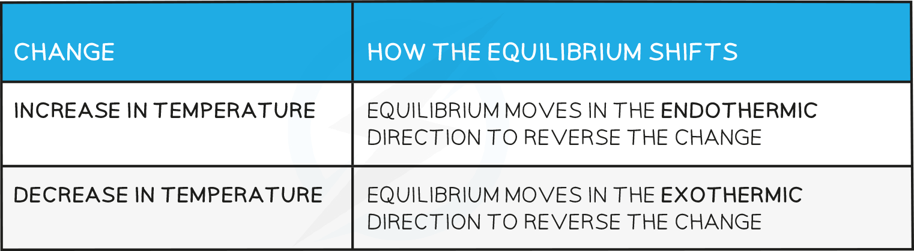

## Temperature & the Equilibrium Constant

* Changes in temperature **change**the equilibrium constants *K**c*and *K**p*
* For an endothermic reaction such as:

   An increase in temperature:

   [H2] and [I2] **increases**

   [HI] **decreases**

   Because [H2] and [I2] are **increasing** and [HI] is **decreasing**, the equilibrium constant **increases**

* For an exothermic reaction such as:

   An increase in temperature:

   [SO3] **decreases**

   [SO2] and [O2] **increases**

   Because [SO3] **decreases** and [SO2] and [O2] **increases**the equilibrium constant  decreases

#### Worked Example

**Factors which increase** ***K******p*****value:**

What will increase the value of Kp of the following equilibrium?

2A (g) + B (g)  ⇌  2C (g)       ΔH = +6.5 kJ mol-1

**Answer**

* Only temperature changes permanently affect the value of *K**p*

  + An increase in temperature shifts the reaction in favour of the products.
  + The [ products ] increases and [ reactants ] decreases, therefore, the *K**p* value increases.

## Temperature & the Equilibrium Position

* How the equilibrium shifts with temperature changes:

**Effect on the value of the equilibrium constant**

* For a reaction that is exothermic in the forward direction, increasing the temperature pushes the equilibrium from right to left
* Therefore, the value of the equilibrium constantwill decrease as the ratio of [ products ] to [ reactants ] decreases
* Conversely, if the temperature is raised in an endothermic reaction, the value of the equilibrium constantwill increase

## Changing Reaction Conditions

* If all other conditions stay the same, the equilibrium constant*K**c* is **not affected** by any changes in concentration of the reactants or products
* For example, the decomposition of hydrogen iodide:

**2HI ⇌ H****2****+ I****2**

   The equilibrium expression is:

   Adding more HI makes the ratio of [ products ] to [ reactants ] smaller

To restore equilibrium, [H2] and [I2] increases and [HI] decreases

Equilibrium is restored when the ratio is 6.25 x 10-3 again

#### Changes in pressure

* A change in pressure **only**changes the **position** **of the equilibrium**
* If all other conditions stay the same, the equilibrium constant*K**c* is **not affected**by any changes in pressure of the reactants and products
* The value of *K**p*is not affected by any changes in pressure.
* Changes in pressure cause a shift in the position of equilibrium to a new position which restores the value of *K**p*
* This is analogous to what happens to *K**c*when you change concentration in an aqueous equilibrium; a shift restores equilibrium to a new position maintaining *K**c*

#### Presence of a catalyst

* If all other conditions stay the same, the equilibrium constants*K**p*and *K**c* are **not affected**by the presence of a catalyst
* A catalyst speeds up both the forward and reverse reactions at the same rate so the ratio of  [ products ] to [ reactants ] remains unchanged
* Catalysts only cause a reaction to reach equilibrium **faster**
* Catalysts, therefore, have **no effect**on the **position of the equilibrium**once this is reached

#### Worked Example

Hydrogen iodide is formed in the gas phase by the reaction of hydrogen and iodine:

H2 (g) + I2 (g)![rightwards harpoon over leftwards harpoon](data:image/svg+xml;charset=utf8,%3Csvg%20xmlns%3D%22http%3A%2F%2Fwww.w3.org%2F2000%2Fsvg%22%20xmlns%3Awrs%3D%22http%3A%2F%2Fwww.wiris.com%2Fxml%2Fmathml-extension%22%20height%3D%2219%22%20width%3D%2221%22%20wrs%3Abaseline%3D%2216%22%3E%3C!--MathML%3A%20%3Cmath%20xmlns%3D%22http%3A%2F%2Fwww.w3.org%2F1998%2FMath%2FMathML%22%20class%3D%22wrs_chemistry%22%3E%3Cmo%3E%26%23x21CC%3B%3C%2Fmo%3E%3C%2Fmath%3E--%3E%3Cdefs%3E%3Cstyle%20type%3D%22text%2Fcss%22%3E%40font-face%7Bfont-family%3A'math1aa495e18c7e3a21a4e48923b92'%3Bsrc%3Aurl(data%3Afont%2Ftruetype%3Bcharset%3Dutf-8%3Bbase64%2CAAEAAAAMAIAAAwBAT1MvMi7iBBMAAADMAAAATmNtYXDEvmKUAAABHAAAADRjdnQgDVUNBwAAAVAAAAA6Z2x5ZoPi2VsAAAGMAAAAmGhlYWQQC2qxAAACJAAAADZoaGVhCGsXSAAAAlwAAAAkaG10eE2rRkcAAAKAAAAACGxvY2EAHTwYAAACiAAAAAxtYXhwBT0FPgAAApQAAAAgbmFtZaBxlY4AAAK0AAABn3Bvc3QB9wD6AAAEVAAAACBwcmVwa1uragAABHQAAAAUAAADSwGQAAUAAAQABAAAAAAABAAEAAAAAAAAAQEAAAAAAAAAAAAAAAAAAAAAAAAAAAAAAAAAAAAAACAgICAAAAAg1UADev96AAAD6ACWAAAAAAACAAEAAQAAABQAAwABAAAAFAAEACAAAAAEAAQAAQAAIcz%2F%2FwAAIcz%2F%2F941AAEAAAAAAAABVAMsAIABAABWACoCWAIeAQ4BLAIsAFoBgAKAAKAA1ACAAAAAAAAAACsAVQCAAKsA1QEAASsABwAAAAIAVQAAAwADqwADAAcAADMRIRElIREhVQKr%2FasCAP4AA6v8VVUDAAACAIAAAAOAAv8ABgANADUYAbAPELAE1LAOELAA1LAPELAH1LAOELAI1ACwDhCwANSwABCwBtSwBhCwB9SwBxCwDdQwMRMhJzUFFSEBIRUFNSchgAIrVgEr%2FQADAP0AAStVAioCVUBqv0D%2FAEDAa0AAAQAAAAEAANV4zkFfDzz1AAMEAP%2F%2F%2F%2F%2FWOhNz%2F%2F%2F%2F%2F9Y6E3MAAP8gBIADqwAAAAoAAgABAAAAAAABAAAD6P9qAAAXcAAA%2F7YEgAABAAAAAAAAAAAAAAAAAAAAAgNSAFUEAACAAAAAAAAAACgAAACYAAEAAAACAF4ABQAAAAAAAgCABAAAAAAABAAA3gAAAAAAAAAVAQIAAAAAAAAAAQASAAAAAAAAAAAAAgAOABIAAAAAAAAAAwAwACAAAAAAAAAABAASAFAAAAAAAAAABQAWAGIAAAAAAAAABgAJAHgAAAAAAAAACAAcAIEAAQAAAAAAAQASAAAAAQAAAAAAAgAOABIAAQAAAAAAAwAwACAAAQAAAAAABAASAFAAAQAAAAAABQAWAGIAAQAAAAAABgAJAHgAAQAAAAAACAAcAIEAAwABBAkAAQASAAAAAwABBAkAAgAOABIAAwABBAkAAwAwACAAAwABBAkABAASAFAAAwABBAkABQAWAGIAAwABBAkABgAJAHgAAwABBAkACAAcAIEATQBhAHQAaAAgAEYAbwBuAHQAUgBlAGcAdQBsAGEAcgBNAGEAdABoAHMAIABGAG8AcgAgAE0AbwByAGUAIABNAGEAdABoACAARgBvAG4AdABNAGEAdABoACAARgBvAG4AdABWAGUAcgBzAGkAbwBuACAAMQAuADBNYXRoX0ZvbnQATQBhAHQAaABzACAARgBvAHIAIABNAG8AcgBlAAADAAAAAAAAAfQA%2BgAAAAAAAAAAAAAAAAAAAAAAAAAAuQcRAACNhRgAsgAAABUUE7EAAT8%3D)format('truetype')%3Bfont-weight%3Anormal%3Bfont-style%3Anormal%3B%7D%3C%2Fstyle%3E%3C%2Fdefs%3E%3Ctext%20font-family%3D%22math1aa495e18c7e3a21a4e48923b92%22%20font-size%3D%2216%22%20text-anchor%3D%22middle%22%20x%3D%2210.5%22%20y%3D%2216%22%3E%26%23x21CC%3B%3C%2Ftext%3E%3C%2Fsvg%3E)2HI (g)

The equilibrium constants at two different temperatures are related by the following expression:

![ln open square brackets K subscript 2 over K subscript 1 close square brackets equals fraction numerator increment H over denominator R end fraction open square brackets 1 over T subscript 1 minus 1 over T subscript 2 close square brackets](data:image/svg+xml;charset=utf8,%3Csvg%20xmlns%3D%22http%3A%2F%2Fwww.w3.org%2F2000%2Fsvg%22%20xmlns%3Awrs%3D%22http%3A%2F%2Fwww.wiris.com%2Fxml%2Fmathml-extension%22%20height%3D%2245%22%20width%3D%22163%22%20wrs%3Abaseline%3D%2227%22%3E%3C!--MathML%3A%20%3Cmath%20xmlns%3D%22http%3A%2F%2Fwww.w3.org%2F1998%2FMath%2FMathML%22%20class%3D%22wrs_chemistry%22%20style%3D%22font-family%3AArial%22%3E%3Cmstyle%20mathsize%3D%2214px%22%3E%3Cmi%3Eln%3C%2Fmi%3E%3Cmfenced%20close%3D%22%5D%22%20open%3D%22%5B%22%3E%3Cmfrac%3E%3Cmsub%3E%3Cmi%3EK%3C%2Fmi%3E%3Cmn%3E2%3C%2Fmn%3E%3C%2Fmsub%3E%3Cmsub%3E%3Cmi%3EK%3C%2Fmi%3E%3Cmn%3E1%3C%2Fmn%3E%3C%2Fmsub%3E%3C%2Fmfrac%3E%3C%2Fmfenced%3E%3Cmo%3E%3D%3C%2Fmo%3E%3Cmfrac%3E%3Cmrow%3E%3Cmo%3E%26%23x2206%3B%3C%2Fmo%3E%3Cmi%3EH%3C%2Fmi%3E%3C%2Fmrow%3E%3Cmi%3ER%3C%2Fmi%3E%3C%2Fmfrac%3E%3Cmfenced%20close%3D%22%5D%22%20open%3D%22%5B%22%3E%3Cmrow%3E%3Cmfrac%3E%3Cmn%3E1%3C%2Fmn%3E%3Cmsub%3E%3Cmi%3ET%3C%2Fmi%3E%3Cmn%3E1%3C%2Fmn%3E%3C%2Fmsub%3E%3C%2Fmfrac%3E%3Cmo%3E-%3C%2Fmo%3E%3Cmfrac%3E%3Cmn%3E1%3C%2Fmn%3E%3Cmsub%3E%3Cmi%3ET%3C%2Fmi%3E%3Cmn%3E2%3C%2Fmn%3E%3C%2Fmsub%3E%3C%2Fmfrac%3E%3C%2Fmrow%3E%3C%2Fmfenced%3E%3C%2Fmstyle%3E%3C%2Fmath%3E--%3E%3Cdefs%3E%3Cstyle%20type%3D%22text%2Fcss%22%3E%40font-face%7Bfont-family%3A'math1e120e52ad41b526956171af3df'%3Bsrc%3Aurl(data%3Afont%2Ftruetype%3Bcharset%3Dutf-8%3Bbase64%2CAAEAAAAMAIAAAwBAT1MvMi7iBBMAAADMAAAATmNtYXDEvmKUAAABHAAAAERjdnQgDVUNBwAAAWAAAAA6Z2x5ZoPi2VsAAAGcAAABoWhlYWQQC2qxAAADQAAAADZoaGVhCGsXSAAAA3gAAAAkaG10eE2rRkcAAAOcAAAAEGxvY2EAHTwYAAADrAAAABRtYXhwBT0FPgAAA8AAAAAgbmFtZaBxlY4AAAPgAAABn3Bvc3QB9wD6AAAFgAAAACBwcmVwa1uragAABaAAAAAUAAADSwGQAAUAAAQABAAAAAAABAAEAAAAAAAAAQEAAAAAAAAAAAAAAAAAAAAAAAAAAAAAAAAAAAAAACAgICAAAAAg1UADev96AAAD6ACWAAAAAAACAAEAAQAAABQAAwABAAAAFAAEADAAAAAIAAgAAgAAAD0iBiIS%2F%2F8AAAA9IgYiEv%2F%2F%2F8Td%2FN3xAAEAAAAAAAAAAAAAAVQDLACAAQAAVgAqAlgCHgEOASwCLABaAYACgACgANQAgAAAAAAAAAArAFUAgACrANUBAAErAAcAAAACAFUAAAMAA6sAAwAHAAAzESERJSERIVUCq%2F2rAgD%2BAAOr%2FFVVAwAAAgCAAOsC1QIVAAMABwBlGAGwCBCwBtSwBhCwBdSwCBCwAdSwARCwANSwBhCwBzywBRCwBDywARCwAjywABCwAzwAsAgQsAbUsAYQsAfUsAcQsAHUsAEQsALUsAYQsAU8sAcQsAQ8sAEQsAA8sAIQsAM8MTATITUhHQEhNYACVf2rAlUBwFXVVVUAAwBVAAADAQMAAAMABwALAGsYAbAMELAA1LAAELAD1LADELAC1LAAELAB1LACELAGPLAGELAH1LAGELAF1LAFELAE1LABELAKPLAEELALPLAFELAN1ACwDBCwA9SwAxCwBjywAxCwANSwABCwCjywABCwBDywChCwCdQwMTM3ASMBFwEjASEVIVVWASpWAS1V%2FtZWASr%2BAAIAAQL%2F%2FQEBAwD9VVUAAQCAAVUC1QGrAAMAMBgBsAQQsQAD9rADPLECB%2FWwATyxBQPmALEAABMQsQAG5bEAARMQsAE8sQMF9bACPBMhFSGAAlX9qwGrVgAAAAABAAAAAQAA1XjOQV8PPPUAAwQA%2F%2F%2F%2F%2F9Y6E3P%2F%2F%2F%2F%2F1joTcwAA%2FyAEgAOrAAAACgACAAEAAAAAAAEAAAPo%2F2oAABdwAAD%2FtgSAAAEAAAAAAAAAAAAAAAAAAAAEA1IAVQNWAIADVwBVA1YAgAAAAAAAAAAoAAAAsgAAAVcAAAGhAAEAAAAEAF4ABQAAAAAAAgCABAAAAAAABAAA3gAAAAAAAAAVAQIAAAAAAAAAAQASAAAAAAAAAAAAAgAOABIAAAAAAAAAAwAwACAAAAAAAAAABAASAFAAAAAAAAAABQAWAGIAAAAAAAAABgAJAHgAAAAAAAAACAAcAIEAAQAAAAAAAQASAAAAAQAAAAAAAgAOABIAAQAAAAAAAwAwACAAAQAAAAAABAASAFAAAQAAAAAABQAWAGIAAQAAAAAABgAJAHgAAQAAAAAACAAcAIEAAwABBAkAAQASAAAAAwABBAkAAgAOABIAAwABBAkAAwAwACAAAwABBAkABAASAFAAAwABBAkABQAWAGIAAwABBAkABgAJAHgAAwABBAkACAAcAIEATQBhAHQAaAAgAEYAbwBuAHQAUgBlAGcAdQBsAGEAcgBNAGEAdABoAHMAIABGAG8AcgAgAE0AbwByAGUAIABNAGEAdABoACAARgBvAG4AdABNAGEAdABoACAARgBvAG4AdABWAGUAcgBzAGkAbwBuACAAMQAuADBNYXRoX0ZvbnQATQBhAHQAaABzACAARgBvAHIAIABNAG8AcgBlAAADAAAAAAAAAfQA%2BgAAAAAAAAAAAAAAAAAAAAAAAAAAuQcRAACNhRgAsgAAABUUE7EAAT8%3D)format('truetype')%3Bfont-weight%3Anormal%3Bfont-style%3Anormal%3B%7D%40font-face%7Bfont-family%3A'brackets4e06b854ad106cdec1d8cc9'%3Bsrc%3Aurl(data%3Afont%2Ftruetype%3Bcharset%3Dutf-8%3Bbase64%2CAAEAAAAMAIAAAwBAT1MvMi7RIisAAADMAAAATmNtYXBi7uzYAAABHAAAAFxjdnQgBAkDLgAAAXgAAAASZ2x5Zo64f%2BkAAAGMAAABi2hlYWQLniGcAAADGAAAADZoaGVhBK4XLAAAA1AAAAAkaG10eCWq%2F90AAAN0AAAAHGxvY2EAABknAAADkAAAACBtYXhwBJIESAAAA7AAAAAgbmFtZRAA8I4AAAPQAAAB3nBvc3QBwwDgAAAFsAAAACBwcmVwupWEAAAABdAAAAAHAAACggGQAAUAAAQABAAAAAAABAAEAAAAAAAAAQEAAAAAAAAAAAAAAAAAAAAAAAAAAAAAAAAAAAAAACAgICAAAAAg9AMEAAAAAAADgAAAAAAAAAACAAEAAQAAABQAAwABAAAAFAAEAEgAAAAOAAgAAgAGI6EjoiOjI6QjpSOm%2F%2F8AACOhI6IjoyOkI6Ujpv%2F%2F3GDcYNxg3GDcYNxgAAEAAAAAAAAAAAAAAAAAAAAAAVQAVgEAACwAqAOAADIABwAAAAIAAAAqANUDVQADAAcAADUzESMTIxEz1dWrgIAqAyv9AALVAAEAAAAAAVUDgAAFAB8YAbEAAD%2BwBjyxBAL9sALFALEAAD%2BxAgY%2FsQQC7TEwMREhFSERAVX%2FAAOAVfzVAAEAAAAAAFUDgAADAB8YAbADL7AAPLECAvWwATwAsQMAP7ACPHyxAAb1sAE8ETMRI1VVA4D8gAABAAAAAAFVA4AABQAhGAGxAAA%2FsAY8sQQC%2FbACxQB8sQAGPxixAgb2sQQC7TEwGQEhNSERAVX%2FAAOA%2FIBVAysAAf%2FXAAABLAOAAAUAHhgBsAEvsAc8sQUC%2FbADxQCxAQA%2FsQMGP7EFAu0xMDsBESEVIddV%2FqsBAAOAVQABANcAAAEsA4AAAwAhGAGwAS%2BxBwI8PLEDAvWwADwAsQMAP7ACPHyxAAb1sAE8EzMRI9dVVQOA%2FIAAAf%2FXAAABLAOAAAUAIBgBsAEvsAc8sQUC%2FbADxQB8sQEGPxixAwb2sQUC7TEwEzMRITUh11X%2BqwEAA4D8gFUAAAEAAAABAAB65NymXw889QADBAD%2F%2F%2F%2F%2F1a3ujv%2F%2F%2F%2F%2FVre6O%2F6wAAAGAA4AAAAAKAAIAAQAAAAAAAQAAA4AAAAAAF3D%2FrP%2BsAYAAAQAAAAAAAAAAAAAAAAAAAAcA1QAAASwAAAEsAAABLAAAASz%2F1wEsANcBLP%2FXAAAAAAAAACQAAABgAAAAlwAAANcAAAESAAABTAAAAYsAAQAAAAcACAACAAAAAAACAIAEAAAAAAAEAAA%2BAAAAAAAAABUBAgAAAAAAAAABACQAAAAAAAAAAAACAA4AJAAAAAAAAAADAEIAMgAAAAAAAAAEACQAdAAAAAAAAAAFABYAmAAAAAAAAAAGABIArgAAAAAAAAAIABwAwAABAAAAAAABACQAAAABAAAAAAACAA4AJAABAAAAAAADAEIAMgABAAAAAAAEACQAdAABAAAAAAAFABYAmAABAAAAAAAGABIArgABAAAAAAAIABwAwAADAAEECQABACQAAAADAAEECQACAA4AJAADAAEECQADAEIAMgADAAEECQAEACQAdAADAAEECQAFABYAmAADAAEECQAGABIArgADAAEECQAIABwAwABCAHIAYQBjAGsAZQB0AHMAIABmAHUAbABsACAAcwBpAHoAZQBSAGUAZwB1AGwAYQByAE0AYQB0AGgAcwAgAEYAbwByACAATQBvAHIAZQAgAEIAcgBhAGMAawBlAHQAcwAgAGYAdQBsAGwAIABzAGkAegBlAEIAcgBhAGMAawBlAHQAcwAgAGYAdQBsAGwAIABzAGkAegBlAFYAZQByAHMAaQBvAG4AIAAyAC4AMEJyYWNrZXRzX2Z1bGxfc2l6ZQBNAGEAdABoAHMAIABGAG8AcgAgAE0AbwByAGUAAAADAAAAAAAAAcAA4AAAAAAAAAAAAAAAAAAAAAAAAAAAuQf%2FAAGNhQA%3D)format('truetype')%3Bfont-weight%3Anormal%3Bfont-style%3Anormal%3B%7D%3C%2Fstyle%3E%3C%2Fdefs%3E%3Ctext%20font-family%3D%22Arial%22%20font-size%3D%2214%22%20text-anchor%3D%22middle%22%20x%3D%225.5%22%20y%3D%2227%22%3Eln%3C%2Ftext%3E%3Ctext%20font-family%3D%22brackets4e06b854ad106cdec1d8cc9%22%20font-size%3D%2214%22%20text-anchor%3D%22start%22%20x%3D%2212.5%22%20y%3D%2217%22%3E%26%23x23A1%3B%3C%2Ftext%3E%3Ctext%20font-family%3D%22brackets4e06b854ad106cdec1d8cc9%22%20font-size%3D%2214%22%20text-anchor%3D%22start%22%20x%3D%2212.5%22%20y%3D%2229%22%3E%26%23x23A2%3B%3C%2Ftext%3E%3Ctext%20font-family%3D%22brackets4e06b854ad106cdec1d8cc9%22%20font-size%3D%2214%22%20text-anchor%3D%22start%22%20x%3D%2212.5%22%20y%3D%2241%22%3E%26%23x23A3%3B%3C%2Ftext%3E%3Ctext%20font-family%3D%22brackets4e06b854ad106cdec1d8cc9%22%20font-size%3D%2214%22%20text-anchor%3D%22start%22%20x%3D%2240.5%22%20y%3D%2217%22%3E%26%23x23A4%3B%3C%2Ftext%3E%3Ctext%20font-family%3D%22brackets4e06b854ad106cdec1d8cc9%22%20font-size%3D%2214%22%20text-anchor%3D%22start%22%20x%3D%2240.5%22%20y%3D%2229%22%3E%26%23x23A5%3B%3C%2Ftext%3E%3Ctext%20font-family%3D%22brackets4e06b854ad106cdec1d8cc9%22%20font-size%3D%2214%22%20text-anchor%3D%22start%22%20x%3D%2240.5%22%20y%3D%2241%22%3E%26%23x23A6%3B%3C%2Ftext%3E%3Cline%20stroke%3D%22%23000%22%20stroke-linecap%3D%22square%22%20stroke-width%3D%221%22%20x1%3D%2219.5%22%20x2%3D%2236.5%22%20y1%3D%2222.5%22%20y2%3D%2222.5%22%2F%3E%3Ctext%20font-family%3D%22Arial%22%20font-size%3D%2214%22%20font-style%3D%22italic%22%20text-anchor%3D%22middle%22%20x%3D%2224.5%22%20y%3D%2213%22%3EK%3C%2Ftext%3E%3Ctext%20font-family%3D%22Arial%22%20font-size%3D%2210%22%20text-anchor%3D%22middle%22%20x%3D%2233.5%22%20y%3D%2217%22%3E2%3C%2Ftext%3E%3Ctext%20font-family%3D%22Arial%22%20font-size%3D%2214%22%20font-style%3D%22italic%22%20text-anchor%3D%22middle%22%20x%3D%2224.5%22%20y%3D%2237%22%3EK%3C%2Ftext%3E%3Ctext%20font-family%3D%22Arial%22%20font-size%3D%2210%22%20text-anchor%3D%22middle%22%20x%3D%2233.5%22%20y%3D%2241%22%3E1%3C%2Ftext%3E%3Ctext%20font-family%3D%22math1e120e52ad41b526956171af3df%22%20font-size%3D%2214%22%20text-anchor%3D%22middle%22%20x%3D%2253.5%22%20y%3D%2227%22%3E%3D%3C%2Ftext%3E%3Cline%20stroke%3D%22%23000%22%20stroke-linecap%3D%22square%22%20stroke-width%3D%221%22%20x1%3D%2263.5%22%20x2%3D%2289.5%22%20y1%3D%2222.5%22%20y2%3D%2222.5%22%2F%3E%3Ctext%20font-family%3D%22math1e120e52ad41b526956171af3df%22%20font-size%3D%2214%22%20text-anchor%3D%22middle%22%20x%3D%2271.5%22%20y%3D%2217%22%3E%26%23x2206%3B%3C%2Ftext%3E%3Ctext%20font-family%3D%22Arial%22%20font-size%3D%2214%22%20font-style%3D%22italic%22%20text-anchor%3D%22middle%22%20x%3D%2283.5%22%20y%3D%2217%22%3EH%3C%2Ftext%3E%3Ctext%20font-family%3D%22Arial%22%20font-size%3D%2214%22%20font-style%3D%22italic%22%20text-anchor%3D%22middle%22%20x%3D%2276.5%22%20y%3D%2237%22%3ER%3C%2Ftext%3E%3Ctext%20font-family%3D%22brackets4e06b854ad106cdec1d8cc9%22%20font-size%3D%2214%22%20text-anchor%3D%22start%22%20x%3D%2293.5%22%20y%3D%2219%22%3E%26%23x23A1%3B%3C%2Ftext%3E%3Ctext%20font-family%3D%22brackets4e06b854ad106cdec1d8cc9%22%20font-size%3D%2214%22%20text-anchor%3D%22start%22%20x%3D%2293.5%22%20y%3D%2231%22%3E%26%23x23A2%3B%3C%2Ftext%3E%3Ctext%20font-family%3D%22brackets4e06b854ad106cdec1d8cc9%22%20font-size%3D%2214%22%20text-anchor%3D%22start%22%20x%3D%2293.5%22%20y%3D%2243%22%3E%26%23x23A3%3B%3C%2Ftext%3E%3Ctext%20font-family%3D%22brackets4e06b854ad106cdec1d8cc9%22%20font-size%3D%2214%22%20text-anchor%3D%22start%22%20x%3D%22157.5%22%20y%3D%2219%22%3E%26%23x23A4%3B%3C%2Ftext%3E%3Ctext%20font-family%3D%22brackets4e06b854ad106cdec1d8cc9%22%20font-size%3D%2214%22%20text-anchor%3D%22start%22%20x%3D%22157.5%22%20y%3D%2231%22%3E%26%23x23A5%3B%3C%2Ftext%3E%3Ctext%20font-family%3D%22brackets4e06b854ad106cdec1d8cc9%22%20font-size%3D%2214%22%20text-anchor%3D%22start%22%20x%3D%22157.5%22%20y%3D%2243%22%3E%26%23x23A6%3B%3C%2Ftext%3E%3Cline%20stroke%3D%22%23000%22%20stroke-linecap%3D%22square%22%20stroke-width%3D%221%22%20x1%3D%22100.5%22%20x2%3D%22117.5%22%20y1%3D%2222.5%22%20y2%3D%2222.5%22%2F%3E%3Ctext%20font-family%3D%22Arial%22%20font-size%3D%2214%22%20text-anchor%3D%22middle%22%20x%3D%22109.5%22%20y%3D%2217%22%3E1%3C%2Ftext%3E%3Ctext%20font-family%3D%22Arial%22%20font-size%3D%2214%22%20font-style%3D%22italic%22%20text-anchor%3D%22middle%22%20x%3D%22105.5%22%20y%3D%2237%22%3ET%3C%2Ftext%3E%3Ctext%20font-family%3D%22Arial%22%20font-size%3D%2210%22%20text-anchor%3D%22middle%22%20x%3D%22114.5%22%20y%3D%2241%22%3E1%3C%2Ftext%3E%3Ctext%20font-family%3D%22math1e120e52ad41b526956171af3df%22%20font-size%3D%2214%22%20text-anchor%3D%22middle%22%20x%3D%22127.5%22%20y%3D%2227%22%3E%26%23x2212%3B%3C%2Ftext%3E%3Cline%20stroke%3D%22%23000%22%20stroke-linecap%3D%22square%22%20stroke-width%3D%221%22%20x1%3D%22136.5%22%20x2%3D%22153.5%22%20y1%3D%2222.5%22%20y2%3D%2222.5%22%2F%3E%3Ctext%20font-family%3D%22Arial%22%20font-size%3D%2214%22%20text-anchor%3D%22middle%22%20x%3D%22145.5%22%20y%3D%2217%22%3E1%3C%2Ftext%3E%3Ctext%20font-family%3D%22Arial%22%20font-size%3D%2214%22%20font-style%3D%22italic%22%20text-anchor%3D%22middle%22%20x%3D%22141.5%22%20y%3D%2237%22%3ET%3C%2Ftext%3E%3Ctext%20font-family%3D%22Arial%22%20font-size%3D%2210%22%20text-anchor%3D%22middle%22%20x%3D%22150.5%22%20y%3D%2241%22%3E2%3C%2Ftext%3E%3C%2Fsvg%3E)

At 763 K, the equilibrium constant *K*1 is 45.9. The enthalpy change for the reaction is Δ*H* = -26 500 J mol-1.

Calculate the value of the equilibrium constant *K*2 for this reaction at 718 K.  [Use the value of R= 8.31 J mol-1 K-1]

**Answer:**

![Error converting from MathML to accessible text.](data:image/svg+xml;charset=utf8,%3Csvg%20xmlns%3D%22http%3A%2F%2Fwww.w3.org%2F2000%2Fsvg%22%20xmlns%3Awrs%3D%22http%3A%2F%2Fwww.wiris.com%2Fxml%2Fmathml-extension%22%20height%3D%2245%22%20width%3D%22165%22%20wrs%3Abaseline%3D%2227%22%3E%3C!--MathML%3A%20%3Cmath%20xmlns%3D%22http%3A%2F%2Fwww.w3.org%2F1998%2FMath%2FMathML%22%20class%3D%22wrs_chemistry%22%20style%3D%22font-family%3AArial%22%3E%3Cmi%20mathsize%3D%2214px%22%3Eln%3C%2Fmi%3E%3Cmstyle%20mathsize%3D%2214px%22%3E%3Cmo%20stretchy%3D%22true%22%3E%5B%3C%2Fmo%3E%3Cmfrac%3E%3Cmsub%3E%3Cmi%3EK%3C%2Fmi%3E%3Cmn%3E2%3C%2Fmn%3E%3C%2Fmsub%3E%3Cmsub%3E%3Cmi%3EK%3C%2Fmi%3E%3Cmn%3E1%3C%2Fmn%3E%3C%2Fmsub%3E%3C%2Fmfrac%3E%3Cmo%20stretchy%3D%22true%22%3E%5D%3C%2Fmo%3E%3C%2Fmstyle%3E%3Cmo%20mathsize%3D%2214px%22%3E%3D%3C%2Fmo%3E%3Cmfrac%3E%3Cmrow%3E%3Cmo%20mathsize%3D%2214px%22%3E%26%23x2206%3B%3C%2Fmo%3E%3Cmi%20mathsize%3D%2214px%22%3EH%3C%2Fmi%3E%3C%2Fmrow%3E%3Cmi%20mathsize%3D%2214px%22%3ER%3C%2Fmi%3E%3C%2Fmfrac%3E%3Cmstyle%20mathsize%3D%2214px%22%3E%3Cmo%20stretchy%3D%22true%22%3E%5B%3C%2Fmo%3E%3Cmfrac%3E%3Cmn%3E1%3C%2Fmn%3E%3Cmsub%3E%3Cmi%3ET%3C%2Fmi%3E%3Cmn%3E1%3C%2Fmn%3E%3C%2Fmsub%3E%3C%2Fmfrac%3E%3Cmo%3E-%3C%2Fmo%3E%3Cmfrac%3E%3Cmn%3E1%3C%2Fmn%3E%3Cmsub%3E%3Cmi%3ET%3C%2Fmi%3E%3Cmn%3E2%3C%2Fmn%3E%3C%2Fmsub%3E%3C%2Fmfrac%3E%3Cmo%20stretchy%3D%22true%22%3E%5D%3C%2Fmo%3E%3C%2Fmstyle%3E%3C%2Fmath%3E--%3E%3Cdefs%3E%3Cstyle%20type%3D%22text%2Fcss%22%3E%40font-face%7Bfont-family%3A'math1e120e52ad41b526956171af3df'%3Bsrc%3Aurl(data%3Afont%2Ftruetype%3Bcharset%3Dutf-8%3Bbase64%2CAAEAAAAMAIAAAwBAT1MvMi7iBBMAAADMAAAATmNtYXDEvmKUAAABHAAAAERjdnQgDVUNBwAAAWAAAAA6Z2x5ZoPi2VsAAAGcAAABoWhlYWQQC2qxAAADQAAAADZoaGVhCGsXSAAAA3gAAAAkaG10eE2rRkcAAAOcAAAAEGxvY2EAHTwYAAADrAAAABRtYXhwBT0FPgAAA8AAAAAgbmFtZaBxlY4AAAPgAAABn3Bvc3QB9wD6AAAFgAAAACBwcmVwa1uragAABaAAAAAUAAADSwGQAAUAAAQABAAAAAAABAAEAAAAAAAAAQEAAAAAAAAAAAAAAAAAAAAAAAAAAAAAAAAAAAAAACAgICAAAAAg1UADev96AAAD6ACWAAAAAAACAAEAAQAAABQAAwABAAAAFAAEADAAAAAIAAgAAgAAAD0iBiIS%2F%2F8AAAA9IgYiEv%2F%2F%2F8Td%2FN3xAAEAAAAAAAAAAAAAAVQDLACAAQAAVgAqAlgCHgEOASwCLABaAYACgACgANQAgAAAAAAAAAArAFUAgACrANUBAAErAAcAAAACAFUAAAMAA6sAAwAHAAAzESERJSERIVUCq%2F2rAgD%2BAAOr%2FFVVAwAAAgCAAOsC1QIVAAMABwBlGAGwCBCwBtSwBhCwBdSwCBCwAdSwARCwANSwBhCwBzywBRCwBDywARCwAjywABCwAzwAsAgQsAbUsAYQsAfUsAcQsAHUsAEQsALUsAYQsAU8sAcQsAQ8sAEQsAA8sAIQsAM8MTATITUhHQEhNYACVf2rAlUBwFXVVVUAAwBVAAADAQMAAAMABwALAGsYAbAMELAA1LAAELAD1LADELAC1LAAELAB1LACELAGPLAGELAH1LAGELAF1LAFELAE1LABELAKPLAEELALPLAFELAN1ACwDBCwA9SwAxCwBjywAxCwANSwABCwCjywABCwBDywChCwCdQwMTM3ASMBFwEjASEVIVVWASpWAS1V%2FtZWASr%2BAAIAAQL%2F%2FQEBAwD9VVUAAQCAAVUC1QGrAAMAMBgBsAQQsQAD9rADPLECB%2FWwATyxBQPmALEAABMQsQAG5bEAARMQsAE8sQMF9bACPBMhFSGAAlX9qwGrVgAAAAABAAAAAQAA1XjOQV8PPPUAAwQA%2F%2F%2F%2F%2F9Y6E3P%2F%2F%2F%2F%2F1joTcwAA%2FyAEgAOrAAAACgACAAEAAAAAAAEAAAPo%2F2oAABdwAAD%2FtgSAAAEAAAAAAAAAAAAAAAAAAAAEA1IAVQNWAIADVwBVA1YAgAAAAAAAAAAoAAAAsgAAAVcAAAGhAAEAAAAEAF4ABQAAAAAAAgCABAAAAAAABAAA3gAAAAAAAAAVAQIAAAAAAAAAAQASAAAAAAAAAAAAAgAOABIAAAAAAAAAAwAwACAAAAAAAAAABAASAFAAAAAAAAAABQAWAGIAAAAAAAAABgAJAHgAAAAAAAAACAAcAIEAAQAAAAAAAQASAAAAAQAAAAAAAgAOABIAAQAAAAAAAwAwACAAAQAAAAAABAASAFAAAQAAAAAABQAWAGIAAQAAAAAABgAJAHgAAQAAAAAACAAcAIEAAwABBAkAAQASAAAAAwABBAkAAgAOABIAAwABBAkAAwAwACAAAwABBAkABAASAFAAAwABBAkABQAWAGIAAwABBAkABgAJAHgAAwABBAkACAAcAIEATQBhAHQAaAAgAEYAbwBuAHQAUgBlAGcAdQBsAGEAcgBNAGEAdABoAHMAIABGAG8AcgAgAE0AbwByAGUAIABNAGEAdABoACAARgBvAG4AdABNAGEAdABoACAARgBvAG4AdABWAGUAcgBzAGkAbwBuACAAMQAuADBNYXRoX0ZvbnQATQBhAHQAaABzACAARgBvAHIAIABNAG8AcgBlAAADAAAAAAAAAfQA%2BgAAAAAAAAAAAAAAAAAAAAAAAAAAuQcRAACNhRgAsgAAABUUE7EAAT8%3D)format('truetype')%3Bfont-weight%3Anormal%3Bfont-style%3Anormal%3B%7D%40font-face%7Bfont-family%3A'brackets4e06b854ad106cdec1d8cc9'%3Bsrc%3Aurl(data%3Afont%2Ftruetype%3Bcharset%3Dutf-8%3Bbase64%2CAAEAAAAMAIAAAwBAT1MvMi7RIisAAADMAAAATmNtYXBi7uzYAAABHAAAAFxjdnQgBAkDLgAAAXgAAAASZ2x5Zo64f%2BkAAAGMAAABi2hlYWQLniGcAAADGAAAADZoaGVhBK4XLAAAA1AAAAAkaG10eCWq%2F90AAAN0AAAAHGxvY2EAABknAAADkAAAACBtYXhwBJIESAAAA7AAAAAgbmFtZRAA8I4AAAPQAAAB3nBvc3QBwwDgAAAFsAAAACBwcmVwupWEAAAABdAAAAAHAAACggGQAAUAAAQABAAAAAAABAAEAAAAAAAAAQEAAAAAAAAAAAAAAAAAAAAAAAAAAAAAAAAAAAAAACAgICAAAAAg9AMEAAAAAAADgAAAAAAAAAACAAEAAQAAABQAAwABAAAAFAAEAEgAAAAOAAgAAgAGI6EjoiOjI6QjpSOm%2F%2F8AACOhI6IjoyOkI6Ujpv%2F%2F3GDcYNxg3GDcYNxgAAEAAAAAAAAAAAAAAAAAAAAAAVQAVgEAACwAqAOAADIABwAAAAIAAAAqANUDVQADAAcAADUzESMTIxEz1dWrgIAqAyv9AALVAAEAAAAAAVUDgAAFAB8YAbEAAD%2BwBjyxBAL9sALFALEAAD%2BxAgY%2FsQQC7TEwMREhFSERAVX%2FAAOAVfzVAAEAAAAAAFUDgAADAB8YAbADL7AAPLECAvWwATwAsQMAP7ACPHyxAAb1sAE8ETMRI1VVA4D8gAABAAAAAAFVA4AABQAhGAGxAAA%2FsAY8sQQC%2FbACxQB8sQAGPxixAgb2sQQC7TEwGQEhNSERAVX%2FAAOA%2FIBVAysAAf%2FXAAABLAOAAAUAHhgBsAEvsAc8sQUC%2FbADxQCxAQA%2FsQMGP7EFAu0xMDsBESEVIddV%2FqsBAAOAVQABANcAAAEsA4AAAwAhGAGwAS%2BxBwI8PLEDAvWwADwAsQMAP7ACPHyxAAb1sAE8EzMRI9dVVQOA%2FIAAAf%2FXAAABLAOAAAUAIBgBsAEvsAc8sQUC%2FbADxQB8sQEGPxixAwb2sQUC7TEwEzMRITUh11X%2BqwEAA4D8gFUAAAEAAAABAAB65NymXw889QADBAD%2F%2F%2F%2F%2F1a3ujv%2F%2F%2F%2F%2FVre6O%2F6wAAAGAA4AAAAAKAAIAAQAAAAAAAQAAA4AAAAAAF3D%2FrP%2BsAYAAAQAAAAAAAAAAAAAAAAAAAAcA1QAAASwAAAEsAAABLAAAASz%2F1wEsANcBLP%2FXAAAAAAAAACQAAABgAAAAlwAAANcAAAESAAABTAAAAYsAAQAAAAcACAACAAAAAAACAIAEAAAAAAAEAAA%2BAAAAAAAAABUBAgAAAAAAAAABACQAAAAAAAAAAAACAA4AJAAAAAAAAAADAEIAMgAAAAAAAAAEACQAdAAAAAAAAAAFABYAmAAAAAAAAAAGABIArgAAAAAAAAAIABwAwAABAAAAAAABACQAAAABAAAAAAACAA4AJAABAAAAAAADAEIAMgABAAAAAAAEACQAdAABAAAAAAAFABYAmAABAAAAAAAGABIArgABAAAAAAAIABwAwAADAAEECQABACQAAAADAAEECQACAA4AJAADAAEECQADAEIAMgADAAEECQAEACQAdAADAAEECQAFABYAmAADAAEECQAGABIArgADAAEECQAIABwAwABCAHIAYQBjAGsAZQB0AHMAIABmAHUAbABsACAAcwBpAHoAZQBSAGUAZwB1AGwAYQByAE0AYQB0AGgAcwAgAEYAbwByACAATQBvAHIAZQAgAEIAcgBhAGMAawBlAHQAcwAgAGYAdQBsAGwAIABzAGkAegBlAEIAcgBhAGMAawBlAHQAcwAgAGYAdQBsAGwAIABzAGkAegBlAFYAZQByAHMAaQBvAG4AIAAyAC4AMEJyYWNrZXRzX2Z1bGxfc2l6ZQBNAGEAdABoAHMAIABGAG8AcgAgAE0AbwByAGUAAAADAAAAAAAAAcAA4AAAAAAAAAAAAAAAAAAAAAAAAAAAuQf%2FAAGNhQA%3D)format('truetype')%3Bfont-weight%3Anormal%3Bfont-style%3Anormal%3B%7D%3C%2Fstyle%3E%3C%2Fdefs%3E%3Ctext%20font-family%3D%22Arial%22%20font-size%3D%2214%22%20text-anchor%3D%22middle%22%20x%3D%225.5%22%20y%3D%2227%22%3Eln%3C%2Ftext%3E%3Ctext%20font-family%3D%22brackets4e06b854ad106cdec1d8cc9%22%20font-size%3D%2214%22%20text-anchor%3D%22start%22%20x%3D%2212.5%22%20y%3D%2216%22%3E%26%23x23A1%3B%3C%2Ftext%3E%3Ctext%20font-family%3D%22brackets4e06b854ad106cdec1d8cc9%22%20font-size%3D%2214%22%20text-anchor%3D%22start%22%20x%3D%2212.5%22%20y%3D%2228%22%3E%26%23x23A2%3B%3C%2Ftext%3E%3Ctext%20font-family%3D%22brackets4e06b854ad106cdec1d8cc9%22%20font-size%3D%2214%22%20text-anchor%3D%22start%22%20x%3D%2212.5%22%20y%3D%2240%22%3E%26%23x23A3%3B%3C%2Ftext%3E%3Cline%20stroke%3D%22%23000%22%20stroke-linecap%3D%22square%22%20stroke-width%3D%221%22%20x1%3D%2219.5%22%20x2%3D%2236.5%22%20y1%3D%2222.5%22%20y2%3D%2222.5%22%2F%3E%3Ctext%20font-family%3D%22Arial%22%20font-size%3D%2214%22%20font-style%3D%22italic%22%20text-anchor%3D%22middle%22%20x%3D%2224.5%22%20y%3D%2213%22%3EK%3C%2Ftext%3E%3Ctext%20font-family%3D%22Arial%22%20font-size%3D%2210%22%20text-anchor%3D%22middle%22%20x%3D%2233.5%22%20y%3D%2217%22%3E2%3C%2Ftext%3E%3Ctext%20font-family%3D%22Arial%22%20font-size%3D%2214%22%20font-style%3D%22italic%22%20text-anchor%3D%22middle%22%20x%3D%2224.5%22%20y%3D%2237%22%3EK%3C%2Ftext%3E%3Ctext%20font-family%3D%22Arial%22%20font-size%3D%2210%22%20text-anchor%3D%22middle%22%20x%3D%2233.5%22%20y%3D%2241%22%3E1%3C%2Ftext%3E%3Ctext%20font-family%3D%22brackets4e06b854ad106cdec1d8cc9%22%20font-size%3D%2214%22%20text-anchor%3D%22start%22%20x%3D%2240.5%22%20y%3D%2216%22%3E%26%23x23A4%3B%3C%2Ftext%3E%3Ctext%20font-family%3D%22brackets4e06b854ad106cdec1d8cc9%22%20font-size%3D%2214%22%20text-anchor%3D%22start%22%20x%3D%2240.5%22%20y%3D%2228%22%3E%26%23x23A5%3B%3C%2Ftext%3E%3Ctext%20font-family%3D%22brackets4e06b854ad106cdec1d8cc9%22%20font-size%3D%2214%22%20text-anchor%3D%22start%22%20x%3D%2240.5%22%20y%3D%2240%22%3E%26%23x23A6%3B%3C%2Ftext%3E%3Ctext%20font-family%3D%22math1e120e52ad41b526956171af3df%22%20font-size%3D%2214%22%20text-anchor%3D%22middle%22%20x%3D%2253.5%22%20y%3D%2227%22%3E%3D%3C%2Ftext%3E%3Cline%20stroke%3D%22%23000%22%20stroke-linecap%3D%22square%22%20stroke-width%3D%221%22%20x1%3D%2263.5%22%20x2%3D%2291.5%22%20y1%3D%2220.5%22%20y2%3D%2220.5%22%2F%3E%3Ctext%20font-family%3D%22math1e120e52ad41b526956171af3df%22%20font-size%3D%2214%22%20text-anchor%3D%22middle%22%20x%3D%2272.5%22%20y%3D%2215%22%3E%26%23x2206%3B%3C%2Ftext%3E%3Ctext%20font-family%3D%22Arial%22%20font-size%3D%2214%22%20font-style%3D%22italic%22%20text-anchor%3D%22middle%22%20x%3D%2284.5%22%20y%3D%2215%22%3EH%3C%2Ftext%3E%3Ctext%20font-family%3D%22Arial%22%20font-size%3D%2214%22%20font-style%3D%22italic%22%20text-anchor%3D%22middle%22%20x%3D%2277.5%22%20y%3D%2235%22%3ER%3C%2Ftext%3E%3Ctext%20font-family%3D%22brackets4e06b854ad106cdec1d8cc9%22%20font-size%3D%2214%22%20text-anchor%3D%22start%22%20x%3D%2295.5%22%20y%3D%2218%22%3E%26%23x23A1%3B%3C%2Ftext%3E%3Ctext%20font-family%3D%22brackets4e06b854ad106cdec1d8cc9%22%20font-size%3D%2214%22%20text-anchor%3D%22start%22%20x%3D%2295.5%22%20y%3D%2230%22%3E%26%23x23A2%3B%3C%2Ftext%3E%3Ctext%20font-family%3D%22brackets4e06b854ad106cdec1d8cc9%22%20font-size%3D%2214%22%20text-anchor%3D%22start%22%20x%3D%2295.5%22%20y%3D%2242%22%3E%26%23x23A3%3B%3C%2Ftext%3E%3Cline%20stroke%3D%22%23000%22%20stroke-linecap%3D%22square%22%20stroke-width%3D%221%22%20x1%3D%22102.5%22%20x2%3D%22119.5%22%20y1%3D%2222.5%22%20y2%3D%2222.5%22%2F%3E%3Ctext%20font-family%3D%22Arial%22%20font-size%3D%2214%22%20text-anchor%3D%22middle%22%20x%3D%22111.5%22%20y%3D%2217%22%3E1%3C%2Ftext%3E%3Ctext%20font-family%3D%22Arial%22%20font-size%3D%2214%22%20font-style%3D%22italic%22%20text-anchor%3D%22middle%22%20x%3D%22107.5%22%20y%3D%2237%22%3ET%3C%2Ftext%3E%3Ctext%20font-family%3D%22Arial%22%20font-size%3D%2210%22%20text-anchor%3D%22middle%22%20x%3D%22116.5%22%20y%3D%2241%22%3E1%3C%2Ftext%3E%3Ctext%20font-family%3D%22math1e120e52ad41b526956171af3df%22%20font-size%3D%2214%22%20text-anchor%3D%22middle%22%20x%3D%22129.5%22%20y%3D%2227%22%3E%26%23x2212%3B%3C%2Ftext%3E%3Cline%20stroke%3D%22%23000%22%20stroke-linecap%3D%22square%22%20stroke-width%3D%221%22%20x1%3D%22138.5%22%20x2%3D%22155.5%22%20y1%3D%2222.5%22%20y2%3D%2222.5%22%2F%3E%3Ctext%20font-family%3D%22Arial%22%20font-size%3D%2214%22%20text-anchor%3D%22middle%22%20x%3D%22147.5%22%20y%3D%2217%22%3E1%3C%2Ftext%3E%3Ctext%20font-family%3D%22Arial%22%20font-size%3D%2214%22%20font-style%3D%22italic%22%20text-anchor%3D%22middle%22%20x%3D%22143.5%22%20y%3D%2237%22%3ET%3C%2Ftext%3E%3Ctext%20font-family%3D%22Arial%22%20font-size%3D%2210%22%20text-anchor%3D%22middle%22%20x%3D%22152.5%22%20y%3D%2241%22%3E2%3C%2Ftext%3E%3Ctext%20font-family%3D%22brackets4e06b854ad106cdec1d8cc9%22%20font-size%3D%2214%22%20text-anchor%3D%22start%22%20x%3D%22159.5%22%20y%3D%2218%22%3E%26%23x23A4%3B%3C%2Ftext%3E%3Ctext%20font-family%3D%22brackets4e06b854ad106cdec1d8cc9%22%20font-size%3D%2214%22%20text-anchor%3D%22start%22%20x%3D%22159.5%22%20y%3D%2230%22%3E%26%23x23A5%3B%3C%2Ftext%3E%3Ctext%20font-family%3D%22brackets4e06b854ad106cdec1d8cc9%22%20font-size%3D%2214%22%20text-anchor%3D%22start%22%20x%3D%22159.5%22%20y%3D%2242%22%3E%26%23x23A6%3B%3C%2Ftext%3E%3C%2Fsvg%3E)

![begin mathsize 14px style ln stretchy left square bracket fraction numerator K subscript 2 over denominator 45.9 end fraction stretchy right square bracket equals fraction numerator negative sign 26 space 500 over denominator 8.31 end fraction stretchy left square bracket 1 over 763 minus sign 1 over 718 stretchy right square bracket end style](data:image/svg+xml;charset=utf8,%3Csvg%20xmlns%3D%22http%3A%2F%2Fwww.w3.org%2F2000%2Fsvg%22%20xmlns%3Awrs%3D%22http%3A%2F%2Fwww.wiris.com%2Fxml%2Fmathml-extension%22%20height%3D%2242%22%20width%3D%22223%22%20wrs%3Abaseline%3D%2227%22%3E%3C!--MathML%3A%20%3Cmath%20xmlns%3D%22http%3A%2F%2Fwww.w3.org%2F1998%2FMath%2FMathML%22%20class%3D%22wrs_chemistry%22%20style%3D%22font-family%3AArial%22%3E%3Cmstyle%20mathsize%3D%2214px%22%3E%3Cmi%3Eln%3C%2Fmi%3E%3Cmo%20stretchy%3D%22true%22%3E%5B%3C%2Fmo%3E%3Cmfrac%3E%3Cmsub%3E%3Cmi%3EK%3C%2Fmi%3E%3Cmn%3E2%3C%2Fmn%3E%3C%2Fmsub%3E%3Cmrow%3E%3Cmn%3E45%3C%2Fmn%3E%3Cmo%3E.%3C%2Fmo%3E%3Cmn%3E9%3C%2Fmn%3E%3C%2Fmrow%3E%3C%2Fmfrac%3E%3Cmo%20stretchy%3D%22true%22%3E%5D%3C%2Fmo%3E%3Cmo%3E%3D%3C%2Fmo%3E%3Cmfrac%3E%3Cmrow%3E%3Cmo%3E-%3C%2Fmo%3E%3Cmn%3E26%3C%2Fmn%3E%3Cmo%3E%26%23xA0%3B%3C%2Fmo%3E%3Cmn%3E500%3C%2Fmn%3E%3C%2Fmrow%3E%3Cmrow%3E%3Cmn%3E8%3C%2Fmn%3E%3Cmo%3E.%3C%2Fmo%3E%3Cmn%3E31%3C%2Fmn%3E%3C%2Fmrow%3E%3C%2Fmfrac%3E%3Cmo%20stretchy%3D%22true%22%3E%5B%3C%2Fmo%3E%3Cmfrac%3E%3Cmn%3E1%3C%2Fmn%3E%3Cmn%3E763%3C%2Fmn%3E%3C%2Fmfrac%3E%3Cmo%3E-%3C%2Fmo%3E%3Cmfrac%3E%3Cmn%3E1%3C%2Fmn%3E%3Cmn%3E718%3C%2Fmn%3E%3C%2Fmfrac%3E%3Cmo%20stretchy%3D%22true%22%3E%5D%3C%2Fmo%3E%3C%2Fmstyle%3E%3C%2Fmath%3E--%3E%3Cdefs%3E%3Cstyle%20type%3D%22text%2Fcss%22%3E%40font-face%7Bfont-family%3A'math16d8888858ea6f9ebce8ea398ff'%3Bsrc%3Aurl(data%3Afont%2Ftruetype%3Bcharset%3Dutf-8%3Bbase64%2CAAEAAAAMAIAAAwBAT1MvMi7iBBMAAADMAAAATmNtYXDEvmKUAAABHAAAAERjdnQgDVUNBwAAAWAAAAA6Z2x5ZoPi2VsAAAGcAAABQmhlYWQQC2qxAAAC4AAAADZoaGVhCGsXSAAAAxgAAAAkaG10eE2rRkcAAAM8AAAAEGxvY2EAHTwYAAADTAAAABRtYXhwBT0FPgAAA2AAAAAgbmFtZaBxlY4AAAOAAAABn3Bvc3QB9wD6AAAFIAAAACBwcmVwa1uragAABUAAAAAUAAADSwGQAAUAAAQABAAAAAAABAAEAAAAAAAAAQEAAAAAAAAAAAAAAAAAAAAAAAAAAAAAAAAAAAAAACAgICAAAAAg1UADev96AAAD6ACWAAAAAAACAAEAAQAAABQAAwABAAAAFAAEADAAAAAIAAgAAgAAAC4APSIS%2F%2F8AAAAuAD0iEv%2F%2F%2F9P%2Fxd3xAAEAAAAAAAAAAAAAAVQDLACAAQAAVgAqAlgCHgEOASwCLABaAYACgACgANQAgAAAAAAAAAArAFUAgACrANUBAAErAAcAAAACAFUAAAMAA6sAAwAHAAAzESERJSERIVUCq%2F2rAgD%2BAAOr%2FFVVAwAAAQAgAAAAoACAAAMALxgBsAQQsAPUsAMQsALUsAMQsAA8sAIQsAE8ALAEELAD1LADELACPLAAELABPDAxNzMVIyCAgICAAAIAgADrAtUCFQADAAcAZRgBsAgQsAbUsAYQsAXUsAgQsAHUsAEQsADUsAYQsAc8sAUQsAQ8sAEQsAI8sAAQsAM8ALAIELAG1LAGELAH1LAHELAB1LABELAC1LAGELAFPLAHELAEPLABELAAPLACELADPDEwEyE1IR0BITWAAlX9qwJVAcBV1VVVAAEAgAFVAtUBqwADADAYAbAEELEAA%2FawAzyxAgf1sAE8sQUD5gCxAAATELEABuWxAAETELABPLEDBfWwAjwTIRUhgAJV%2FasBq1YAAAABAAAAAQAA1XjOQV8PPPUAAwQA%2F%2F%2F%2F%2F9Y6E3P%2F%2F%2F%2F%2F1joTcwAA%2FyAEgAOrAAAACgACAAEAAAAAAAEAAAPo%2F2oAABdwAAD%2FtgSAAAEAAAAAAAAAAAAAAAAAAAAEA1IAVQDIACADVgCAA1YAgAAAAAAAAAAoAAAAbgAAAPgAAAFCAAEAAAAEAF4ABQAAAAAAAgCABAAAAAAABAAA3gAAAAAAAAAVAQIAAAAAAAAAAQASAAAAAAAAAAAAAgAOABIAAAAAAAAAAwAwACAAAAAAAAAABAASAFAAAAAAAAAABQAWAGIAAAAAAAAABgAJAHgAAAAAAAAACAAcAIEAAQAAAAAAAQASAAAAAQAAAAAAAgAOABIAAQAAAAAAAwAwACAAAQAAAAAABAASAFAAAQAAAAAABQAWAGIAAQAAAAAABgAJAHgAAQAAAAAACAAcAIEAAwABBAkAAQASAAAAAwABBAkAAgAOABIAAwABBAkAAwAwACAAAwABBAkABAASAFAAAwABBAkABQAWAGIAAwABBAkABgAJAHgAAwABBAkACAAcAIEATQBhAHQAaAAgAEYAbwBuAHQAUgBlAGcAdQBsAGEAcgBNAGEAdABoAHMAIABGAG8AcgAgAE0AbwByAGUAIABNAGEAdABoACAARgBvAG4AdABNAGEAdABoACAARgBvAG4AdABWAGUAcgBzAGkAbwBuACAAMQAuADBNYXRoX0ZvbnQATQBhAHQAaABzACAARgBvAHIAIABNAG8AcgBlAAADAAAAAAAAAfQA%2BgAAAAAAAAAAAAAAAAAAAAAAAAAAuQcRAACNhRgAsgAAABUUE7EAAT8%3D)format('truetype')%3Bfont-weight%3Anormal%3Bfont-style%3Anormal%3B%7D%40font-face%7Bfont-family%3A'brackets4e06b854ad106cdec1d8cc9'%3Bsrc%3Aurl(data%3Afont%2Ftruetype%3Bcharset%3Dutf-8%3Bbase64%2CAAEAAAAMAIAAAwBAT1MvMi7RIisAAADMAAAATmNtYXBi7uzYAAABHAAAAFxjdnQgBAkDLgAAAXgAAAASZ2x5Zo64f%2BkAAAGMAAABi2hlYWQLniGcAAADGAAAADZoaGVhBK4XLAAAA1AAAAAkaG10eCWq%2F90AAAN0AAAAHGxvY2EAABknAAADkAAAACBtYXhwBJIESAAAA7AAAAAgbmFtZRAA8I4AAAPQAAAB3nBvc3QBwwDgAAAFsAAAACBwcmVwupWEAAAABdAAAAAHAAACggGQAAUAAAQABAAAAAAABAAEAAAAAAAAAQEAAAAAAAAAAAAAAAAAAAAAAAAAAAAAAAAAAAAAACAgICAAAAAg9AMEAAAAAAADgAAAAAAAAAACAAEAAQAAABQAAwABAAAAFAAEAEgAAAAOAAgAAgAGI6EjoiOjI6QjpSOm%2F%2F8AACOhI6IjoyOkI6Ujpv%2F%2F3GDcYNxg3GDcYNxgAAEAAAAAAAAAAAAAAAAAAAAAAVQAVgEAACwAqAOAADIABwAAAAIAAAAqANUDVQADAAcAADUzESMTIxEz1dWrgIAqAyv9AALVAAEAAAAAAVUDgAAFAB8YAbEAAD%2BwBjyxBAL9sALFALEAAD%2BxAgY%2FsQQC7TEwMREhFSERAVX%2FAAOAVfzVAAEAAAAAAFUDgAADAB8YAbADL7AAPLECAvWwATwAsQMAP7ACPHyxAAb1sAE8ETMRI1VVA4D8gAABAAAAAAFVA4AABQAhGAGxAAA%2FsAY8sQQC%2FbACxQB8sQAGPxixAgb2sQQC7TEwGQEhNSERAVX%2FAAOA%2FIBVAysAAf%2FXAAABLAOAAAUAHhgBsAEvsAc8sQUC%2FbADxQCxAQA%2FsQMGP7EFAu0xMDsBESEVIddV%2FqsBAAOAVQABANcAAAEsA4AAAwAhGAGwAS%2BxBwI8PLEDAvWwADwAsQMAP7ACPHyxAAb1sAE8EzMRI9dVVQOA%2FIAAAf%2FXAAABLAOAAAUAIBgBsAEvsAc8sQUC%2FbADxQB8sQEGPxixAwb2sQUC7TEwEzMRITUh11X%2BqwEAA4D8gFUAAAEAAAABAAB65NymXw889QADBAD%2F%2F%2F%2F%2F1a3ujv%2F%2F%2F%2F%2FVre6O%2F6wAAAGAA4AAAAAKAAIAAQAAAAAAAQAAA4AAAAAAF3D%2FrP%2BsAYAAAQAAAAAAAAAAAAAAAAAAAAcA1QAAASwAAAEsAAABLAAAASz%2F1wEsANcBLP%2FXAAAAAAAAACQAAABgAAAAlwAAANcAAAESAAABTAAAAYsAAQAAAAcACAACAAAAAAACAIAEAAAAAAAEAAA%2BAAAAAAAAABUBAgAAAAAAAAABACQAAAAAAAAAAAACAA4AJAAAAAAAAAADAEIAMgAAAAAAAAAEACQAdAAAAAAAAAAFABYAmAAAAAAAAAAGABIArgAAAAAAAAAIABwAwAABAAAAAAABACQAAAABAAAAAAACAA4AJAABAAAAAAADAEIAMgABAAAAAAAEACQAdAABAAAAAAAFABYAmAABAAAAAAAGABIArgABAAAAAAAIABwAwAADAAEECQABACQAAAADAAEECQACAA4AJAADAAEECQADAEIAMgADAAEECQAEACQAdAADAAEECQAFABYAmAADAAEECQAGABIArgADAAEECQAIABwAwABCAHIAYQBjAGsAZQB0AHMAIABmAHUAbABsACAAcwBpAHoAZQBSAGUAZwB1AGwAYQByAE0AYQB0AGgAcwAgAEYAbwByACAATQBvAHIAZQAgAEIAcgBhAGMAawBlAHQAcwAgAGYAdQBsAGwAIABzAGkAegBlAEIAcgBhAGMAawBlAHQAcwAgAGYAdQBsAGwAIABzAGkAegBlAFYAZQByAHMAaQBvAG4AIAAyAC4AMEJyYWNrZXRzX2Z1bGxfc2l6ZQBNAGEAdABoAHMAIABGAG8AcgAgAE0AbwByAGUAAAADAAAAAAAAAcAA4AAAAAAAAAAAAAAAAAAAAAAAAAAAuQf%2FAAGNhQA%3D)format('truetype')%3Bfont-weight%3Anormal%3Bfont-style%3Anormal%3B%7D%3C%2Fstyle%3E%3C%2Fdefs%3E%3Ctext%20font-family%3D%22Arial%22%20font-size%3D%2214%22%20text-anchor%3D%22middle%22%20x%3D%225.5%22%20y%3D%2227%22%3Eln%3C%2Ftext%3E%3Ctext%20font-family%3D%22brackets4e06b854ad106cdec1d8cc9%22%20font-size%3D%2214%22%20text-anchor%3D%22start%22%20x%3D%2212.5%22%20y%3D%2215%22%3E%26%23x23A1%3B%3C%2Ftext%3E%3Ctext%20font-family%3D%22brackets4e06b854ad106cdec1d8cc9%22%20font-size%3D%2214%22%20text-anchor%3D%22start%22%20x%3D%2212.5%22%20y%3D%2227%22%3E%26%23x23A2%3B%3C%2Ftext%3E%3Ctext%20font-family%3D%22brackets4e06b854ad106cdec1d8cc9%22%20font-size%3D%2214%22%20text-anchor%3D%22start%22%20x%3D%2212.5%22%20y%3D%2239%22%3E%26%23x23A3%3B%3C%2Ftext%3E%3Cline%20stroke%3D%22%23000%22%20stroke-linecap%3D%22square%22%20stroke-width%3D%221%22%20x1%3D%2219.5%22%20x2%3D%2249.5%22%20y1%3D%2222.5%22%20y2%3D%2222.5%22%2F%3E%3Ctext%20font-family%3D%22Arial%22%20font-size%3D%2214%22%20font-style%3D%22italic%22%20text-anchor%3D%22middle%22%20x%3D%2231.5%22%20y%3D%2213%22%3EK%3C%2Ftext%3E%3Ctext%20font-family%3D%22Arial%22%20font-size%3D%2210%22%20text-anchor%3D%22middle%22%20x%3D%2240.5%22%20y%3D%2217%22%3E2%3C%2Ftext%3E%3Ctext%20font-family%3D%22Arial%22%20font-size%3D%2214%22%20text-anchor%3D%22middle%22%20x%3D%2228.5%22%20y%3D%2238%22%3E45%3C%2Ftext%3E%3Ctext%20font-family%3D%22math16d8888858ea6f9ebce8ea398ff%22%20font-size%3D%2214%22%20text-anchor%3D%22middle%22%20x%3D%2238.5%22%20y%3D%2238%22%3E.%3C%2Ftext%3E%3Ctext%20font-family%3D%22Arial%22%20font-size%3D%2214%22%20text-anchor%3D%22middle%22%20x%3D%2245.5%22%20y%3D%2238%22%3E9%3C%2Ftext%3E%3Ctext%20font-family%3D%22brackets4e06b854ad106cdec1d8cc9%22%20font-size%3D%2214%22%20text-anchor%3D%22start%22%20x%3D%2253.5%22%20y%3D%2215%22%3E%26%23x23A4%3B%3C%2Ftext%3E%3Ctext%20font-family%3D%22brackets4e06b854ad106cdec1d8cc9%22%20font-size%3D%2214%22%20text-anchor%3D%22start%22%20x%3D%2253.5%22%20y%3D%2227%22%3E%26%23x23A5%3B%3C%2Ftext%3E%3Ctext%20font-family%3D%22brackets4e06b854ad106cdec1d8cc9%22%20font-size%3D%2214%22%20text-anchor%3D%22start%22%20x%3D%2253.5%22%20y%3D%2239%22%3E%26%23x23A6%3B%3C%2Ftext%3E%3Ctext%20font-family%3D%22math16d8888858ea6f9ebce8ea398ff%22%20font-size%3D%2214%22%20text-anchor%3D%22middle%22%20x%3D%2266.5%22%20y%3D%2227%22%3E%3D%3C%2Ftext%3E%3Cline%20stroke%3D%22%23000%22%20stroke-linecap%3D%22square%22%20stroke-width%3D%221%22%20x1%3D%2276.5%22%20x2%3D%22133.5%22%20y1%3D%2222.5%22%20y2%3D%2222.5%22%2F%3E%3Ctext%20font-family%3D%22math16d8888858ea6f9ebce8ea398ff%22%20font-size%3D%2214%22%20text-anchor%3D%22middle%22%20x%3D%2283.5%22%20y%3D%2217%22%3E%26%23x2212%3B%3C%2Ftext%3E%3Ctext%20font-family%3D%22Arial%22%20font-size%3D%2214%22%20text-anchor%3D%22middle%22%20x%3D%2297.5%22%20y%3D%2217%22%3E26%3C%2Ftext%3E%3Ctext%20font-family%3D%22Arial%22%20font-size%3D%2214%22%20text-anchor%3D%22middle%22%20x%3D%22120.5%22%20y%3D%2217%22%3E500%3C%2Ftext%3E%3Ctext%20font-family%3D%22Arial%22%20font-size%3D%2214%22%20text-anchor%3D%22middle%22%20x%3D%2295.5%22%20y%3D%2238%22%3E8%3C%2Ftext%3E%3Ctext%20font-family%3D%22math16d8888858ea6f9ebce8ea398ff%22%20font-size%3D%2214%22%20text-anchor%3D%22middle%22%20x%3D%22101.5%22%20y%3D%2238%22%3E.%3C%2Ftext%3E%3Ctext%20font-family%3D%22Arial%22%20font-size%3D%2214%22%20text-anchor%3D%22middle%22%20x%3D%22112.5%22%20y%3D%2238%22%3E31%3C%2Ftext%3E%3Ctext%20font-family%3D%22brackets4e06b854ad106cdec1d8cc9%22%20font-size%3D%2214%22%20text-anchor%3D%22start%22%20x%3D%22137.5%22%20y%3D%2215%22%3E%26%23x23A1%3B%3C%2Ftext%3E%3Ctext%20font-family%3D%22brackets4e06b854ad106cdec1d8cc9%22%20font-size%3D%2214%22%20text-anchor%3D%22start%22%20x%3D%22137.5%22%20y%3D%2227%22%3E%26%23x23A2%3B%3C%2Ftext%3E%3Ctext%20font-family%3D%22brackets4e06b854ad106cdec1d8cc9%22%20font-size%3D%2214%22%20text-anchor%3D%22start%22%20x%3D%22137.5%22%20y%3D%2239%22%3E%26%23x23A3%3B%3C%2Ftext%3E%3Cline%20stroke%3D%22%23000%22%20stroke-linecap%3D%22square%22%20stroke-width%3D%221%22%20x1%3D%22144.5%22%20x2%3D%22169.5%22%20y1%3D%2222.5%22%20y2%3D%2222.5%22%2F%3E%3Ctext%20font-family%3D%22Arial%22%20font-size%3D%2214%22%20text-anchor%3D%22middle%22%20x%3D%22157.5%22%20y%3D%2217%22%3E1%3C%2Ftext%3E%3Ctext%20font-family%3D%22Arial%22%20font-size%3D%2214%22%20text-anchor%3D%22middle%22%20x%3D%22156.5%22%20y%3D%2237%22%3E763%3C%2Ftext%3E%3Ctext%20font-family%3D%22math16d8888858ea6f9ebce8ea398ff%22%20font-size%3D%2214%22%20text-anchor%3D%22middle%22%20x%3D%22179.5%22%20y%3D%2227%22%3E%26%23x2212%3B%3C%2Ftext%3E%3Cline%20stroke%3D%22%23000%22%20stroke-linecap%3D%22square%22%20stroke-width%3D%221%22%20x1%3D%22188.5%22%20x2%3D%22213.5%22%20y1%3D%2222.5%22%20y2%3D%2222.5%22%2F%3E%3Ctext%20font-family%3D%22Arial%22%20font-size%3D%2214%22%20text-anchor%3D%22middle%22%20x%3D%22201.5%22%20y%3D%2217%22%3E1%3C%2Ftext%3E%3Ctext%20font-family%3D%22Arial%22%20font-size%3D%2214%22%20text-anchor%3D%22middle%22%20x%3D%22200.5%22%20y%3D%2237%22%3E718%3C%2Ftext%3E%3Ctext%20font-family%3D%22brackets4e06b854ad106cdec1d8cc9%22%20font-size%3D%2214%22%20text-anchor%3D%22start%22%20x%3D%22217.5%22%20y%3D%2215%22%3E%26%23x23A4%3B%3C%2Ftext%3E%3Ctext%20font-family%3D%22brackets4e06b854ad106cdec1d8cc9%22%20font-size%3D%2214%22%20text-anchor%3D%22start%22%20x%3D%22217.5%22%20y%3D%2227%22%3E%26%23x23A5%3B%3C%2Ftext%3E%3Ctext%20font-family%3D%22brackets4e06b854ad106cdec1d8cc9%22%20font-size%3D%2214%22%20text-anchor%3D%22start%22%20x%3D%22217.5%22%20y%3D%2239%22%3E%26%23x23A6%3B%3C%2Ftext%3E%3C%2Fsvg%3E)

![ln stretchy left square bracket fraction numerator K subscript 2 over denominator 45.9 end fraction stretchy right square bracket equals 0.26194](data:image/svg+xml;charset=utf8,%3Csvg%20xmlns%3D%22http%3A%2F%2Fwww.w3.org%2F2000%2Fsvg%22%20xmlns%3Awrs%3D%22http%3A%2F%2Fwww.wiris.com%2Fxml%2Fmathml-extension%22%20height%3D%2242%22%20width%3D%22128%22%20wrs%3Abaseline%3D%2227%22%3E%3C!--MathML%3A%20%3Cmath%20xmlns%3D%22http%3A%2F%2Fwww.w3.org%2F1998%2FMath%2FMathML%22%20class%3D%22wrs_chemistry%22%20style%3D%22font-family%3AArial%22%3E%3Cmi%20mathsize%3D%2214px%22%3Eln%3C%2Fmi%3E%3Cmstyle%20mathsize%3D%2214px%22%3E%3Cmo%20stretchy%3D%22true%22%3E%5B%3C%2Fmo%3E%3Cmfrac%3E%3Cmsub%3E%3Cmi%3EK%3C%2Fmi%3E%3Cmn%3E2%3C%2Fmn%3E%3C%2Fmsub%3E%3Cmrow%3E%3Cmn%3E45%3C%2Fmn%3E%3Cmo%3E.%3C%2Fmo%3E%3Cmn%3E9%3C%2Fmn%3E%3C%2Fmrow%3E%3C%2Fmfrac%3E%3Cmo%20stretchy%3D%22true%22%3E%5D%3C%2Fmo%3E%3C%2Fmstyle%3E%3Cmo%20mathsize%3D%2214px%22%3E%3D%3C%2Fmo%3E%3Cmn%20mathsize%3D%2214px%22%3E0%3C%2Fmn%3E%3Cmo%20mathsize%3D%2214px%22%3E.%3C%2Fmo%3E%3Cmn%20mathsize%3D%2214px%22%3E26194%3C%2Fmn%3E%3C%2Fmath%3E--%3E%3Cdefs%3E%3Cstyle%20type%3D%22text%2Fcss%22%3E%40font-face%7Bfont-family%3A'math1dd165a6c6b5bc8158c57065d13'%3Bsrc%3Aurl(data%3Afont%2Ftruetype%3Bcharset%3Dutf-8%3Bbase64%2CAAEAAAAMAIAAAwBAT1MvMi7iBBMAAADMAAAATmNtYXDEvmKUAAABHAAAADxjdnQgDVUNBwAAAVgAAAA6Z2x5ZoPi2VsAAAGUAAAA%2BGhlYWQQC2qxAAACjAAAADZoaGVhCGsXSAAAAsQAAAAkaG10eE2rRkcAAALoAAAADGxvY2EAHTwYAAAC9AAAABBtYXhwBT0FPgAAAwQAAAAgbmFtZaBxlY4AAAMkAAABn3Bvc3QB9wD6AAAExAAAACBwcmVwa1uragAABOQAAAAUAAADSwGQAAUAAAQABAAAAAAABAAEAAAAAAAAAQEAAAAAAAAAAAAAAAAAAAAAAAAAAAAAAAAAAAAAACAgICAAAAAg1UADev96AAAD6ACWAAAAAAACAAEAAQAAABQAAwABAAAAFAAEACgAAAAGAAQAAQACAC4APf%2F%2FAAAALgA9%2F%2F%2F%2F0%2F%2FFAAEAAAAAAAAAAAFUAywAgAEAAFYAKgJYAh4BDgEsAiwAWgGAAoAAoADUAIAAAAAAAAAAKwBVAIAAqwDVAQABKwAHAAAAAgBVAAADAAOrAAMABwAAMxEhESUhESFVAqv9qwIA%2FgADq%2FxVVQMAAAEAIAAAAKAAgAADAC8YAbAEELAD1LADELAC1LADELAAPLACELABPACwBBCwA9SwAxCwAjywABCwATwwMTczFSMggICAgAACAIAA6wLVAhUAAwAHAGUYAbAIELAG1LAGELAF1LAIELAB1LABELAA1LAGELAHPLAFELAEPLABELACPLAAELADPACwCBCwBtSwBhCwB9SwBxCwAdSwARCwAtSwBhCwBTywBxCwBDywARCwADywAhCwAzwxMBMhNSEdASE1gAJV%2FasCVQHAVdVVVQABAAAAAQAA1XjOQV8PPPUAAwQA%2F%2F%2F%2F%2F9Y6E3P%2F%2F%2F%2F%2F1joTcwAA%2FyAEgAOrAAAACgACAAEAAAAAAAEAAAPo%2F2oAABdwAAD%2FtgSAAAEAAAAAAAAAAAAAAAAAAAADA1IAVQDIACADVgCAAAAAAAAAACgAAABuAAAA%2BAABAAAAAwBeAAUAAAAAAAIAgAQAAAAAAAQAAN4AAAAAAAAAFQECAAAAAAAAAAEAEgAAAAAAAAAAAAIADgASAAAAAAAAAAMAMAAgAAAAAAAAAAQAEgBQAAAAAAAAAAUAFgBiAAAAAAAAAAYACQB4AAAAAAAAAAgAHACBAAEAAAAAAAEAEgAAAAEAAAAAAAIADgASAAEAAAAAAAMAMAAgAAEAAAAAAAQAEgBQAAEAAAAAAAUAFgBiAAEAAAAAAAYACQB4AAEAAAAAAAgAHACBAAMAAQQJAAEAEgAAAAMAAQQJAAIADgASAAMAAQQJAAMAMAAgAAMAAQQJAAQAEgBQAAMAAQQJAAUAFgBiAAMAAQQJAAYACQB4AAMAAQQJAAgAHACBAE0AYQB0AGgAIABGAG8AbgB0AFIAZQBnAHUAbABhAHIATQBhAHQAaABzACAARgBvAHIAIABNAG8AcgBlACAATQBhAHQAaAAgAEYAbwBuAHQATQBhAHQAaAAgAEYAbwBuAHQAVgBlAHIAcwBpAG8AbgAgADEALgAwTWF0aF9Gb250AE0AYQB0AGgAcwAgAEYAbwByACAATQBvAHIAZQAAAwAAAAAAAAH0APoAAAAAAAAAAAAAAAAAAAAAAAAAALkHEQAAjYUYALIAAAAVFBOxAAE%2F)format('truetype')%3Bfont-weight%3Anormal%3Bfont-style%3Anormal%3B%7D%40font-face%7Bfont-family%3A'brackets4e06b854ad106cdec1d8cc9'%3Bsrc%3Aurl(data%3Afont%2Ftruetype%3Bcharset%3Dutf-8%3Bbase64%2CAAEAAAAMAIAAAwBAT1MvMi7RIisAAADMAAAATmNtYXBi7uzYAAABHAAAAFxjdnQgBAkDLgAAAXgAAAASZ2x5Zo64f%2BkAAAGMAAABi2hlYWQLniGcAAADGAAAADZoaGVhBK4XLAAAA1AAAAAkaG10eCWq%2F90AAAN0AAAAHGxvY2EAABknAAADkAAAACBtYXhwBJIESAAAA7AAAAAgbmFtZRAA8I4AAAPQAAAB3nBvc3QBwwDgAAAFsAAAACBwcmVwupWEAAAABdAAAAAHAAACggGQAAUAAAQABAAAAAAABAAEAAAAAAAAAQEAAAAAAAAAAAAAAAAAAAAAAAAAAAAAAAAAAAAAACAgICAAAAAg9AMEAAAAAAADgAAAAAAAAAACAAEAAQAAABQAAwABAAAAFAAEAEgAAAAOAAgAAgAGI6EjoiOjI6QjpSOm%2F%2F8AACOhI6IjoyOkI6Ujpv%2F%2F3GDcYNxg3GDcYNxgAAEAAAAAAAAAAAAAAAAAAAAAAVQAVgEAACwAqAOAADIABwAAAAIAAAAqANUDVQADAAcAADUzESMTIxEz1dWrgIAqAyv9AALVAAEAAAAAAVUDgAAFAB8YAbEAAD%2BwBjyxBAL9sALFALEAAD%2BxAgY%2FsQQC7TEwMREhFSERAVX%2FAAOAVfzVAAEAAAAAAFUDgAADAB8YAbADL7AAPLECAvWwATwAsQMAP7ACPHyxAAb1sAE8ETMRI1VVA4D8gAABAAAAAAFVA4AABQAhGAGxAAA%2FsAY8sQQC%2FbACxQB8sQAGPxixAgb2sQQC7TEwGQEhNSERAVX%2FAAOA%2FIBVAysAAf%2FXAAABLAOAAAUAHhgBsAEvsAc8sQUC%2FbADxQCxAQA%2FsQMGP7EFAu0xMDsBESEVIddV%2FqsBAAOAVQABANcAAAEsA4AAAwAhGAGwAS%2BxBwI8PLEDAvWwADwAsQMAP7ACPHyxAAb1sAE8EzMRI9dVVQOA%2FIAAAf%2FXAAABLAOAAAUAIBgBsAEvsAc8sQUC%2FbADxQB8sQEGPxixAwb2sQUC7TEwEzMRITUh11X%2BqwEAA4D8gFUAAAEAAAABAAB65NymXw889QADBAD%2F%2F%2F%2F%2F1a3ujv%2F%2F%2F%2F%2FVre6O%2F6wAAAGAA4AAAAAKAAIAAQAAAAAAAQAAA4AAAAAAF3D%2FrP%2BsAYAAAQAAAAAAAAAAAAAAAAAAAAcA1QAAASwAAAEsAAABLAAAASz%2F1wEsANcBLP%2FXAAAAAAAAACQAAABgAAAAlwAAANcAAAESAAABTAAAAYsAAQAAAAcACAACAAAAAAACAIAEAAAAAAAEAAA%2BAAAAAAAAABUBAgAAAAAAAAABACQAAAAAAAAAAAACAA4AJAAAAAAAAAADAEIAMgAAAAAAAAAEACQAdAAAAAAAAAAFABYAmAAAAAAAAAAGABIArgAAAAAAAAAIABwAwAABAAAAAAABACQAAAABAAAAAAACAA4AJAABAAAAAAADAEIAMgABAAAAAAAEACQAdAABAAAAAAAFABYAmAABAAAAAAAGABIArgABAAAAAAAIABwAwAADAAEECQABACQAAAADAAEECQACAA4AJAADAAEECQADAEIAMgADAAEECQAEACQAdAADAAEECQAFABYAmAADAAEECQAGABIArgADAAEECQAIABwAwABCAHIAYQBjAGsAZQB0AHMAIABmAHUAbABsACAAcwBpAHoAZQBSAGUAZwB1AGwAYQByAE0AYQB0AGgAcwAgAEYAbwByACAATQBvAHIAZQAgAEIAcgBhAGMAawBlAHQAcwAgAGYAdQBsAGwAIABzAGkAegBlAEIAcgBhAGMAawBlAHQAcwAgAGYAdQBsAGwAIABzAGkAegBlAFYAZQByAHMAaQBvAG4AIAAyAC4AMEJyYWNrZXRzX2Z1bGxfc2l6ZQBNAGEAdABoAHMAIABGAG8AcgAgAE0AbwByAGUAAAADAAAAAAAAAcAA4AAAAAAAAAAAAAAAAAAAAAAAAAAAuQf%2FAAGNhQA%3D)format('truetype')%3Bfont-weight%3Anormal%3Bfont-style%3Anormal%3B%7D%3C%2Fstyle%3E%3C%2Fdefs%3E%3Ctext%20font-family%3D%22Arial%22%20font-size%3D%2214%22%20text-anchor%3D%22middle%22%20x%3D%225.5%22%20y%3D%2227%22%3Eln%3C%2Ftext%3E%3Ctext%20font-family%3D%22brackets4e06b854ad106cdec1d8cc9%22%20font-size%3D%2214%22%20text-anchor%3D%22start%22%20x%3D%2212.5%22%20y%3D%2215%22%3E%26%23x23A1%3B%3C%2Ftext%3E%3Ctext%20font-family%3D%22brackets4e06b854ad106cdec1d8cc9%22%20font-size%3D%2214%22%20text-anchor%3D%22start%22%20x%3D%2212.5%22%20y%3D%2227%22%3E%26%23x23A2%3B%3C%2Ftext%3E%3Ctext%20font-family%3D%22brackets4e06b854ad106cdec1d8cc9%22%20font-size%3D%2214%22%20text-anchor%3D%22start%22%20x%3D%2212.5%22%20y%3D%2239%22%3E%26%23x23A3%3B%3C%2Ftext%3E%3Cline%20stroke%3D%22%23000%22%20stroke-linecap%3D%22square%22%20stroke-width%3D%221%22%20x1%3D%2219.5%22%20x2%3D%2249.5%22%20y1%3D%2222.5%22%20y2%3D%2222.5%22%2F%3E%3Ctext%20font-family%3D%22Arial%22%20font-size%3D%2214%22%20font-style%3D%22italic%22%20text-anchor%3D%22middle%22%20x%3D%2231.5%22%20y%3D%2213%22%3EK%3C%2Ftext%3E%3Ctext%20font-family%3D%22Arial%22%20font-size%3D%2210%22%20text-anchor%3D%22middle%22%20x%3D%2240.5%22%20y%3D%2217%22%3E2%3C%2Ftext%3E%3Ctext%20font-family%3D%22Arial%22%20font-size%3D%2214%22%20text-anchor%3D%22middle%22%20x%3D%2228.5%22%20y%3D%2238%22%3E45%3C%2Ftext%3E%3Ctext%20font-family%3D%22math1dd165a6c6b5bc8158c57065d13%22%20font-size%3D%2214%22%20text-anchor%3D%22middle%22%20x%3D%2238.5%22%20y%3D%2238%22%3E.%3C%2Ftext%3E%3Ctext%20font-family%3D%22Arial%22%20font-size%3D%2214%22%20text-anchor%3D%22middle%22%20x%3D%2245.5%22%20y%3D%2238%22%3E9%3C%2Ftext%3E%3Ctext%20font-family%3D%22brackets4e06b854ad106cdec1d8cc9%22%20font-size%3D%2214%22%20text-anchor%3D%22start%22%20x%3D%2253.5%22%20y%3D%2215%22%3E%26%23x23A4%3B%3C%2Ftext%3E%3Ctext%20font-family%3D%22brackets4e06b854ad106cdec1d8cc9%22%20font-size%3D%2214%22%20text-anchor%3D%22start%22%20x%3D%2253.5%22%20y%3D%2227%22%3E%26%23x23A5%3B%3C%2Ftext%3E%3Ctext%20font-family%3D%22brackets4e06b854ad106cdec1d8cc9%22%20font-size%3D%2214%22%20text-anchor%3D%22start%22%20x%3D%2253.5%22%20y%3D%2239%22%3E%26%23x23A6%3B%3C%2Ftext%3E%3Ctext%20font-family%3D%22math1dd165a6c6b5bc8158c57065d13%22%20font-size%3D%2214%22%20text-anchor%3D%22middle%22%20x%3D%2266.5%22%20y%3D%2227%22%3E%3D%3C%2Ftext%3E%3Ctext%20font-family%3D%22Arial%22%20font-size%3D%2214%22%20text-anchor%3D%22middle%22%20x%3D%2278.5%22%20y%3D%2227%22%3E0%3C%2Ftext%3E%3Ctext%20font-family%3D%22math1dd165a6c6b5bc8158c57065d13%22%20font-size%3D%2214%22%20text-anchor%3D%22middle%22%20x%3D%2284.5%22%20y%3D%2227%22%3E.%3C%2Ftext%3E%3Ctext%20font-family%3D%22Arial%22%20font-size%3D%2214%22%20text-anchor%3D%22middle%22%20x%3D%22106.5%22%20y%3D%2227%22%3E26194%3C%2Ftext%3E%3C%2Fsvg%3E)

![fraction numerator K subscript italic 2 over denominator 45.9 end fraction equals space e to the power of 0.26194 end exponent](data:image/svg+xml;charset=utf8,%3Csvg%20xmlns%3D%22http%3A%2F%2Fwww.w3.org%2F2000%2Fsvg%22%20xmlns%3Awrs%3D%22http%3A%2F%2Fwww.wiris.com%2Fxml%2Fmathml-extension%22%20height%3D%2242%22%20width%3D%22105%22%20wrs%3Abaseline%3D%2227%22%3E%3C!--MathML%3A%20%3Cmath%20xmlns%3D%22http%3A%2F%2Fwww.w3.org%2F1998%2FMath%2FMathML%22%20class%3D%22wrs_chemistry%22%20style%3D%22font-family%3AArial%22%3E%3Cmstyle%20mathsize%3D%2214px%22%3E%3Cmfrac%3E%3Cmsub%3E%3Cmi%3EK%3C%2Fmi%3E%3Cmn%20mathvariant%3D%22italic%22%3E2%3C%2Fmn%3E%3C%2Fmsub%3E%3Cmrow%3E%3Cmn%3E45%3C%2Fmn%3E%3Cmo%3E.%3C%2Fmo%3E%3Cmn%3E9%3C%2Fmn%3E%3C%2Fmrow%3E%3C%2Fmfrac%3E%3Cmo%3E%3D%3C%2Fmo%3E%3Cmo%3E%26%23xA0%3B%3C%2Fmo%3E%3Cmsup%3E%3Cmi%3Ee%3C%2Fmi%3E%3Cmrow%3E%3Cmn%3E0%3C%2Fmn%3E%3Cmo%3E.%3C%2Fmo%3E%3Cmn%3E26194%3C%2Fmn%3E%3C%2Fmrow%3E%3C%2Fmsup%3E%3C%2Fmstyle%3E%3C%2Fmath%3E--%3E%3Cdefs%3E%3Cstyle%20type%3D%22text%2Fcss%22%3E%40font-face%7Bfont-family%3A'math1dd165a6c6b5bc8158c57065d13'%3Bsrc%3Aurl(data%3Afont%2Ftruetype%3Bcharset%3Dutf-8%3Bbase64%2CAAEAAAAMAIAAAwBAT1MvMi7iBBMAAADMAAAATmNtYXDEvmKUAAABHAAAADxjdnQgDVUNBwAAAVgAAAA6Z2x5ZoPi2VsAAAGUAAAA%2BGhlYWQQC2qxAAACjAAAADZoaGVhCGsXSAAAAsQAAAAkaG10eE2rRkcAAALoAAAADGxvY2EAHTwYAAAC9AAAABBtYXhwBT0FPgAAAwQAAAAgbmFtZaBxlY4AAAMkAAABn3Bvc3QB9wD6AAAExAAAACBwcmVwa1uragAABOQAAAAUAAADSwGQAAUAAAQABAAAAAAABAAEAAAAAAAAAQEAAAAAAAAAAAAAAAAAAAAAAAAAAAAAAAAAAAAAACAgICAAAAAg1UADev96AAAD6ACWAAAAAAACAAEAAQAAABQAAwABAAAAFAAEACgAAAAGAAQAAQACAC4APf%2F%2FAAAALgA9%2F%2F%2F%2F0%2F%2FFAAEAAAAAAAAAAAFUAywAgAEAAFYAKgJYAh4BDgEsAiwAWgGAAoAAoADUAIAAAAAAAAAAKwBVAIAAqwDVAQABKwAHAAAAAgBVAAADAAOrAAMABwAAMxEhESUhESFVAqv9qwIA%2FgADq%2FxVVQMAAAEAIAAAAKAAgAADAC8YAbAEELAD1LADELAC1LADELAAPLACELABPACwBBCwA9SwAxCwAjywABCwATwwMTczFSMggICAgAACAIAA6wLVAhUAAwAHAGUYAbAIELAG1LAGELAF1LAIELAB1LABELAA1LAGELAHPLAFELAEPLABELACPLAAELADPACwCBCwBtSwBhCwB9SwBxCwAdSwARCwAtSwBhCwBTywBxCwBDywARCwADywAhCwAzwxMBMhNSEdASE1gAJV%2FasCVQHAVdVVVQABAAAAAQAA1XjOQV8PPPUAAwQA%2F%2F%2F%2F%2F9Y6E3P%2F%2F%2F%2F%2F1joTcwAA%2FyAEgAOrAAAACgACAAEAAAAAAAEAAAPo%2F2oAABdwAAD%2FtgSAAAEAAAAAAAAAAAAAAAAAAAADA1IAVQDIACADVgCAAAAAAAAAACgAAABuAAAA%2BAABAAAAAwBeAAUAAAAAAAIAgAQAAAAAAAQAAN4AAAAAAAAAFQECAAAAAAAAAAEAEgAAAAAAAAAAAAIADgASAAAAAAAAAAMAMAAgAAAAAAAAAAQAEgBQAAAAAAAAAAUAFgBiAAAAAAAAAAYACQB4AAAAAAAAAAgAHACBAAEAAAAAAAEAEgAAAAEAAAAAAAIADgASAAEAAAAAAAMAMAAgAAEAAAAAAAQAEgBQAAEAAAAAAAUAFgBiAAEAAAAAAAYACQB4AAEAAAAAAAgAHACBAAMAAQQJAAEAEgAAAAMAAQQJAAIADgASAAMAAQQJAAMAMAAgAAMAAQQJAAQAEgBQAAMAAQQJAAUAFgBiAAMAAQQJAAYACQB4AAMAAQQJAAgAHACBAE0AYQB0AGgAIABGAG8AbgB0AFIAZQBnAHUAbABhAHIATQBhAHQAaABzACAARgBvAHIAIABNAG8AcgBlACAATQBhAHQAaAAgAEYAbwBuAHQATQBhAHQAaAAgAEYAbwBuAHQAVgBlAHIAcwBpAG8AbgAgADEALgAwTWF0aF9Gb250AE0AYQB0AGgAcwAgAEYAbwByACAATQBvAHIAZQAAAwAAAAAAAAH0APoAAAAAAAAAAAAAAAAAAAAAAAAAALkHEQAAjYUYALIAAAAVFBOxAAE%2F)format('truetype')%3Bfont-weight%3Anormal%3Bfont-style%3Anormal%3B%7D%3C%2Fstyle%3E%3C%2Fdefs%3E%3Cline%20stroke%3D%22%23000%22%20stroke-linecap%3D%22square%22%20stroke-width%3D%221%22%20x1%3D%222.5%22%20x2%3D%2232.5%22%20y1%3D%2222.5%22%20y2%3D%2222.5%22%2F%3E%3Ctext%20font-family%3D%22Arial%22%20font-size%3D%2214%22%20font-style%3D%22italic%22%20text-anchor%3D%22middle%22%20x%3D%2213.5%22%20y%3D%2213%22%3EK%3C%2Ftext%3E%3Ctext%20font-family%3D%22Arial%22%20font-size%3D%2210%22%20font-style%3D%22italic%22%20text-anchor%3D%22middle%22%20x%3D%2222.5%22%20y%3D%2217%22%3E2%3C%2Ftext%3E%3Ctext%20font-family%3D%22Arial%22%20font-size%3D%2214%22%20text-anchor%3D%22middle%22%20x%3D%2211.5%22%20y%3D%2238%22%3E45%3C%2Ftext%3E%3Ctext%20font-family%3D%22math1dd165a6c6b5bc8158c57065d13%22%20font-size%3D%2214%22%20text-anchor%3D%22middle%22%20x%3D%2221.5%22%20y%3D%2238%22%3E.%3C%2Ftext%3E%3Ctext%20font-family%3D%22Arial%22%20font-size%3D%2214%22%20text-anchor%3D%22middle%22%20x%3D%2228.5%22%20y%3D%2238%22%3E9%3C%2Ftext%3E%3Ctext%20font-family%3D%22math1dd165a6c6b5bc8158c57065d13%22%20font-size%3D%2214%22%20text-anchor%3D%22middle%22%20x%3D%2243.5%22%20y%3D%2227%22%3E%3D%3C%2Ftext%3E%3Ctext%20font-family%3D%22Arial%22%20font-size%3D%2214%22%20font-style%3D%22italic%22%20text-anchor%3D%22middle%22%20x%3D%2259.5%22%20y%3D%2227%22%3Ee%3C%2Ftext%3E%3Ctext%20font-family%3D%22Arial%22%20font-size%3D%2210%22%20text-anchor%3D%22middle%22%20x%3D%2267.5%22%20y%3D%2221%22%3E0%3C%2Ftext%3E%3Ctext%20font-family%3D%22math1dd165a6c6b5bc8158c57065d13%22%20font-size%3D%2210%22%20text-anchor%3D%22middle%22%20x%3D%2272.5%22%20y%3D%2221%22%3E.%3C%2Ftext%3E%3Ctext%20font-family%3D%22Arial%22%20font-size%3D%2210%22%20text-anchor%3D%22middle%22%20x%3D%2288.5%22%20y%3D%2221%22%3E26194%3C%2Ftext%3E%3C%2Fsvg%3E)

![K subscript 2 space equals space 45.9 space cross times space 1.2995 space equals 59.64](data:image/svg+xml;charset=utf8,%3Csvg%20xmlns%3D%22http%3A%2F%2Fwww.w3.org%2F2000%2Fsvg%22%20xmlns%3Awrs%3D%22http%3A%2F%2Fwww.wiris.com%2Fxml%2Fmathml-extension%22%20height%3D%2222%22%20width%3D%22194%22%20wrs%3Abaseline%3D%2214%22%3E%3C!--MathML%3A%20%3Cmath%20xmlns%3D%22http%3A%2F%2Fwww.w3.org%2F1998%2FMath%2FMathML%22%20class%3D%22wrs_chemistry%22%20style%3D%22font-family%3AArial%22%3E%3Cmstyle%20mathsize%3D%2214px%22%3E%3Cmsub%3E%3Cmi%3EK%3C%2Fmi%3E%3Cmn%3E2%3C%2Fmn%3E%3C%2Fmsub%3E%3Cmo%3E%26%23xA0%3B%3C%2Fmo%3E%3Cmo%3E%3D%3C%2Fmo%3E%3Cmo%3E%26%23xA0%3B%3C%2Fmo%3E%3Cmn%3E45%3C%2Fmn%3E%3Cmo%3E.%3C%2Fmo%3E%3Cmn%3E9%3C%2Fmn%3E%3Cmo%3E%26%23xA0%3B%3C%2Fmo%3E%3Cmo%3E%26%23xD7%3B%3C%2Fmo%3E%3Cmo%3E%26%23xA0%3B%3C%2Fmo%3E%3Cmn%3E1%3C%2Fmn%3E%3Cmo%3E.%3C%2Fmo%3E%3Cmn%3E2995%3C%2Fmn%3E%3Cmo%3E%26%23xA0%3B%3C%2Fmo%3E%3Cmo%3E%3D%3C%2Fmo%3E%3Cmn%3E59%3C%2Fmn%3E%3Cmo%3E.%3C%2Fmo%3E%3Cmn%3E64%3C%2Fmn%3E%3C%2Fmstyle%3E%3C%2Fmath%3E--%3E%3Cdefs%3E%3Cstyle%20type%3D%22text%2Fcss%22%3E%40font-face%7Bfont-family%3A'math17994cda3defe015d857709bac5'%3Bsrc%3Aurl(data%3Afont%2Ftruetype%3Bcharset%3Dutf-8%3Bbase64%2CAAEAAAAMAIAAAwBAT1MvMi7iBBMAAADMAAAATmNtYXDEvmKUAAABHAAAAERjdnQgDVUNBwAAAWAAAAA6Z2x5ZoPi2VsAAAGcAAABZ2hlYWQQC2qxAAADBAAAADZoaGVhCGsXSAAAAzwAAAAkaG10eE2rRkcAAANgAAAAEGxvY2EAHTwYAAADcAAAABRtYXhwBT0FPgAAA4QAAAAgbmFtZaBxlY4AAAOkAAABn3Bvc3QB9wD6AAAFRAAAACBwcmVwa1uragAABWQAAAAUAAADSwGQAAUAAAQABAAAAAAABAAEAAAAAAAAAQEAAAAAAAAAAAAAAAAAAAAAAAAAAAAAAAAAAAAAACAgICAAAAAg1UADev96AAAD6ACWAAAAAAACAAEAAQAAABQAAwABAAAAFAAEADAAAAAIAAgAAgAAAC4APQDX%2F%2F8AAAAuAD0A1%2F%2F%2F%2F9P%2Fxf8sAAEAAAAAAAAAAAAAAVQDLACAAQAAVgAqAlgCHgEOASwCLABaAYACgACgANQAgAAAAAAAAAArAFUAgACrANUBAAErAAcAAAACAFUAAAMAA6sAAwAHAAAzESERJSERIVUCq%2F2rAgD%2BAAOr%2FFVVAwAAAQAgAAAAoACAAAMALxgBsAQQsAPUsAMQsALUsAMQsAA8sAIQsAE8ALAEELAD1LADELACPLAAELABPDAxNzMVIyCAgICAAAIAgADrAtUCFQADAAcAZRgBsAgQsAbUsAYQsAXUsAgQsAHUsAEQsADUsAYQsAc8sAUQsAQ8sAEQsAI8sAAQsAM8ALAIELAG1LAGELAH1LAHELAB1LABELAC1LAGELAFPLAHELAEPLABELAAPLACELADPDEwEyE1IR0BITWAAlX9qwJVAcBV1VVVAAIAgABVAtUCgAADAAcARhiwARQAsQAAExCxAAnksQABExCwBDyxBgj0sAI8MAGxCAETELEAA%2FawBzyxAQX1sAY8sgUHABD0sAI8sQkD5rEEBfWwAzwTMwEjETMBI4BVAgBVVf4AVQKA%2FdUCK%2F3VAAABAAAAAQAA1XjOQV8PPPUAAwQA%2F%2F%2F%2F%2F9Y6E3P%2F%2F%2F%2F%2F1joTcwAA%2FyAEgAOrAAAACgACAAEAAAAAAAEAAAPo%2F2oAABdwAAD%2FtgSAAAEAAAAAAAAAAAAAAAAAAAAEA1IAVQDIACADVgCAA1YAgAAAAAAAAAAoAAAAbgAAAPgAAAFnAAEAAAAEAF4ABQAAAAAAAgCABAAAAAAABAAA3gAAAAAAAAAVAQIAAAAAAAAAAQASAAAAAAAAAAAAAgAOABIAAAAAAAAAAwAwACAAAAAAAAAABAASAFAAAAAAAAAABQAWAGIAAAAAAAAABgAJAHgAAAAAAAAACAAcAIEAAQAAAAAAAQASAAAAAQAAAAAAAgAOABIAAQAAAAAAAwAwACAAAQAAAAAABAASAFAAAQAAAAAABQAWAGIAAQAAAAAABgAJAHgAAQAAAAAACAAcAIEAAwABBAkAAQASAAAAAwABBAkAAgAOABIAAwABBAkAAwAwACAAAwABBAkABAASAFAAAwABBAkABQAWAGIAAwABBAkABgAJAHgAAwABBAkACAAcAIEATQBhAHQAaAAgAEYAbwBuAHQAUgBlAGcAdQBsAGEAcgBNAGEAdABoAHMAIABGAG8AcgAgAE0AbwByAGUAIABNAGEAdABoACAARgBvAG4AdABNAGEAdABoACAARgBvAG4AdABWAGUAcgBzAGkAbwBuACAAMQAuADBNYXRoX0ZvbnQATQBhAHQAaABzACAARgBvAHIAIABNAG8AcgBlAAADAAAAAAAAAfQA%2BgAAAAAAAAAAAAAAAAAAAAAAAAAAuQcRAACNhRgAsgAAABUUE7EAAT8%3D)format('truetype')%3Bfont-weight%3Anormal%3Bfont-style%3Anormal%3B%7D%3C%2Fstyle%3E%3C%2Fdefs%3E%3Ctext%20font-family%3D%22Arial%22%20font-size%3D%2214%22%20font-style%3D%22italic%22%20text-anchor%3D%22middle%22%20x%3D%224.5%22%20y%3D%2214%22%3EK%3C%2Ftext%3E%3Ctext%20font-family%3D%22Arial%22%20font-size%3D%2210%22%20text-anchor%3D%22middle%22%20x%3D%2213.5%22%20y%3D%2218%22%3E2%3C%2Ftext%3E%3Ctext%20font-family%3D%22math17994cda3defe015d857709bac5%22%20font-size%3D%2214%22%20text-anchor%3D%22middle%22%20x%3D%2228.5%22%20y%3D%2214%22%3E%3D%3C%2Ftext%3E%3Ctext%20font-family%3D%22Arial%22%20font-size%3D%2214%22%20text-anchor%3D%22middle%22%20x%3D%2248.5%22%20y%3D%2214%22%3E45%3C%2Ftext%3E%3Ctext%20font-family%3D%22math17994cda3defe015d857709bac5%22%20font-size%3D%2214%22%20text-anchor%3D%22middle%22%20x%3D%2258.5%22%20y%3D%2214%22%3E.%3C%2Ftext%3E%3Ctext%20font-family%3D%22Arial%22%20font-size%3D%2214%22%20text-anchor%3D%22middle%22%20x%3D%2265.5%22%20y%3D%2214%22%3E9%3C%2Ftext%3E%3Ctext%20font-family%3D%22math17994cda3defe015d857709bac5%22%20font-size%3D%2214%22%20text-anchor%3D%22middle%22%20x%3D%2280.5%22%20y%3D%2214%22%3E%26%23xD7%3B%3C%2Ftext%3E%3Ctext%20font-family%3D%22Arial%22%20font-size%3D%2214%22%20text-anchor%3D%22middle%22%20x%3D%2295.5%22%20y%3D%2214%22%3E1%3C%2Ftext%3E%3Ctext%20font-family%3D%22math17994cda3defe015d857709bac5%22%20font-size%3D%2214%22%20text-anchor%3D%22middle%22%20x%3D%22101.5%22%20y%3D%2214%22%3E.%3C%2Ftext%3E%3Ctext%20font-family%3D%22Arial%22%20font-size%3D%2214%22%20text-anchor%3D%22middle%22%20x%3D%22119.5%22%20y%3D%2214%22%3E2995%3C%2Ftext%3E%3Ctext%20font-family%3D%22math17994cda3defe015d857709bac5%22%20font-size%3D%2214%22%20text-anchor%3D%22middle%22%20x%3D%22148.5%22%20y%3D%2214%22%3E%3D%3C%2Ftext%3E%3Ctext%20font-family%3D%22Arial%22%20font-size%3D%2214%22%20text-anchor%3D%22middle%22%20x%3D%22164.5%22%20y%3D%2214%22%3E59%3C%2Ftext%3E%3Ctext%20font-family%3D%22math17994cda3defe015d857709bac5%22%20font-size%3D%2214%22%20text-anchor%3D%22middle%22%20x%3D%22174.5%22%20y%3D%2214%22%3E.%3C%2Ftext%3E%3Ctext%20font-family%3D%22Arial%22%20font-size%3D%2214%22%20text-anchor%3D%22middle%22%20x%3D%22185.5%22%20y%3D%2214%22%3E64%3C%2Ftext%3E%3C%2Fsvg%3E)

* This is an exothermic reaction, so you would expect a decrease temperature to cause the equilibrium to shift to the right. This is borne out by seeing an increase in the value of *K* as the temperature decreases

#### Examiner Tips and Tricks

* In exams, you do not need to know the equation in this worked example
* You will be given this equation if you are expected to work with it