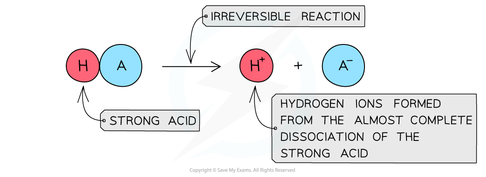
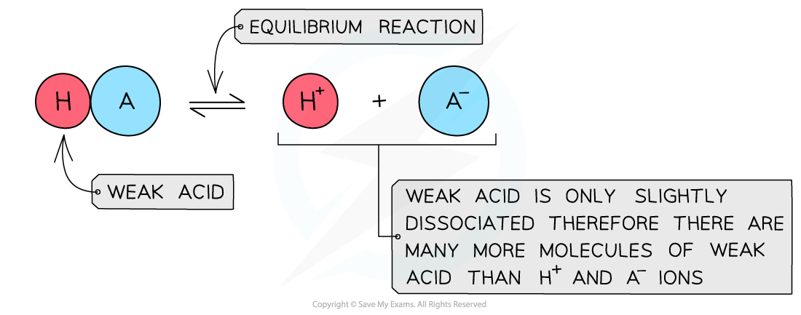

## Acid Dissociation

#### Strong acids

* A **strong acid**is an acid that **dissociates** almost **completely** in aqueous solutions

  + HCl (hydrochloric acid), HNO3 (nitric acid) and H2SO4 (sulfuric acid)
* The position of the equilibrium is so far over to the **right** that you can represent the reaction as an irreversible reaction

***The diagram shows the complete dissociation of a strong acid in aqueous solution***

#### Weak acids

* A **weak acid**is an acid that **partially** (or incompletely) **dissociates** in aqueous solutions

  + Eg. most organic acids (ethanoic acid), HCN (hydrocyanic acid), H2S (hydrogen sulfide) and H2CO3 (carbonic acid)
* The position of the equilibrium is more over to the **left** and an equilibrium is established

***The diagram shows the partial dissociation of a weak acid in aqueous solution***

#### Enthalpy change of neutralisation

* The enthlapy change of neutralisation of **strong acids** and **strong bases** are very similar, around -57 to -58 kJmol-1
* This is because the acids and alkalis are fully ionised and the neutralisation reaction between H+ + OH– occurs to produce water:

  + H+ (aq) + OH– (aq) → H2O (l)
* The other ions are not involved in the reaction, i.e. are spectator ions, so do not affect neutralisation
* As this is the reaction that is occurring in each stong acid-strong alkali reaction, then the enthalpy change of neutralisation will be very similar
* **Weak acids** and **weak alkalis** only partially ionise, so energy has to be used to fully ionise them
* This means that the resulting enthalpy change of neutralisation will be less exothermic , i.e. less negative

  + For example, the standard enthalpy change of neturalisation of ethanoic acid with sodium hydroxide is -55.2 kJ mol-1

## Ka Expressions

* For weak acids as there is an equilibrium we can write an equilibrium constant expression for the reaction

* This constant is called the **acid dissociation constant**, *K**a*, and has the units mol dm-3
* Values of *K**a*are very small, for example for ethanoic acid *K**a*= 1.74 x 10-5 mol dm-3
* When writing the equilibrium expression for weak acids, the following assumptions are made:

  + The concentration of hydrogen ions due to the ionisation of water is negligible
* The value of *K**a* indicates the extent of dissociation

  + The higher the value of *K**a* the more dissociated the acid and the stronger it is
  + The lower the value of *K**a* the weaker the acid

## pH Calculations for Acids

#### Strong acids

* **Strong acids** are completely **ionised**in solution

**HA (aq) → H****+****(aq) + A****-****(aq)**

* Therefore, the concentration of hydrogen ions, H+, is **equal**to the concentration of acid, HA
* The number of hydrogen ions formed from the ionisation of water is **very small**relative to the [H+] due to ionisation of the strong acid and can therefore be **neglected**
* The **total**[H+] is therefore the same as the [HA]

#### Worked Example

What is the pH of 0.01 mol dm-3 hydrochloric acid?

**Answer**

* [HC*l*] = [H+] = 0.01 mol dm-3

  + pH = - log[H+]
  + pH = - log[0.01] = 2.00

**The pH of dibasic acids**

* Dibasic or diprotic acids have two replaceable protons and will react in a 1:2 ratio with bases
* Sulfuric acid is an example

**H****2****SO****4****(aq)  + 2NaOH (aq) → Na****2****SO****4****(aq) + 2H****2****O (l)**

* You might think that being a strong acid it is fully ionised so the concentration of the hydrogen is double the concentration of the acid
* This would mean that 0.1 mol dm-3 would be 0.2 mol dm-3 in [H+] and have a pH of 0.69
* However, measurements of the pH of  0.1 mol dm-3sulfuric acid show that it is actually about pH 0.98, which indicates it is not fully ionised
* The ionisation of sulfuric acid occurs in two steps

**H****2****SO****4****→ HSO****4****-****+ H****+**

**HSO****4****-****⇌ SO****4****2-****+ H****+**

* Although the first step is thought to be fully ionised, the second step is suppressed by the abundance of hydrogen ions from the first step creating an equilibrium
* The result is that the hydrogen ion concentration is less than double the acid concentration

#### Weak acids

The pH of **weak acids** can be calculated when the following is known: The **concentration** of the acid The ***K******a*** value of the acid From the ***K******a***expression we can see that there are three variables:

* However, the equilibrium concentration of [H+] and [A-] will be the same since one molecule of HA dissociates into one of each ion
* This means you can simplify and re-arrange the expression to

***K******a*****x [HA] = [H****+****]****2**

**[H****+****]****2****=*****K******a*****x [HA]**

* Taking the square roots of each side

**[H****+****] = √(*****K******a*****x [HA])**

* Then take the negative logs

**pH = -log[H****+****] = -log√(*****K******a*****x [HA])**

#### Worked Example

**pH calculations of weak acids**

Calculate the pH of 0.100 mol dm-3ethanoic acid at 298 k with a *K**a* value of 1.74 × 10-5 mol dm-3

**Answer**

Ethanoic acid is a weak acid which ionises as follows:

**CH****3****COOH (aq) ⇌ H****+****(aq) + CH****3****COO****-****(aq)**

**Step 1:**Write down the equilibrium expression to find *K**a*

**Step 2:**Simplify the expression

The ratio of H+ to CH3COO- ions is 1:1

The concentration of H+ and CH3COO- ions are therefore the same

The expression can be simplified to:

**Step 3:**Rearrange the expression to find [H+]

**Step 4:**Substitute the values into the expression to find [H+]

**= 1.32 x 10****-3****mol dm****-3**

**Step 5:**Find the pH

**pH = -log[H****+****]**

**= -log(1.32 x 10****-3****)**

**= 2.88**