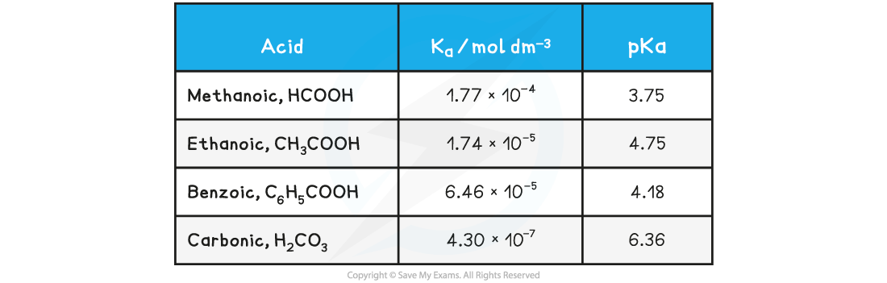

## Ionic Product of Water, Kw

* In all aqueous solutions, an equilibrium exists in water where a few water molecules dissociate into protons and hydroxide ions
* We can derive an equilibrium constant for the reaction:

* This is a specific equilibrium constant called the **ionic product for water**
* The product of the two ion concentrations is *always* **1 x** **10****-14****mol****2****dm****-6**
* This makes it straightforward to see the relationship between the two concentrations and the nature of the solution:

**[H****+****] & [OH****–****] Table**

![[H+] and [OH-] table, downloadable IB Chemistry revision notes](8.1.8-H-and-OH-table.png)

The relationship between *K**w*and*pK**w*is given by the following equation:

**pK****w** **= -logK****w**

#### pKa

* The range of values of *K**a* is very large and for weak acids, the values themselves are very small numbers

**Table of*****K******a*****values**

* For this reason it is easier to work with another term called ***pK******a***
* The ***pK******a***  is the negative log of the ***K******a*** value, so the concept is analogous to converting [H+] into pH values

***pK******a*****= -log*****K******a***

* Looking at the *pK**a*values for the same acids:

**Table of*****pK******a*****values**

* The range of *pK**a*values for most weak acids lies between 3 and 7

## pH Calculation of a Strong Base

* **Strong bases**are completely **ionised**in solution

**BOH (aq) → B****+****(aq) + OH****-****(aq)**

* Therefore, the concentration of hydroxide ions [OH-] is **equal**to the concentration of base [BOH]

  + Even strong alkalis have small amounts of H+ in solution which is due to the ionisation of water
* The concentration of OH- in solution can be used to calculate the pH using the **ionic product of water**
* Once the [H+] has been determined, the pH of the strong alkali can be founding using pH = -log[H+]

* Similarly, the ionic product of water can be used to find the concentration of OH- ions in solution if [H+] is known, simply by dividing *K**w*by the [H+]

#### Worked Example

**pH calculations of a strong alkali**

**Question 1:**

Calculate the pH of 0.15 mol dm-3sodium hydroxide, NaOH

**Question 2:**

Calculate the hydroxide concentration of a solution of sodium hydroxide when the pH is 10.50

**Answer**

Sodium hydroxide is a strong base which ionises as follows:

**NaOH (aq) → Na****+****(aq) + OH****-****(aq)**

**Answer 1:**

   The pH of the solution is:

   [H+] = *K**w*÷ [OH-]

   [H+] = (1 x 10-14) ÷ 0.15 = 6.66 x 10-14

   pH = -log[H+]

         = -log 6.66 x 10-14**= 13.17**

**Answer 2**

**Step 1:** Calculate hydrogen concentration by rearranging the equation for pH

   pH = -log[H+]

   [H+]= 10-pH

   [H+]= 10-10.50

   [H+]= 3.16 x 10-11 mol dm-3

**Step 2:**Rearrange the **ionic product of water**  to find the concentration of hydroxide ions

*K**w* = [H+] [OH-]

    [OH-]= *K**w*÷  [H+]

**Step 3:**Substitute the values into the expression to find the concentration of hydroxide ions

   Since *K**w* is 1 x 10-14 mol2 dm-6,

    [OH-]= (1 x 10-14)÷  (3.16 x 10-11)

   [OH-]=**3.16 x 10****-4****mol dm****-3**