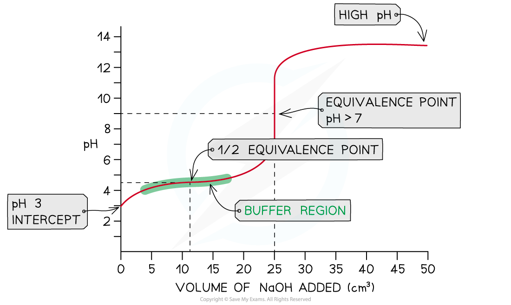

## Weak Acid - Strong Base Titration

* In this example, strong sodium hydroxide, NaOH (aq), is being added to weak ethanoic acid, CH3COOH (aq)

**NaOH (aq) + CH****3****COOH (aq) → CH****3****COONa (aq) + H****2****O (l)**

* The pH on the intercept on the y axis starts at roughly 3 due to the relative strength of the ethanoic acid
* The initial rise in pH is steep as the neutralisation of the weak acid by the strong base is rapid
* Ethanoate ions (conjugate base to ethanoic acid) are formed which then creates a buffer

  + A buffer consists of a weak acid and its conjugate base or a weak base and its conjugate acid
* At this point, the buffer formed will resist changes in pH so the pH rises gradually as shown in the **buffer region**
* The **half equivalence point** is the stage of the titration at which exactly half the amount of weak acid has been neutralised

  + **[CH****3****COOH (aq)] = [CH****3****COO****-****(aq)]**
  + At this point, it is important to note that the p*K*a of the acid is equal to the pH

    - **p*****K*****a****= pH**at **half equivalence**
* The equivalence point in a weak acid - strong base titration is **above 7**

***Weak acid - strong base pH curve***