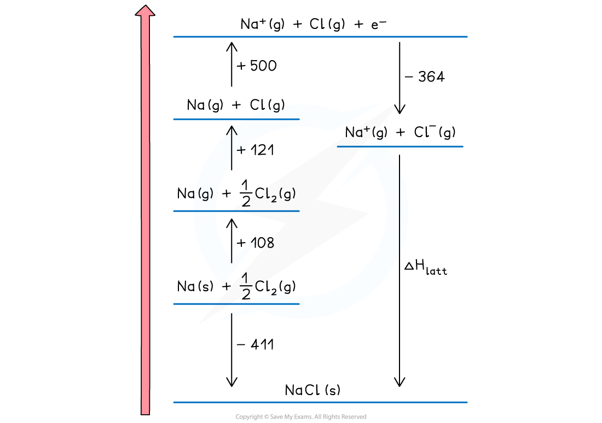
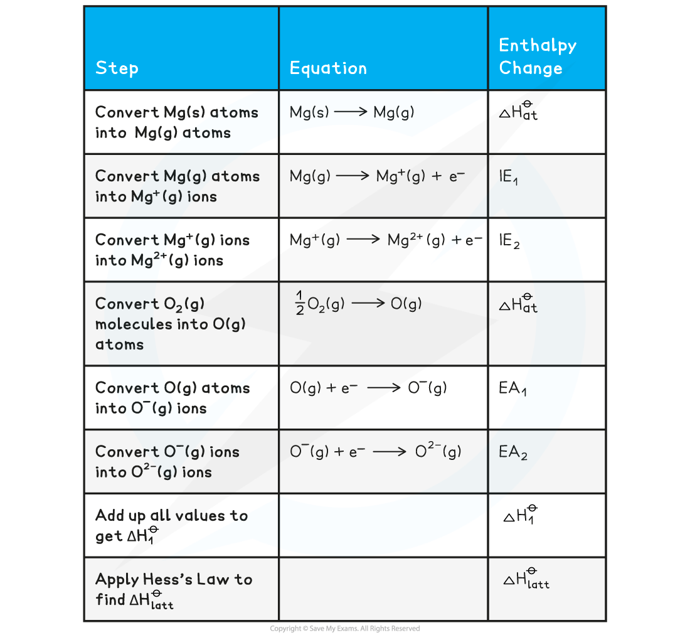
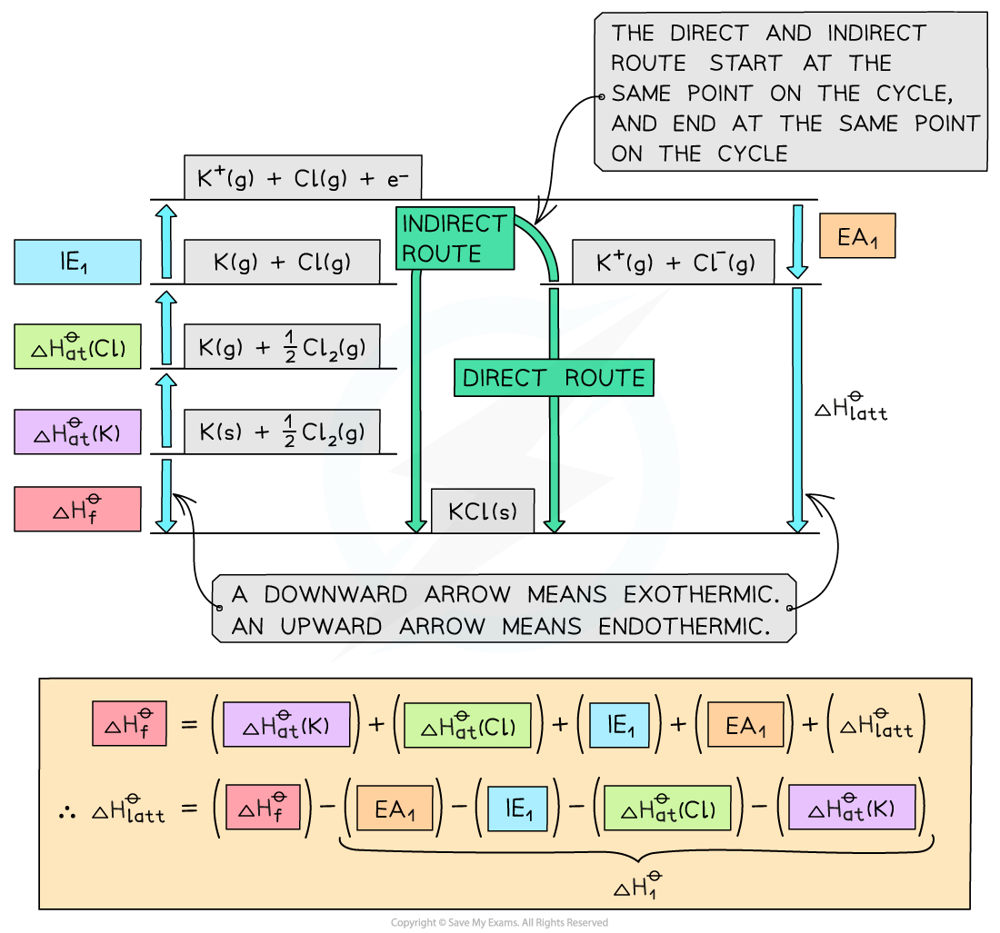

## Born-Haber Cycles

* A **Born-Haber cycle** is a specific application of Hess’ Law for ionic compounds and enable us to calculate lattice enthalpy which cannot be found by experiment
* The basic principle of drawing the cycle is to construct a diagram in which energy increases going up the diagram

***The basic principle of a Born-Haber cycle***

* The cycle shows all the steps needed to turn atoms into gaseous ions and from gaseous ions into the ionic lattice
* The alternative route to the ionic lattice begins from the enthalpy of formation of the elements in their standard states

#### Drawing the cycle for sodium chloride

* A good starting point is to draw the elements with their state symbols about a third of the way up the diagram
* This is shown as the left hand side of the equation for the process indicated
* The location is marked by drawing a horizontal bar or line which represents the starting energy level

***Drawing a Born-Haber cycle step 1***

* Next, we need to create the gaseous ions
* This is a two step process of first creating the gaseous atoms and then turning them into ions
* Creating gaseous atoms is a bond breaking process, so arrows must be drawn upwards
* It doesn't matter whether you start with sodium or chlorine
* The enthalpy of atomisation of sodium is

**Na (s) → Na (g)           Δ*****H******at*****ꝋ** **= +108 kJ mol** **-1**

* The enthalpy of atomisation of chlorine is

**½Cl****2** **(g) → Cl (g)       Δ*****H******at*****ꝋ** **= +121 kJ mol** **-1**

* We can show the products of the process on the horizontal lines and the energy value against a vertical arrow connecting the energy levels

***Drawing a Born-Haber cycle step 2 - creating the gaseous atoms***

* Now the ions are created
* The sodium ion loses an electron, so this energy change is the first ionisation energy for sodium

**Na (g) → Na****+****(g) + e****–****Δ*****H******ie*****ꝋ** **= +500 kJ mol****-1**

* The change is endothermic so the direction continues upwards
* The chlorine atom gains an electron, so this is electron affinity

**Cl (g) + e****–****→ Cl****-** **(g)           Δ*****H******ea*****ꝋ** **= -364 kJ mol****-1**

* The exothermic change means this is downwards
* The change is displaced to the right to make the diagram easier to read

***Drawing a Born-Haber cycle step 3 - creating the gaseous ions***

* The two remaining parts of the cycle can now be completed
* The enthalpy of formation of sodium chloride is added at the bottom of the diagram

**Na (s) + ½Cl****2** **(g) → NaCl (s)            Δ*****H******f*****ꝋ** **= -411 kJ mol** **-1**

* This is an exothermic change for sodium chloride so the arrow points downwards
* Enthalpy of formation can be exothermic or endothermic, so you may need to show it above the elements ( and displaced to the right) for a endothermic change
* The final change is lattice enthalpy, which is usually shown a formation. For sodium chloride the equation is

**Na****+****(g) + Cl****-****(g) → NaCl (s)  Δ*****H******latt*****ꝋ**

***Drawing a Born-Haber cycle step 4 - completing the cycle***

* The cycle is now complete
* The cycle is usually used to calculate the lattice enthalpy of an ionic solid, but can be used to find other enthalpy changes if you are given the lattice enthalpy

#### Worked Example

**Constructing a Born-Haber cycle for KCl**

Construct a Born-Haber Cycle which can be used to calculate the lattice energy of potassium chloride

**Answer**

#### Worked Example

**Constructing a Born-Haber cycle for MgO**

Construct a Born-Haber Cycle which can be used to calculate the lattice energy of magnesium oxide

**Answer**

* Once a Born-Haber cycle has been constructed, it is possible to calculate the lattice energy (Δ*H**latt*ꝋ) by applying Hess’s law and rearranging:

**Δ*****H******f*****ꝋ** **= Δ*****H******at*****ꝋ** **+ Δ*****H******at*****ꝋ** **+** ***IE*** **+** ***EA*** **+ Δ*****H******latt*****ꝋ**

* If we simplify this into three terms, this makes the equation easier to see:

  + Δ*H**latt*ꝋ
  + Δ*H**f*ꝋ
  + Δ*H**1*ꝋ (the sum of all of the various enthalpy changes necessary to convert the elements in their standard states to gaseous ions)
* The simplified equation becomes

**Δ*****H******f*****ꝋ** **= Δ*****H******1*****ꝋ** **+ Δ*****H******latt*****ꝋ**

So, if we rearrange to calculate the lattice energy, the equation becomes

**Δ*****H******latt*****ꝋ** **= Δ*****H******f*****ꝋ** **- Δ*****H******1*****ꝋ**

* When calculating the Δ*H**latt*ꝋ, all other necessary values will be given in the question
* A Born-Haber cycle could be used to calculate any stage in the cycle

  + For example, you could be given the lattice energy and asked to calculate the enthalpy change of formation of the ionic compound
  + The principle would be exactly the same
  + Work out the **direct** and **indirect route** of the cycle (the stage that you are being asked to calculate will always be the direct route)
  + Write out the equation in terms of enthalpy changes and rearrange if necessary to calculate the required value
* **Remember:** sometimes a value may need to be doubled or halved, depending on the ionic solid involved

  + For example, with MgCl2 the value for the first electron affinity of chlorine would need to be doubled in the calculation, because there are two moles of chlorine atoms
  + Therefore, you are adding **2 moles** of electrons to **2 moles** of chlorine atoms, to form **2 moles** of Cl- ions

#### Worked Example

**Calculating the lattice energy of KCl**

Given the data below, calculate the Δ*H**latt*ꝋ of potassium chloride (KCl)

**Answer**

**Step 1:** The corresponding Born-Haber cycle is:

**Step 2:** Applying Hess’ law, the lattice energy of KC*l* is:

**Δ*****H******latt*****ꝋ** **= Δ*****H******f*****ꝋ** **- Δ*****H******1*****ꝋ**

**Δ*****H******latt*****ꝋ** **= Δ*****H******f*****ꝋ** **- [(Δ*****H******at*****ꝋ** **K) + (Δ*****H******at*****ꝋ** **Cl) + (*****IE******1*** **K) + (*****EA******1*** **Cl)]**

**Step 3:** Substitute in the numbers:

**Δ*****H******latt*****ꝋ** **= (-437) - [(+90) + (+122) + (+418) + (-349)] = -718 kJ mol****-1**

#### Worked Example

**Calculating the lattice energy of MgO**

Given the data below, calculate the of Δ*H**latt*ꝋ magnesium oxide of magnesium oxide (MgO)

**Answer**

**Step 1:** The corresponding Born-Haber cycle is:

**Step 2:** Applying Hess’ law, the lattice energy of MgO is:

**Δ*****H******latt*****ꝋ** **= Δ*****H******f*****ꝋ** **- Δ*****H******1*****ꝋ**

**Δ*****H******latt*****ꝋ** **= Δ*****H******f*****ꝋ** **- [(Δ*****H******at*****ꝋ** **Mg) + (Δ*****H******at*****ꝋ** **O) + (IE****1** **Mg) + (*****IE******2*** **Mg) + (*****EA******1*** **O) + (*****EA******2*** **O)]**

**Step 3:** Substitute in the numbers:

**Δ*****H******latt*****ꝋ** **= (-602) - [(+148) + (+248) + (+736) + (+1450) + (-142) + (+770)]**

**= -3812 kJ mol****-1**