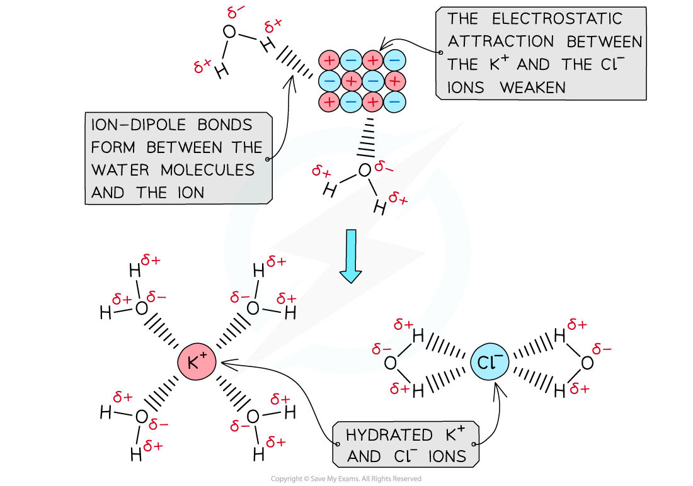

## Solution & Hydration Definitions

#### Enthalpy of solution

* The **standard enthalpy change of solution (Δ*****H******sol*****ꝋ****)** is the enthalpy change when **1 mole** of an ionic substance **dissolves** in sufficient water to form an **infinitely dilute solution**
* The symbol **(aq)** is used to show that the solid is dissolved in **sufficient water**

  + For example, the enthalpy changes of solution for potassium chloride are described by the following equations:

**KCl (s) + aq → KCl****(aq)**

**OR**

**KCl****(s) + aq → K****+****(aq) + Cl****-****(aq)**

* Δ*H**sol*ꝋ can be **exothermic** (negative) or **endothermic** (positive)

#### Enthalpy of hydration

* The **standard enthalpy change of hydration (Δ*****H******hyd*****ꝋ****)** is the enthalpy change when **1 mole** of a specified **gaseous ion dissolves** in sufficient water to form an infinitely dilute **solution**

  + For example, the enthalpy change of hydration for magnesium ions is described by the following equation:

**Mg****2+****(g) + aq → Mg****2+****(aq)**

* Hydration enthalpies are the measure of the energy that is released when there is an attraction formed between the ions and water molecules

  + Hydration enthalpies are **exothermic**
* When an **ionic solid** dissolves in water, positive and negative ions are formed
* Water is a **polar** molecule with a δ- oxygen (O) atom and δ+ hydrogen (H) atoms which will form **ion-dipole attractions** with the ions present in the solution
* The oxygen atom in water will be attracted to the **positive ions** and the hydrogen atoms will be attracted to the **negative** **ions**

***The polar water molecules will form ion-dipole bonds with the ions in solution causing the ions to become hydrated***

#### How are enthalpy of solution and hydration enthalpies related?

***The relationship between lattice enthalpy, hydration enthalpies and enthalpy of solution***

* From the diagram we can see that the relationship is

**Enthalpy of solution = reverse lattice enthalpy\* + hydration enthalpy**

* The hydration enthalpy is the **sum** of the hydration enthalpies of each ion
* If there is more than one cation or anion, such as in MgCl2, then you must multiply by the appropriate coefficient for that ion

\*To be consistent with lattice *formation* enthalpy

## Cycles & Energy Level Diagrams

* Questions in this topic typically ask you to calculate the hydration enthalpy of one of the ions, given the lattice enthalpy, enthalpy of solution and hydration enthalpy of the other ion.
* This can be done by constructing an appropriate energy cycle and using Hess's Law to find the unknown energy value
* The energy cycle above shows that there are two routes to go from the gaseous ions to the ions in an aqueous solution:

  + **Route 1**: going from gaseous ions → ionic solid → ions in aqueous solution (this is the **indirect route**)

    - **Route 2**: going from gaseous ions  →  ions in aqueous solution (this is the **direct route**)

* According to **Hess’s law,** the enthalpy change for both routes is the same, such that:

**Δ*****H******hyd*****ꝋ** **= Δ*****H******latt*****ꝋ** **+ Δ*****H******sol*****ꝋ**

* Each ion will have its own enthalpy change of hydration, Δ*H**hyd*ꝋ, which will need to be taken into account during calculations

  + The total Δ*H**hyd*ꝋ is found by adding the  Δ*H**hyd*ꝋ values of both anions and cations together

#### Worked Example

**Constructing an energy cycle for KC*****l***Calculate the enthalpy of hydration of the chloride ion given the following data:

Δ*H**latt*ꝋ [KCl] = -711 kJ mol-1

Δ*H**sol*ꝋ [KCl] = +26 kJ mol-1

Δ*H**hyd*ꝋ [K+] = -322 kJ mol-1

**Answer**

**Step 1:** Draw the energy cycle and make Δ*H**hyd*[Cl-] the subject of the formula:

**Step 2:** Substitute the values to find Δ*H**hyd*ꝋ [Cl-]

**Δ*****H******hyd*****ꝋ** **[Cl****-****]   = (-711) + (+26) - (-322) = -363 kJ mol****-1**

**Alternative Diagram**

* You can also draw a Born-Haber cycle as an alternative approach to the same problem

Energy level diagram:

#### Worked Example

**Constructing an energy cycle and energy level diagram of MgCl****2**

Construct an energy cycle to calculate the Δ*H**hyd*ꝋof magnesium ions in magnesium chloride, given the following data:

Δ*H**latt*[MgCl2] = -2592 kJ mol-1

Δ*H**sol*[MgCl2] = -55 kJ mol-1

Δ*H**hyd*[Cl-] = -363 kJ mol-1

**Answer**

**Step 1:** Draw an energy cycle:

**Step 2:** Substitute the values to find Δ*H**hyd*ꝋ [Mg2+]

**Δ*****H******hyd*****ꝋ****[Mg****2+****]  = (-2592) + (-55) - (2 x -363) = -1921 kJ mol****-1**

**Alternative route to find Δ*****H******hyd*****ꝋ****[Mg****2+****]**

* Here is the same solution using a Born-Haber cycle

#### Examiner Tips and Tricks

It doesn't matter whether you use Hess cycles or Born-Haber style cycles to solve these problems as long as the information is correctly labelled and the direction of the arrows matches the definitions.Exam problems in this topic often show diagrams with missing labels which you have to complete and find unknown values.The key to success in energy cycle calculations is not to panic, but have a careful step-by-step approach, show your workings and use brackets to separate mathematical operations from the enthalpy changes.

## The Effects of Ionic Charge & Radius

#### Factors affecting lattice enthalpy

* The two key factors which affect lattice energy, Δ*H**latt*ꝋ, are the **charge** and **radius** of the ions that make up the **crystalline lattice**

#### Ionic radius

* The lattice energy becomes **less exothermic** as the **ionic** **radius** of the ions **increases**
* This is because the charge on the ions is more **spread** **out** over the ion when the ions are **larger**
* The ions are also **further apart** from each other in the lattice

  + The attraction between ions is between the centres of the ions involved, so the bigger the ions the bigger the distance between the centre of the ions
* Therefore, the **electrostatic forces of** **attraction** between the oppositely charged ions in the lattice are **weaker**
* For example, the lattice energy of caesium fluoride (CsF) is **less exothermic** than the lattice energy of potassium fluoride (KF)

  + Since both compounds contain a fluoride (F-) ion, the difference in lattice energy must be due to the caesium (Cs+) ion in CsF and potassium (K+) ion in KF
  + Potassium is a Group 1 and Period 4 element
  + Caesium is a Group 1 and Period 6 element
  + This means that the Cs+ ion is **larger** than the K+ ion
  + There are **weaker** electrostatic forces of attraction between the Cs+ and F- ions compared to K+ and F- ions
  + As a result, the **lattice** **energy** of CsF is **less exothermic** than that of KF

***The lattice energies get less exothermic as the ionic radius of the ions increases***

#### Ionic charge

* The lattice energy gets **more exothermic** as the **ionic** **charge** of the ions **increases**
* The greater the ionic charge, the **higher the charge density**
* This results in **stronger electrostatic attraction** between the oppositely charged ions in the lattice
* As a result, the lattice energy is **more exothermic**
* For example, the lattice energy of calcium oxide (CaO) is **more exothermic** than the lattice energy of potassium chloride (KCl)

  + Calcium oxide is an ionic compound which consists of calcium (Ca2+) and oxide (O2-) ions
  + Potassium chloride is formed from potassium (K+) and chloride (Cl-) ions
  + The ions in calcium oxide have a **greater ionic charge** than the ions in potassium chloride
  + This means that the electrostatic forces of attraction are **stronger** between the Ca2+and O2- compared to the forces between K+ and Cl-
  + Therefore, the lattice energy of calcium oxide is **more exothermic,** as more energy is released upon its formation from its gaseous ions
  + Ca2+ and O2- are also smaller ions than K+ and Cl-, so this also adds to the value for the lattice energy being more exothermic

#### Factors affecting enthalpy of hydration

* Hydration enthalpies are exothermic as energy is given out as water molecules bond to the metal ions
* The negative ions are attracted to the **δ+ hydrogens** on the **polar water molecules** and the positive ions are attracted to the **δ- oxygen** on the polar water molecules
* The higher the charge density the greater the hydration enthalpy (e.g. smaller ions or ions with larger charges) as the ions attract the water molecules more strongly, for example:
* Fluoride ions, F-,  have more negative hydration enthalpies than chloride ions, Cl-
* Magnesium ions, Mg2+, have a more negative hydration enthalpy than barium ion, Ba2+