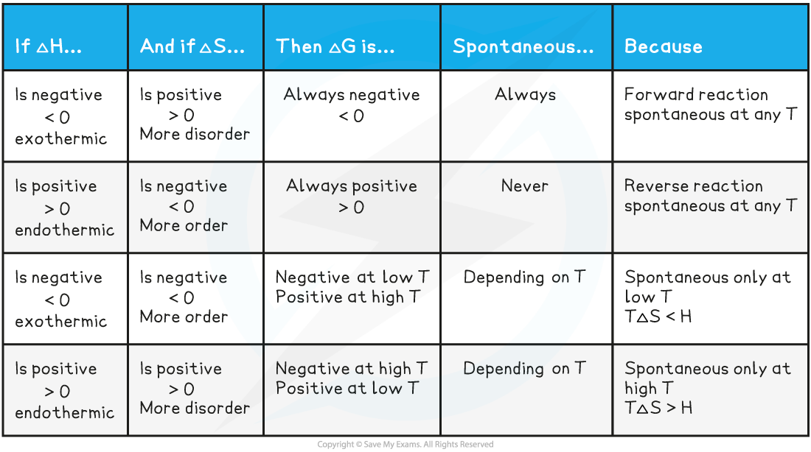

Feasibility of Reactions
------------------------

#### Gibbs free energy

* The feasibility of a reaction is determined by two factors

  + The <b>enthalpy</b> and <b>entropy change</b>
* The two factors come together in a fundamental thermodynamic concept called the <b>Gibbs free energy (</b>*<b>G</b>*<b>)</b>
* The Gibbs equation is:

<b>Δ</b>*<b>G</b>*<b>ꝋ</b><b> = Δ</b>*<b>H</b>**<b>reaction</b>*<b>ꝋ</b><b> – </b>*<b>T</b>*<b>Δ</b>*<b>S</b>**<b>system</b>*<b>ꝋ</b>

* The units of Δ*G*ꝋ are in kJ mol<b>–</b>1

  + The units of Δ*H**reaction*ꝋare in kJ mol<b>–</b>1
  + The units of *T* are in K
  + The units of Δ*S**system*ꝋ are in J K-1<b> </b>mol<b>–</b>1(and must therefore be converted to kJ K<b>–</b>1 mol<b>–</b>1by dividing by 1000)
* For a reaction to be feasible, Δ*G*ꝋ must be <b>equal or less than zero </b>

Gibbs Free Energy Calculations
------------------------------

#### Calculating ΔGΘ

* This can be done by using the Gibbs equation, using enthalpy change, Δ*H*ꝋ, and entropy change, Δ*S*ꝋ, values

#### Worked Example

<b>Δ</b>*<b>G</b>*<b>ꝋ</b><b>from Δ</b>*<b>H</b>*<b>ꝋ</b><b>and Δ</b>*<b>S</b>*<b>ꝋ</b><b>values</b>

Calculate the free energy change for the following reaction:

<b>2NaHCO</b><b>3 </b><b>(s) → Na</b><b>2</b><b>CO</b><b>3</b><b> (s) + H</b><b>2</b><b>O (l) + CO</b><b>2</b><b> (g)</b>

* Δ*H*ꝋ = +135 kJ mol-1       
* Δ*S*ꝋ = +344 J K-1 mol-1

<b>Answer:</b>

<b>Step 1:</b> Convert the entropy value in kilojoules

Δ*S*ꝋ = +344 J K-1 mol-1  ÷ 1000 = +0.344 kJ K-1 mol-1 

<b>Step 2:</b> Substitute the terms into the Gibbs Equation

Δ*G*ꝋ= Δ*H**reaction*ꝋ– TΔ*S**system*ꝋ

= +135 – (298 x 0.344)

= <b>+32.49 kJ mol</b><b>-1 </b>

*The temperature is 298 K since standard values are quoted in the question*

* Rearranging the Gibbs equation allows you to determine the temperature at which a non-spontaneous reaction become feasible

<b>Δ</b>*<b>G</b>*<b>ꝋ</b><b> = Δ</b>*<b>H</b>**<b>reaction</b>*<b>ꝋ</b><b> - TΔ</b>*<b>S</b>**<b>system</b>*<b>ꝋ</b>

* Remember, for a reaction to be feasible Δ*G*Θꝋmust be zero or negative

<b>0 = Δ</b>*<b>H</b>*<b>ꝋ</b><b> - TΔ</b>*<b>S</b>*<b>ꝋ</b>

<b>Δ</b>*<b>H</b>*<b>ꝋ</b><b> = TΔ</b>*<b>S</b>*<b>ꝋ</b>

<b>T</b><b> </b><b>= Δ</b>*<b>H</b>*<b>ꝋ </b><b>÷ Δ</b>*<b>S</b>*<b>ꝋ</b>

#### Worked Example

At what temperature will the reduction of aluminium oxide with carbon become spontaneous?

<b>Al</b><b>2</b><b>O</b><b>3</b><b>(s) + 3C(s)→ 2Al(s) + 3CO(g) </b>

Δ*H*ꝋ = +1336 kJ mol-1

Δ*S*ꝋ = +581 J K-1 mol-1

<b>Answer:</b>

* If ΔGꝋ = 0 then T = Δ*H*ꝋ ÷ Δ*S*ꝋ

  + Covert Δ*S*ꝋ to kJ K-1 mol-1 by dividing by 1000
  + T = 1336 ÷ (581/1000)
  + <b>T</b><b> </b><b>= 2299 K</b>

#### Temperature and Gibbs free energy

* When Δ*G*ꝋ is <b>negative</b>, the reaction is <b>spontaneous / feasible </b>and likely to occur
* When Δ*G*ꝋ is <b>positive</b>, the reaction is <b>not spontaneous / feasible</b> and unlikely to occur
* We can also look at the the values for enthalpy change, Δ*H*, and entropy change, Δ*S*

  + Depending on the value for Δ*H* and Δ*S* we can determine whether the reaction is spontaneous at a given temperature (*T*)

<b>Summary for temperature and Gibbs free energy </b>

