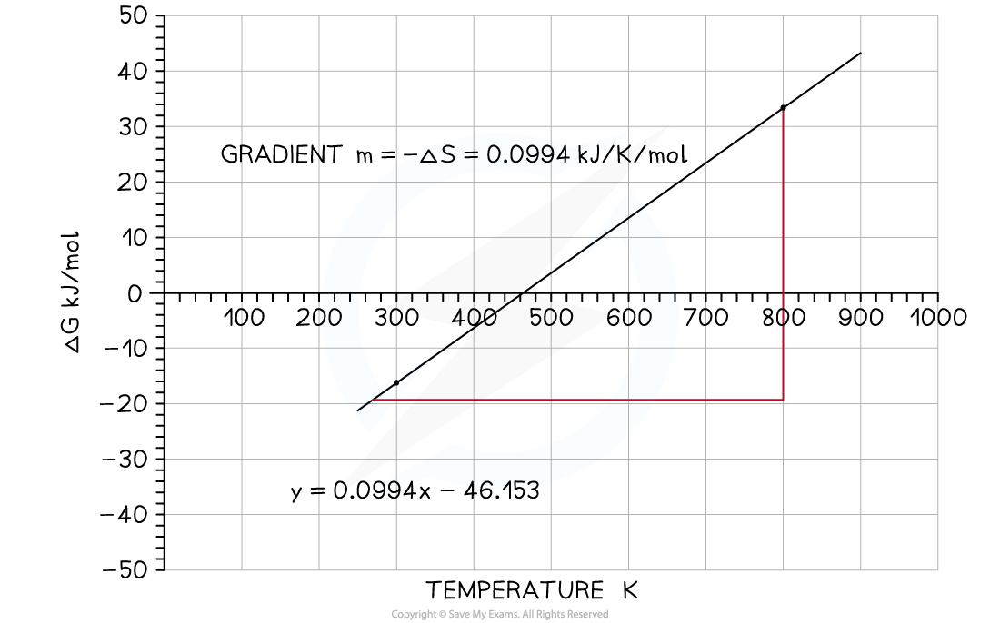
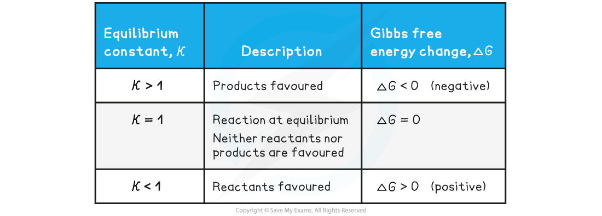

Feasible Reactions
------------------

#### Graphing the Gibbs Equation

* The Gibbs equation can be expressed as the equation for a straight line<b> </b>

<b>Δ</b>*<b>G</b>*<b>ꝋ</b><b> = Δ</b>*<b>H</b>*<b>ꝋ</b><b> - TΔ</b>*<b>S</b>*<b>ꝋ </b>

<b>Δ</b>*<b>G</b>*<b>ꝋ</b><b> = - Δ</b>*<b>S</b>*<b>ꝋ</b><b>T</b><b>  </b><b>+ Δ</b>*<b>H</b>*<b>ꝋ</b><b> </b>

<b>y = mx + c</b>

* A graph of free energy versus temperature (in K) will give a straight line, with slope -Δ*S*ꝋ and y-intercept, Δ*H*ꝋ.
* The variation of Δ*G*ꝋagainst T for the synthesis of ammonia has been plotted below:

<b>N</b><b>2</b><b> (g) + 3H</b><b>2 </b><b>(g)⇌ 2NH</b><b>3</b><b> (g)</b>

*<b>Graph of free energy versus temperature for the synthesis of ammonia</b>*

* From this graph you should be able to see some key features:

  + The x-intercept shows you where the reaction ceases to be spontaneous, in this case at 460 K (187 oC)
  + Above this temperature Δ*G* is positive so the reaction is not feasible

    - However, you may recall that the operating conditions of the Haber process are higher than this temperature, but this graph takes no account of the use of a catalyst which affects the energetics of the system, nor does it take into account anything about the rate of reaction or the fact that it is an equilibrium and removal of the ammonia as soon as it is formed also tips the balance in favour of the product
  + The y-intercept shows you reaction is exothermic which you can see from the enthalpy of formation; the value is approximately -46 kJ mol -1
  + An exothermic equilibrium reaction would be favoured by lower temperatures - this is seen by the value of Δ*G*ꝋ  becoming increasingly negative as the temperature falls

#### Gibbs Free Energy & the Equilibrium Constant

* The equilibrium constant, *K*c, gives no information about the individual rates of reaction

  + It is independent of the kinetics of the reaction
* The equilibrium constant, *K*c, is directly related to the Gibbs free energy change, Δ*G**Ꝋ*, according to the following (van't Hoff's) equation:

<b>Δ</b>*<b>G</b>*<b>Ꝋ</b><b> = -</b>*<b>RT</b>*<b> ln</b>*<b>K</b>*

* Δ*G*Ꝋ= Gibbs free energy change (kJ mol–1)

  + *R* = gas constant (8.31 J K-1 mol-1)
  + *T* = temperature (Kelvin, K)
  + *K* = equilibrium constant

* This relationship between the equilibrium constant, *K*c, and Gibbs free energy change, Δ*G*Ꝋ, can be used to determine whether the forward or backward reaction is favoured

<b>The relationship between the equilibrium constant, </b>*<b>K</b>*<b>c</b><b>, and Gibbs free energy change, ΔG</b><b>Ꝋ</b>

* At a given temperature, a negative Δ*G* value for a reaction indicates that:

  + The reaction is feasible / spontaneous
  + The equilibrium concentration of the products is greater than the equilibrium concentration of the reactants
  + The value of the equilibrium constant is greater than 1
* As Δ*G* becomes more negative:

  + The forward reaction is favoured more
  + The value of the equilibrium constant increases

#### Limitations of using ΔG

* ∆*G*o can only be used to predict the feasibility of a reaction under standard conditions

  + Under non-standard conditions, ∆*G* must be calculated
* It is important to note that just because a reaction is feasible does not mean that it will occur at an observable rate
* While ∆*G* can be used to determine the feasibility of a reaction, it does not take into account the kinetics of the reaction i.e. rate of reaction
* There might be a large energy barrier (*E*a) which the reacting species have to overcome before a reaction can occur
* Some reactions are feasible since ∆*G* is negative, but kinetically not feasible since it just occurs too slowly
* Such reactions are feasible but very slow

* An example is the decomposition of hydrogen peroxide at 298 K

<b>H</b><b>2</b><b>O</b><b>2</b><b> (l) → H</b><b>2</b><b>O (l) + ½O</b><b>2</b><b> (g)          ∆</b>*<b>G </b>*<b>= -117 kJ mol</b><b>-1 </b>

* This reaction has a very large Ea so must be catalysed using manganese dioxide, MnO2
* If the reaction was left for long enough, the hydrogen peroxide would eventually decompose, however the addition of the MnO2 allows the reaction to take place via an alternative route with a lower *E*a
* Although the value for ∆*G* indicates the reaction is feasible, it does not take into account the kinetics of the reaction