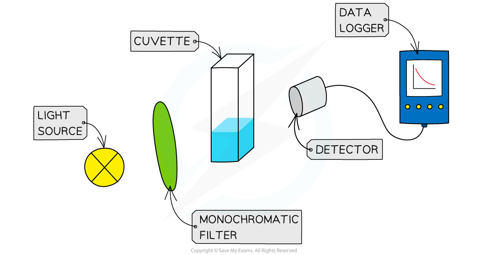

Continuous Monitoring Method
----------------------------

* <b>Continuous</b> <b>monitoring </b>involves collecting experimental data throughout the course of a reaction to plot a concentration-time graph
* Two of the most common ways to collect this data are by:

  + Measuring the volume / amount of gas evolved over time
  + Measuring the mass of reactants lost over time
* Another alternative method involves the use of colorimetry:

#### The iodination of propanone

* The iodination of propanone provides a suitable experiment in which the rate of reaction can be measured throughout the reaction by using a colorimeter
* The reaction is carried out using a catalyst of dilute sulfuric acid
* The iodine decolourises during the reaction as it turns into iodopropanone and hydrogen iodide:

CH3COCH3   +   I2  → CH3COCH2I   + HI

* The colorimeter measures colour absorbance which is proportional to the concentration of the coloured species
* Before the investigation begins it is necessary to  measure the absorbance of a set of standard solutions of iodine and obtain a calibration curve
* For example, here is a calibration curve for a transition metal ion that allows you to convert colorimeter readings into concentrations:

*<b>A calibration curve showing the relationship between colour absorbance and concentration</b>*

* The colorimeter uses very small volumes of solutions, so four burettes can be filled with solutions of 0.02 mol dm-3 iodine, 1.0 mol dm-3 propanone and 1.0  mol dm-3 sulfuric acid and distilled water
* By varying the volumes of solutions while maintaining a constant total volume with the use of distilled water, you can obtain a number of different concentrations
* The solutions are measured into a small beaker, leaving the iodine in a separate beaker - this starts the reaction, so it can be added when you start a timer or stop watch
* The iodine is added to the other liquids, the contents mixed and then quickly transferred into the cuvette (small receptacle) and the colorimeter / data logger started

*<b>The set up for using a colorimeter and data logger to continuously measure the rate of reaction</b>*

* A typical set of volume compositions could be as follows:

<b>Volume Compositions Table</b>

<b>Practical tip</b>

* Choose a filter that gives the strongest absorbance for the solution you are using - this will be the complementary colour to the colour of the solution under investigation

<b>Specimen results table for the iodination of propanone</b>

*<b>Graph showing the change in concentration of iodine during the course of the reaction</b>*

<b>Measuring rate</b>

* To find the rate of reaction at any point, a tangent is drawn and the gradient is determined
* The gradient gives the rate of reaction
* For example, in the graph above, the rate of reaction at 300 seconds can be found

  + A vertical line is drawn from the 300 s mark until it meets the curve, then a tangent is drawn
  + Gradient ![equals space fraction numerator capital delta y over denominator capital delta x end fraction space equals space fraction numerator 0.0069 over denominator 580 end fraction space equals](data:image/svg+xml;charset=utf8,%3Csvg%20xmlns%3D%22http%3A%2F%2Fwww.w3.org%2F2000%2Fsvg%22%20xmlns%3Awrs%3D%22http%3A%2F%2Fwww.wiris.com%2Fxml%2Fmathml-extension%22%20height%3D%2247%22%20width%3D%22156%22%20wrs%3Abaseline%3D%2230%22%3E%3C!--MathML%3A%20%3Cmath%20xmlns%3D%22http%3A%2F%2Fwww.w3.org%2F1998%2FMath%2FMathML%22%3E%3Cmo%3E%3D%3C%2Fmo%3E%3Cmo%3E%26%23xA0%3B%3C%2Fmo%3E%3Cmfrac%3E%3Cmrow%3E%3Cmi%3E%26%23x394%3B%3C%2Fmi%3E%3Cmi%3Ey%3C%2Fmi%3E%3C%2Fmrow%3E%3Cmrow%3E%3Cmi%3E%26%23x394%3B%3C%2Fmi%3E%3Cmi%3Ex%3C%2Fmi%3E%3C%2Fmrow%3E%3C%2Fmfrac%3E%3Cmo%3E%26%23xA0%3B%3C%2Fmo%3E%3Cmo%3E%3D%3C%2Fmo%3E%3Cmo%3E%26%23xA0%3B%3C%2Fmo%3E%3Cmfrac%3E%3Cmrow%3E%3Cmn%3E0%3C%2Fmn%3E%3Cmo%3E.%3C%2Fmo%3E%3Cmn%3E0069%3C%2Fmn%3E%3C%2Fmrow%3E%3Cmn%3E580%3C%2Fmn%3E%3C%2Fmfrac%3E%3Cmo%3E%26%23xA0%3B%3C%2Fmo%3E%3Cmo%3E%3D%3C%2Fmo%3E%3C%2Fmath%3E--%3E%3Cdefs%3E%3Cstyle%20type%3D%22text%2Fcss%22%3E%40font-face%7Bfont-family%3A'math11824c643d1feb4da18b28ed527'%3Bsrc%3Aurl(data%3Afont%2Ftruetype%3Bcharset%3Dutf-8%3Bbase64%2CAAEAAAAMAIAAAwBAT1MvMi7iBBMAAADMAAAATmNtYXDEvmKUAAABHAAAADxjdnQgDVUNBwAAAVgAAAA6Z2x5ZoPi2VsAAAGUAAAA%2BGhlYWQQC2qxAAACjAAAADZoaGVhCGsXSAAAAsQAAAAkaG10eE2rRkcAAALoAAAADGxvY2EAHTwYAAAC9AAAABBtYXhwBT0FPgAAAwQAAAAgbmFtZaBxlY4AAAMkAAABn3Bvc3QB9wD6AAAExAAAACBwcmVwa1uragAABOQAAAAUAAADSwGQAAUAAAQABAAAAAAABAAEAAAAAAAAAQEAAAAAAAAAAAAAAAAAAAAAAAAAAAAAAAAAAAAAACAgICAAAAAg1UADev96AAAD6ACWAAAAAAACAAEAAQAAABQAAwABAAAAFAAEACgAAAAGAAQAAQACAC4APf%2F%2FAAAALgA9%2F%2F%2F%2F0%2F%2FFAAEAAAAAAAAAAAFUAywAgAEAAFYAKgJYAh4BDgEsAiwAWgGAAoAAoADUAIAAAAAAAAAAKwBVAIAAqwDVAQABKwAHAAAAAgBVAAADAAOrAAMABwAAMxEhESUhESFVAqv9qwIA%2FgADq%2FxVVQMAAAEAIAAAAKAAgAADAC8YAbAEELAD1LADELAC1LADELAAPLACELABPACwBBCwA9SwAxCwAjywABCwATwwMTczFSMggICAgAACAIAA6wLVAhUAAwAHAGUYAbAIELAG1LAGELAF1LAIELAB1LABELAA1LAGELAHPLAFELAEPLABELACPLAAELADPACwCBCwBtSwBhCwB9SwBxCwAdSwARCwAtSwBhCwBTywBxCwBDywARCwADywAhCwAzwxMBMhNSEdASE1gAJV%2FasCVQHAVdVVVQABAAAAAQAA1XjOQV8PPPUAAwQA%2F%2F%2F%2F%2F9Y6E3P%2F%2F%2F%2F%2F1joTcwAA%2FyAEgAOrAAAACgACAAEAAAAAAAEAAAPo%2F2oAABdwAAD%2FtgSAAAEAAAAAAAAAAAAAAAAAAAADA1IAVQDIACADVgCAAAAAAAAAACgAAABuAAAA%2BAABAAAAAwBeAAUAAAAAAAIAgAQAAAAAAAQAAN4AAAAAAAAAFQECAAAAAAAAAAEAEgAAAAAAAAAAAAIADgASAAAAAAAAAAMAMAAgAAAAAAAAAAQAEgBQAAAAAAAAAAUAFgBiAAAAAAAAAAYACQB4AAAAAAAAAAgAHACBAAEAAAAAAAEAEgAAAAEAAAAAAAIADgASAAEAAAAAAAMAMAAgAAEAAAAAAAQAEgBQAAEAAAAAAAUAFgBiAAEAAAAAAAYACQB4AAEAAAAAAAgAHACBAAMAAQQJAAEAEgAAAAMAAQQJAAIADgASAAMAAQQJAAMAMAAgAAMAAQQJAAQAEgBQAAMAAQQJAAUAFgBiAAMAAQQJAAYACQB4AAMAAQQJAAgAHACBAE0AYQB0AGgAIABGAG8AbgB0AFIAZQBnAHUAbABhAHIATQBhAHQAaABzACAARgBvAHIAIABNAG8AcgBlACAATQBhAHQAaAAgAEYAbwBuAHQATQBhAHQAaAAgAEYAbwBuAHQAVgBlAHIAcwBpAG8AbgAgADEALgAwTWF0aF9Gb250AE0AYQB0AGgAcwAgAEYAbwByACAATQBvAHIAZQAAAwAAAAAAAAH0APoAAAAAAAAAAAAAAAAAAAAAAAAAALkHEQAAjYUYALIAAAAVFBOxAAE%2F)format('truetype')%3Bfont-weight%3Anormal%3Bfont-style%3Anormal%3B%7D%3C%2Fstyle%3E%3C%2Fdefs%3E%3Ctext%20font-family%3D%22math11824c643d1feb4da18b28ed527%22%20font-size%3D%2216%22%20text-anchor%3D%22middle%22%20x%3D%228.5%22%20y%3D%2230%22%3E%3D%3C%2Ftext%3E%3Cline%20stroke%3D%22%23000%22%20stroke-linecap%3D%22square%22%20stroke-width%3D%221%22%20x1%3D%2223.5%22%20x2%3D%2248.5%22%20y1%3D%2223.5%22%20y2%3D%2223.5%22%2F%3E%3Ctext%20font-family%3D%22Times%20New%20Roman%22%20font-size%3D%2218%22%20font-style%3D%22italic%22%20text-anchor%3D%22middle%22%20x%3D%2231.5%22%20y%3D%2216%22%3E%26%23x394%3B%3C%2Ftext%3E%3Ctext%20font-family%3D%22Times%20New%20Roman%22%20font-size%3D%2218%22%20font-style%3D%22italic%22%20text-anchor%3D%22middle%22%20x%3D%2241.5%22%20y%3D%2216%22%3Ey%3C%2Ftext%3E%3Ctext%20font-family%3D%22Times%20New%20Roman%22%20font-size%3D%2218%22%20font-style%3D%22italic%22%20text-anchor%3D%22middle%22%20x%3D%2231.5%22%20y%3D%2241%22%3E%26%23x394%3B%3C%2Ftext%3E%3Ctext%20font-family%3D%22Times%20New%20Roman%22%20font-size%3D%2218%22%20font-style%3D%22italic%22%20text-anchor%3D%22middle%22%20x%3D%2241.5%22%20y%3D%2241%22%3Ex%3C%2Ftext%3E%3Ctext%20font-family%3D%22math11824c643d1feb4da18b28ed527%22%20font-size%3D%2216%22%20text-anchor%3D%22middle%22%20x%3D%2263.5%22%20y%3D%2230%22%3E%3D%3C%2Ftext%3E%3Cline%20stroke%3D%22%23000%22%20stroke-linecap%3D%22square%22%20stroke-width%3D%221%22%20x1%3D%2278.5%22%20x2%3D%22131.5%22%20y1%3D%2223.5%22%20y2%3D%2223.5%22%2F%3E%3Ctext%20font-family%3D%22Times%20New%20Roman%22%20font-size%3D%2218%22%20text-anchor%3D%22middle%22%20x%3D%2284.5%22%20y%3D%2216%22%3E0%3C%2Ftext%3E%3Ctext%20font-family%3D%22math11824c643d1feb4da18b28ed527%22%20font-size%3D%2216%22%20text-anchor%3D%22middle%22%20x%3D%2291.5%22%20y%3D%2216%22%3E.%3C%2Ftext%3E%3Ctext%20font-family%3D%22Times%20New%20Roman%22%20font-size%3D%2218%22%20text-anchor%3D%22middle%22%20x%3D%22112.5%22%20y%3D%2216%22%3E0069%3C%2Ftext%3E%3Ctext%20font-family%3D%22Times%20New%20Roman%22%20font-size%3D%2218%22%20text-anchor%3D%22middle%22%20x%3D%22105.5%22%20y%3D%2241%22%3E580%3C%2Ftext%3E%3Ctext%20font-family%3D%22math11824c643d1feb4da18b28ed527%22%20font-size%3D%2216%22%20text-anchor%3D%22middle%22%20x%3D%22146.5%22%20y%3D%2230%22%3E%3D%3C%2Ftext%3E%3C%2Fsvg%3E)1.19 x 10-5 mol dm-3 s-1

* The gradient is the rate of reaction at that point

#### Examiner Tips and Tricks

Whichever rates experiments you carry out, make sure you can

* describe the steps in the procedure
* name all the apparatus used
* draw data tables which include headings and units
* draw graphs showing labels, units and best fit lines
* determine an initial gradient or at any point in the curve