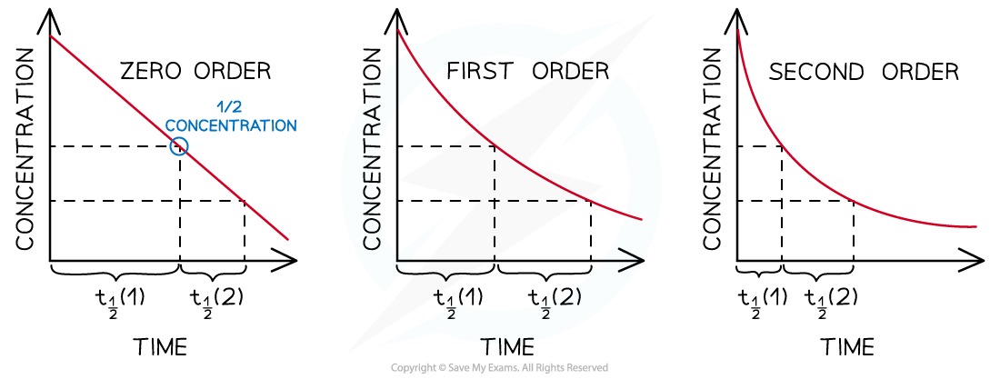

## Reaction Order Graphs

#### Reaction Order Using Concentration-Time Graphs

* In a **zero-order** reaction, the concentration of the reactant is inversely proportional to time

  + This means that the reactant concentration decreases as time increases
  + The graph is a straight line going down as shown:

***Concentration-time graph of a zero-order reaction***

* The gradient of the line is the rate of reaction

  + Calculating the gradient at different points on the graph, will give a constant value for the rate of reaction
* When the order with respect to a reactant is 0, a change in the concentration of the reactant has no effect on the rate of the reaction
* Therefore:

**Rate =** ***k***

* This equation means that the gradient of the graph is the rate of reaction as well as the rate constant, *k*

* In a **first-order** reaction, the concentration of the reactant decreases with time

  + The graph is a curve going downwards and eventually plateaus:

***Concentration-time graph of a first-order reaction***

* In a **second-order** reaction, the concentration of the reactant decreases more steeply with time

  + The concentration of reactant decreases **more** with increasing time compared to a first-order reaction
  + The graph is a steeper curve going downwards:

***Concentration-time graph of a second-order reaction***

#### Order of reaction from half-life

* The order of a reaction can also be deduced from its half-life **(t****1/2** **)**
* For a zero-order reaction the successive half-lives decrease with time

  + This means that it would take less time for the concentration of reactant to halve as the reaction progresses
* The half-life of a first-order reaction remains constant throughout the reaction

  + The amount of time required for the concentration of reactants to halve will be the same during the entire reaction
* For a second-order reaction, the half-life increases with time

  + This means that as the reaction is taking place, it takes more time for the concentration of reactants to halve

***Half-lives of zero, first and second-order reactions***

#### Examiner Tips and Tricks

Make sure that you know the correct shapes for the concentration-time graphs. It can be easy to confuse some concentration-time graphs with the following rate-concentration graphs, particularly;

* The straight line of a zero-order concentration-time graph with the straight line of a first-order rate-concentration graph.
* The curve of a first-order concentration-time graph with the curve of a second-order rate-concentration graph.

#### Reaction order using rate-concentration graphs

* In a **zero-order** reaction, the rate doesn’t depend on the concentration of the reactant

  + The rate of the reaction therefore remains constant throughout the reaction
  + The graph is a horizontal line
  + The rate equation is **rate =** ***k***

***Rate-concentration graph of a zero-order reaction***

* In a **first-order** reaction, the rate is directly proportional to the concentration of a reactant

  + The rate of the reaction increases as the concentration of the reactant increases
  + This means that the rate of the reaction decreases as the concentration of the reactant decreases when it gets used up during the reaction
  + The graph is a straight line
  + The rate equation is **rate =** ***k*****[A]**

***Rate-concentration graph of a first-order reaction***

* In a **second-order** reaction, the rate is directly proportional to the square of concentration of a reactant

  + The rate of the reaction increases more as the concentration of the reactant increases
  + This means that the rate of the reaction decreases more as the concentration of the reactant decreases when it gets used up during the reaction
  + The graph is a curved line
  + The rate equation is **rate =** ***k*****[A]****2**

***Rate-concentration graphs of a second-order reaction***

#### Examiner Tips and Tricks

Careful - sometimes when asked to complete calculations for the rate constant, *k*, the exam question will give you a graph as well as tabulated data. Do not ignore the graph as this demonstrates the order of one of the reactants, while the tabulated data allows you to determine the order for the other reactants.