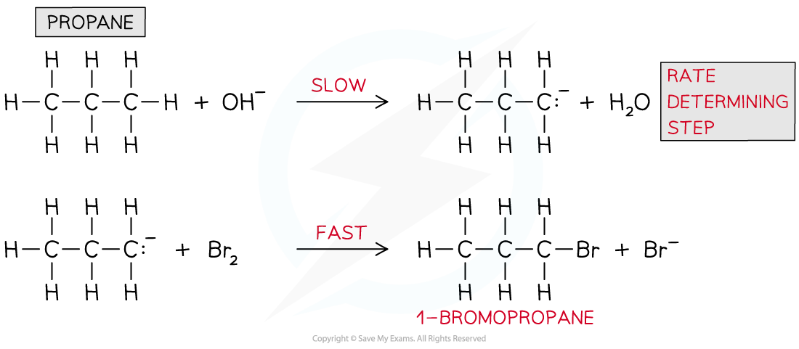

## Deducing Rate-Determining Steps

#### Rate-determining step & intermediates

* A chemical reaction can only go as fast as the slowest part of the reaction

  + So, the **rate-determining step** is the slowest step in the reaction
* If a reactant appears in the **rate-determining step**, then the concentration of that reactant will also appear in the **rate equation**
* For example, the rate equation for the reaction below is rate = *k* [CH3Br] [OH-]

**CH****3****Br + OH****-** **→ CH****3****OH + Br****-**

* This suggests that **both** CH3Br and OH- take part in the **slow rate-determining step**

#### Predicting the reaction mechanism

* The **overall reaction equation** and **rate equation** can be used to predict a possible reaction mechanism of a reaction

  + This shows the individual reaction steps which are taking place
* For example, nitrogen dioxide (NO2) and carbon monoxide (CO) react to form nitrogen monoxide (NO) and carbon dioxide (CO2)

  + The overall reaction equation is:

**NO****2** **(g) + CO (g) → NO (g) + CO****2** **(g)**

* The rate equation is:

**Rate =** ***k*** **[NO****2****]****2**

* From the rate equation it can be concluded that the reaction is **zero order** with respect to CO (g) and **second order** with respect to NO2 (g)
* This means that there are **two molecules** of NO2 (g) involved in the **rate-determining step** and **zero molecules** of CO (g)
* A possible reaction mechanism could therefore be:

**Step 1:**

**2NO****2** **(g) → NO (g) + NO****3** **(g)**                   **slow** (rate-determining step)

**Step 2:**

**NO****3** **(g) + CO (g) → NO****2** **(g) + CO****2** **(g)**     **fast**

**Overall:**

~~**2**~~**NO****2** **(g) +** ~~**NO**~~~~**3**~~ ~~**(g)**~~ **+ CO (g) → NO (g) +** ~~**NO**~~~~**3**~~ ~~**(g)**~~ **+** ~~**NO**~~~~**2**~~ ~~**(g)**~~ **+ CO****2** **(g)**

**=     NO****2** **(g) + CO (g) → NO (g) + CO****2** **(g)**

#### Predicting the reaction order & deducing the rate equation

* The **order** of a reactant and thus the rate equation can be deduced from a reaction mechanism if the rate-determining step is known
* For example, the reaction of nitrogen oxide (NO) with hydrogen (H2) to form nitrogen (N2) and water

**2NO (g) + 2H****2** **(g) → N****2** **(g) + 2H****2****O (l)**

* The reaction mechanism for this reaction is:

**Step 1:**

**NO (g) + NO (g) → N****2****O****2** **(g)**                      **fast**

**Step 2:**

**N****2****O****2** **(g) + H****2** **(g) → H****2****O (l) + N****2****O (g)**    **slow** (rate-determining step)

**Step 3:**

**N****2****O (g) + H****2** **(g) → N****2** **(g) + H****2****O (l)           fast**

* The second step in this reaction mechanism is the **rate-determining step**
* The rate-determining step consists of:

  + N2O2 which is formed from the reaction of **two NO molecules**
  + **One H****2** **molecule**
* The reaction is, therefore, **second order** with respect to NO and **first order** with respect to H2
* So, the **rate** **equation** becomes:

**Rate =** ***k*** **[NO]****2** **[H****2****]**

* The reaction is, therefore, **third order overall**

#### Identifying the rate-determining step

* The rate-determining step can be identified from a rate equation given that the reaction mechanism is known
* For example, propane (CH3CH2CH3) undergoes bromination under alkaline solutions
* The overall reaction is:

**CH****3****CH****2****CH****3** **+ Br****2** **+ OH****-** **→ CH****3****CH****2****CH****2****Br + H****2****O + Br****-**

* The reaction mechanism is:

***Reaction mechanism for the bromination of propane under alkaline conditions***

* The rate equation is:

**Rate =** ***k*** **[CH****3****CH****2****CH****3****] [OH****-****]**

* From the rate equation, it can be deduced that only CH3CH2CH3 and OH- are involved in the **rate-determining step** and not bromine (Br2)
* CH3CH2CH3 and OH- are only involved in the first step of the reaction mechanism, therefore the **rate-determining step** is:

  + CH3CH2CH3 + OH- **→** CH3CH2CH2- + H2O