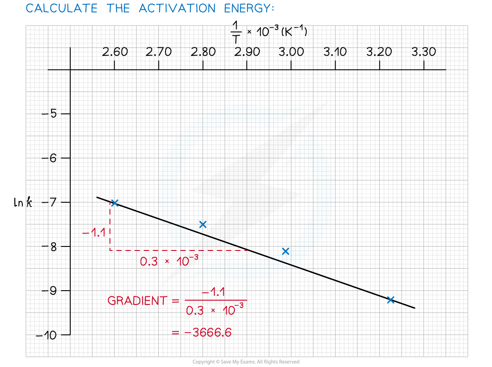

## Arrhenius & Activation Energy

* The rate equation shows how each of the reactants in a reaction affects the rate of the reaction and it includes the rate constant, *k*
* However, *k* only remains constant if the concentration of the reactants is the only factor which is changed

  + If the temperature is changed or a catalyst is used or changed, then the rate constant, *k*, changes
* At higher temperatures, a greater proportion of molecules have energy greater than than the activation energy
* Since the **rate constant** and **rate of reaction** are **directly proportional** to the fraction of molecules with energy equal or greater than the activation energy, then at higher temperatures:

  + The **rate of reaction** increases
  + The **rate constant** increases

* The relationship between the rate constant, the temperature and also the activation energy is given by the Arrhenius equation:

* *E**a* and *A* are constants that are characteristic of a specific reaction

  + *A* does vary slightly with temperature but it can still be considered a constant
  + *R* is a fundamental physical constant for all reactions
  + *k* and *T* are the only variables in the Arrhenius equation
* The Arrhenius equation is used to describe reactions that involve gases, reactions occurring in solution or reactions that occur on the surface of a catalyst

#### Finding the Activation Energy

* Very often, the Arrhenius equation is used to calculate the activation energy of a reaction
* A question will either give sufficient information for the Arrhenius equation to be used or a graph can be plotted and the calculation done from the plot

#### Using the Arrhenius Equation

* The Arrhenius equation is easier to use if you take natural logarithms of each side of the equation, which results in the following equation:

* The Arrhenius Equation can be used to show the effect that a change in temperature has on the rate constant, *k*, and thus on the overall rate of the reaction

  + An increase in temperature (higher value of *T*) gives a greater value of ln *k* and therefore a higher value of *k*
  + Since the rate of the reaction depends on the rate constant, *k*, an increase in *k* also means an increased rate of reaction
* The equation can also be used to show the effect of increasing the activation energy on the value of the rate constant, *k*

  + An increase in the activation energy, Ea, means that the proportion of molecules which possess at least the activation energy is less
  + This means that the rate of the reaction, and therefore the value of *k*, will decrease
* The values of *k* and *T* for a reaction can be determined experimentally

  + These values of *k* and *T* can then be used to calculate the activation energy for a reaction
  + This is the most common type of calculation you will be asked to do on this topic

#### Worked Example

Calculate the activation energy of a reaction which takes place at 400 K, where the rate constant of the reaction is 6.25 x 10-4 s-1.

*A* = 4.6 x 1013 and R = 8.31 J mol-1 K-1.

**Answer**

#### Using an Arrhenius plot:

* A graph of ln *k* against 1/*T* can be plotted, and then used to calculate *E**a*

  + This gives a line which follows the form y = mx + c

***The graph of ln k against 1/T is a straight line with gradient -E******a******/R***

* From the graph, the equation in the form of y = mx + c is as follows:

#### Worked Example

1. Complete the following table
2. Plot a graph of ln *k* against 1/*T*
3. Use this to calculate the activation energy, *E**a*, and the Arrhenius constant, *A*, of the reaction.

**Answer 1:**

**Answer 2:**

**Answer 3:**

