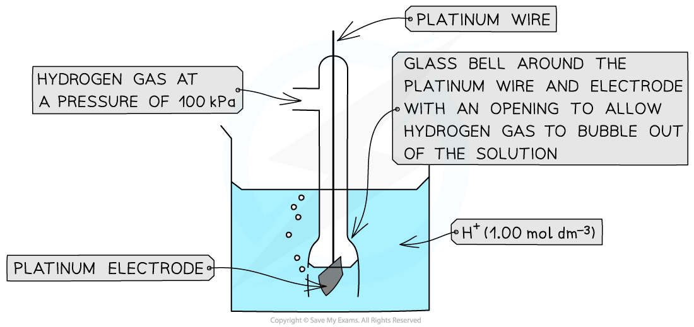

## Standard Electrode Potentials

#### Standard electrode potential

* The position of equilibrium and therefore the electrode potential depends on factors such as:

  + Temperature
  + Pressure of gases
  + Concentration of reagents
* So, to be able to compare the electrode potentials of different species, they all have to be measured against a common reference or standard
* **Standard** **conditions** also have to be used when comparing electrode potentials
* These standard conditions are:

  + Ion concentration of 1.00 mol dm-3
  + A temperature of 298 K
  + A pressure of 100 kPa
* Standard measurements are made using a **high resistance voltmeter** so that no current flows and the maximum potential difference is achieved

* The electrode potentials are measured relative to a **standard hydrogen electrode**
* The standard hydrogen electrode is given a value of 0.00 V, and all other electrode potentials are compared to this standard
* This means that the electrode potentials are always referred to as a **standard electrode potential** **(*****E*****ꝋ****)**
* The **standard electrode potential** **(*****E*****ꝋ****)**is the potential difference ( sometimes called voltage) produced when a **standard half-cell** is connected to a **standard hydrogen cell** under standard conditions
* For example, the standard electrode potential of bromine suggests that relative to the hydrogen half-cell it is more likely to get reduced, as it has a **more positive** *E*ꝋ value

**Br****2****(l) + 2e****–****⇌ 2Br****–****(aq)*****E*****ꝋ** **= +1.09 V**

**2H****+****(aq) + 2e****–****⇌ H****2****(g)*****E*****ꝋ** **= 0.00 V**

* The standard electrode potential of sodium, on the other hand, suggests that relative to the hydrogen half-cell it is less likely to get reduced as it has a **more negative** *E*ꝋ value

**Na****+****(aq) + e****–****⇌ Na(s)*****E*****ꝋ****= -2.71 V**

**2H****+****(aq) + 2e****–****⇌ H****2****(g)*****E*****ꝋ** **= 0.00 V**

## The Standard Hydrogen Electrode, SHE

* The **standard hydrogen electrode** is a half-cell used as a **reference electrode** and consists of:

  + Hydrogen gas in equilibrium with H+ ions of concentration 1.00 mol dm-3 (at 100 kPa)

**2H****+** **(aq) + 2e****-** **⇌ H****2** **(g)**

* An **inert** **platinum** electrode that is in contact with the hydrogen gas and H+ ions
* When the standard hydrogen electrode is connected to another half-cell, the **standard electrode potential** of that half-cell can be read off a high resistance voltmeter

***The standard electrode potential of a half-cell can be determined by connecting it to a standard hydrogen electrode***