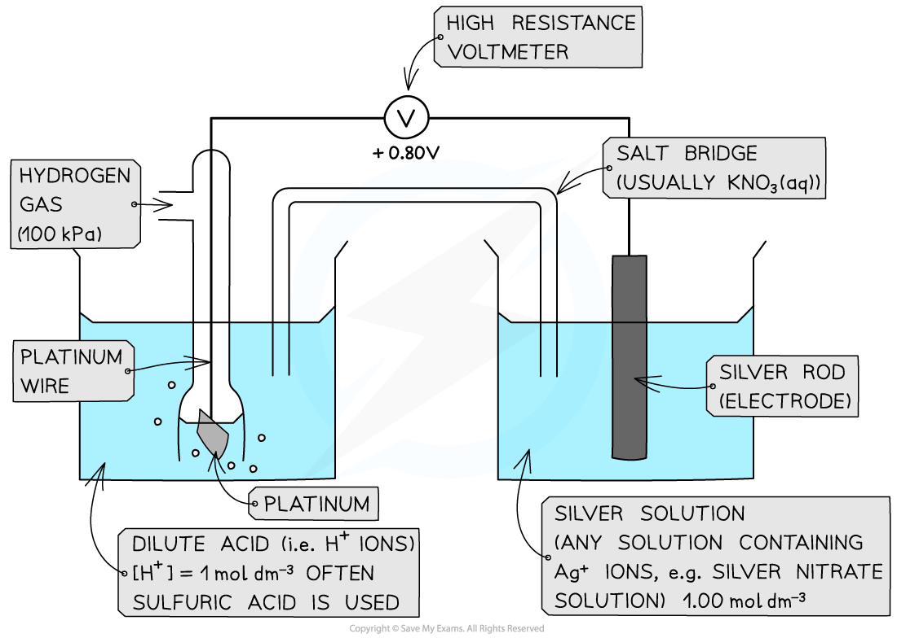
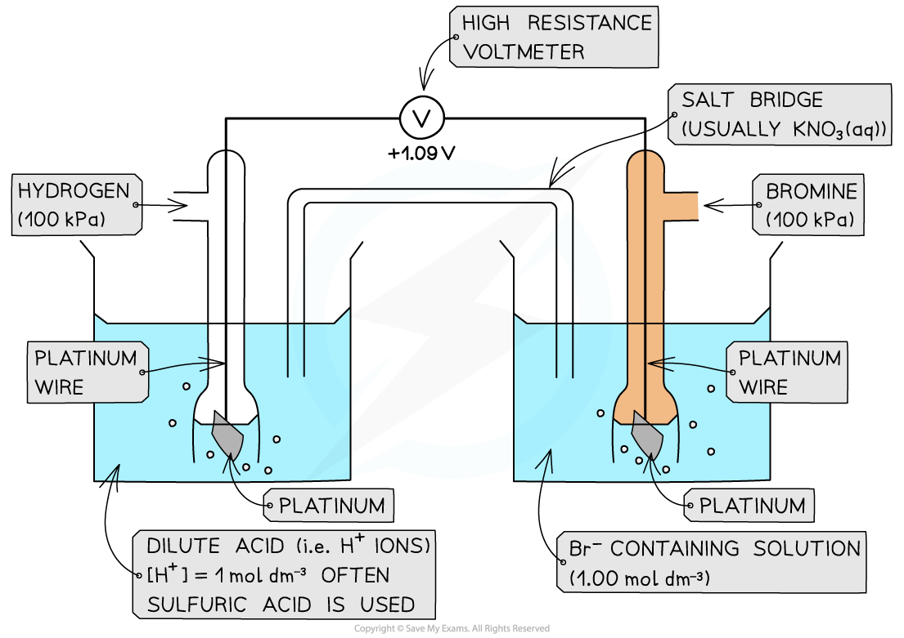

## Measuring Standard Electrode Potential

* There are three different types of half-cells that can be connected to a standard hydrogen electrode to measure standard electrode potential

  + A metal / metal ion half-cell
  + A non-metal / non-metal ion half-cell
  + An ion / ion half-cell (the ions are in different oxidation states)

#### Metal / metal-ion half-cell

***Example of a metal / metal ion half-cell connected to a standard hydrogen electrode***

* An example of a metal/metal ion half-cell is the Ag+/ Ag half-cell

  + Ag is the metal
  + Ag+ is the metal ion
* This half-cell is connected to a **standard hydrogen electrode** and the two half-equations are:

**Ag****+** **(aq) + e****-** **⇌ Ag (s)** ***E*****ꝋ** **= + 0.80 V**

**2H****+** **(aq) + 2e****-** **⇌ H****2** **(g)** ***E*****ꝋ** **= 0.00 V**

* Since the Ag+/ Ag half-cell has a more positive *E*ꝋ value, this is the **positive pole** and the H+/H2 half-cell is the **negative** pole
* The **standard cell potential (***E**cell*ꝋ) is ***E******cell*****ꝋ** **= (+ 0.80) - (0.00) = + 0.80 V**
* The Ag+ ions are more likely to get **reduced** than the H+ ions as it has a greater *E*ꝋ value

  + Reduction occurs at the **positive electrode**
  + Oxidation occurs at the **negative electrode**

#### Non-metal / non-metal ion half-cell

* In a **non-metal / non-metal ion** half-cell, **platinum** wire or foil is used as an electrode to make electrical contact with the solution

  + Like graphite, platinum is inert and does not take part in the reaction
  + The redox equilibrium is established on the platinum surface
* An example of a non-metal / non-metal ion is the Br2/ Br- half-cell

  + Br2 is the non-metal
  + Br- is the non-metal ion
* The half-cell is connected to a **standard hydrogen electrode** and the two half-equations are:

**Br****2** **(aq) + 2e****-** **⇌ 2Br****-** **(aq)** ***E*****ꝋ** **= +1.09 V**

**2H****+** **(aq) + 2e****-** **⇌ H****2** **(g)** ***E*****ꝋ** **= 0.00 V**

* The Br2/ Br- half-cell is the **positive pole** and the H+/ H2 is the **negative** pole
* The *E**cell*ꝋ is: ***E******cell*****ꝋ** **= (+ 1.09) - (0.00) = + 1.09 V**
* The Br2 molecules are more likely to get **reduced** than H+ as they have a greater *E*ꝋ value

***Example of a non-metal / non-metal ion half-cell connected to a standard hydrogen electrode***

#### Ion / Ion half-cell

* A **platinum electrode** is again used to form a half-cell of ions that are in **different oxidation states**
* An example of such a half-cell is the MnO4- / Mn2+ half-cell

  + MnO4- is an ion containing Mn with oxidation state +7
  + The Mn2+ ion contains Mn with oxidation state +2
* This half-cell is connected to a **standard hydrogen electrode** and the two half-equations are:

**MnO****4****-** **(aq) + 8H****+** **(aq) + 5e****-** **⇌ Mn****2+** **(aq) + 4H****2****O (l)*****E*****ꝋ** **= +1.52 V**

**2H****+** **(aq) + 2e****-** **⇌ H****2** **(g)*****E*****ꝋ** **= 0.00 V**

* The H+ ions are also present in the half-cell as they are required to convert MnO4- into Mn2+ ions
* The MnO4- / Mn2+ half-cell is the **positive pole** and the H+ / H2 is the **negative** pole
* The *E**cell*ꝋ is ***E******cell*****ꝋ** **= (+ 1.52) - (0.00) = + 1.52 V**

***Ions in solution half cell***

#### The Salt Bridge

* A salt bridge has **mobile ions** that complete the circuit
* Ions must be able to flow between the half-cells or solutions
* This should be made on metal wire, even if the metal is inert

  + Metal wire allows the flow of electrons but not the flow of ions
* **Potassium chloride** and **potassium nitrate** are commonly used to make the salt bridge as chlorides and nitrates are usually soluble
* This should ensure that no precipitates form which can affect the equilibrium position of the half cells

## Electromotive Force

#### Standard cell potential

* Once the ***E***ꝋ of a half-cell is known, the **potential difference** or **voltage** or **emf** of an **electrochemical cell** made up of any two half-cells can be calculated

  + These could be **any** half-cells and neither have to be a standard hydrogen electrode
* The **standard cell potential (***E**cell*ꝋ) can be calculated by **subtracting** the **less** **positive** *E*ꝋ from the **more positive** *E*ꝋ value

  + The half-cell with the more positive *E*ꝋ value will be the **positive** pole

    - By convention this is shown on the right hand side in a conventional cell diagram, so is termed ***E******right*****ꝋ**
  + The half-cell with the less positive *E*ꝋvalue will be the **negative**pole

    - By convention this is shown on the left hand side in a conventional cell diagram, so is termed ***E******left*****ꝋ**

***E******cell*****ꝋ****=*****E******right*****ꝋ****-*****E******left*****ꝋ**

* Since oxidation is always on the left and reduction on the right, you can also use this version

***E******cell*****ꝋ****=*****E******reduction*****ꝋ****-*****E******oxidation***

#### Worked Example

**Calculating the standard cell potential**

Calculate the standard cell potential for the electrochemical cell below and explain why the Cu2+/ Cu half-cell is the positive pole. The half-equations are as follows:

Cu2+(aq) + 2e- ⇌ Cu(s)      *E*ꝋ = +0.34 V

Zn2+(aq) + 2e- ⇌ Zn(s)      *E*ꝋ = −0.76 V

**Answer**

**Step 1:** Calculate the standard cell potential. The copper is more positive so must be the right hand side.

*E**cell*ꝋ = *E**right*ꝋ- *E**left*ꝋ

*E**cell*ꝋ = (+0.34) - (-0.76)

= +1.10 V

The voltmeter will therefore give a value of +1.10 V

**Step 2:** Determine the positive and negative poles

The Cu2+/ Cu  half-cell is the **positive** pole as its *E*ꝋ is more positive than the *E*ꝋ value of the Zn2+/ Zn half-cell

#### Examiner Tips and Tricks

**A helpful mnemonic for remembering redox in cells**

***Lio the lion goes Roor!***

Lio stands for 'Left Is Oxidation' and he is saying ROOR because that is the order of species in the cell:

Reduced/Oxidised (salt bridge) Oxidised/Reduced