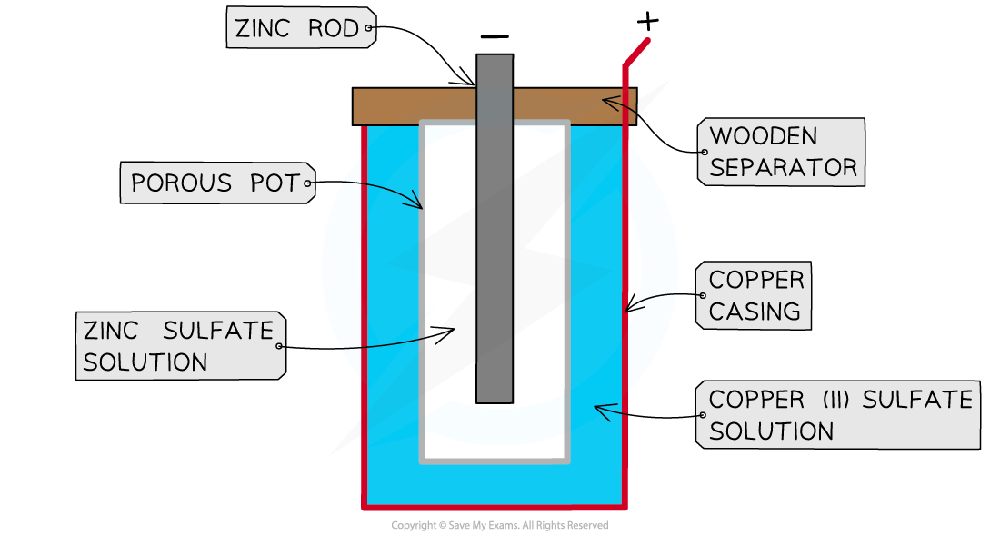
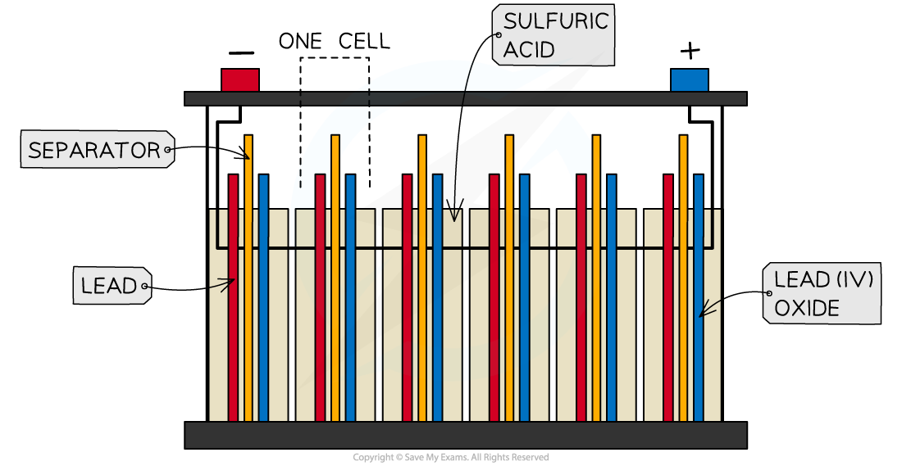
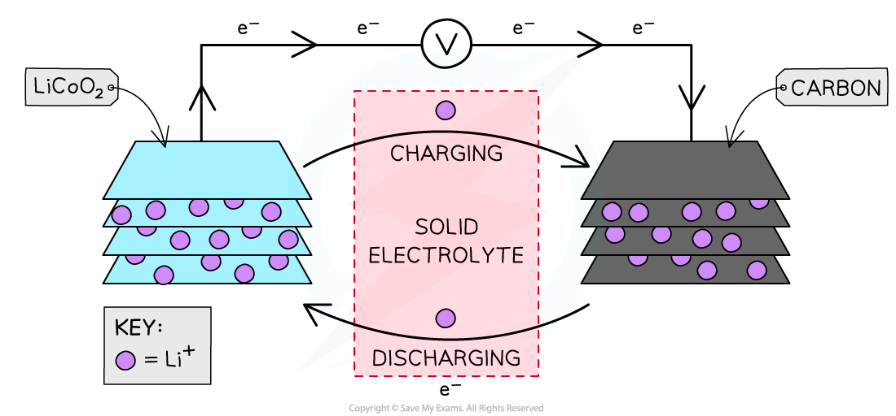

## Storage Cells

* Electrochemical cells can be used as a commercial source of electrical energy
* Cells can be described as **primary, secondary** or **fuel cells**

  + Primary cells are **non-rechargeable** (irreversible)
  + Secondary cells are **rechargeable**
* Type of cells used in commercial applications depend on

  + the **voltage** required
  + the **current** needed
  + the **size** of the cell
  + the **cost**
* Although it is commonly used incorrectly, the term *battery* should be used to refer to a *collection* of cells
* A car battery is correct, because it is a collection of six cells joined together

#### Primary cells

**The Daniell cell**

* The Daniell cell was one of the earliest electrochemical cells and consisted of a simple metal-metal ion system
* It was invented by British chemist John Daniell in 1836
* The cell consists of

  + a zinc rod immersed in a solution of zinc sulfate
  + a copper cylinder filled with copper sulfate solution
  + a porous pot that separates the copper sulfate from the zinc sulfate

***A Daniell cell***

* The zinc acts as the negative electrode and the copper is the positive electrode
* The half-cell reactions are

**Zn (s) →   Zn****2+** **(aq)  +  2e****-*****E******θ*****= -0.76 V**

**Cu****2+** **(aq)  + 2e****-** **→ Cu (s)** ***E******θ*****= +0.34 V**

* The cell generates an EMF of 1.1 V and the overall reaction is

**Zn (s)  + CuSO****4****(aq)→ Cu (s)  + ZnSO****4** **(aq)** ***E******θ******cell*** **= +1.10 V**

* However, the cell is impractical to use as a portable device because of the hazardous liquids in the cell

**Zinc-carbon cells**

* Zinc-carbon cells are the most common type of non-rechargeable cells, consisting of

  + a zinc casing which acts as the negative electrode
  + a paste of ammonium chloride which acts as an electrolyte as well as the positive electrode
  + a carbon rod which acts as an electron carrier in the cell

***The zinc-carbon cell***

* The half-cell reactions are

**Zn (s) →   Zn****2+** **(aq)  +  2e****-*****E******θ*** **= -0.76 V**

**2NH****4****+** **(aq) + 2e****-** **→ 2NH****3** **(g) + H****2** **(g)** ***E******θ*****= +0.74 V**

* The cell generates an emf of 1.50 V and the overall reaction is

**2NH****4****+** **(aq) + Zn (s)  → 2NH****3** **(g) + H****2** **(g)  + Zn****2+** **(aq)** ***E******θ******cell*** **= +1.50 V**

* As the cell discharges, the zinc casing eventually wears away and the corrosive contents of the electrolyte paste can leak out, which is an obvious disadvantage of zinc-carbon cells
* The cell provides a small current and is relative cheap compared to other cells
* Extra long life cells have a similar chemistry, but supply a higher current and use zinc chloride in the paste; they are suitable for torches, radios and clocks
* Another variation on the cell uses an alkaline paste in the electrolyte and they have a much longer operating life, but are noticeably more expensive than regular zinc-carbon cells

#### Secondary Cells

* Secondary / rechargeable cells employ chemical reactions which can be reversed by applying a voltage greater than the cell voltage, causing electrons to push in the opposite direction
* There are many types of rechargeable cells, but common ones include **lead-acid** batteries, **NiCad** cells and **lithium** cells which are covered in more detail in the next section

**Lead-acid batteries**

* Lead-acid batteries consist of **six cells** joined together **in series**
* The cells use **lead** metal as the **negative electrode** and and **lead(IV) oxide** as the **positive electrode**
* The electrolyte is sulfuric acid

***A lead-acid battery***

* The half-cell reactions are

**Pb (s) +  SO****4****2-** **(aq)****→   PbSO****4****(s)  +  2e****-*****E******θ*****= -0.36 V**

**PbO****2****(s) +  4H****+** **(aq) +  SO****4****2-** **(aq) +  2e****-** **→  PbSO****4** **(s)  + 2H****2****O (l)*****E******θ*****= +1.70 V**

* The cell generates an EMF of about 2 V and the overall reaction is

**PbO****2** **(s) +  4H****+** **(aq) +  2SO****4****2-** **(aq) +  Pb (s) →  2PbSO****4** **(s)  + 2H****2****O (l)*****E******θ******cell*** **= +2.06 V**

* In a commercial car battery, the six cells in series give a combined voltage of about 12 V
* When the car is in motion, the generator provides a push of electrons that reverses the reaction and regenerates lead and lead(IV) oxide
* Lead-acid batteries are designed to produce a **high current** for a short period of time, hence their use in powering a starter motor in car engines
* The disadvantage of lead-acid batteries is that:

  + They are very **heavy**
  + They contain **toxic** materials: lead and lead(IV) oxide
  + The sulfuric acid electrolyte is very **corrosive**
* This presents challenges of disposal when lead-acid batteries come to the end of their useful life

**NiCad cells**

* NiCad stands for nickel-cadmium and these cells are available in many standard sizes and voltages so they can replace almost any application of traditional zinc-carbon cells
* Although they are more expensive cells, the fact they can be recharged hundreds of times means they are commercially viable
* The positive electrode consists of cadmium and the negative electrode is made of a nickel(II) hydroxide-oxide system

* The half-cell reactions are

**Cd (s) +  2OH****-****(aq) → Cd(OH)****2** **(s)  +  2e****-*****E******θ*****= -0.82 V**

**NiO(OH) (s) + H****2****O (l) + e****-** **→ Ni(OH)****2** **(s) +   OH****-****(aq)*****E******θ*****=  +0.38 V**

* The overall reaction in the cell is

**2NiO(OH) (s) + 2H****2****O (l) + Cd (s) → 2Ni(OH)****2** **(s) + Cd(OH)****2** **(s)*****E******θ*****= +1.2 V**

* Cadmium is a toxic metal so the disposal of old NiCad cells is also an environmental issue

**Lithium Cells**

* Lithium ion cells power the laptop or mobile device you are probably reading this on
* The Noble Prize for Chemistry in 2019 was awarded to John B. Goodenough, M. Stanley Whittingham and Akira Yoshino for their work on lithium ion cells that have revolutionised portable electronics
* Lithium is used because it has a very low density and relatively high electrode potential
* The cell consists of:

  + a positive lithium cobalt oxide electrode
  + a negative carbon electrode
  + a porous polymer membrane electrolyte
* The polymer electrolyte cannot leak since it is not a liquid or paste, which presents advantages over other types of cells

***Lithium ion cell***

* The cell consists of a sandwich of different layers of lithium cobalt oxide and carbon
* When the cell is charged and discharged the lithium ions flow between the negative and the positive through the solid electrolyte
* The half-cell reactions on discharge are:

**Li (s) →   Li****+** **(s)  +  e****–** ***E******θ*** **= -3 V**

**Li****+** **(s)  + CoO****2** **(s)  +  e****–** **→   Li** **+** **(CoO****2****)** **–** **(s)*****E******θ*** **= +1 V**

* The cell generates an EMF of between 3.5 V and 4.0 V and the overall reaction is

**Li (s)  + CoO****2** **(s)  →   Li** **+** **(CoO****2****)** **–** **(s)*****E******θ******cell*** **~ +3.5**

* NiCad cells have a problem called the memory effect in which they gradually begin to lose their charge after repeated charge cycles when the cell is not fully discharged. The cells appear to 'remember' their lower state of charge
* Lithium-ion cells do not have this problem so can be topped up without any loss of charge
* Some of the problems with lithium ion cells:

  + A global shortage of lithium is likely to make lithium ion cells unsustainable as the current demand for lithium exceeds the supply
  + If cells are not recycled but thrown away in landfills, then a huge amount of lithium becomes lost to future generations
  + Reports of lithium ion cell fires have raised concern about the safety of these batteries in electronic devices; it is a reminder to us that lithium is a very reactive element in Group 1 of the periodic table, which is why it has a high electrode potential