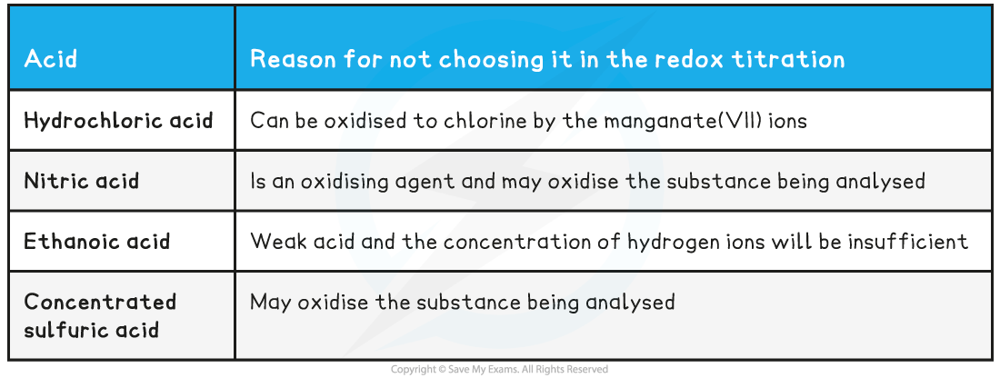
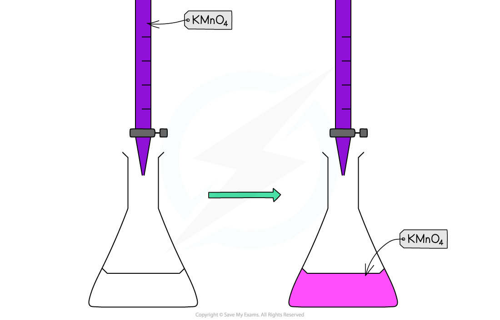

Redox Titration Calculations
----------------------------

#### Redox Titrations

* In a<b> titration</b>, the concentration of a solution is determined by titrating with a solution of known concentration.
* In redox titrations, an <b>oxidising agent</b> is titrated against a <b>reducing agent</b>
* Electrons are transferred from one species to the other
* <b>Indicators</b> are sometimes used to show the endpoint of the<b> titration</b>
* However, most <b>transition metal ions</b> naturally change colour when changing<b> oxidation state</b>
* There are two common <b>redox titrations</b> you should know about <b>manganate(VII) titrations</b> and<b> iodine-thiosulfate titrations</b>

#### Potassium manganate(VII) titrations

* In these redox titrations the manganate(VII) is the oxidising agent and is reduced to Mn2+(aq)
* The iron is the reducing agent and is oxidised to Fe3+(aq) and the reaction mixture must be acidified, to excess acid is added to the iron(II) ions before the reaction begins
* The choice of acid is important, as it must not react with the manganate(VII) ions, so the acid normally used is dilute sulfuric acid

  + As it does not oxidise under these conditions and does not react with the manganate(VII) ions
* You could be asked why other acids are not suitable for this redox titration in the exam so make sure you understand the suitability of dilute sulfuric acid

<b>Table explaining why other acids are not suitable for the redox titration</b>

#### Indicator and end point

* Potassium manganate(VII) titrations are self-indicating

  + Potassium manganate(VII) solution is purple
* The potassium manganate(VII) solution is titrated into the conical flask from the burette
* The manganate(VII) ions react with the analyte to form manganese(II) ions

  + The manganese(II) ions, Mn2+(aq), have a very pale pink colour
  + But, the concentration is so low that the solution looks colourless
* When all of the analyte ions have reacted with the manganate(VII) ions, a pale pink colour appears in the flask due to an excess of manganate(VII) ions

  + When this colour remains with swirling, the endpoint has been reached

*<b>Redox titration colour change for potassium permanganate and iron(II) ions</b>*

#### Worked Example

<b>Equations</b>

Find the stoichiometry for the reaction and complete the two half equations:

MnO4- (aq) + 5e- + 8H+ (aq) → Mn2+ (aq) + 4H2O (l)

Fe2+ (aq) → Fe3+ (aq) + e-

<b>   </b>

<b>   Answers:</b>

   Balance the electrons:

MnO4- (aq) + 5e- + 8H+ (aq) → Mn2+ (aq) + 4H2O (l)

5Fe2+ (aq) → 5Fe3+ (aq) + 5e-

   Add the two half equations:

MnO4- (aq) + 8H+ (aq) 5Fe2+ (aq) → Mn2+ (aq) + 4H2O (l) + 5Fe3+ (aq)

* Manganate(VII) titrations can be used to determine:

  + The percentage purity of iron supplements
* Percentage purity = ![fraction numerator mass space of space sample over denominator mass space of space impure space sample end fraction space cross times space 100](data:image/svg+xml;charset=utf8,%3Csvg%20xmlns%3D%22http%3A%2F%2Fwww.w3.org%2F2000%2Fsvg%22%20xmlns%3Awrs%3D%22http%3A%2F%2Fwww.wiris.com%2Fxml%2Fmathml-extension%22%20height%3D%2239%22%20width%3D%22198%22%20wrs%3Abaseline%3D%2224%22%3E%3C!--MathML%3A%20%3Cmath%20xmlns%3D%22http%3A%2F%2Fwww.w3.org%2F1998%2FMath%2FMathML%22%20style%3D%22font-family%3AArial%22%3E%3Cmstyle%20mathsize%3D%2214px%22%3E%3Cmfrac%3E%3Cmrow%3E%3Cmi%3Emass%3C%2Fmi%3E%3Cmo%3E%26%23xA0%3B%3C%2Fmo%3E%3Cmi%3Eof%3C%2Fmi%3E%3Cmo%3E%26%23xA0%3B%3C%2Fmo%3E%3Cmi%3Esample%3C%2Fmi%3E%3C%2Fmrow%3E%3Cmrow%3E%3Cmi%3Emass%3C%2Fmi%3E%3Cmo%3E%26%23xA0%3B%3C%2Fmo%3E%3Cmi%3Eof%3C%2Fmi%3E%3Cmo%3E%26%23xA0%3B%3C%2Fmo%3E%3Cmi%3Eimpure%3C%2Fmi%3E%3Cmo%3E%26%23xA0%3B%3C%2Fmo%3E%3Cmi%3Esample%3C%2Fmi%3E%3C%2Fmrow%3E%3C%2Fmfrac%3E%3Cmo%3E%26%23xA0%3B%3C%2Fmo%3E%3Cmo%3E%26%23xD7%3B%3C%2Fmo%3E%3Cmo%3E%26%23xA0%3B%3C%2Fmo%3E%3Cmn%3E100%3C%2Fmn%3E%3C%2Fmstyle%3E%3C%2Fmath%3E--%3E%3Cdefs%3E%3Cstyle%20type%3D%22text%2Fcss%22%3E%40font-face%7Bfont-family%3A'math13b8a614226a953a8cd9526fca6'%3Bsrc%3Aurl(data%3Afont%2Ftruetype%3Bcharset%3Dutf-8%3Bbase64%2CAAEAAAAMAIAAAwBAT1MvMi7iBBMAAADMAAAATmNtYXDEvmKUAAABHAAAADRjdnQgDVUNBwAAAVAAAAA6Z2x5ZoPi2VsAAAGMAAAAl2hlYWQQC2qxAAACJAAAADZoaGVhCGsXSAAAAlwAAAAkaG10eE2rRkcAAAKAAAAACGxvY2EAHTwYAAACiAAAAAxtYXhwBT0FPgAAApQAAAAgbmFtZaBxlY4AAAK0AAABn3Bvc3QB9wD6AAAEVAAAACBwcmVwa1uragAABHQAAAAUAAADSwGQAAUAAAQABAAAAAAABAAEAAAAAAAAAQEAAAAAAAAAAAAAAAAAAAAAAAAAAAAAAAAAAAAAACAgICAAAAAg1UADev96AAAD6ACWAAAAAAACAAEAAQAAABQAAwABAAAAFAAEACAAAAAEAAQAAQAAANf%2F%2FwAAANf%2F%2F%2F8qAAEAAAAAAAABVAMsAIABAABWACoCWAIeAQ4BLAIsAFoBgAKAAKAA1ACAAAAAAAAAACsAVQCAAKsA1QEAASsABwAAAAIAVQAAAwADqwADAAcAADMRIRElIREhVQKr%2FasCAP4AA6v8VVUDAAACAIAAVQLVAoAAAwAHAEYYsAEUALEAABMQsQAJ5LEAARMQsAQ8sQYI9LACPDABsQgBExCxAAP2sAc8sQEF9bAGPLIFBwAQ9LACPLEJA%2BaxBAX1sAM8EzMBIxEzASOAVQIAVVX%2BAFUCgP3VAiv91QAAAQAAAAEAANV4zkFfDzz1AAMEAP%2F%2F%2F%2F%2FWOhNz%2F%2F%2F%2F%2F9Y6E3MAAP8gBIADqwAAAAoAAgABAAAAAAABAAAD6P9qAAAXcAAA%2F7YEgAABAAAAAAAAAAAAAAAAAAAAAgNSAFUDVgCAAAAAAAAAACgAAACXAAEAAAACAF4ABQAAAAAAAgCABAAAAAAABAAA3gAAAAAAAAAVAQIAAAAAAAAAAQASAAAAAAAAAAAAAgAOABIAAAAAAAAAAwAwACAAAAAAAAAABAASAFAAAAAAAAAABQAWAGIAAAAAAAAABgAJAHgAAAAAAAAACAAcAIEAAQAAAAAAAQASAAAAAQAAAAAAAgAOABIAAQAAAAAAAwAwACAAAQAAAAAABAASAFAAAQAAAAAABQAWAGIAAQAAAAAABgAJAHgAAQAAAAAACAAcAIEAAwABBAkAAQASAAAAAwABBAkAAgAOABIAAwABBAkAAwAwACAAAwABBAkABAASAFAAAwABBAkABQAWAGIAAwABBAkABgAJAHgAAwABBAkACAAcAIEATQBhAHQAaAAgAEYAbwBuAHQAUgBlAGcAdQBsAGEAcgBNAGEAdABoAHMAIABGAG8AcgAgAE0AbwByAGUAIABNAGEAdABoACAARgBvAG4AdABNAGEAdABoACAARgBvAG4AdABWAGUAcgBzAGkAbwBuACAAMQAuADBNYXRoX0ZvbnQATQBhAHQAaABzACAARgBvAHIAIABNAG8AcgBlAAADAAAAAAAAAfQA%2BgAAAAAAAAAAAAAAAAAAAAAAAAAAuQcRAACNhRgAsgAAABUUE7EAAT8%3D)format('truetype')%3Bfont-weight%3Anormal%3Bfont-style%3Anormal%3B%7D%3C%2Fstyle%3E%3C%2Fdefs%3E%3Cline%20stroke%3D%22%23000%22%20stroke-linecap%3D%22square%22%20stroke-width%3D%221%22%20x1%3D%222.5%22%20x2%3D%22148.5%22%20y1%3D%2219.5%22%20y2%3D%2219.5%22%2F%3E%3Ctext%20font-family%3D%22Arial%22%20font-size%3D%2214%22%20text-anchor%3D%22middle%22%20x%3D%2243.5%22%20y%3D%2214%22%3Emass%3C%2Ftext%3E%3Ctext%20font-family%3D%22Arial%22%20font-size%3D%2214%22%20text-anchor%3D%22middle%22%20x%3D%2270.5%22%20y%3D%2214%22%3Eof%3C%2Ftext%3E%3Ctext%20font-family%3D%22Arial%22%20font-size%3D%2214%22%20text-anchor%3D%22middle%22%20x%3D%22102.5%22%20y%3D%2214%22%3Esample%3C%2Ftext%3E%3Ctext%20font-family%3D%22Arial%22%20font-size%3D%2214%22%20text-anchor%3D%22middle%22%20x%3D%2219.5%22%20y%3D%2235%22%3Emass%3C%2Ftext%3E%3Ctext%20font-family%3D%22Arial%22%20font-size%3D%2214%22%20text-anchor%3D%22middle%22%20x%3D%2246.5%22%20y%3D%2235%22%3Eof%3C%2Ftext%3E%3Ctext%20font-family%3D%22Arial%22%20font-size%3D%2214%22%20text-anchor%3D%22middle%22%20x%3D%2277.5%22%20y%3D%2235%22%3Eimpure%3C%2Ftext%3E%3Ctext%20font-family%3D%22Arial%22%20font-size%3D%2214%22%20text-anchor%3D%22middle%22%20x%3D%22125.5%22%20y%3D%2235%22%3Esample%3C%2Ftext%3E%3Ctext%20font-family%3D%22math13b8a614226a953a8cd9526fca6%22%20font-size%3D%2214%22%20text-anchor%3D%22middle%22%20x%3D%22162.5%22%20y%3D%2224%22%3E%26%23xD7%3B%3C%2Ftext%3E%3Ctext%20font-family%3D%22Arial%22%20font-size%3D%2214%22%20text-anchor%3D%22middle%22%20x%3D%22184.5%22%20y%3D%2224%22%3E100%3C%2Ftext%3E%3C%2Fsvg%3E)

  + The formula of a sample of hydrated ethanedioic acid

#### Worked Example

<b>Analysis of iron tablets</b>

An iron tablet, weighing 0.960 g was dissolved in dilute sulfuric acid. An average titre of 28.50 cm3 of 0.0180 mol dm-3 potassium manganate(VII) solution was needed to reach the endpoint.

What is the percentage by mass of iron in the tablet?

<b>Answer:</b>

* MnO4- (aq) + 8H+ (aq) + 5Fe2+ → Mn2+ (aq) + 5Fe3+ (aq) + 4H2O (l)

  + 1 : 5 ratio of MnO4- : Fe2+
  + Number of moles of MnO4- (aq)![equals space fraction numerator 0.0180 space cross times space 28.50 over denominator 1000 end fraction space equals](data:image/svg+xml;charset=utf8,%3Csvg%20xmlns%3D%22http%3A%2F%2Fwww.w3.org%2F2000%2Fsvg%22%20xmlns%3Awrs%3D%22http%3A%2F%2Fwww.wiris.com%2Fxml%2Fmathml-extension%22%20height%3D%2238%22%20width%3D%22151%22%20wrs%3Abaseline%3D%2224%22%3E%3C!--MathML%3A%20%3Cmath%20xmlns%3D%22http%3A%2F%2Fwww.w3.org%2F1998%2FMath%2FMathML%22%20style%3D%22font-family%3AArial%22%3E%3Cmstyle%20mathsize%3D%2214px%22%3E%3Cmo%3E%3D%3C%2Fmo%3E%3Cmo%3E%26%23xA0%3B%3C%2Fmo%3E%3Cmfrac%3E%3Cmrow%3E%3Cmn%3E0%3C%2Fmn%3E%3Cmo%3E.%3C%2Fmo%3E%3Cmn%3E0180%3C%2Fmn%3E%3Cmo%3E%26%23xA0%3B%3C%2Fmo%3E%3Cmo%3E%26%23xD7%3B%3C%2Fmo%3E%3Cmo%3E%26%23xA0%3B%3C%2Fmo%3E%3Cmn%3E28%3C%2Fmn%3E%3Cmo%3E.%3C%2Fmo%3E%3Cmn%3E50%3C%2Fmn%3E%3C%2Fmrow%3E%3Cmn%3E1000%3C%2Fmn%3E%3C%2Fmfrac%3E%3Cmo%3E%26%23xA0%3B%3C%2Fmo%3E%3Cmo%3E%3D%3C%2Fmo%3E%3C%2Fmstyle%3E%3C%2Fmath%3E--%3E%3Cdefs%3E%3Cstyle%20type%3D%22text%2Fcss%22%3E%40font-face%7Bfont-family%3A'math17994cda3defe015d857709bac5'%3Bsrc%3Aurl(data%3Afont%2Ftruetype%3Bcharset%3Dutf-8%3Bbase64%2CAAEAAAAMAIAAAwBAT1MvMi7iBBMAAADMAAAATmNtYXDEvmKUAAABHAAAAERjdnQgDVUNBwAAAWAAAAA6Z2x5ZoPi2VsAAAGcAAABZ2hlYWQQC2qxAAADBAAAADZoaGVhCGsXSAAAAzwAAAAkaG10eE2rRkcAAANgAAAAEGxvY2EAHTwYAAADcAAAABRtYXhwBT0FPgAAA4QAAAAgbmFtZaBxlY4AAAOkAAABn3Bvc3QB9wD6AAAFRAAAACBwcmVwa1uragAABWQAAAAUAAADSwGQAAUAAAQABAAAAAAABAAEAAAAAAAAAQEAAAAAAAAAAAAAAAAAAAAAAAAAAAAAAAAAAAAAACAgICAAAAAg1UADev96AAAD6ACWAAAAAAACAAEAAQAAABQAAwABAAAAFAAEADAAAAAIAAgAAgAAAC4APQDX%2F%2F8AAAAuAD0A1%2F%2F%2F%2F9P%2Fxf8sAAEAAAAAAAAAAAAAAVQDLACAAQAAVgAqAlgCHgEOASwCLABaAYACgACgANQAgAAAAAAAAAArAFUAgACrANUBAAErAAcAAAACAFUAAAMAA6sAAwAHAAAzESERJSERIVUCq%2F2rAgD%2BAAOr%2FFVVAwAAAQAgAAAAoACAAAMALxgBsAQQsAPUsAMQsALUsAMQsAA8sAIQsAE8ALAEELAD1LADELACPLAAELABPDAxNzMVIyCAgICAAAIAgADrAtUCFQADAAcAZRgBsAgQsAbUsAYQsAXUsAgQsAHUsAEQsADUsAYQsAc8sAUQsAQ8sAEQsAI8sAAQsAM8ALAIELAG1LAGELAH1LAHELAB1LABELAC1LAGELAFPLAHELAEPLABELAAPLACELADPDEwEyE1IR0BITWAAlX9qwJVAcBV1VVVAAIAgABVAtUCgAADAAcARhiwARQAsQAAExCxAAnksQABExCwBDyxBgj0sAI8MAGxCAETELEAA%2FawBzyxAQX1sAY8sgUHABD0sAI8sQkD5rEEBfWwAzwTMwEjETMBI4BVAgBVVf4AVQKA%2FdUCK%2F3VAAABAAAAAQAA1XjOQV8PPPUAAwQA%2F%2F%2F%2F%2F9Y6E3P%2F%2F%2F%2F%2F1joTcwAA%2FyAEgAOrAAAACgACAAEAAAAAAAEAAAPo%2F2oAABdwAAD%2FtgSAAAEAAAAAAAAAAAAAAAAAAAAEA1IAVQDIACADVgCAA1YAgAAAAAAAAAAoAAAAbgAAAPgAAAFnAAEAAAAEAF4ABQAAAAAAAgCABAAAAAAABAAA3gAAAAAAAAAVAQIAAAAAAAAAAQASAAAAAAAAAAAAAgAOABIAAAAAAAAAAwAwACAAAAAAAAAABAASAFAAAAAAAAAABQAWAGIAAAAAAAAABgAJAHgAAAAAAAAACAAcAIEAAQAAAAAAAQASAAAAAQAAAAAAAgAOABIAAQAAAAAAAwAwACAAAQAAAAAABAASAFAAAQAAAAAABQAWAGIAAQAAAAAABgAJAHgAAQAAAAAACAAcAIEAAwABBAkAAQASAAAAAwABBAkAAgAOABIAAwABBAkAAwAwACAAAwABBAkABAASAFAAAwABBAkABQAWAGIAAwABBAkABgAJAHgAAwABBAkACAAcAIEATQBhAHQAaAAgAEYAbwBuAHQAUgBlAGcAdQBsAGEAcgBNAGEAdABoAHMAIABGAG8AcgAgAE0AbwByAGUAIABNAGEAdABoACAARgBvAG4AdABNAGEAdABoACAARgBvAG4AdABWAGUAcgBzAGkAbwBuACAAMQAuADBNYXRoX0ZvbnQATQBhAHQAaABzACAARgBvAHIAIABNAG8AcgBlAAADAAAAAAAAAfQA%2BgAAAAAAAAAAAAAAAAAAAAAAAAAAuQcRAACNhRgAsgAAABUUE7EAAT8%3D)format('truetype')%3Bfont-weight%3Anormal%3Bfont-style%3Anormal%3B%7D%3C%2Fstyle%3E%3C%2Fdefs%3E%3Ctext%20font-family%3D%22math17994cda3defe015d857709bac5%22%20font-size%3D%2214%22%20text-anchor%3D%22middle%22%20x%3D%228.5%22%20y%3D%2224%22%3E%3D%3C%2Ftext%3E%3Cline%20stroke%3D%22%23000%22%20stroke-linecap%3D%22square%22%20stroke-width%3D%221%22%20x1%3D%2222.5%22%20x2%3D%22127.5%22%20y1%3D%2219.5%22%20y2%3D%2219.5%22%2F%3E%3Ctext%20font-family%3D%22Arial%22%20font-size%3D%2214%22%20text-anchor%3D%22middle%22%20x%3D%2227.5%22%20y%3D%2214%22%3E0%3C%2Ftext%3E%3Ctext%20font-family%3D%22math17994cda3defe015d857709bac5%22%20font-size%3D%2214%22%20text-anchor%3D%22middle%22%20x%3D%2233.5%22%20y%3D%2214%22%3E.%3C%2Ftext%3E%3Ctext%20font-family%3D%22Arial%22%20font-size%3D%2214%22%20text-anchor%3D%22middle%22%20x%3D%2251.5%22%20y%3D%2214%22%3E0180%3C%2Ftext%3E%3Ctext%20font-family%3D%22math17994cda3defe015d857709bac5%22%20font-size%3D%2214%22%20text-anchor%3D%22middle%22%20x%3D%2279.5%22%20y%3D%2214%22%3E%26%23xD7%3B%3C%2Ftext%3E%3Ctext%20font-family%3D%22Arial%22%20font-size%3D%2214%22%20text-anchor%3D%22middle%22%20x%3D%2298.5%22%20y%3D%2214%22%3E28%3C%2Ftext%3E%3Ctext%20font-family%3D%22math17994cda3defe015d857709bac5%22%20font-size%3D%2214%22%20text-anchor%3D%22middle%22%20x%3D%22108.5%22%20y%3D%2214%22%3E.%3C%2Ftext%3E%3Ctext%20font-family%3D%22Arial%22%20font-size%3D%2214%22%20text-anchor%3D%22middle%22%20x%3D%22119.5%22%20y%3D%2214%22%3E50%3C%2Ftext%3E%3Ctext%20font-family%3D%22Arial%22%20font-size%3D%2214%22%20text-anchor%3D%22middle%22%20x%3D%2274.5%22%20y%3D%2234%22%3E1000%3C%2Ftext%3E%3Ctext%20font-family%3D%22math17994cda3defe015d857709bac5%22%20font-size%3D%2214%22%20text-anchor%3D%22middle%22%20x%3D%22142.5%22%20y%3D%2224%22%3E%3D%3C%2Ftext%3E%3C%2Fsvg%3E)5.13 x 10-4 moles
  + Moles of iron(II) = 5 x 5.13 x 10-4 = 2.565 x 10-3 moles
  + Mass of iron(II) = 55.8 x 2.565 x 10-3 = 0.143127 g
  + Percentage by mass = ![equals space fraction numerator 0.1436127 over denominator 0.960 end fraction space cross times 100 equals space](data:image/svg+xml;charset=utf8,%3Csvg%20xmlns%3D%22http%3A%2F%2Fwww.w3.org%2F2000%2Fsvg%22%20xmlns%3Awrs%3D%22http%3A%2F%2Fwww.wiris.com%2Fxml%2Fmathml-extension%22%20height%3D%2239%22%20width%3D%22158%22%20wrs%3Abaseline%3D%2224%22%3E%3C!--MathML%3A%20%3Cmath%20xmlns%3D%22http%3A%2F%2Fwww.w3.org%2F1998%2FMath%2FMathML%22%20style%3D%22font-family%3AArial%22%3E%3Cmstyle%20mathsize%3D%2214px%22%3E%3Cmo%3E%3D%3C%2Fmo%3E%3Cmo%3E%26%23xA0%3B%3C%2Fmo%3E%3Cmfrac%3E%3Cmrow%3E%3Cmn%3E0%3C%2Fmn%3E%3Cmo%3E.%3C%2Fmo%3E%3Cmn%3E1436127%3C%2Fmn%3E%3C%2Fmrow%3E%3Cmrow%3E%3Cmn%3E0%3C%2Fmn%3E%3Cmo%3E.%3C%2Fmo%3E%3Cmn%3E960%3C%2Fmn%3E%3C%2Fmrow%3E%3C%2Fmfrac%3E%3Cmo%3E%26%23xA0%3B%3C%2Fmo%3E%3Cmo%3E%26%23xD7%3B%3C%2Fmo%3E%3Cmn%3E100%3C%2Fmn%3E%3Cmo%3E%3D%3C%2Fmo%3E%3Cmo%3E%26%23xA0%3B%3C%2Fmo%3E%3C%2Fmstyle%3E%3C%2Fmath%3E--%3E%3Cdefs%3E%3Cstyle%20type%3D%22text%2Fcss%22%3E%40font-face%7Bfont-family%3A'math17994cda3defe015d857709bac5'%3Bsrc%3Aurl(data%3Afont%2Ftruetype%3Bcharset%3Dutf-8%3Bbase64%2CAAEAAAAMAIAAAwBAT1MvMi7iBBMAAADMAAAATmNtYXDEvmKUAAABHAAAAERjdnQgDVUNBwAAAWAAAAA6Z2x5ZoPi2VsAAAGcAAABZ2hlYWQQC2qxAAADBAAAADZoaGVhCGsXSAAAAzwAAAAkaG10eE2rRkcAAANgAAAAEGxvY2EAHTwYAAADcAAAABRtYXhwBT0FPgAAA4QAAAAgbmFtZaBxlY4AAAOkAAABn3Bvc3QB9wD6AAAFRAAAACBwcmVwa1uragAABWQAAAAUAAADSwGQAAUAAAQABAAAAAAABAAEAAAAAAAAAQEAAAAAAAAAAAAAAAAAAAAAAAAAAAAAAAAAAAAAACAgICAAAAAg1UADev96AAAD6ACWAAAAAAACAAEAAQAAABQAAwABAAAAFAAEADAAAAAIAAgAAgAAAC4APQDX%2F%2F8AAAAuAD0A1%2F%2F%2F%2F9P%2Fxf8sAAEAAAAAAAAAAAAAAVQDLACAAQAAVgAqAlgCHgEOASwCLABaAYACgACgANQAgAAAAAAAAAArAFUAgACrANUBAAErAAcAAAACAFUAAAMAA6sAAwAHAAAzESERJSERIVUCq%2F2rAgD%2BAAOr%2FFVVAwAAAQAgAAAAoACAAAMALxgBsAQQsAPUsAMQsALUsAMQsAA8sAIQsAE8ALAEELAD1LADELACPLAAELABPDAxNzMVIyCAgICAAAIAgADrAtUCFQADAAcAZRgBsAgQsAbUsAYQsAXUsAgQsAHUsAEQsADUsAYQsAc8sAUQsAQ8sAEQsAI8sAAQsAM8ALAIELAG1LAGELAH1LAHELAB1LABELAC1LAGELAFPLAHELAEPLABELAAPLACELADPDEwEyE1IR0BITWAAlX9qwJVAcBV1VVVAAIAgABVAtUCgAADAAcARhiwARQAsQAAExCxAAnksQABExCwBDyxBgj0sAI8MAGxCAETELEAA%2FawBzyxAQX1sAY8sgUHABD0sAI8sQkD5rEEBfWwAzwTMwEjETMBI4BVAgBVVf4AVQKA%2FdUCK%2F3VAAABAAAAAQAA1XjOQV8PPPUAAwQA%2F%2F%2F%2F%2F9Y6E3P%2F%2F%2F%2F%2F1joTcwAA%2FyAEgAOrAAAACgACAAEAAAAAAAEAAAPo%2F2oAABdwAAD%2FtgSAAAEAAAAAAAAAAAAAAAAAAAAEA1IAVQDIACADVgCAA1YAgAAAAAAAAAAoAAAAbgAAAPgAAAFnAAEAAAAEAF4ABQAAAAAAAgCABAAAAAAABAAA3gAAAAAAAAAVAQIAAAAAAAAAAQASAAAAAAAAAAAAAgAOABIAAAAAAAAAAwAwACAAAAAAAAAABAASAFAAAAAAAAAABQAWAGIAAAAAAAAABgAJAHgAAAAAAAAACAAcAIEAAQAAAAAAAQASAAAAAQAAAAAAAgAOABIAAQAAAAAAAwAwACAAAQAAAAAABAASAFAAAQAAAAAABQAWAGIAAQAAAAAABgAJAHgAAQAAAAAACAAcAIEAAwABBAkAAQASAAAAAwABBAkAAgAOABIAAwABBAkAAwAwACAAAwABBAkABAASAFAAAwABBAkABQAWAGIAAwABBAkABgAJAHgAAwABBAkACAAcAIEATQBhAHQAaAAgAEYAbwBuAHQAUgBlAGcAdQBsAGEAcgBNAGEAdABoAHMAIABGAG8AcgAgAE0AbwByAGUAIABNAGEAdABoACAARgBvAG4AdABNAGEAdABoACAARgBvAG4AdABWAGUAcgBzAGkAbwBuACAAMQAuADBNYXRoX0ZvbnQATQBhAHQAaABzACAARgBvAHIAIABNAG8AcgBlAAADAAAAAAAAAfQA%2BgAAAAAAAAAAAAAAAAAAAAAAAAAAuQcRAACNhRgAsgAAABUUE7EAAT8%3D)format('truetype')%3Bfont-weight%3Anormal%3Bfont-style%3Anormal%3B%7D%3C%2Fstyle%3E%3C%2Fdefs%3E%3Ctext%20font-family%3D%22math17994cda3defe015d857709bac5%22%20font-size%3D%2214%22%20text-anchor%3D%22middle%22%20x%3D%228.5%22%20y%3D%2224%22%3E%3D%3C%2Ftext%3E%3Cline%20stroke%3D%22%23000%22%20stroke-linecap%3D%22square%22%20stroke-width%3D%221%22%20x1%3D%2222.5%22%20x2%3D%2292.5%22%20y1%3D%2219.5%22%20y2%3D%2219.5%22%2F%3E%3Ctext%20font-family%3D%22Arial%22%20font-size%3D%2214%22%20text-anchor%3D%22middle%22%20x%3D%2227.5%22%20y%3D%2214%22%3E0%3C%2Ftext%3E%3Ctext%20font-family%3D%22math17994cda3defe015d857709bac5%22%20font-size%3D%2214%22%20text-anchor%3D%22middle%22%20x%3D%2233.5%22%20y%3D%2214%22%3E.%3C%2Ftext%3E%3Ctext%20font-family%3D%22Arial%22%20font-size%3D%2214%22%20text-anchor%3D%22middle%22%20x%3D%2263.5%22%20y%3D%2214%22%3E1436127%3C%2Ftext%3E%3Ctext%20font-family%3D%22Arial%22%20font-size%3D%2214%22%20text-anchor%3D%22middle%22%20x%3D%2243.5%22%20y%3D%2235%22%3E0%3C%2Ftext%3E%3Ctext%20font-family%3D%22math17994cda3defe015d857709bac5%22%20font-size%3D%2214%22%20text-anchor%3D%22middle%22%20x%3D%2249.5%22%20y%3D%2235%22%3E.%3C%2Ftext%3E%3Ctext%20font-family%3D%22Arial%22%20font-size%3D%2214%22%20text-anchor%3D%22middle%22%20x%3D%2263.5%22%20y%3D%2235%22%3E960%3C%2Ftext%3E%3Ctext%20font-family%3D%22math17994cda3defe015d857709bac5%22%20font-size%3D%2214%22%20text-anchor%3D%22middle%22%20x%3D%22106.5%22%20y%3D%2224%22%3E%26%23xD7%3B%3C%2Ftext%3E%3Ctext%20font-family%3D%22Arial%22%20font-size%3D%2214%22%20text-anchor%3D%22middle%22%20x%3D%22124.5%22%20y%3D%2224%22%3E100%3C%2Ftext%3E%3Ctext%20font-family%3D%22math17994cda3defe015d857709bac5%22%20font-size%3D%2214%22%20text-anchor%3D%22middle%22%20x%3D%22145.5%22%20y%3D%2224%22%3E%3D%3C%2Ftext%3E%3C%2Fsvg%3E)14.9%

#### Iodine-Thiosulfate Titrations

* A redox reaction occurs between iodine and thiosulfate ions:

<b>2S</b><b>2</b><b>O</b><b>3</b><b>2– </b><b>(aq) + I</b><b>2 </b><b>(aq) → 2I</b><b>–</b><b>(aq) + S</b><b>4</b><b>O</b><b>6</b><b>2–</b><b> (aq)</b>

* The light brown/yellow colour of the iodine turns paler as it is converted to colourless iodide ions
* When the solution is a straw colour,<b> starch</b> is added to clarify the end point
* The solution turns blue/black until all the iodine reacts, at which point the colour disappears.
* This titration can be used to determine the concentration of an<b> oxidizing agent</b>, which <b>oxidizes</b> iodide ions to iodine molecules
* The amount of iodine is determined from <b>titration</b> against a known quantity of sodium thiosulfate solution

#### Worked Example

<b>Analysis of household bleach</b>

Chlorate(I) ions, ClO-, are the active ingredient in many household bleaches.

10.0 cm3 of bleach was made up to 250.0 cm3. 25.0 cm3 of this solution had 10.0 cm3 of 1.0 mol dm-3 potassium iodide and then acidified with 1.0 mol dm-3 hydrochloric acid.

ClO- (aq) + 2I- (aq) + 2H+ (aq) → Cl- (aq) + I2 (aq) + H2O (l)

This was titrated with 0.05 mol dm-3 sodium thiosulfate solution giving an average titre of 25.20 cm3.

2S2O32- (aq) + I2 (aq) → 2I- (aq) + S4O62- (aq)

What is the concentration of chlorate(I) ions in the bleach?

<b>Answer:</b>

* One mole of ClO- (aq) produces one mole of I2 (aq) which reacts with two moles of 2S2O32- (aq)

  + Therefore, 1 : 2 ratio of ClO- (aq) : S2O32- (aq)
  + Number of moles of S2O32- (aq) ![equals space fraction numerator 0.05 space cross times space 25.20 over denominator 1000 end fraction equals space](data:image/svg+xml;charset=utf8,%3Csvg%20xmlns%3D%22http%3A%2F%2Fwww.w3.org%2F2000%2Fsvg%22%20xmlns%3Awrs%3D%22http%3A%2F%2Fwww.wiris.com%2Fxml%2Fmathml-extension%22%20height%3D%2238%22%20width%3D%22135%22%20wrs%3Abaseline%3D%2224%22%3E%3C!--MathML%3A%20%3Cmath%20xmlns%3D%22http%3A%2F%2Fwww.w3.org%2F1998%2FMath%2FMathML%22%20style%3D%22font-family%3AArial%22%3E%3Cmstyle%20mathsize%3D%2214px%22%3E%3Cmo%3E%3D%3C%2Fmo%3E%3Cmo%3E%26%23xA0%3B%3C%2Fmo%3E%3Cmfrac%3E%3Cmrow%3E%3Cmn%3E0%3C%2Fmn%3E%3Cmo%3E.%3C%2Fmo%3E%3Cmn%3E05%3C%2Fmn%3E%3Cmo%3E%26%23xA0%3B%3C%2Fmo%3E%3Cmo%3E%26%23xD7%3B%3C%2Fmo%3E%3Cmo%3E%26%23xA0%3B%3C%2Fmo%3E%3Cmn%3E25%3C%2Fmn%3E%3Cmo%3E.%3C%2Fmo%3E%3Cmn%3E20%3C%2Fmn%3E%3C%2Fmrow%3E%3Cmn%3E1000%3C%2Fmn%3E%3C%2Fmfrac%3E%3Cmo%3E%3D%3C%2Fmo%3E%3Cmo%3E%26%23xA0%3B%3C%2Fmo%3E%3C%2Fmstyle%3E%3C%2Fmath%3E--%3E%3Cdefs%3E%3Cstyle%20type%3D%22text%2Fcss%22%3E%40font-face%7Bfont-family%3A'math17994cda3defe015d857709bac5'%3Bsrc%3Aurl(data%3Afont%2Ftruetype%3Bcharset%3Dutf-8%3Bbase64%2CAAEAAAAMAIAAAwBAT1MvMi7iBBMAAADMAAAATmNtYXDEvmKUAAABHAAAAERjdnQgDVUNBwAAAWAAAAA6Z2x5ZoPi2VsAAAGcAAABZ2hlYWQQC2qxAAADBAAAADZoaGVhCGsXSAAAAzwAAAAkaG10eE2rRkcAAANgAAAAEGxvY2EAHTwYAAADcAAAABRtYXhwBT0FPgAAA4QAAAAgbmFtZaBxlY4AAAOkAAABn3Bvc3QB9wD6AAAFRAAAACBwcmVwa1uragAABWQAAAAUAAADSwGQAAUAAAQABAAAAAAABAAEAAAAAAAAAQEAAAAAAAAAAAAAAAAAAAAAAAAAAAAAAAAAAAAAACAgICAAAAAg1UADev96AAAD6ACWAAAAAAACAAEAAQAAABQAAwABAAAAFAAEADAAAAAIAAgAAgAAAC4APQDX%2F%2F8AAAAuAD0A1%2F%2F%2F%2F9P%2Fxf8sAAEAAAAAAAAAAAAAAVQDLACAAQAAVgAqAlgCHgEOASwCLABaAYACgACgANQAgAAAAAAAAAArAFUAgACrANUBAAErAAcAAAACAFUAAAMAA6sAAwAHAAAzESERJSERIVUCq%2F2rAgD%2BAAOr%2FFVVAwAAAQAgAAAAoACAAAMALxgBsAQQsAPUsAMQsALUsAMQsAA8sAIQsAE8ALAEELAD1LADELACPLAAELABPDAxNzMVIyCAgICAAAIAgADrAtUCFQADAAcAZRgBsAgQsAbUsAYQsAXUsAgQsAHUsAEQsADUsAYQsAc8sAUQsAQ8sAEQsAI8sAAQsAM8ALAIELAG1LAGELAH1LAHELAB1LABELAC1LAGELAFPLAHELAEPLABELAAPLACELADPDEwEyE1IR0BITWAAlX9qwJVAcBV1VVVAAIAgABVAtUCgAADAAcARhiwARQAsQAAExCxAAnksQABExCwBDyxBgj0sAI8MAGxCAETELEAA%2FawBzyxAQX1sAY8sgUHABD0sAI8sQkD5rEEBfWwAzwTMwEjETMBI4BVAgBVVf4AVQKA%2FdUCK%2F3VAAABAAAAAQAA1XjOQV8PPPUAAwQA%2F%2F%2F%2F%2F9Y6E3P%2F%2F%2F%2F%2F1joTcwAA%2FyAEgAOrAAAACgACAAEAAAAAAAEAAAPo%2F2oAABdwAAD%2FtgSAAAEAAAAAAAAAAAAAAAAAAAAEA1IAVQDIACADVgCAA1YAgAAAAAAAAAAoAAAAbgAAAPgAAAFnAAEAAAAEAF4ABQAAAAAAAgCABAAAAAAABAAA3gAAAAAAAAAVAQIAAAAAAAAAAQASAAAAAAAAAAAAAgAOABIAAAAAAAAAAwAwACAAAAAAAAAABAASAFAAAAAAAAAABQAWAGIAAAAAAAAABgAJAHgAAAAAAAAACAAcAIEAAQAAAAAAAQASAAAAAQAAAAAAAgAOABIAAQAAAAAAAwAwACAAAQAAAAAABAASAFAAAQAAAAAABQAWAGIAAQAAAAAABgAJAHgAAQAAAAAACAAcAIEAAwABBAkAAQASAAAAAwABBAkAAgAOABIAAwABBAkAAwAwACAAAwABBAkABAASAFAAAwABBAkABQAWAGIAAwABBAkABgAJAHgAAwABBAkACAAcAIEATQBhAHQAaAAgAEYAbwBuAHQAUgBlAGcAdQBsAGEAcgBNAGEAdABoAHMAIABGAG8AcgAgAE0AbwByAGUAIABNAGEAdABoACAARgBvAG4AdABNAGEAdABoACAARgBvAG4AdABWAGUAcgBzAGkAbwBuACAAMQAuADBNYXRoX0ZvbnQATQBhAHQAaABzACAARgBvAHIAIABNAG8AcgBlAAADAAAAAAAAAfQA%2BgAAAAAAAAAAAAAAAAAAAAAAAAAAuQcRAACNhRgAsgAAABUUE7EAAT8%3D)format('truetype')%3Bfont-weight%3Anormal%3Bfont-style%3Anormal%3B%7D%3C%2Fstyle%3E%3C%2Fdefs%3E%3Ctext%20font-family%3D%22math17994cda3defe015d857709bac5%22%20font-size%3D%2214%22%20text-anchor%3D%22middle%22%20x%3D%228.5%22%20y%3D%2224%22%3E%3D%3C%2Ftext%3E%3Cline%20stroke%3D%22%23000%22%20stroke-linecap%3D%22square%22%20stroke-width%3D%221%22%20x1%3D%2222.5%22%20x2%3D%22111.5%22%20y1%3D%2219.5%22%20y2%3D%2219.5%22%2F%3E%3Ctext%20font-family%3D%22Arial%22%20font-size%3D%2214%22%20text-anchor%3D%22middle%22%20x%3D%2227.5%22%20y%3D%2214%22%3E0%3C%2Ftext%3E%3Ctext%20font-family%3D%22math17994cda3defe015d857709bac5%22%20font-size%3D%2214%22%20text-anchor%3D%22middle%22%20x%3D%2233.5%22%20y%3D%2214%22%3E.%3C%2Ftext%3E%3Ctext%20font-family%3D%22Arial%22%20font-size%3D%2214%22%20text-anchor%3D%22middle%22%20x%3D%2244.5%22%20y%3D%2214%22%3E05%3C%2Ftext%3E%3Ctext%20font-family%3D%22math17994cda3defe015d857709bac5%22%20font-size%3D%2214%22%20text-anchor%3D%22middle%22%20x%3D%2263.5%22%20y%3D%2214%22%3E%26%23xD7%3B%3C%2Ftext%3E%3Ctext%20font-family%3D%22Arial%22%20font-size%3D%2214%22%20text-anchor%3D%22middle%22%20x%3D%2282.5%22%20y%3D%2214%22%3E25%3C%2Ftext%3E%3Ctext%20font-family%3D%22math17994cda3defe015d857709bac5%22%20font-size%3D%2214%22%20text-anchor%3D%22middle%22%20x%3D%2292.5%22%20y%3D%2214%22%3E.%3C%2Ftext%3E%3Ctext%20font-family%3D%22Arial%22%20font-size%3D%2214%22%20text-anchor%3D%22middle%22%20x%3D%22103.5%22%20y%3D%2214%22%3E20%3C%2Ftext%3E%3Ctext%20font-family%3D%22Arial%22%20font-size%3D%2214%22%20text-anchor%3D%22middle%22%20x%3D%2266.5%22%20y%3D%2234%22%3E1000%3C%2Ftext%3E%3Ctext%20font-family%3D%22math17994cda3defe015d857709bac5%22%20font-size%3D%2214%22%20text-anchor%3D%22middle%22%20x%3D%22122.5%22%20y%3D%2224%22%3E%3D%3C%2Ftext%3E%3C%2Fsvg%3E)1.26 x 10-3 moles
  + Number of moles of I2 (aq) and ClO- (aq) in 25.0 cm3 ![equals space fraction numerator 1.26 space cross times space 10 to the power of negative 3 end exponent over denominator 2 end fraction space equals](data:image/svg+xml;charset=utf8,%3Csvg%20xmlns%3D%22http%3A%2F%2Fwww.w3.org%2F2000%2Fsvg%22%20xmlns%3Awrs%3D%22http%3A%2F%2Fwww.wiris.com%2Fxml%2Fmathml-extension%22%20height%3D%2240%22%20width%3D%22128%22%20wrs%3Abaseline%3D%2226%22%3E%3C!--MathML%3A%20%3Cmath%20xmlns%3D%22http%3A%2F%2Fwww.w3.org%2F1998%2FMath%2FMathML%22%20style%3D%22font-family%3AArial%22%3E%3Cmstyle%20mathsize%3D%2214px%22%3E%3Cmo%3E%3D%3C%2Fmo%3E%3Cmo%3E%26%23xA0%3B%3C%2Fmo%3E%3Cmfrac%3E%3Cmrow%3E%3Cmn%3E1%3C%2Fmn%3E%3Cmo%3E.%3C%2Fmo%3E%3Cmn%3E26%3C%2Fmn%3E%3Cmo%3E%26%23xA0%3B%3C%2Fmo%3E%3Cmo%3E%26%23xD7%3B%3C%2Fmo%3E%3Cmo%3E%26%23xA0%3B%3C%2Fmo%3E%3Cmsup%3E%3Cmn%3E10%3C%2Fmn%3E%3Cmrow%3E%3Cmo%3E-%3C%2Fmo%3E%3Cmn%3E3%3C%2Fmn%3E%3C%2Fmrow%3E%3C%2Fmsup%3E%3C%2Fmrow%3E%3Cmn%3E2%3C%2Fmn%3E%3C%2Fmfrac%3E%3Cmo%3E%26%23xA0%3B%3C%2Fmo%3E%3Cmo%3E%3D%3C%2Fmo%3E%3C%2Fmstyle%3E%3C%2Fmath%3E--%3E%3Cdefs%3E%3Cstyle%20type%3D%22text%2Fcss%22%3E%40font-face%7Bfont-family%3A'math1e7fcb5367a1e28ffae8ac7476d'%3Bsrc%3Aurl(data%3Afont%2Ftruetype%3Bcharset%3Dutf-8%3Bbase64%2CAAEAAAAMAIAAAwBAT1MvMi7iBBMAAADMAAAATmNtYXDEvmKUAAABHAAAAExjdnQgDVUNBwAAAWgAAAA6Z2x5ZoPi2VsAAAGkAAABsWhlYWQQC2qxAAADWAAAADZoaGVhCGsXSAAAA5AAAAAkaG10eE2rRkcAAAO0AAAAFGxvY2EAHTwYAAADyAAAABhtYXhwBT0FPgAAA%2BAAAAAgbmFtZaBxlY4AAAQAAAABn3Bvc3QB9wD6AAAFoAAAACBwcmVwa1uragAABcAAAAAUAAADSwGQAAUAAAQABAAAAAAABAAEAAAAAAAAAQEAAAAAAAAAAAAAAAAAAAAAAAAAAAAAAAAAAAAAACAgICAAAAAg1UADev96AAAD6ACWAAAAAAACAAEAAQAAABQAAwABAAAAFAAEADgAAAAKAAgAAgACAC4APQDXIhL%2F%2FwAAAC4APQDXIhL%2F%2F%2F%2FT%2F8X%2FLN3yAAEAAAAAAAAAAAAAAAABVAMsAIABAABWACoCWAIeAQ4BLAIsAFoBgAKAAKAA1ACAAAAAAAAAACsAVQCAAKsA1QEAASsABwAAAAIAVQAAAwADqwADAAcAADMRIRElIREhVQKr%2FasCAP4AA6v8VVUDAAABACAAAACgAIAAAwAvGAGwBBCwA9SwAxCwAtSwAxCwADywAhCwATwAsAQQsAPUsAMQsAI8sAAQsAE8MDE3MxUjIICAgIAAAgCAAOsC1QIVAAMABwBlGAGwCBCwBtSwBhCwBdSwCBCwAdSwARCwANSwBhCwBzywBRCwBDywARCwAjywABCwAzwAsAgQsAbUsAYQsAfUsAcQsAHUsAEQsALUsAYQsAU8sAcQsAQ8sAEQsAA8sAIQsAM8MTATITUhHQEhNYACVf2rAlUBwFXVVVUAAgCAAFUC1QKAAAMABwBGGLABFACxAAATELEACeSxAAETELAEPLEGCPSwAjwwAbEIARMQsQAD9rAHPLEBBfWwBjyyBQcAEPSwAjyxCQPmsQQF9bADPBMzASMRMwEjgFUCAFVV%2FgBVAoD91QIr%2FdUAAQCAAVUC1QGrAAMAMBgBsAQQsQAD9rADPLECB%2FWwATyxBQPmALEAABMQsQAG5bEAARMQsAE8sQMF9bACPBMhFSGAAlX9qwGrVgAAAAABAAAAAQAA1XjOQV8PPPUAAwQA%2F%2F%2F%2F%2F9Y6E3P%2F%2F%2F%2F%2F1joTcwAA%2FyAEgAOrAAAACgACAAEAAAAAAAEAAAPo%2F2oAABdwAAD%2FtgSAAAEAAAAAAAAAAAAAAAAAAAAFA1IAVQDIACADVgCAA1YAgANWAIAAAAAAAAAAKAAAAG4AAAD4AAABZwAAAbEAAQAAAAUAXgAFAAAAAAACAIAEAAAAAAAEAADeAAAAAAAAABUBAgAAAAAAAAABABIAAAAAAAAAAAACAA4AEgAAAAAAAAADADAAIAAAAAAAAAAEABIAUAAAAAAAAAAFABYAYgAAAAAAAAAGAAkAeAAAAAAAAAAIABwAgQABAAAAAAABABIAAAABAAAAAAACAA4AEgABAAAAAAADADAAIAABAAAAAAAEABIAUAABAAAAAAAFABYAYgABAAAAAAAGAAkAeAABAAAAAAAIABwAgQADAAEECQABABIAAAADAAEECQACAA4AEgADAAEECQADADAAIAADAAEECQAEABIAUAADAAEECQAFABYAYgADAAEECQAGAAkAeAADAAEECQAIABwAgQBNAGEAdABoACAARgBvAG4AdABSAGUAZwB1AGwAYQByAE0AYQB0AGgAcwAgAEYAbwByACAATQBvAHIAZQAgAE0AYQB0AGgAIABGAG8AbgB0AE0AYQB0AGgAIABGAG8AbgB0AFYAZQByAHMAaQBvAG4AIAAxAC4AME1hdGhfRm9udABNAGEAdABoAHMAIABGAG8AcgAgAE0AbwByAGUAAAMAAAAAAAAB9AD6AAAAAAAAAAAAAAAAAAAAAAAAAAC5BxEAAI2FGACyAAAAFRQTsQABPw%3D%3D)format('truetype')%3Bfont-weight%3Anormal%3Bfont-style%3Anormal%3B%7D%3C%2Fstyle%3E%3C%2Fdefs%3E%3Ctext%20font-family%3D%22math1e7fcb5367a1e28ffae8ac7476d%22%20font-size%3D%2214%22%20text-anchor%3D%22middle%22%20x%3D%228.5%22%20y%3D%2226%22%3E%3D%3C%2Ftext%3E%3Cline%20stroke%3D%22%23000%22%20stroke-linecap%3D%22square%22%20stroke-width%3D%221%22%20x1%3D%2222.5%22%20x2%3D%22104.5%22%20y1%3D%2221.5%22%20y2%3D%2221.5%22%2F%3E%3Ctext%20font-family%3D%22Arial%22%20font-size%3D%2214%22%20text-anchor%3D%22middle%22%20x%3D%2227.5%22%20y%3D%2216%22%3E1%3C%2Ftext%3E%3Ctext%20font-family%3D%22math1e7fcb5367a1e28ffae8ac7476d%22%20font-size%3D%2214%22%20text-anchor%3D%22middle%22%20x%3D%2233.5%22%20y%3D%2216%22%3E.%3C%2Ftext%3E%3Ctext%20font-family%3D%22Arial%22%20font-size%3D%2214%22%20text-anchor%3D%22middle%22%20x%3D%2244.5%22%20y%3D%2216%22%3E26%3C%2Ftext%3E%3Ctext%20font-family%3D%22math1e7fcb5367a1e28ffae8ac7476d%22%20font-size%3D%2214%22%20text-anchor%3D%22middle%22%20x%3D%2263.5%22%20y%3D%2216%22%3E%26%23xD7%3B%3C%2Ftext%3E%3Ctext%20font-family%3D%22Arial%22%20font-size%3D%2214%22%20text-anchor%3D%22middle%22%20x%3D%2282.5%22%20y%3D%2216%22%3E10%3C%2Ftext%3E%3Ctext%20font-family%3D%22math1e7fcb5367a1e28ffae8ac7476d%22%20font-size%3D%2210%22%20text-anchor%3D%22middle%22%20x%3D%2294.5%22%20y%3D%2210%22%3E%26%23x2212%3B%3C%2Ftext%3E%3Ctext%20font-family%3D%22Arial%22%20font-size%3D%2210%22%20text-anchor%3D%22middle%22%20x%3D%22101.5%22%20y%3D%2210%22%3E3%3C%2Ftext%3E%3Ctext%20font-family%3D%22Arial%22%20font-size%3D%2214%22%20text-anchor%3D%22middle%22%20x%3D%2264.5%22%20y%3D%2236%22%3E2%3C%2Ftext%3E%3Ctext%20font-family%3D%22math1e7fcb5367a1e28ffae8ac7476d%22%20font-size%3D%2214%22%20text-anchor%3D%22middle%22%20x%3D%22119.5%22%20y%3D%2226%22%3E%3D%3C%2Ftext%3E%3C%2Fsvg%3E)6.30 x 10-4 moles
  + Number of moles of ClO- (aq) in 250.0 cm3 = 6.30 x 10-4 x 10 = 6.30 x 10-3 moles
  + The 250.0 cm3 was prepared from 10.0 cm3 bleach

    - 10 cm3 bleach = 6.30 x 10-3 moles of ClO- ions
    - 1.0 dm3 bleach = 0.630 moles of ClO- ions
    - Therefore, the concentration of ClO- ions in the bleach is <b>0.630 mol dm</b><b>-3</b><b> </b>

#### Examiner Tips and Tricks

<b>General sequence for redox titration calculations</b>

1. Write down the half equations for the oxidant and reductant
2. Deduce the overall equation
3. Calculate the number of moles of manganate(VII) or dichromate(VI) used
4. Calculate the ratio of moles of oxidant to moles of reductant from the overall redox equation
5. Calculate the number of moles in the sample solution of the reductant
6. Calculate the number of moles in the original solution of reductant
7. Determine either the concentration of the original solution or the percentage of reductant in a known quantity of sample