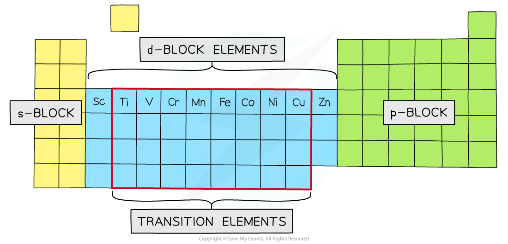
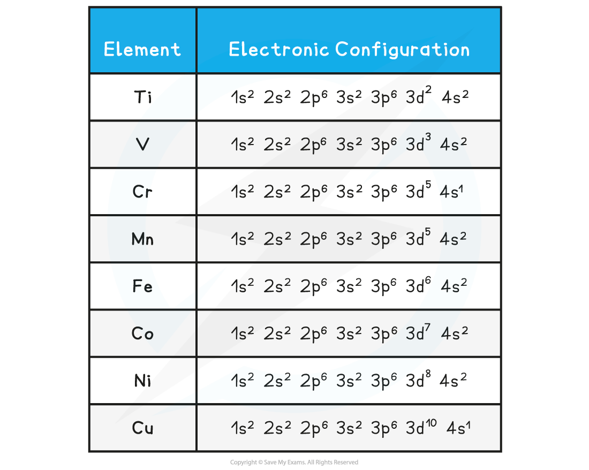
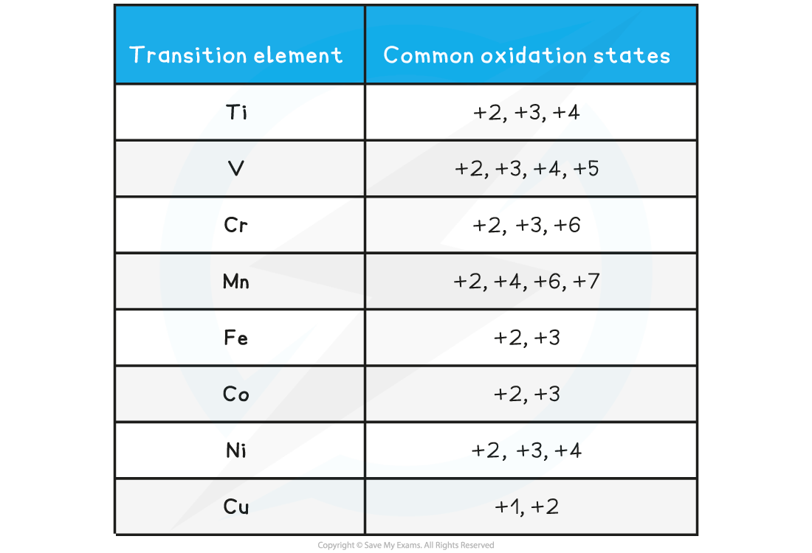

## General Properties of Transition Metals

* Transition metals are elements with an incomplete d-subshell that can form at least one stable ion with an incomplete d-subshell
* This definition distinguishes them from d-block elements, because scandium and zinc do not fit the definition

  + Scandium only forms the ion **Sc****3+**, configuration **[Ar] 3d****0**
  + Zinc only forms the ion **Zn****2+**, configuration **[Ar] 3d****10**
* The elements of the first transition series are therefore titanium to copper

***The transition elements and the d-block elements***

#### Electron Configuration

* The full electronic configuration of the first d-series transition metals is shown in the table below
* Following the **Aufbau Principle** electrons occupy the lowest energy subshells first
* The 4s overlaps with the 3d subshell so the 4s is filled first
* Remember that you can abbreviate the first five subshells, 1s-3p, as **[Ar]** representing the configuration of argon( known as the argon core)

**Table showing the Electronic Configuration of the First d-series Transition Elements**

* From AS Chemistry you should recall two exceptions to the Aufbau Principle, chromium and copper
* In both cases an electron is promoted from the 4s to the 3d to achieve a half full and full d-subshell, respectively
* Chromium and copper have the following electron configurations, which are different to what you may expect:

  + Cr is [Ar] 3d5 4s1 **not** [Ar] 3d4 4s2
  + Cu is [Ar] 3d10 4s1**not** [Ar] 3d9 4s2
* This is because the [Ar] 3d5 4s1 and [Ar] 3d10 4s1configurations are **energetically more stable**

#### Worked Example

**Writing electronic configuration of transition element ions**

State the full electronic configuration of the manganese(III) ion

**Answer**

**Step 1:** Write out the electron configuration of the atom first:

Mn atomic number = 25

1s22s22p63s23p64s23d5

2 + 2 + 6 + 2 + 6 + 2 + 5 = 25 electrons

**Step 2:** Subtract the appropriate number of electrons starting from the 4s subshell

Mn(III) = 22 electrons

1s22s22p63s23p63d4

#### General properties

* Although the**transition elements** are metals, they have some properties unlike those of other metals on the periodic table, such as:

  + Variable **oxidation states**
  + Form **complex ions**
  + Form **coloured compounds**
  + Behave as **catalysts**

## Variable Oxidation Number

* Like other metals on the periodic table, the transition elements will lose electrons to form positively charged ions
* However, unlike other metals, transition elements can form more than one positive ion

  + They are said to have **variable oxidation states**
* Because of this, Roman numerals are used to indicate the oxidation state on the metal ion
* For example, the metal sodium (Na) will only form Na+ ions (no Roman numerals are needed, as the ion formed by Na will always have an oxidation state of +1)

  + The transition metal iron (Fe) can form Fe2+ (Fe(II)) **and** Fe3+ (Fe(III)) ions

* When transition elements forms ions they lose electrons from the **4s** subshell first
* This is because when the orbitals are occupied, the repulsion between electrons pushes the**4s** into a higher energy state so that it now becomes slightly higher in energy than the **3d** subshell

  + The **4s** is now the outer shell and loses electrons first
* The loss of the **4s** electrons means that **+2** is a common **oxidation state** in transition metals
* The reason why the transition metals have variable oxidation states all comes down to energy

**Table showing the Common Oxidation States of Transition Elements**

