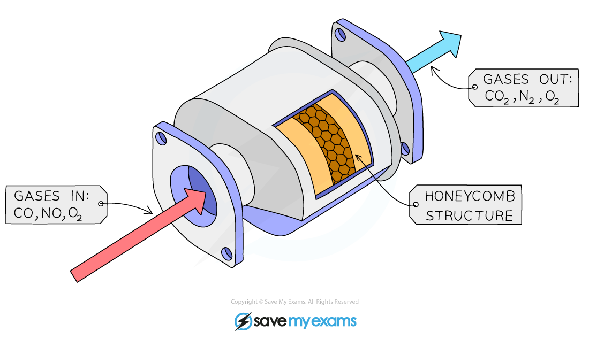

## Heterogeneous Catalysts

* A **heterogeneous** catalyst is in a different physical state (phase) from the reactants
* Heterogeneous catalysts are usually solids whereas the reactants are gaseous or in solution
* The reaction occurs at active sites on the surface of the catalyst

#### Surface adsorption theory

* This theory can be used to explain how a heterogeneous catalyst works

1. **Adsorption**, in which one or more reactants becomes attached to the surface of the catalyst
2. Reaction, following the weakening of the bonds in the adsorbed reactants
3. **Desorption**, in which the reaction product becomes detached from the surface of the catalyst

* Adsorption of reactants at active sites on the surface may lead to catalytic action
* The active site is the place where the reactants adsorb onto the surface of the catalyst
* This can result in the bonds within the reactant molecules becoming weaker, or the molecules being held in a more reactive configuration
* There will also be a higher concentration of reactants at the solid surface so leading to a higher collision frequency

#### Strength of adsorption

* The strength of adsorption helps to determine the effectiveness of the catalytic activity
* Some metals e.g. W have too strong adsorption and so the products cannot be released
* Some metals e.g. Ag have too weak adsorption, and the reactants do not adsorb in high enough concentration
* Ni and Pt have about the right strength and are most useful as catalysts

#### Surface area

* Increasing the surface area of a solid catalyst will improve its effectiveness.
* A support medium is often used to maximise the surface area and minimise the cost (e.g. Rh on a ceramic support in catalytic converters)

#### Advantages of heterogeneous catalysts

* Heterogeneous catalysts can be filtered off and are easy to separate from any liquid or gaseous products
* They are also suited to continuous processes rather than batch processes

## The Contact Process

* The manufacture of sulfuric acid is a very important piece of industrial chemistry that makes use of heterogeneous catalysis
* The first step of the process is roasting sulfur in air to produce sulfur dioxide

**S (s) + O****2****(g) → SO****2****(g)**

* The second step is an equilibrium reaction which is catalysed by vanadium(V) oxide, V2O5,

**2SO****2****(g) + O****2****(g) ⇌ 2SO****3****(g)**

* The vanadium(V) oxide catalyst converts sulfur dioxide into sulfur trioxide and is reduced to vanadium(IV) oxide

  + The oxidation number of the vanadium decreases from +5 to +4

**SO****2****(g) + V****2****O****5****(s) →  V****2****O****4****(s) + SO****3****(g)**

* The vanadium(V) oxide is then re-generated by reaction with oxygen, fulfilling its role as a catalyst

  + The original catalyst is regenerated as the oxidation number of vanadium increases from +4 to its original value of +5

**O****2****(g) + 2V****2****O****4****(s) →  2V****2****O****5****(s)**

* This reaction shows that a variable oxidation state can also be utilised in heterogenous catalysis

## How Catalytic Converters Work

* Catalytic converters are used in car exhaust boxes to reduce air pollution. They usually consist of a mixture of finely divided platinum and rhodium supported on a ceramic base

***Diagram of a catalyst on an inert support medium in a vehicle catalytic converter***

* Carbon monoxide, nitrogen dioxide and unburnt hydrocarbons are sources of pollution in car exhaust

  + Carbon monoxide is toxic and interferes with oxygen transport in the body
  + Nitrogen monoxide is easily oxidised in the atmosphere to form nitrogen dioxide which is a respiratory irritant and contributes to the formation of acid rain
* The transition metal catalysts facilitate the conversion of these pollutants into less harmful products

**2NO (g) + 2CO (g) → N****2****(g) + 2CO****2****(g)**

**CH****3****CH****2****CH****3****(g) + 5O****2****(g) → 3CO****2****(g) + 4H****2****O (g)**

* The method of action can be described using surface adsorption theory

1. Molecules of carbon monoxide and nitrogen monoxide are absorbed onto the surface
2. The bonds in both molecules are weakened causing them to react together to form carbon dioxide and nitrogen
3. The products are then desorbed from the surface of the catalyst

* Some of the transition metals are precious metals so they can be very expensive
* In order to minimise the cost and maximise the efficiency of the catalyst the following measures can be taken:

  + Increasing the surface area of the catalyst
  + Coating an inert surface medium with the catalyst to avoid using large amounts of the catalyst
* This is achieved by spreading the catalyst over a hollow matrix such as a honeycomb-like structure

#### Examiner Tips and Tricks

Make sure not to confuse absorb/absorption with adsorb/adsorption.

Absorption involves one substance becoming distributed throughout another (like water in a sponge)

Adsorption only happens at the surface of a substance