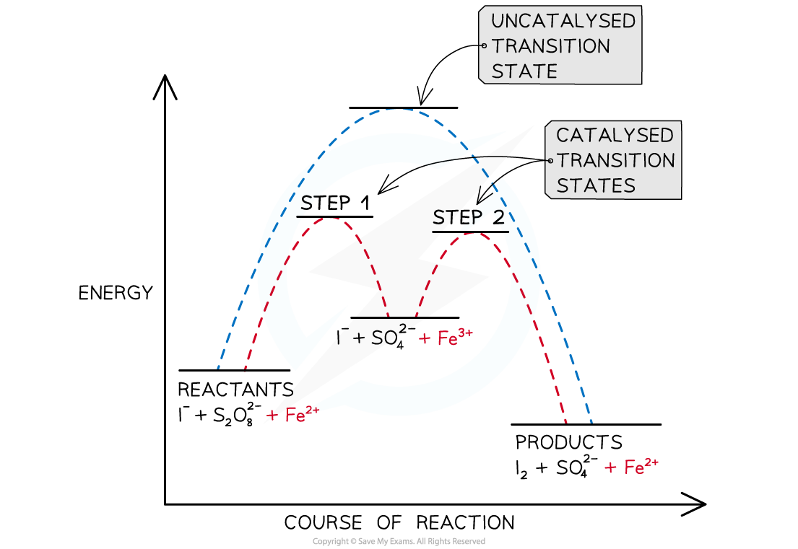

## Homogeneous Catalysts

* **Homogeneous** catalyst is in the same physical state (phase) as the reactants
* This means they are either all gases, or more often, all in aqueous solution
* Homogenous catalysts tend to be much less common in industry
* The key feature of homogeneous catalysis is the formation of an intermediate species for which a specific formula can be written

## Iron(II) Ions

* Transition element ions can adopt more than one **stable oxidation state**
* This means that they can accept and lose electrons easily to go from one oxidation state to another
* They can therefore catalyse **redox**reactions, by acting as both **oxidising agents** and **reducing agents**
* For example, iron (Fe) is often used as a catalyst due to its ability to form Fe(II) and Fe(III) ions, acting as an oxidising agent and a reducing agent

  + When Fe(II) acts as a reducing agent, it will reduce another species and become oxidised itself

**Fe****2+****→ Fe****3+****+ e****-**

* The Fe3+ formed in the catalytic cycle, can then also act as an oxidising agent by oxidising another species and getting reduced itself to reform the Fe2+ ion

**Fe****3+****+ e****-****→ Fe****2+**

* Iron(II) ions catalyse the reaction between iodide ions, I-, and peroxodisulfate ions, S2O82-
* The overall reaction is quite slow because the repulsion of two negative ions coming together hinders the reaction

**S****2****O****8****2-****+ 2I****-****→ I****2****+ 2SO****4****2-**

* The reaction is quite slow even though it is energetically favourable. Both ions are negatively charged, so they are unlikely to make successful collisions with one another. However, if iron(II) ions are added to the reaction, the rate is much quicker. Starch is often added to this reaction, which will form a blue-black colour showing the formation of iodine
* The addition of iron(II) ions reduces the peroxodisulfate to sulfate ions and produces iron(III) in the process

**S****2****O****8****2-****+ 2Fe****2+****→  2SO****4****2-****+ 2Fe****3+**

* The iron(III) ions will oxidise iodide ions to iodine and then are reduced once again to iron(II)

**2I****-****+ 2Fe****3+****→  I****2****+  2Fe****2+**

* The iron(II) produced can then go on to reduce more peroxodisulfate so fulfils its role as a catalyst
* As all of the reactants and products and the catalyst are in the aqueous phase this reaction is an example of homogeneous catalysis
* A catalyst provides a reaction pathway of lower energy which can be illustrated graphically:

***An energy profile showing the alternative reaction pathway provided by iron(II) catalyst in the reaction between iodide ions and peroxodisulfate ions***