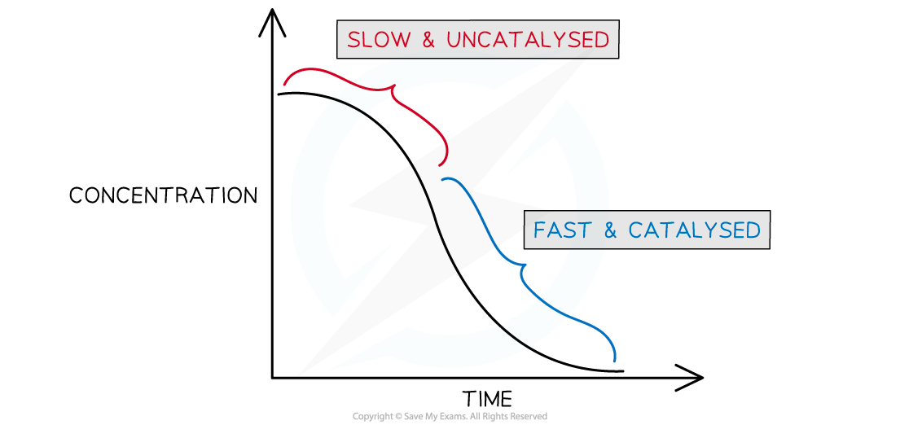
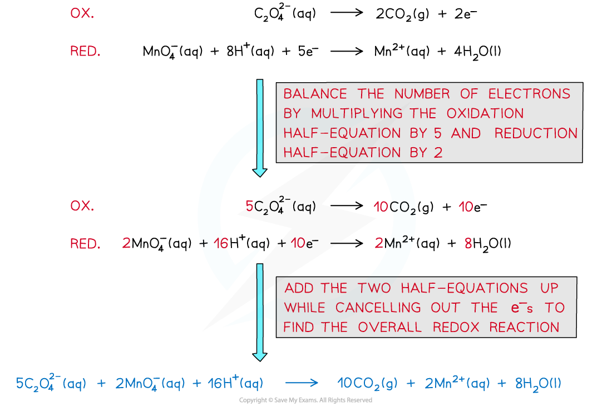

## Manganese(II) ions as an Autocatalyst

* Autocatalysis the term used to describe a reaction which is speeded up by a product which acts as a catalyst for the reaction
* If you plot a rate graph of concentration versus time it has an usual shape

***Concentration versus time for an autocatalytic reaction***

* The gradient becomes steeper during the course of the reaction which tells you the rate is speeding up, not slowing down over time as the reactants become used up
* An example of an autocatalysed reaction takes place between **manganate(VII)** ions and **oxalate** (ethandioate) ions
* The overall equation can be deduced from the half equations

* You can see that one of the products is manganese(II) ions - this is the catalyst
* As more manganese(II) is formed the reaction speeds up
* Like to the role of iron(II) in the previous section, manganese(II) ions take part in a redox cycle between two different oxidation states (+2 **→**+3 **→**+2)

**4Mn****2+****(aq)****+  MnO****4****–****(aq) + 8H****+****(aq)   →   5Mn****3+****(aq)  + 4H****2****O (aq)**

**2Mn****3+****(aq)****+  C****2****O****4****2-****(aq)  →  2CO****2****(g) +  2Mn****2+****(aq)**

* The manganese(II) is not present in the beginning of the reaction, but as it is formed is speeds up the reaction and is re-generated during the redox cycle
* This reaction is easily followed on a colorimeter as the rate at which the purple manganate(VII) ion is consumed accelerates with time