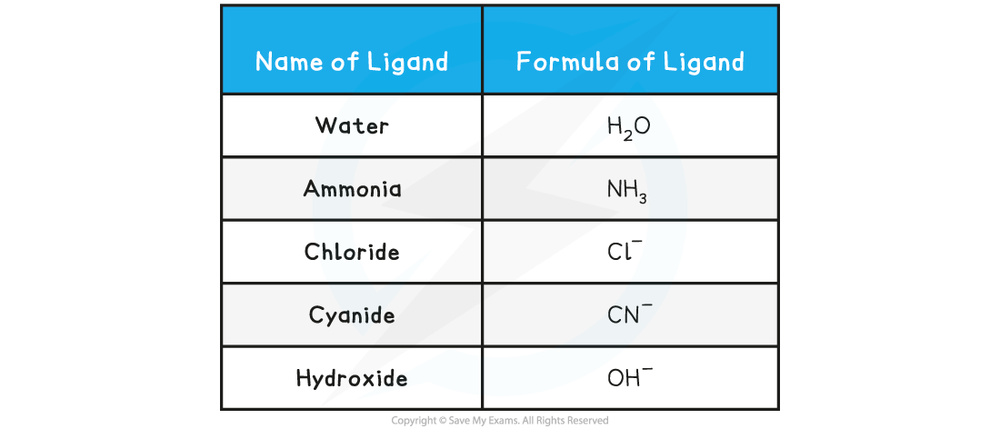
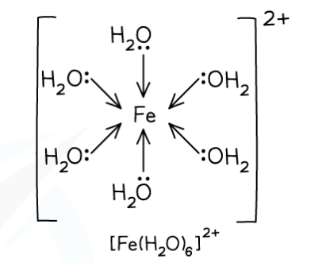

## Octahedral Complexes

* **Octahedral** complexes are formed when a central metal atom or ion forms **six coordinate bonds**
* This could be six coordinate bonds with **six** small, **monodentate** ligands

  + Examples of such ligands are **water**and **ammonia** molecules and **hydroxide** and **thiocyanate**ions
  + As there are six ligands, these complexes are sometimes described as having **six-fold coordination**

**Table showing Examples of Common Monodentate Ligands**

***Example of an octahedral complex with monodentate ligands***

* It could be six-coordinate bonds with **three** **bidentate** ligands

  + Each bidentate ligand will form two coordinate bonds, meaning six-coordinate bonds in total
  + Examples of these ligands are **1,2-diaminoethane** and the**ethanedioate ion**

***Example of an octahedral complex with bidentate ligands***

* It could be six-coordinate bonds with **one multidentate**ligand

  + The multidentate ligand, for example, EDTA4-,forms all six-coordinate bonds

***Example of an octahedral complex with a polydentate ligand***

* The bond angles in an octahedral complex are 90o
* The **coordination** **number** of a complex is the number of dative bonds formed between the central metal ion and the ligands

  + Since there are 6 dative bonds, the coordination number for the complex is 6

#### Examiner Tips and Tricks

Electron pair repulsion theory can be extended to predict and explain the shape of transition metal complexes. The only difference is you should ignore the 3d elctrons in the transition metal ion and overall charge on the complex - just count the number of electron pairs donated by the ligands.