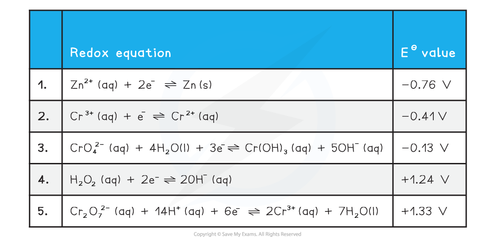

## Reduction & Oxidation of Chromium Species

* For chromium we need to consider the following standard electrode potential values
* We will use zinc and hydrogen peroxide as oxidising agents
* The half equations are arranged from high negative EΘat the top to high positive EΘat the bottom

  + The best reducing agent is the top right species (Zn (s))
  + The best oxidising agent is the bottom left species (Cr2O72-(aq))

#### Oxidation from +3 to +6

* The two half equations we need to consider are 3 and 4
* Chromiums oxidation number changes from +6 to +3 in half equation 3
* The EΘ value for half equation 3 is more negative than the EΘ for half equation 4

  + Cr(OH)3 (aq) is the best reducing agent
  + H2O2 (aq) is the best oxidising agent
* We can obtain the overall equation by reversing half equation 3 and combining it with equation 4

  + When adding half equations remember to multiply them so each has the same number of electrons

**2Cr(OH)****3****(aq) + 4OH****-** **(aq) + 3H****2****O****2** **(aq) → 2CrO****4****2-****(aq) + 8H****2****O (l)**

* This reaction is carried out in alkaline conditions due to the presence of OH- ions in the equation

#### Reduction from +6 to +3

* The two half equations we need to consider are 1 and 5
* Chromiums oxidation number changes from +6 to +3 in half equation 3
* The EΘ value for half equation 1 is more negative than the EΘ for half equation 5

  + Zn is the best reducing agent
  + Cr2O72- is the best oxidising agent
* We can obtain the overall equation by reversing half equation 1 and combining it with equation 5

  + When adding half equations remember to multiply them so each has the same number of electrons

**Cr****2****O****7****2-****(aq) + 14H****+** **(aq) + 3Zn (s) → 2Cr****3+****(aq) + 7H****2****O (l) + 3Zn****2+** **(aq)**

* This reaction is carried out under acidic conditions due to presence of H+ in the equation

#### Reduction from +3 to +2

* The Cr3+ ion can be further reduced by zinc
* The two half equations we need to consider are 1 and 2
* Chromiums oxidation number changes from +3 to +2 in half equation 3
* The EΘ value for half equation 1 is more negative than the EΘ for half equation 2

  + Zn (s) is the best reducing agent
  + Cr3+(aq) is the best oxidising agent
* We can obtain the overall equation by reversing half equation 1 and combining it with equation 2

  + When adding half equations remember to multiply them so each has the same number of electrons

**2Cr****3+****(aq) + Zn****(s) → 2Cr****2+****(aq) + Zn****2+** **(aq)**

* As this reaction is a further step from the previous reduction this reaction is also carried out under acidic conditions

## The Dichromate(VI) - Chromate(VI) Equilibrium

* The chromate CrO42- and dichromate Cr2O72- ions can be converted from one to the other by the following equilibrium reaction

**2CrO****4****2-****(aq) + 2H****+****(aq) ⇌ Cr****2****O****7****2-****(aq) + H****2****O (l)**

* Chromate(VI) ions are stable in alkaline solution, but in acidic conditions the dichromate(VI) ion is more stable
* Addition of acid will push the equilibrium to the dichromate

  + This results in a colour change from yellow to orange
* Addition of alkali will remove the H+ ions and push the equilibrium to the chromate
* This is not a redox reaction as both the chromate and dichromate ions have an oxidation number of +6

  + This is an acid base reaction