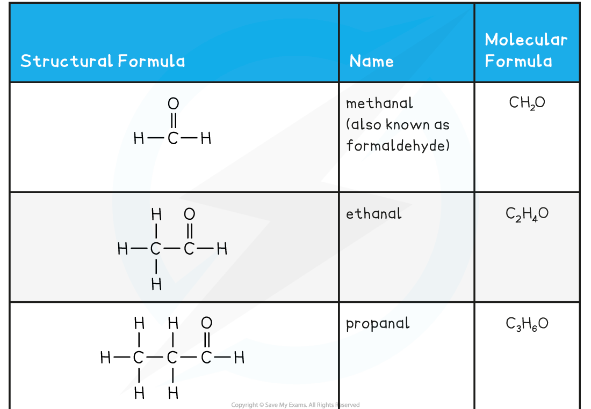
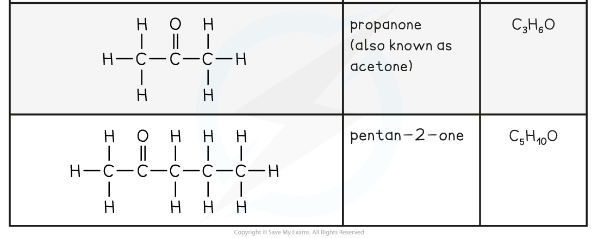
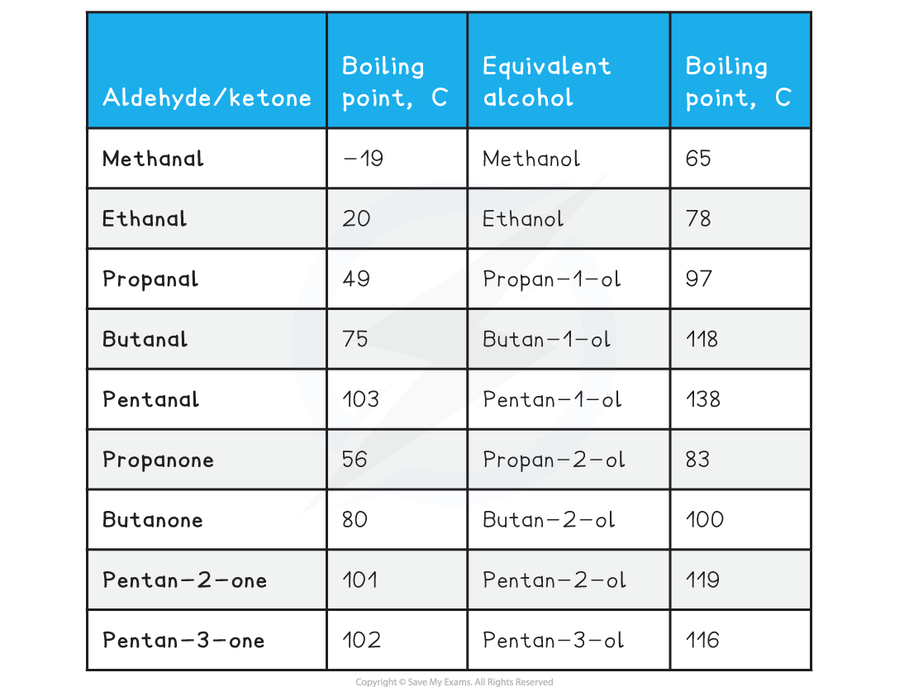

Aldehydes & Ketones
-------------------

Aldehydes and ketones contain the carbonyl functional group, C=O This is why aldehydes and ketones are also known as carbonyls The difference between aldehydes and ketones is the groups bonded to the carbon of the carbonyl group

* The carbonyl group in an aldehyde is always situated at the end of the chain

  + When naming aldehydes, you do not include the '1' in the name, the carbonyl carbon is always number 1 on the chain
  + The simplest aldehyde is methanal, HCHO, with the only carbon being that of the carbonyl group
* The carbonyl group in a ketone is always situated in the middle of the chain

  + The simplest ketone is propan-2-one, CH3COCH3, as you need an alkyl group either side of the carbonyl carbon in a ketone

<b>Aldehyde and Ketone Examples Table</b>

Carbonyls & Hydrogen Bonding
----------------------------

#### Intermolecular forces of carbonyls

* Aldehydes and ketones have a dipole within their structure due to the electronegative oxygen of the carbonyl group

*<b>The carbonyl group has a dipole with a δ+ carbon and a δ– oxygen </b>*

* This means that aldehydes and ketones have permanent dipole-dipole interactions and London forces between molecules
* There are no polar bonds in aldehydes or ketones that can result in a δ+ hydrogen for hydrogen bonding, e.g. O-H, N-H
* Therefore, the melting and boiling points of aldehydes and ketones are lower than their corresponding alcohol

<b>Table Comparing Boiling Points for Aldehydes, Ketones and their Equivalent Alcohols</b>

#### Hydrogen bonding

* Although carbonyls cannot hydrogen bond with themselves, they do have the lone pairs on their oxygen
* This means that smaller aldehydes and ketones are able to hydrogen bond with water

  + The δ– oxygen atom from the carbonyl uses its lone pairs to form hydrogen bonds with the δ+ hydrogen from water
* As a result of this hydrogen bonding, smaller aldehydes and ketones will dissolve in water
* Larger aldehydes and ketones have longer hydrocarbon chains which cannot hydrogen bond with water

  + These hydrocarbon chains can disrupt the hydrogen bonding within water but cannot form hydrogen bonds themselves
* If a carbonyl compound is large enough, they will not dissolve in water

  + To understand this, you have to consider:

    - The intermolecular forces (London forces) between the carbonyl molecules
    - The hydrogen bonding within water
    - The potential hydrogen bonding of the carbonyl molecule with water
  + In order to dissolve, the strength of the potential hydrogen bonding of the carbonyl with water must be higher than the combined strength of the intermolecular forces of the carbonyl and the hydrogen bonding of water

