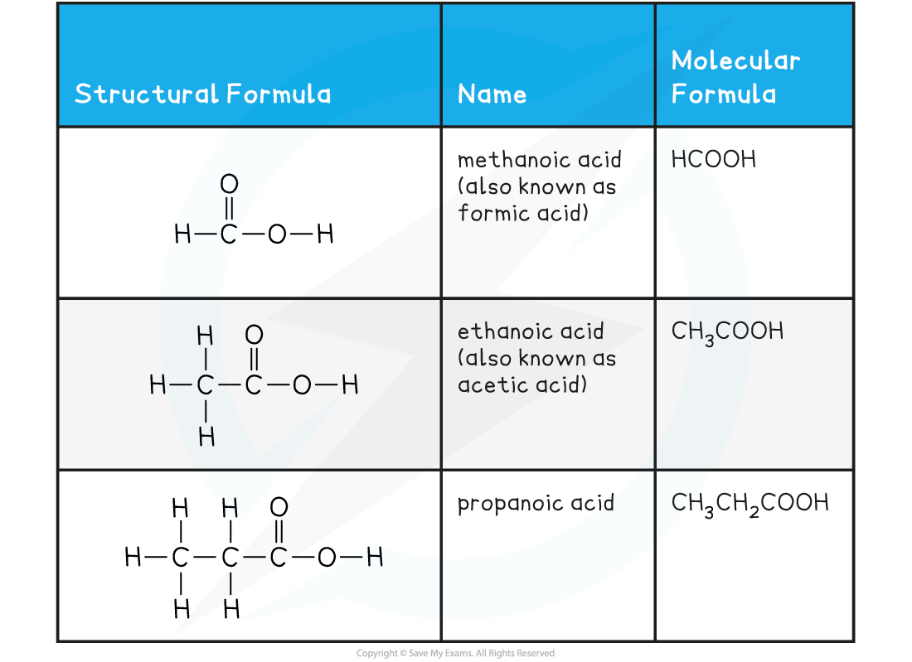

## Physical Properties of Carboxylic Acids

Carboxylic acids **Carboxylic acid** is the name given to the family of compounds that contain the **carboxyl**functional group, **-COOH** The general formula of a carboxylic acid is **C****n****H****2n+1****COOH** which can be shortened to just **RCOOH** (In some countries, this family is also called alkanoic acid)

* The nomenclature of **carboxylic acid** follows the pattern **alkan + oic acid**, e.g. propanoic acid
* There is no need to use numbers in the name as the carboxyl group, COOH, is always on the number 1 carbon atom

**Carboxylic Acids Examples Table**

#### Physical properties of carboxylic acids

* Carboxylic acids contain two polarised groups

  + **C=O** and **O-H**
* This means that the intermolecular forces that carboxylic acids experience are high and they will have relatively high melting points and boiling points
* The presence of the O-H bond means that they can exhibit hydrogen bonding

  + Not only does this contribute to the high melting and boiling points, it also contributes to the solubility in water and other polar solvents of the shorter chained carboxylic acids
* However, solubility falls as the length of the hydrocarbon chain in the carboxylic acid increases
* The hydrocarbon chains are forcing their way between water molecules and so breaking hydrogen bonds between those water molecules

  + Carboxylic acids with more than eight carbon atoms will be solids at room temperature and are very slightly soluble in cold water, but will be more soluble in hot water